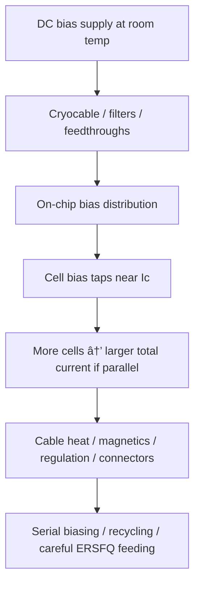
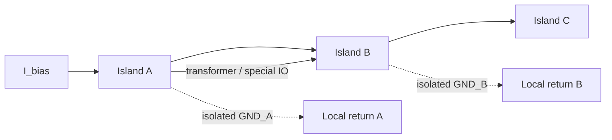

# DC Bias Current Delivery

**Prereqs:** [Resistive Bias to ERSFQ](resistive-bias-to-ersfq.md)  
**Next:** [Serial Biasing and Current Recycling](../concepts/serial-biasing-current-recycling.md) · [AQFP Logic](../concepts/aqfp-logic.md)  

**TL;DR.**
- Story so far: bias networks matter for energy and margins.
- This page: feeding bias currents without wrecking the story.
- Next: turning SFQ pulses into voltage levels for I/O.

**Tracks:** `clocking-biasing-power`

## Learning goals

After this page you should be able to:

1. Explain why [RSFQ](../glossary.md) / [ERSFQ](../glossary.md) chips need large **DC bias currents**: junctions sit near their [critical current](../glossary.md) $I_c$, and **parallel** feeds add branch by branch until the sum reaches **amperes**.
2. Sketch the delivery path from a room-temperature supply → cryocable / filters / feedthroughs → on-chip bias network → cell taps → return, and name what each segment is for.
3. Give an order-of-magnitude estimate $I_{\mathrm{total}} \sim N \times I_b$ and say why that scaling forces [serial biasing / current recycling](../glossary.md) as an architecture topic — without confusing amperes with the static resistor heat you just studied.
4. State what a **[ground island](../glossary.md)** is for (series-stacked blocks with isolated local returns) and why [AQFP](../glossary.md) is a *different excitation family*, not “ERSFQ with a new logo.”

## Why this matters

The previous bridge ([resistive bias to ERSFQ](resistive-bias-to-ersfq.md)) attacked **static heat in bias resistors**. Classical [RSFQ](../glossary.md) often feeds each cell through a resistor that burns power even when the chip is “idle.” [ERSFQ](../glossary.md)-style feeding can slash that idle $I^2R$ bill by changing *how* bias reaches the junctions.

It does **not** erase the need to put the right DC current into every cell.

Each overdamped junction still wants an operating point near its [critical current](../glossary.md) $I_c$ so a small trigger can cause a controlled $2\pi$ slip ([phase to pulse](phase-to-pulse.md)). That near-$I_c$ feed is the [bias current](../glossary.md) story. Multiply “near-$I_c$ feed” by thousands or millions of junctions and — if you feed them in **parallel** from one rail — the chip asks the cryostat plant for **amperes**.

This bridge is the **delivery problem**: cables, magnetics, filtering, regulation, on-chip distribution, and why “just raise the supply brick” is not a CMOS-shaped answer. [Serial biasing and current recycling](../concepts/serial-biasing-current-recycling.md) are the sequel that reuses one ampere through stacked blocks. [AQFP](../concepts/aqfp-logic.md) is a different family that changes the excitation story entirely.

If you only remember “ERSFQ is efficient,” you may still be shocked by ampere-class bias lines. Efficiency of resistors and magnitude of delivered current are different sentences. This page makes the second sentence inevitable.

Say these out loud until they separate (the previous bridge introduced them; this page lives inside sentence 2):

1. “My resistors are hot even when idle.” → ERSFQ conversation.  
2. “My cryocable must carry tens of amperes.” → **this** delivery / recycling conversation.  
3. “Each pulse still costs energy.” → dynamics conversation.

## Analogy (without false physics)

Think of a city of fountains (Josephson junctions). Each fountain needs a steady trickle of water ([bias current](../glossary.md)) to sit ready to splash when a signal arrives.

- **One shared lake with a hose to every fountain** → huge total flow from the pump (large chip bias current). That is **parallel feed**: $I_{\mathrm{total}} \approx N \times I_b$.
- **Terraces that reuse the same water downhill** → intuition for [serial biasing / current recycling](../glossary.md): one ampere does work in neighborhood 1, then neighborhood 2, then neighborhood 3.
- **Neighborhoods that must not share a pipe electrically** → **[ground islands](../glossary.md)**: isolated return references so one terrace’s “ground” is not shorted to another’s when potentials differ.

A second picture: apartment buildings on a hillside. Every apartment can tap the reservoir in parallel (pump sized for the sum), or one riser can run *through* apartment 1’s plumbing, then apartment 2’s, then apartment 3’s before returning (pump sized closer to one floor’s flow). Series reuse shrinks the pump; it also forces careful plumbing between floors — islands and crossings.

These analogies are about **flow reuse and isolated returns**, not about literal plumbing in the fab. Water is continuous; SFQ bias is DC current into Josephson networks; inter-floor “messengers” are pulse / flux interfaces, not literal messengers.

## The delivery path (big picture)

Before scaling arithmetic, name the **path**. “The chip needs bias” is incomplete until you can point at each segment.

```text
  Room-temperature DC bias supply
              │
              â–¼
     cryocable / filters / feedthroughs
              │
              â–¼
  ┌─────────────────────────────────────┐
  │         on-chip bias network        │
  │    ┌────●── cell / JJ cluster A     │
  │    ├────●── cell / JJ cluster B     │
  │    └────●── cell / JJ cluster C ... │
  │              │                      │
  │         chip return / GND           │
  └─────────────────────────────────────┘

  Parallel taps: I_total ≈ sum of branch bias currents
```

## Interactive lab

Try this in place. Prefer full-screen? Open the [lab page](../labs/dc-bias-current-delivery.html).

1. **Parallel feed:** raise $N$ and $I_b$ — watch $I_{\mathrm{supply}} \sim N\times I_b$ hit amperes; toggle **+20% pads** to see timing tax become ampere tax.
2. **Serial recycle (preview):** same $N$, supply current collapses toward $\sim I_b$ — but **ground islands** appear. ERSFQ still does **not** clear amperes by itself.

<iframe
  src="../../labs/dc-bias-current-delivery.html"
  title="DC bias current delivery lab"
  style="width:100%;height:720px;border:1px solid rgba(0,0,0,0.12);border-radius:0.35rem;background:#fff;"
  loading="lazy"
></iframe>



Every segment has a job:

| Segment | Job |
|---------|-----|
| Room-temp supply | Provide controlled DC current / voltage as designed |
| Cable plant | Carry amperes with acceptable heat leak and noise |
| On-chip network | Split current to taps with margins |
| Cell | Sit near $I_c$, switch when triggered |
| Return path | Close the circuit without wrecking signal integrity |

Miss any segment and “the chip needs bias” becomes an incomplete sentence. Delivery is a **system** problem that happens to be forced by device physics — not a footnote for the board designer after the Boolean netlist is “done.”

### Why the path is cold-to-warm painful

Large DC currents are not only a connector ampacity problem:

- **Heat leak.** Metal wires from room temperature toward cryogenic stages conduct heat. More copper for more amperes fights the refrigerator.
- **Magnetics.** Amperes make magnetic fields; loops and cell margins care about stray field and return-path geometry.
- **Filtering.** Bias lines need filtering so room-temperature noise does not masquerade as triggers.
- **Regulation.** Holding thousands of taps near their intended $I_b$ is a distribution and margin problem, not a single bench-supply knob.

That is why “$I_{\mathrm{total}} = N I_b$” is treated as an **architecture** crisis in the [clocking-biasing-power](../tracks/clocking-biasing-power/ROADMAP.md) track, not a footnote.

## Parallel feed scaling — the crisis in one equation

If $N$ similar taps each draw about $I_b$ from a common rail in **parallel**,

\[
I_{\mathrm{total}} \approx N \times I_b.
\]

That linear growth is the crisis in one equation. Classical RSFQ and ERSFQ-style chips still live under this sum **whenever** the feed topology is parallel. Changing resistor heat does not rewrite the sum.

Keep the cartoon honest: real libraries have many junctions per “cell,” margins vary, and not every tap is identical. Illustrative arithmetic below uses round numbers so the **shape** is visible. Do **not** treat them as a paper’s measured chip total.

### Worked example 1 — A small block already asks for an ampere

Take $N = 10{,}000$ junctions/taps and $I_b = 0.1\,\text{mA}$ (illustrative):

\[
I_{\mathrm{total}} \approx 10{,}000 \times 0.1\,\text{mA} = 1\,\text{A}.
\]

Already an ampere — nontrivial once you add connectors, filtering, and magnetics. Device-scale currents can be microamperes to milliamperes; **chip-scale parallel products** can be amperes.

### Worked example 2 — Scale by $100\times$

Same $I_b$, now $N = 1{,}000{,}000$:

\[
I_{\mathrm{total}} \approx 100\,\text{A}.
\]

That is the “this cannot be naive parallel feed” moment. Exact library currents differ; the **shape** $N\times I_b$ does not. This is why serial biasing and recycling exist as first-class architecture topics — not as optional CAD polish.

### Worked example 3 — ERSFQ does not cancel the product

Suppose ERSFQ removes resistor heat so static **power** in $R_b$ collapses. If the cells still need $\sim I_b$ each and you still feed them in parallel, $I_{\mathrm{total}}$ remains $\sim N I_b$. You may have traded watts in resistors for a cleaner bias network — and you still need an ampere strategy.

**Takeaway from the ERSFQ bridge, restated:** different knobs. Heat ≠ amperes ≠ dynamic energy.

| Question | ERSFQ-style feeding | Parallel ampere sum | Serial recycling |
|----------|---------------------|---------------------|------------------|
| Hot resistors at idle? | Attacks this | Does not by itself | Does not by itself |
| $I_{\mathrm{total}} \sim N I_b$? | Still true if parallel | **Is** this problem | Reuses current to shrink supply amperes |
| Ground islands needed? | Not the main story | Not yet | **Yes**, for stacked returns |

### Worked example 4 — Pads add to $N$

From [gate-level pipelining](gate-level-pipelining.md), path balancing inserts padding DFFs. Those pads are more taps in the parallel-feed cartoon. If functional taps are $N_{\mathrm{logic}}$ and pads are $N_{\mathrm{pad}}$,

\[
I_{\mathrm{total}} \sim (N_{\mathrm{logic}} + N_{\mathrm{pad}})\, I_b.
\]

Architecture choices that look like “just timing” become ampere choices. That is why balancing overhead papers and bias-delivery papers belong in the same mental folder: every pad you insert for epoch correctness can also be another branch in the sum.

## Ground islands (intuition only)

When you stack circuit blocks so the **same physical bias current** flows through block 1, then block 2, their local “grounds” generally sit at **different potentials**. If you naively tie all local grounds together, you short the series stack and defeat recycling.

Designers therefore treat blocks as floating **[ground islands](../glossary.md)** — galvanically isolated returns — and pass SFQ signals between islands with transformers, inductive coupling, or drivers that tolerate the offset.

```text
  Serial bias cartoon (not a taping schematic):

  I_bias ──► [ Island A logic ] ──► [ Island B logic ] ──► ...
                 GND_A ≠ GND_B (isolated returns)

  Signals A ↔ B need island-crossing IO,
  not a shared copper ground assumption
```



You only need the cartoon now. Public slogan for later:

\[
I_{\mathrm{supply,\,parallel}} \sim \sum_i I_i \qquad\text{vs}\qquad I_{\mathrm{supply,\,serial}} \sim \max_i I_i
\]

(in the ideal cartoon where each island needs comparable current $I_i$ and recycling is perfect). Voltage compliance and margins get harder — that is the other side of the trade. Topologies, transformer cells, and EDA island assignment live on [serial biasing / current recycling](../concepts/serial-biasing-current-recycling.md).

In room-temperature CMOS you often treat “GND” as one big equipotential plane. Multiple power domains exist, but **reusing one bias current through series-stacked logic blocks** is foreign. In SFQ serial biasing, the scarce resource is often **current through a cold cable**, so the architecture *wants* series reuse — and therefore *must* invent islands and island-crossing IO.

## Comparison table — problems and tools

| Problem | Symptom | Tool family |
|---------|---------|-------------|
| Static resistor heat | Idle watts in $R_{\mathrm{bias}}$ | [ERSFQ](../concepts/ersfq-logic.md)-style feeding |
| Huge $I_{\mathrm{total}}$ | Ampere-class cables, heat leak | [Serial biasing / current recycling](../concepts/serial-biasing-current-recycling.md) |
| Island crossing | Can’t share GND freely | Transformers / special drivers |
| Pads inflate $N$ | Timing pads → more taps | Architecture / balancing budget |
| Different excitation philosophy | Want AC multiphase, adiabatic style | [AQFP](../concepts/aqfp-logic.md) (separate path) |

Read the table left-to-right: name the **symptom**, then pick the **tool**. Mixing rows is how slogans get wrong.

## Why serial biasing / current recycling exists

Once $I_{\mathrm{total}} \sim N I_b$ is real, three responses appear in the field:

1. **Live with parallel feed** for small blocks where one ampere is tolerable.  
2. **Lower per-tap current** carefully (device / library choices) — helps the product, rarely erases it at large scale.  
3. **Reuse one ampere through series-stacked islands** — [serial biasing / current recycling](../glossary.md).

Option 3 is why the next concept card exists. Recycling does not replace ERSFQ; it answers a different row of the table. A large energy-efficient chip may need **both** conversations: feed without hot resistors **and** deliver without ampere-class cable plants. Curriculum order is deliberate: feel the delivery crisis here, then learn the reuse machine ([serial biasing](../concepts/serial-biasing-current-recycling.md)).

## AQFP as a different excitation family

[AQFP](../glossary.md) (Adiabatic Quantum Flux Parametron) is **not** “ERSFQ with multiphase clocks.” It is a different logic family built around **multiphase AC excitation** and adiabatic switching ideas — not the classical DC near-$I_c$ tap cartoon of RSFQ/ERSFQ.

Why mention AQFP on a **DC delivery** page? So you do not force every superconducting logic paper into the $N\times I_b$ mold, and so the **Next** link to [AQFP Logic](../concepts/aqfp-logic.md) is a fork, not a synonym of ERSFQ. AQFP “power / bias” talks mean AC phases and excitation networks — related cryogenic delivery pains, different physics story.

| Family | Excitation cartoon (teaching level) | Ampere story you just learned |
|--------|-------------------------------------|-------------------------------|
| Classical RSFQ | DC bias near $I_c$, often resistive taps | Parallel $N\times I_b$ applies |
| ERSFQ | DC operating point, inductive / JJ feeding | Parallel sum still applies unless recycling |
| AQFP | Multiphase AC excitation / adiabatic mindset | Do not paste the RSFQ DC sum blindly |

## CMOS contrast

| Topic | CMOS | SFQ bias delivery |
|-------|------|-------------------|
| What you distribute | Voltage rails ($V_{DD}$, GND) | Bias **currents** into JJ networks near $I_c$ |
| Scaling pain | IR drop, decoupling, electromigration | Ampere totals, cryocable heat, magnetics |
| Island idea | Multiple power domains exist, but recycling bias current serially is foreign | Ground islands appear naturally with series current reuse |
| Idle | Leakage / clock power | Classical RSFQ resistors; ERSFQ changes that piece |
| “Just use a bigger supply brick” | Sometimes OK at room temp | Cryostat cable plant and heat load often dominate |
| Clock frequency vs supply current | Dynamic current often tracks activity | Parallel DC bias total tracks **tap count** first |
| Timing pads | Area / power secondary effects | Pads add taps → can inflate $I_{\mathrm{total}}$ |

CMOS intuition about voltage domains helps a little with islands — and misleads if you forget that the scarce resource is often **current through a cold cable**, not only voltage compliance.

## Bridge to SFQ circuits

When you read a chip paper’s “bias” section, ask in order:

1. Is the logic family resistively biased RSFQ, ERSFQ-fed, AQFP, or mixed?  
2. Is current fed mostly in parallel, or recycled through series islands?  
3. How do signals cross islands?  
4. What is the cryocable ampere budget story? (measured numbers → private explainers)

On the public path:

- Reuse amperes: [Serial Biasing and Current Recycling](../concepts/serial-biasing-current-recycling.md).  
- Alternate family with AC excitation mindset: [AQFP Logic](../concepts/aqfp-logic.md).  
- Core logic still sits on pulse encoding from earlier bridges ([phase to pulse](phase-to-pulse.md), [pulse to logic state](pulse-to-logic-state.md), [gate-level pipelining](gate-level-pipelining.md)).

Remember: I/O amplifiers ([SFQ pulse to voltage levels](sfq-pulse-to-volt-level.md)) may also care about islands and grounds — delivery and interfaces meet at the package boundary.

Glossary: [RSFQ](../glossary.md), [ERSFQ](../glossary.md), [bias current](../glossary.md), [critical current](../glossary.md), [ground island](../glossary.md), [serial biasing](../glossary.md), [AQFP](../glossary.md).

## Common misconceptions

1. **“ERSFQ means we no longer need DC bias delivery.”**  
   Feeding philosophy changes; cells still need an operating current near $I_c$. Delivery remains.

2. **“Total bias current is proportional to clock frequency.”**  
   To first order in the parallel-feed cartoon, $I_{\mathrm{total}}$ tracks **how many taps you feed**, not how fast pulses fly. Dynamic power depends on activity; ampere delivery is a DC distribution issue.

3. **“Ground is ground — tie all returns together.”**  
   In a series-biased stack, that can short islands and destroy recycling. Islands exist for a reason.

4. **“One ampere on-chip is like one ampere in a room-temp PCB.”**  
   Cryogenic heat leak, filtering, and connector constraints change the cost model dramatically.

5. **“AQFP is just ERSFQ with a different logo.”**  
   AQFP uses multiphase AC excitation and adiabatic switching ideas — a different family. Meet it as its own card after this delivery bridge.

6. **“If $N\times I_b$ is scary, shrink $I_c$ without limit.”**  
   Lower $I_c$ has noise, margin, and speed tradeoffs. Recycling architectures exist because you cannot always solve amperes by starving every junction.

7. **“Serial biasing removes the need for ERSFQ.”**  
   Complementary tools: one reuses amperes; the other attacks resistor heat. Chips may need both conversations.

8. **“Path balancing is unrelated to bias delivery.”**  
   Pads add taps. Timing correctness and ampere totals are coupled through $N$.

## Check yourself

<details markdown="1">
<summary markdown="span">1. Why does an SFQ chip need DC bias at all?</summary>

Junctions are held near $I_c$ so a small trigger can cause a controlled $2\pi$ phase slip (SFQ pulse). Bias sets that operating point.
</details>

<details markdown="1">
<summary markdown="span">2. Why does total bias current grow with chip size in a parallel feed?</summary>

Each tap draws its own bias; parallel currents add: $I_{\mathrm{total}} \sim N \times I_b$.
</details>

<details markdown="1">
<summary markdown="span">3. What problem do ground islands address in one sentence?</summary>

They let series-stacked blocks share bias current while keeping isolated local returns when grounds are not at the same potential.
</details>

<details markdown="1">
<summary markdown="span">4. Compute $I_{\mathrm{total}}$ for $N=20{,}000$, $I_b=0.25\,\text{mA}$ in parallel.</summary>

$I_{\mathrm{total}} = 20{,}000 \times 0.25\,\text{mA} = 5\,\text{A}$.
</details>

<details markdown="1">
<summary markdown="span">5. Does removing bias resistors automatically divide $I_{\mathrm{total}}$ by ten?</summary>

No. Ampere totals follow feed topology and per-tap current. Resistor removal targets static heat, not the $N\times I_b$ sum by itself.
</details>

<details markdown="1">
<summary markdown="span">6. Name two practical pains of ampere-class bias delivery into a cryostat.</summary>

Any two of: cable heat leak, connector limits, filtering/noise, magnetic fields from large DC currents, regulation difficulty.
</details>

<details markdown="1">
<summary markdown="span">7. What is the natural next concept card if the goal is reusing one ampere through many blocks?</summary>

[Serial Biasing and Current Recycling](../concepts/serial-biasing-current-recycling.md).
</details>

<details markdown="1">
<summary markdown="span">8. How can path balancing increase $I_{\mathrm{total}}$?</summary>

Padding cells add bias taps, increasing $N$ in the parallel-feed sum.
</details>

<details markdown="1">
<summary markdown="span">9. Why is “bigger supply brick” a weak answer in cryogenics?</summary>

Cable heat leak, filtering, magnetics, and connector limits often dominate long before a room-temperature brick’s ampacity does.
</details>

<details markdown="1">
<summary markdown="span">10. Sketch the delivery path in order (four or five named segments).</summary>

Room-temp DC supply → cryocable / filters / feedthroughs → on-chip bias network → cell taps → return / GND.
</details>

<details markdown="1">
<summary markdown="span">11. In one sentence, how is AQFP’s excitation story different from classical RSFQ DC bias?</summary>

AQFP is built around multiphase AC excitation / adiabatic switching ideas, not the classical DC near-$I_c$ tap cartoon of RSFQ/ERSFQ.
</details>

## Next steps

- Reuse bias current across ground islands: [Serial Biasing and Current Recycling](../concepts/serial-biasing-current-recycling.md).  
- Continue the core family contrast: [AQFP Logic](../concepts/aqfp-logic.md).  
- Track home: [Clocking, Biasing & Power](../tracks/clocking-biasing-power/ROADMAP.md).  
- Terms: [Glossary](../glossary.md) ([RSFQ](../glossary.md), [ERSFQ](../glossary.md), [bias current](../glossary.md), [critical current](../glossary.md), [ground island](../glossary.md), [serial biasing](../glossary.md), [AQFP](../glossary.md)).
