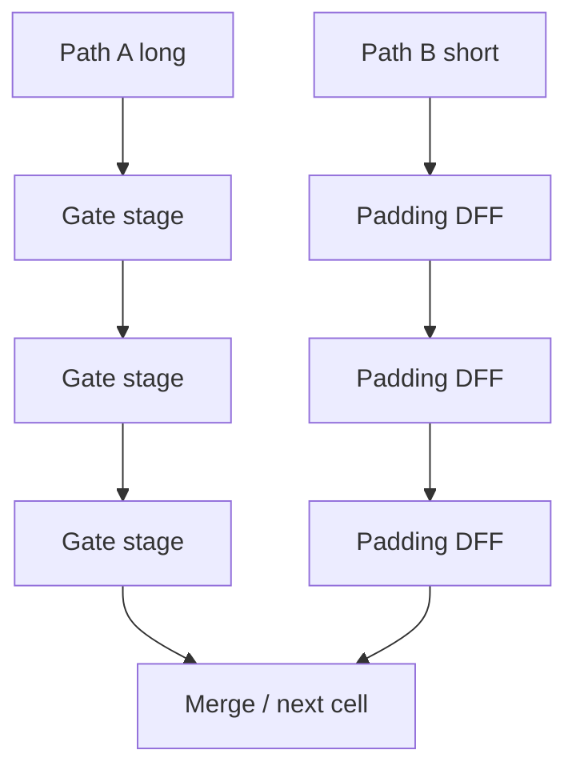
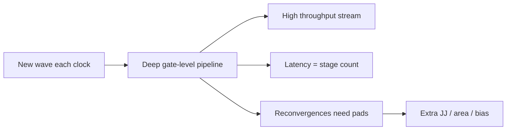

# Gate-Level Pipelining in SFQ

**Prereqs:** [Pulse to Logic State](pulse-to-logic-state.md) · [RSFQ DFF and Retiming](../concepts/rsfq-dff-and-retiming.md)  
**Next:** [Resistive Bias to ERSFQ](resistive-bias-to-ersfq.md) · [Concurrent-Flow and Counter-Flow Clocking](../concepts/concurrent-and-counter-flow-clocking.md) · [Path Balancing Overhead](../concepts/path-balancing-overhead.md)

**TL;DR.**
- Story so far: bits are timed pulse events.
- This page: why RSFQ pipelines are deep by default.
- Next: resistive bias → ERSFQ energy story.


## Learning goals

After this page you should be able to:

1. Explain why classical [RSFQ](../glossary.md) is naturally **[gate-level pipelined](../glossary.md)**: most logic cells also act as timing and storage stages rather than pure unclocked combinational clouds.
2. Define **[path balancing](../glossary.md)** (epoch alignment) and walk a concrete pad example so reconvergent pulses share one clock window at a merge.
3. Name the main costs of padding — extra [DFFs](../glossary.md) or delay stages → Josephson junctions, layout area, and bias taps — in qualitative terms (illustrative arithmetic is fine; no paper chip totals).
4. Separate **throughput** from **latency in clock cycles**, and say why the CMOS habit “draw a combo cloud, sprinkle flops later” fails the RSFQ encoding contract.

## Why this matters

In CMOS digital design you can often sketch a blob of combinational logic — adders, mux trees, random gate clouds — and only afterward sprinkle flip-flops for timing closure. The mental model is clean:

> combinational cloud computes; flip-flops remember.

In Rapid Single Flux Quantum ([RSFQ](../glossary.md)) logic, that split is largely fake. Cells that “compute” typically also **consume and produce pulses on a clocked rhythm**, often with internal flux storage you already met in [pulse to logic state](pulse-to-logic-state.md) and the concrete [DFF](../glossary.md) cell in [RSFQ DFF and retiming](../concepts/rsfq-dff-and-retiming.md). Datapaths become deep pipelines **by default**. If you design as if a twenty-gate CMOS cone could sit between two registers, your SFQ netlist will be unbalanced, racily timed, or simply not how the library works.

This bridge exists so that when you later read about [path balancing overhead](../concepts/path-balancing-overhead.md), [concurrent- vs counter-flow clocking](../concepts/concurrent-and-counter-flow-clocking.md), or SFQ static timing analysis, you already feel the structural reason those topics dominate. [Gate-level pipelining](../glossary.md) is not an optimization tip you apply after synthesis. It is the default grammar of classical RSFQ connectivity.

It also explains an emotional shock for CMOS veterans: “latency in clock cycles ballooned, but throughput can still be excellent.” Until you separate those metrics, SFQ timing talks sound contradictory. High pulse rate and deep stage latency can live in the same design — confusing them is how people conclude “SFQ is slow” when they mean “this answer takes many beats to emerge.”

Later concept cards (why so many DFFs, why pads, why clock direction) become consequences of one structural fact: **logic and latching are fused**.

## Analogy (without false physics)

CMOS combinational logic is like a long hallway of ordinary doors: in one clock period you may run through many doors before the next latch.

RSFQ is like a series of **revolving doors**: you advance **about one door per clock**. Each cell is both “the logic step” and “the place you wait for the next beat.” You do not sprint through a cloud of free doors and then park at a register. The door *is* the register-like stage.

To keep two parallel hallways synchronized at a merge point, both must have the **same number of revolving doors**. That equalization is **[path balancing](../glossary.md)**. Inserting extra revolving doors on the short hallway is not decorative — it is how you make pulses represent the **same epoch** when they meet.

A second picture: two trains that must couple cars at a junction. If one train took three stations and the other took one, they are not the “same trip” anymore even if wall-clock times look inventively aligned. Epochs are station counts in the pulse railroad. Padding stations on the short route is how both trains arrive labeled for the same scheduled meeting.

What these analogies must not teach: that clocks are optional decoration around CMOS-like combo clouds, that padding is free delay foam, or that “same wall-clock nanosecond” equals “same logical epoch.” The analogies are about **stage counts and synchronization**, not about mechanical clocks inside the chip.

## The structural fact: logic and latching fuse

From [pulse to logic state](pulse-to-logic-state.md) you know bits are windowed pulses and stored flux. From [RSFQ DFF and retiming](../concepts/rsfq-dff-and-retiming.md) you know a concrete machine: capture → hold → clocked release. A typical RSFQ logic cell is not “Boolean then separately latch.” It is closer to:

- accepts input pulses (and often a clock pulse),
- updates internal state (often a storage loop or timed junction decision),
- emits output pulses in a timing relationship defined by the cell and the clock.

So a “gate” is already a **pipeline stage**. Deep logic depth means deep pipeline depth. That is the meaning of [gate-level pipelining](../glossary.md) in this curriculum.

```text
CMOS-like mental model (often NOT RSFQ):
  FF ──► [ big combinational cloud ] ──► FF

RSFQ-like default:
  ──► GATE/FF ──► GATE/FF ──► GATE/FF ──►
      (each cell: logic + timing stage)

Unbalanced reconvergence:
  Path A:  1 stage  ──┐
                      ├─► merge / next gate   ← different epochs!
  Path B:  3 stages ──┘

Balanced:
  Path A:  3 stages ──┐
                      ├─► merge / next gate   ← same epoch
  Path B:  3 stages ──┘
  (pad short path with DFFs / delay cells)
```



### Why “unclocked cloud” fails the encoding

RSFQ encoding is epoch-relative. A pulse’s meaning is tied to a timing window ([pulse to logic state](pulse-to-logic-state.md)). If two inputs to a merge traveled different numbers of clocked stages, they belong to different logical beats even if a scope shows them “near” each other in wall-clock time. Balancing restores a shared epoch so Boolean intent matches pulse presence.

This is sharper than CMOS setup/hold intuition. In CMOS, a late edge might still leave a DC level sitting on a wire long enough for the next flop to sample “something.” In RSFQ, a pulse is fleeting: if it belongs to the wrong beat, the merge does not receive a parked voltage — it receives the wrong partner token, or no partner at all. Wrong epoch is wrong meaning.

### The DFF as the default pad and retime widget

When a path needs a pure wait — no new Boolean function — designers reach for [DFF](../glossary.md)-like cells (or delay stages with the same stage-count role). That is why DFFs appear constantly in SFQ netlists: as functional state **and** as padding. Retiming in this world is not “move sparse flops through a cloud.” It is rearranging stage counts and pads until every reconvergence shares an epoch. See [RSFQ DFF and retiming](../concepts/rsfq-dff-and-retiming.md) for the cell story; this bridge is the architectural reason that cell is everywhere.

## Path balancing in plain language

When two pulses must be interpreted together (an AND/XOR-style interaction, a confluence, a datapath merge), they must belong to the **same clock epoch** at the meeting point.

If one side went through more clocked stages than the other, the “same wall-clock time” still means **different logical beats**. Designers insert DFF-like cells or delay elements on short paths so stage counts match. That is [path balancing](../glossary.md).

Balancing is not optional polish. It is how you keep the encoding from [pulse to logic state](pulse-to-logic-state.md) consistent across the graph.

Public stage-count cartoon (same idea you will see again under overhead):

\[
k = n_{\mathrm{long}} - n_{\mathrm{short}}
\]

Here $k$ is the number of padding stages to place on the short path into a shared sink, when both counts are measured from a common reference epoch. Real libraries add setup/hold and interconnect delay nuance; the cartoon is enough to feel why pads appear.

| Unbalanced symptom | What went wrong | Usual fix |
|--------------------|-----------------|-----------|
| Merge sees “wrong” partner bit | Stage counts differ | Pad the short path |
| Bit “skipped” a generation | Epoch misalignment | Retime / rebalance |
| Works in one pattern, fails in another | Race into neighboring epoch | Timing arcs + pads |

## Interactive lab

Try this in place. Prefer full-screen? Open the [lab page](../labs/gate-level-pipelining.html).

1. Leave **Path A = 3**, **Path B = 1**, **pads = 0** and click **Run to merge**. The merge reports an **epoch mismatch**.
2. Set **pads on B = 2** (so both depths are 3) and run again. Same stage count → **merge OK**.

<iframe
  src="../../labs/gate-level-pipelining.html"
  title="Gate-level pipelining lab"
  style="width:100%;height:820px;border:1px solid rgba(0,0,0,0.12);border-radius:0.35rem;background:#fff;"
  loading="lazy"
></iframe>

## Worked example 1 — Pad the short input

Suppose an XOR-style cell needs inputs $A$ and $B$ in the same window:

- From register $R$, input $A$ is one JTL/cell delay away (1 stage).
- Input $B$ is three clocked cells upstream (3 stages).

Without padding, when $B$’s pulse arrives after three beats, $A$’s pulse from the “same” algorithmic step may already be gone — or a newer $A$ may be present. The meeting is nonsense: the Boolean gate receives partners from different songs.

**Fix:** insert two padding DFFs (or equivalent delay stages) on path $A$ so both paths present 3 stages to the XOR. Latency of the short path increases; the merge becomes epoch-aligned.

```text
Before (unbalanced epochs at XOR):

  A:  R ── stage ──────────────────── XOR
  B:  R ── stage ── stage ── stage ── XOR

After (k = 3 − 1 = 2 pads on A):

  A:  R ── stage ── pad ── pad ────── XOR
  B:  R ── stage ── stage ── stage ── XOR
```

**Cost sketch (qualitative):** each padding stage adds Josephson junctions, layout area, and bias taps. Multiply by thousands of imbalance sites on a large datapath and balancing becomes a first-class architecture tax — see [path balancing overhead](../concepts/path-balancing-overhead.md).

## Worked example 2 — Pipeline latency vs CMOS habit

Suppose a CMOS designer estimates: “this function is 6 gates deep; at my FO4, it fits in one 1 ns cycle.”

An RSFQ designer translating naively might invent a 6-deep unclocked cloud. In the gate-level-pipelined world, those 6 cells may imply **about 6 pipeline stages** (details depend on the library’s cell timing model). Throughput can still be high — a new wave each clock — but **latency in clock cycles** grows with logic depth, and every reconvergence needs balance.

| Habit | CMOS-friendly thought | RSFQ-friendly thought |
|-------|----------------------|------------------------|
| Depth | Gates between flops | Stages in a pipeline |
| Speed win | Shrink combo delay to raise $f_{\mathrm{clk}}$ | Often raise throughput with short stages; watch latency and balance |
| Imbalance | Soft timing; maybe still works at lower $f$ | Wrong epoch = wrong bit meaning |
| Retiming | Move flops through combo | Retiming / padding is baked into connectivity |
| “Add flops later” | Often possible after synthesis | Usually wrong; design the pipeline from the start |

**Takeaway:** do not ask only “how many Boolean gates?” Ask “how many timed stages, and where do paths meet?”

## Worked example 3 — Count stages at a fork–join

```text
          ┌─ stage ─ stage ─ stage ─┐
  src ─►──┤                         ├─► join
          └─ stage ─────────────────┘
                 ↑ only 1 stage
```

Stage counts: upper $= 3$, lower $= 1$. Insert $k = 2$ pads on the lower path:

```text
          ┌─ stage ─ stage ─ stage ─┐
  src ─►──┤                         ├─► join
          └─ pad ─ pad ─ stage ─────┘
```

Now both sides present 3 stages. The join sees one epoch.

**Takeaway:** draw stage counts the way CMOS designers draw timing arcs — early and often. A one-line ASCII fork–join sketch catches imbalances that prose hides.

## Worked example 4 — Pads cost amperes later (illustrative only)

Suppose a datapath needs $P = 2{,}000$ padding DFFs across many reconvergences, and each pad is a bias tap of order $I_b \sim 0.1\,\text{mA}$ (illustrative arithmetic, **not** a PDK claim or a paper chip total). A crude parallel-feed addition is

\[
\Delta I \sim P \times I_b = 2{,}000 \times 0.1\,\text{mA} = 0.2\,\text{A}.
\]

That is only the **pad tax**, before functional gates. Junctions and area grow similarly: every pad is another cell footprint and more Josephson junctions that do not compute new Boolean function — they only wait. Balancing is therefore not only a timing correctness tool — it feeds the power and delivery story on the next bridges ([resistive bias to ERSFQ](resistive-bias-to-ersfq.md), [DC bias delivery](dc-bias-current-delivery.md)).

Qualitative cost stack to remember:

| Cost knob | What padding spends |
|-----------|---------------------|
| Junctions | Extra JJs in DFF / delay cells |
| Area | Cell footprints + routing for waits |
| Bias | Extra taps / ampere budget for pads |
| Latency | Short path waits more cycles |
| Effort | Designers must find and fix every reconvergence |

## Throughput vs latency (say it out loud)

Gate-level pipelining is easy to mis-hear as “SFQ is slow.” Often the opposite is true for **throughput**: a new wave of pulses can enter every short clock period, so results stream out at a high rate. What grows is **latency in clock cycles** — how many beats until *this* input’s answer appears — and the **pad tax** on short paths.

| Metric | What newcomers should ask |
|--------|---------------------------|
| Throughput | How often can a new token enter? |
| Latency | How many stages until the result emerges? |
| Balance cost | How many pads did reconvergences demand? |
| Clock style | Concurrent vs counter-flow — see next concepts |

A CMOS cloud that fit in one cycle might become a dozen SFQ stages. That can still be a win at multi‑tens of GHz pulse rates — but only if you planned the pipeline and the balance budget.



## CMOS contrast

| Topic | CMOS | RSFQ gate-level pipeline |
|-------|------|---------------------------|
| Default structure | Combo clouds + sparse flops | Almost every gate is a timed stage |
| Multi-cycle paths | Explicit and common | Different worldview; pulses are epoch tokens |
| Hold / race issues | Real, but levels persist | Pulses are fleeting; wrong epoch fails hard |
| “Add flops later” | Often possible | Usually wrong; design the pipeline from the start |
| Clock purpose | Boundary sampling | Often continuous forward progress of tokens |
| Correctness of merge | Boolean + setup/hold | Boolean + **epoch equality** |
| Depth meaning | Delay budget inside a cycle | Stage count across many cycles |

Coming from CMOS, the emotional shock is not “SFQ is slower.” It is “I am always in a pipeline, and balance is part of correctness.” The CMOS plan “combo cloud, then flops” fails because library logic cells already speak in stages, and the encoding demands epoch equality at every merge.

## Bridge to SFQ circuits

Once you accept [gate-level pipelining](../glossary.md):

- **Clocking style** matters: do clock pulses travel with data or against it? → [concurrent- and counter-flow clocking](../concepts/concurrent-and-counter-flow-clocking.md).
- **Overhead** of pads becomes an architecture metric → [path balancing overhead](../concepts/path-balancing-overhead.md).
- **Verification** needs timing windows, not only Boolean equivalence → [SFQ static timing analysis](../concepts/sfq-static-timing-analysis.md).
- **Cell cards** ([RSFQ logic](../concepts/rsfq-logic.md), [DFF and retiming](../concepts/rsfq-dff-and-retiming.md)) should be read as timed machines, not as CMOS gates with a weird analog drawing.

On the core bridge walk, the next energy topic is why feeding all those stages with resistive bias burns static power — [resistive bias to ERSFQ](resistive-bias-to-ersfq.md). Every padded stage is another bias tap in that story.

Glossary anchors for this chapter: [gate-level pipelining](../glossary.md), [path balancing](../glossary.md), [DFF](../glossary.md), [RSFQ](../glossary.md).

## Common misconceptions

1. **“I can build a big unclocked RSFQ combinational block like CMOS.”**  
   Classical RSFQ libraries are built around clocked pulse handshake / stage semantics. Treat deep unclocked clouds as a foreign idea until a specific family says otherwise.

2. **“Path balancing is only for pretty diagrams.”**  
   Unbalanced reconvergence mixes epochs. That is a logic error in the pulse-encoding sense, not a cosmetic layout preference.

3. **“Padding is free.”**  
   Pads cost junctions, area, wiring, and bias current. Large chips feel that tax.

4. **“Higher clock frequency always fixes imbalance.”**  
   Speeding the beat does not equalize stage counts. Balance is about **epoch alignment**, not only about meeting a setup number borrowed from CMOS.

5. **“Gate-level pipelining means no need for DFFs.”**  
   Opposite: DFF-like cells appear constantly — as functional state and as padding.

6. **“Latency in cycles is the same as in CMOS for the same Boolean depth.”**  
   Often not. Depth maps to stages; cycle-count latency can be much larger even when throughput is excellent.

7. **“If simulation shows pulses, the design is balanced.”**  
   Pulses can exist and still belong to wrong epochs at a merge. Check stage counts and timing arcs, not only pulse existence.

8. **“Throughput and latency are the same word.”**  
   High pulse rate can coexist with deep stage latency. Say which metric you mean.

9. **“I’ll add flip-flops after synthesis like CMOS.”**  
   Dangerous plan: timing stages are entangled with the logic cells themselves. Design the pipeline from the first sketch.

10. **“Same wall-clock arrival means same epoch.”**  
    Not necessarily. Stage-count history defines the logical beat; coincidence can be a race, not a proof of balance.

## Check yourself

<details markdown="1">
<summary markdown="span">1. Why is classical RSFQ described as naturally gate-level pipelined?</summary>

Because typical cells both compute and store/forward pulses on clocked timing, rather than allowing large unclocked combinational clouds between sparse flip-flops. Logic and latching are fused into stages.
</details>

<details markdown="1">
<summary markdown="span">2. What is path balancing?</summary>

Equalizing the number of clocked stages on reconvergent paths so pulses that must interact arrive in the same timing epoch (same logical beat at the merge).
</details>

<details markdown="1">
<summary markdown="span">3. What is a common cost of balancing?</summary>

Extra DFFs or delay cells — more Josephson junctions, layout area, and bias current (plus design effort to find every imbalance).
</details>

<details markdown="1">
<summary markdown="span">4. Path A has 4 stages to a merge; path B has 1. How many padding stages does B need in the simplest count model?</summary>

Three — so both present 4 stages at the merge ($k = n_{\mathrm{long}} - n_{\mathrm{short}} = 3$).
</details>

<details markdown="1">
<summary markdown="span">5. Why is “we will add flip-flops after synthesis like CMOS” a dangerous plan for RSFQ?</summary>

Because timing stages are entangled with the logic cells themselves; the pipeline usually must be designed from the start, not sprinkled on later. There is no honest deep unclocked cloud waiting for late flops.
</details>

<details markdown="1">
<summary markdown="span">6. A pulse is electrically fine but from the previous epoch. What went wrong conceptually?</summary>

Epoch alignment / balancing / clock relationship failed — the bit’s meaning is window-relative, so the wrong beat is the wrong bit context.
</details>

<details markdown="1">
<summary markdown="span">7. Name two follow-on topics that exist mainly because of gate-level pipelining.</summary>

Any two of: concurrent/counter-flow clocking, path-balancing overhead, SFQ STA, retiming-heavy datapath design, resistive-bias ampere budgets inflated by pads.
</details>

<details markdown="1">
<summary markdown="span">8. How can SFQ feel “fast” and “high latency” at once?</summary>

Throughput can be high (new wave each short clock) while latency in cycles equals deep stage count — different metrics. Many waves can be in flight while each wave still walks every stage.
</details>

<details markdown="1">
<summary markdown="span">9. Why does padding eventually show up in bias/power conversations?</summary>

Each pad adds junctions and bias taps; at scale that increases static heat and/or total ampere delivery needs — even when pads compute no new Boolean function.
</details>

## Next steps

- Static power in classical bias networks: [Resistive Bias to ERSFQ](resistive-bias-to-ersfq.md).
- How clocks travel with or against data: [Concurrent-Flow and Counter-Flow Clocking](../concepts/concurrent-and-counter-flow-clocking.md).
- Why pads hurt at scale: [Path Balancing Overhead](../concepts/path-balancing-overhead.md).
- Cell deep-dive refresh: [RSFQ DFF and retiming](../concepts/rsfq-dff-and-retiming.md).
- Terms: [Glossary](../glossary.md) — especially [gate-level pipelining](../glossary.md), [path balancing](../glossary.md), [DFF](../glossary.md), [RSFQ](../glossary.md).
