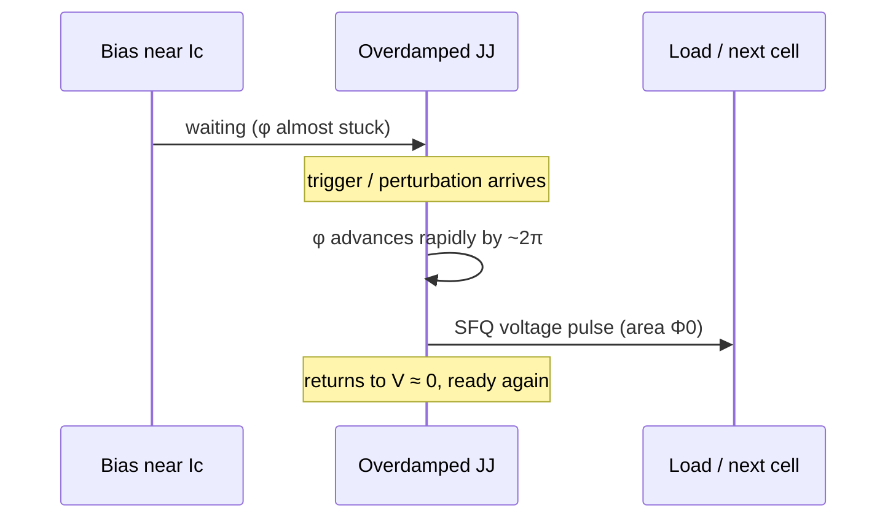
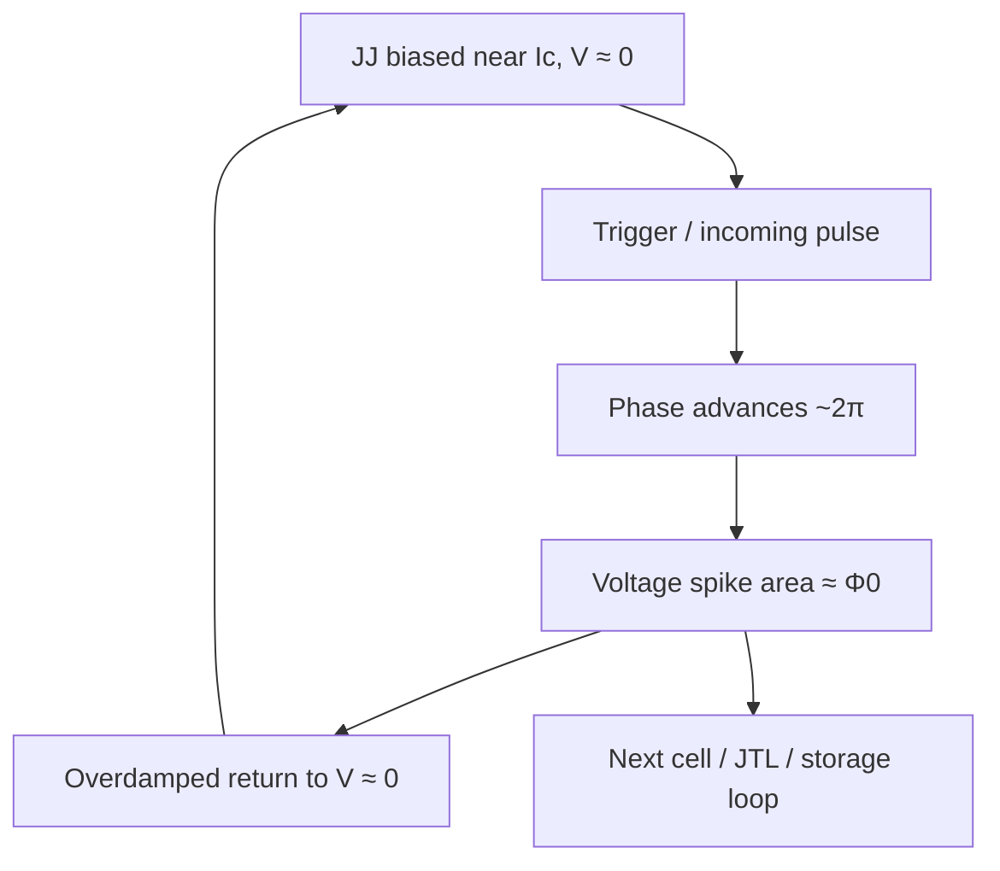

# From Josephson Phase to Picosecond SFQ Pulses

**Prereqs:** [Overdamped vs Underdamped JJ](../fundamentals/overdamped-vs-underdamped-jj.md)  
**Next:** [Pulse to Logic State](pulse-to-logic-state.md)

## Learning goals

After this page you should be able to:

1. State the AC Josephson relation and explain, in plain words, why one $2\pi$ phase slip produces a voltage pulse whose **area** equals one [flux quantum](../glossary.md) $\Phi_0 \approx 2.07\,\text{mV}\cdot\text{ps}$.
2. Tell the overdamped “click-and-recover” story: bias near the [critical current](../glossary.md), trigger, rapid phase advance, picosecond spike, return to $V\approx 0$.
3. Estimate a crude average pulse height from $\Phi_0 / \Delta t$ and explain why **area**, not peak height, is the digital invariant.
4. Contrast that SFQ pulse with CMOS rectangular voltage levels, and say why underdamped latching belongs on the I/O side path — not as the default gate token.

## Why this matters

Everything in Single Flux Quantum (SFQ) digital electronics — every hop along a [Josephson Transmission Line](../glossary.md) (JTL), every data flip-flop write, every clocked gate in [RSFQ](../glossary.md) logic — is built from one physical event. A Josephson junction briefly advances its superconducting phase by about $2\pi$ and emits a voltage spike. The voltage–time area of that spike is one flux quantum.

If you only remember “junctions switch,” SFQ still feels like magic. If you remember **phase slip → pulse of area $\Phi_0$**, the rest of the curriculum becomes engineering on top of one clear mechanism. This bridge is where device physics ([RCSJ](../fundamentals/josephson-junction-rcsj.md), [flux quantization](../fundamentals/flux-quantization.md), [overdamped vs underdamped](../fundamentals/overdamped-vs-underdamped-jj.md)) turns into the **language of the chip**: pulses.

CMOS chips talk in sustained voltage levels. SFQ chips talk in **events**. Understanding where those events come from — and what is fixed about them — is the first cliff between fundamentals and cell cards. Without this page, every later schematic looks like unexplained spaghetti: you see junctions and inductors, but you cannot say what “a bit on the wire” physically is.

Take a moment to notice how radical that claim is. In CMOS you can slow a design down and still recognize a “high” as a high. In SFQ, the native token is a fleeting packet. If you lose the packet’s meaning, you lose the bit. So the curriculum invents the packet carefully here, then teaches how to store it, pipeline it, bias it, and eventually shout it toward semiconductor land.

## Analogy (without false physics)

Think of the Josephson phase $\phi$ as the angle of a wheel. The AC Josephson relation says that the **voltage** across the junction is proportional to how fast the wheel is spinning:

$$V(t) = \frac{\Phi_0}{2\pi}\frac{d\phi}{dt}.$$

- If the wheel sits still, $d\phi/dt = 0$ and $V = 0$ (the superconducting state at DC).
- If the wheel turns steadily, you get a continuous voltage (the classic DC Josephson voltage–frequency link).
- If the wheel advances by **exactly one full turn** ($2\pi$) in a short burst and then stops again, you get a **single voltage pulse**. Integrating the relation over that turn shows that the **area** under the pulse equals $\Phi_0$ — like an odometer advancing by one unit, regardless of whether the turn was fast or slow (within the model).

The analogy is about **counting turns** and **area under $V(t)$**. It is not a claim that there is a mechanical axle inside the niobium. The physics underneath is the Josephson effect plus the definition $\Phi_0 = h/(2e)$.

A useful second picture: a click of a ratchet. Each allowed digital event advances the “count” by one flux quantum. RSFQ logic is a technology for making those clicks happen on purpose, in the right places, at the right times.

A third picture: a camera shutter open for one frame. The shutter motion can be faster or slower, but one frame is still one frame. One $2\pi$ slip is still one fluxon — one [SFQ pulse](../glossary.md).

What the analogies must *not* teach: that peak voltage is the bit, that “faster” changes $\Phi_0$, or that underdamped latching is the same animal as an overdamped click. Those traps return in the misconceptions section.

## From phase speed to voltage

You already met the AC Josephson relation on the RCSJ and flux pages. Restate it as a design mantra:

| If phase… | Then voltage… |
|-----------|----------------|
| is constant | is zero (DC) |
| changes slowly | is small |
| changes rapidly by $2\pi$ | is a short spike whose area is $\Phi_0$ |

Integrate over one complete $2\pi$ advance:

$$\int V(t)\,dt = \frac{\Phi_0}{2\pi}\int_{0}^{2\pi} d\phi = \Phi_0 \approx 2.07\,\text{mV}\cdot\text{ps}.$$

That identity is the heart of this bridge:

**one intentional $2\pi$ phase slip $\Leftrightarrow$ one SFQ voltage pulse of area $\Phi_0$.**

Shape is allowed to vary. Peak height is allowed to vary. Width is allowed to vary with junction parameters and load. The **invariant** for an ideal single slip is the area. Engineers still care about shape for margins, coupling, and timing — but when someone asks “what is the digital token?”, the honest answer is the flux packet, not the ugliest or prettiest pixel on a scope.

```text
   Phase φ(t)                         Voltage V(t)

   φ                                  V
   |          ________                |      /\
   |         /                        |     /  \
   | _______/   (+2π slip)            |____/    \____
   |                                  |
   +-------------------- time         +---------------- time

   Area under V(t) = ∫ V dt = Φ0 ≈ 2.07 mV·ps
```



Why write $\Phi_0$ as $\text{mV}\cdot\text{ps}$? Because $1\,\text{Wb} = 1\,\text{V}\cdot\text{s}$, so

$$\Phi_0 \approx 2.07\times 10^{-15}\,\text{V}\cdot\text{s} = 2.07\,\text{mV}\cdot\text{ps}.$$

That unit conversion is how device physicists and circuit designers share the same number on a picosecond scope sketch. It is also why “millivolt × picosecond” appears everywhere in SFQ talk: it is the engineering face of a fundamental constant.

### Slow phase vs fast slip — same constant

Suppose phase crept through $2\pi$ over one nanosecond. The area would still be $\Phi_0$, but the average height would be tiny:

$$V_{\mathrm{avg}} \approx \frac{2.07\,\text{mV}\cdot\text{ps}}{1000\,\text{ps}} \approx 2\,\mu\text{V}.$$

That is not an RSFQ token useful for gate-to-gate digital communication. RSFQ engineers choose damping and bias so that the slip is **fast** — few picoseconds — so the pulse is millivolt-scale and short enough to fit in high-rate logic timing. The constant does not change; the **dynamics** do.

## Overdamped switching: the SFQ pulse story

Classical RSFQ gates use **overdamped** junctions (see [overdamped vs underdamped](../fundamentals/overdamped-vs-underdamped-jj.md)). The operating story is:

1. **Bias near $I_c$.** A DC [bias current](../glossary.md) holds the junction close to its [critical current](../glossary.md) so a small additional trigger can push it over the edge. Too little bias and triggers bounce off; too much and the junction chatters or runs away.
2. **Trigger.** An incoming SFQ pulse, a clock pulse, or a designed current injection briefly increases the effective drive. The trigger is not “the bit voltage level”; it is a perturbation that starts the slip.
3. **Phase slip.** The junction’s phase races forward by about $2\pi$. While $\phi$ is moving fast, $V(t)$ spikes.
4. **Return.** Because the junction is overdamped, it does **not** latch at a large DC voltage. It dumps roughly one $\Phi_0$ of area and returns to $V\approx 0$, ready for the next event.

That return-to-zero property is why RSFQ data lines do not look like CMOS rails. After the event, the wire is quiet again. The information either moved downstream as another pulse or parked as circulating flux in a storage loop — topics for the [next bridge](pulse-to-logic-state.md).

Underdamped junctions can latch into a running voltage state and stay there until reset. That behavior is useful in some **I/O amplifiers** (side path: [SFQ pulse to voltage levels](sfq-pulse-to-volt-level.md)), but it is not the default “click and recover” behavior of RSFQ pulse logic. Mixing the two regimes in your head is one of the most common early mistakes.

```text
  Overdamped (RSFQ gate style)          Underdamped (often I/O / latching)

  V                                     V
  |   /\                                |   /‾‾‾‾‾‾‾‾  (latched until reset)
  |__/  \___  back to ~0                |__/
  time                                  time
```

### Bias is the stage crew, not the actor

Newcomers sometimes hear “bias current” and think the signal *is* the bias. Keep the roles separate:

| Role | What it is | What it is not |
|------|------------|----------------|
| Bias | Sets operating point near $I_c$ | Not the data token |
| Trigger / pulse | Starts a controlled $2\pi$ slip | Not a CMOS $V_{DD}$ level |
| Pulse area | Ideal digital invariant $\Phi_0$ | Not “whatever peak the scope shows” |

Chip-scale delivery of those bias amperes is a later story ([DC bias current delivery](dc-bias-current-delivery.md)). Here you only need: without bias near $I_c$, reliable intentional slips are hard; with bias alone and no trigger design, you do not yet have logic.

### Why damping decides the ending

In the RCSJ picture, damping decides whether the “particle” representing phase settles after one trip past the barrier or keeps running. Overdamping is why classical RSFQ can treat each slip as a **self-terminating click**. Underdamping is why some junctions prefer to **stay running** once they start — useful when you want a sustained voltage for an amplifier, awkward when you wanted a single picosecond token on a data wire.

You do not need the full Stewart–McCumber formula on this page. You need the design slogan:

> Gate pulse language ≈ overdamped click-and-recover.  
> Sustained volt-level language ≈ often underdamped latching (I/O side path).

## Why “picosecond”?

$\Phi_0 \approx 2.07\,\text{mV}\cdot\text{ps}$ already hints at the scale. If the entire slip dumps its area into a pulse only a few picoseconds wide, the average height is millivolts, not volts:

$$V_{\mathrm{avg}} \approx \frac{\Phi_0}{\Delta t}.$$

| Rough duration $\Delta t$ | Rough average height $\Phi_0/\Delta t$ |
|---------------------------|----------------------------------------|
| $2\,\text{ps}$ | $\sim 1.0\,\text{mV}$ |
| $4\,\text{ps}$ | $\sim 0.5\,\text{mV}$ |
| $10\,\text{ps}$ | $\sim 0.2\,\text{mV}$ |

Real pulses are not flat rectangles; peaks can exceed the average. Niobium junctions used in RSFQ are engineered so that dynamics live in this **few-picosecond** ballpark. The curriculum phrase “picosecond SFQ pulse” is therefore not marketing — it is what you get when one $\Phi_0$ of area is delivered by a fast overdamped switch.

Notice the cruel geometry hiding in the table: **narrower ⇒ taller average** for fixed area; **wider ⇒ shorter average**. That same geometry will return when you meet I/O: you cannot stretch one fluxon into a tall CMOS rectangle without leaving the single-$\Phi_0$ story.

## Worked example 1 — Average height from duration

Suppose an entire $2\pi$ slip completes in roughly $\Delta t = 4\,\text{ps}$. A crude average voltage is

$$V_{\mathrm{avg}} \approx \frac{\Phi_0}{\Delta t} \approx \frac{2.07\,\text{mV}\cdot\text{ps}}{4\,\text{ps}} \approx 0.52\,\text{mV}.$$

**Interpretation.** On a scope sketch you might see a spike whose peak is higher than $0.5\,\text{mV}$ and whose base is a few picoseconds wide. Do not panic if the peak is not “exactly” $0.52\,\text{mV}$. Ask first: is the **area** near $2.07\,\text{mV}\cdot\text{ps}$?

**Takeaway:** duration sets the rough height scale; area is the conserved digital quantity.

## Worked example 2 — Triangle sketch vs $\Phi_0$

Model a pulse as a triangle of base $\Delta t = 5\,\text{ps}$ and peak $V_p = 0.8\,\text{mV}$:

$$A \approx \tfrac{1}{2}\,V_p\,\Delta t = \tfrac{1}{2}\times 0.8\,\text{mV}\times 5\,\text{ps} = 2.0\,\text{mV}\cdot\text{ps}.$$

Compare to $\Phi_0 \approx 2.07\,\text{mV}\cdot\text{ps}$. The sketch is already within a few percent of one flux quantum. That is the intended design ballpark for a single overdamped slip: **one click, one quantum**.

If instead someone drew a $1\,\text{ns}$-wide, $1\,\text{V}$ CMOS-like rectangle and called it an SFQ pulse, the area would be enormous ($\sim 10^{6}\,\text{mV}\cdot\text{ps}$) — that is a completely different physical object (many quanta, latching waveform, or simply not an SFQ fluxon event).

## Worked example 3 — What a $4\pi$ slip would mean

If a junction advanced by $4\pi$ in one uncontrolled event,

$$\int V\,dt = \frac{\Phi_0}{2\pi}\int_{0}^{4\pi} d\phi = 2\Phi_0.$$

In the ideal Josephson picture that is **two** flux quanta, not a “taller bit.” RSFQ cells are designed and timed so that normal operation produces controlled single ($2\pi$) slips. Multi-slip events are usually margin or timing failures, not a free way to invent multi-level logic.

**Extra check.** A $6\pi$ advance would enclose $3\Phi_0$. Counting slips is counting tokens. Logic families that want one bit per event fight to keep events single.

## Worked example 4 — Two shapes, one area

Suppose pulse A is a triangle with base $4\,\text{ps}$ and peak $1.035\,\text{mV}$:

$$A_A \approx \tfrac{1}{2}\times 1.035\times 4 = 2.07\,\text{mV}\cdot\text{ps}.$$

Suppose pulse B is a crude rectangle of width $6\,\text{ps}$ and height $0.345\,\text{mV}$:

$$A_B \approx 0.345\times 6 = 2.07\,\text{mV}\cdot\text{ps}.$$

They look different on a sketch. Idealized single-slip digital meaning is the same: one flux quantum of area. Real cells still care which shape couples better into the next inductor — margins are engineering — but newcomers should stop asking “which peak is the 1?” and start asking “did we deliver about one $\Phi_0$ in the right place at the right time?”

## A second figure — from idle to click

```text
Timeline of one overdamped gate click (cartoon)

  Bias current:  ===============================  (steady near Ic)
  Trigger:       ________★______________________
  Phase φ:       _______ /‾‾‾‾‾‾‾‾‾‾‾‾‾‾‾‾‾‾‾  (+2π step)
  Voltage V:     ________/\____________________  (spike, then ~0)

  ★ = trigger arrives
  After the spike, data wire is quiet again — bit moved or stored elsewhere
```



## Area is the invariant — peak is not

Hold this distinction tightly; it saves months of confusion:

| Quantity | Ideal single $2\pi$ slip | What engineers still tune |
|----------|--------------------------|---------------------------|
| $\int V\,dt$ | $\Phi_0$ (fixed by physics) | Keep the event single and well-coupled |
| Peak $V$ | Not fixed | Depends on dynamics, load, parasitics |
| Width $\Delta t$ | Not fixed | Set by junction dynamics and circuit |
| Shape details | Not fixed | Matter for margins and timing |

Saying “area not peak” does **not** mean shape is irrelevant in the lab. It means the **definition of the token** is the flux packet. A peak that looks “impressive” on a plot is not automatically a better 1. A quiet-looking spike with the right area, in the right epoch, into the right next cell, is a perfect 1.

## CMOS contrast

| Idea | Typical CMOS digital intuition | SFQ pulse (this page) |
|------|--------------------------------|------------------------|
| What is a “1”? | Node held near $V_{DD}$ for as long as needed | Presence of a pulse event (later: in a clock window) |
| Signal shape | Often treated as levels / edges on nanosecond scales | Picosecond spike with area $\Phi_0$ |
| What is fixed? | Logic swing is a design choice | Token size $\Phi_0$ is a physical constant |
| Idle wire | Can sit at a valid DC level | No sustained “high voltage 1” on an RSFQ data line |
| Device goal | Transistors steer charge to set voltage | Overdamped JJ produces a $2\pi$ slip then recovers |
| “Stronger 1” | Sometimes larger swing or drive | Not “taller peak”; usually better margins / timing / coupling of one quantum |

CMOS can hold a logic high indefinitely with a DC voltage. RSFQ data lines do not “park” at a millivolt high; they either fire a pulse or they do not. Storage, when needed, lives in **circulating flux** in a loop — the next bridge.

If you catch yourself asking “is this node high?”, replace the question with “did a fluxon event happen / is a quantum stored?” That habit change is half the battle of learning SFQ.

## Bridge to SFQ circuits

Gates on an SFQ chip do not behave like tiny voltmeters asking “is this node above $V_{IH}$?” They ask questions closer to:

- Did a pulse **arrive** on this wire in this timing window?
- Does this storage loop **hold** a circulating $\Phi_0$?
- When the clock arrives, should we **emit** an output pulse?

Josephson Transmission Lines regenerate and move pulses. Splitters copy them. Storage cells capture them as circulating current. Clocked gates release them on cue. All of that machinery assumes you already understand **where a pulse comes from** and **why its area is sacred**.

A JTL stage is, at heart, another biased overdamped junction waiting for a trigger: the arriving pulse starts a new $2\pi$ slip, which launches a fresh pulse of area $\approx\Phi_0$ into the next inductor. Regeneration is not “amplifying a voltage level”; it is **recreating the flux packet** so it can travel farther without fading into noise.

Optional later side path (I/O): when you must talk to CMOS or room-temperature instruments, pulses are too small and too short — see [SFQ pulse to voltage levels](sfq-pulse-to-volt-level.md). Stay on the core walk first: how pulse presence becomes a logic bit in [Pulse to Logic State](pulse-to-logic-state.md).

## Common misconceptions

1. **“The digital bit is the peak voltage of the pulse.”**  
   No. The ideal invariant of one $2\pi$ slip is the **area** $\int V\,dt = \Phi_0$. Peaks vary with dynamics and parasitics.

2. **“SFQ pulses are just very short CMOS edges.”**  
   CMOS edges connect sustained voltage levels. An SFQ pulse is a **self-contained flux packet** delivered as a spike; after it passes, the line returns to $\sim 0$ without leaving a CMOS-like high level behind.

3. **“Faster always means a different $\Phi_0$.”**  
   $\Phi_0$ is fixed by $h$ and $2e$. Faster dynamics change the **shape** (taller/narrower vs shorter/wider) while still enclosing about one quantum for a single slip.

4. **“Any Josephson switch makes a good RSFQ pulse.”**  
   Overdamped recovery (pulse then $V\to 0$) is what classical RSFQ wants. Underdamped latching is a different tool, often for interfaces.

5. **“If I do not see a rectangle on the scope, it is not digital.”**  
   SFQ digital meaning is carried by **events and stored flux**, not by flat-top CMOS rectangles. Ugly-looking spikes can still be perfect logic tokens if the area and timing are right.

6. **“Bias current is the signal.”**  
   Bias sets the operating point near $I_c$. The **signal** is the phase-slip event (and the pulse it launches). Confusing bias rails with data is a common early mix-up; the [DC bias current delivery](dc-bias-current-delivery.md) bridge untangles delivery at chip scale later.

7. **“A taller spike is automatically a stronger 1.”**  
   Within the single-slip model, “stronger” is about reliable delivery of one quantum into the next cell — margins, damping, coupling — not about inventing a CMOS-like voltage hierarchy of 1s.

8. **“If area is fixed, I/O is easy: just slow the pulse down.”**  
   Slowing a fixed-area pulse lowers average height. Leaving pulse-land for volt-level electronics needs gain / latching / stacking — later.

## Check yourself

<details>
<summary>1. Write the AC Josephson relation and state what each symbol means in one short clause.</summary>

$V(t) = (\Phi_0 / 2\pi)\, d\phi/dt$. $V$ is the voltage across the junction; $\phi$ is the Josephson phase difference; $\Phi_0$ is the flux quantum. Voltage tracks how fast phase is changing.
</details>

<details>
<summary>2. What physical event creates one ideal SFQ pulse?</summary>

An (overdamped) Josephson junction advancing its phase by about $2\pi$ — a phase slip — so that $\int V\,dt = \Phi_0$.
</details>

<details>
<summary>3. What is fixed about every ideal single-slip SFQ pulse, and what is allowed to vary?</summary>

Fixed: voltage–time area equals $\Phi_0$. Allowed to vary: peak height, detailed shape, and exact width (within the device’s dynamics).
</details>

<details>
<summary>4. Why do we say “picosecond” pulses for typical Nb RSFQ junctions?</summary>

Because one $\Phi_0$ of area dumped by fast overdamped dynamics naturally lands in a few-picosecond-wide, millivolt-scale spike — not a nanosecond CMOS edge.
</details>

<details>
<summary>5. A triangular sketch is $3\,\text{ps}$ wide and $1.4\,\text{mV}$ tall. Is its area near one $\Phi_0$?</summary>

Area $\approx \tfrac{1}{2}\times 1.4\,\text{mV}\times 3\,\text{ps} = 2.1\,\text{mV}\cdot\text{ps}$, yes — on the order of $\Phi_0 \approx 2.07\,\text{mV}\cdot\text{ps}$.
</details>

<details>
<summary>6. How does an overdamped SFQ switching event differ from an underdamped latching event in one sentence?</summary>

Overdamped: emit a short pulse and return to $V\approx 0$. Underdamped: can jump to a large voltage and stay latched until reset.
</details>

<details>
<summary>7. Why is “is the node high?” a bad first question for RSFQ data wires?</summary>

Because RSFQ data is carried by pulse events (and stored flux in loops), not by parking a wire at a sustained CMOS-like high level.
</details>

<details>
<summary>8. If $\Delta t$ doubles and area stays $\Phi_0$, what happens to average height?</summary>

It roughly halves: $V_{\mathrm{avg}} \approx \Phi_0/\Delta t$.
</details>

<details>
<summary>9. A junction slips by $4\pi$ once. How many flux quanta of area were produced?</summary>

Two — because $\int V\,dt = 2\Phi_0$ for a $4\pi$ advance.
</details>

<details>
<summary>10. In one sentence, what does a JTL “regenerate”?</summary>

It recreates the flux packet by launching a new overdamped $2\pi$ slip (a fresh SFQ pulse of area $\approx\Phi_0$), rather than amplifying a sustained CMOS-like voltage level.
</details>

## Next steps

- Turn pulse presence into bits, windows, and storage loops: [Pulse to Logic State](pulse-to-logic-state.md).
- If I/O amplitude already worries you (optional side path): [SFQ pulse to voltage levels](sfq-pulse-to-volt-level.md).
- Refresh damping contrast anytime: [Overdamped vs Underdamped JJ](../fundamentals/overdamped-vs-underdamped-jj.md).
- Refresh the packet size: [Flux quantization](../fundamentals/flux-quantization.md).
- Plain-English terms: [Glossary](../glossary.md).
