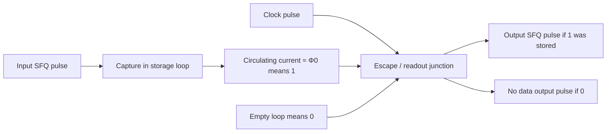
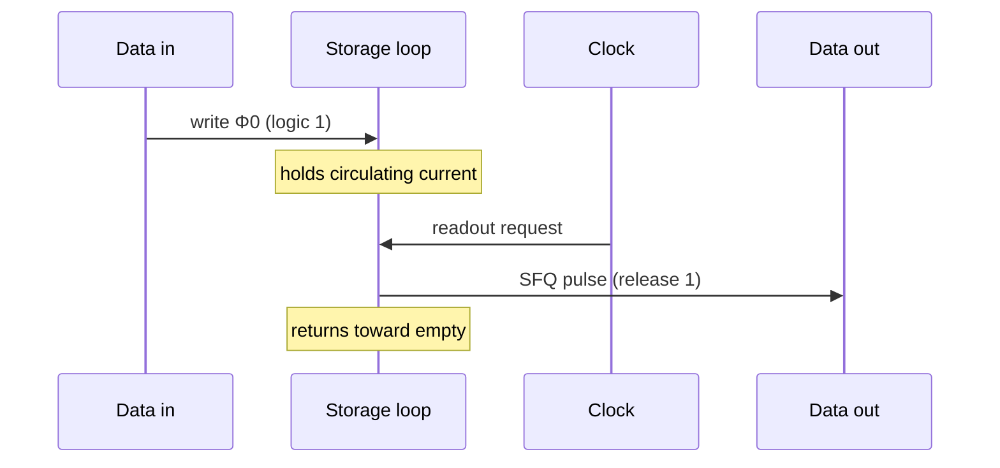

# From SFQ Pulses to Logic States

**Prereqs:** [Phase to Pulse](phase-to-pulse.md)  
**Next:** [RSFQ Logic](../concepts/rsfq-logic.md) · [Gate-Level Pipelining](gate-level-pipelining.md)

## Learning goals

After this page you should be able to:

1. Explain Rapid Single Flux Quantum ([RSFQ](../glossary.md)) windowed encoding: logic **1** ≈ an [SFQ pulse](../glossary.md) present in a defined [clock window](../glossary.md) (epoch); logic **0** ≈ **absence** of a pulse in that same window.
2. Describe how a superconducting **storage loop** holds a parked “1” as a circulating current corresponding to about one [flux quantum](../glossary.md) $\Phi_0$, and how a clocked readout releases it as an output pulse.
3. Walk a one-bit [DFF](../glossary.md)-like story end to end: **capture → hold → clocked readout** (or no readout pulse when the store is empty).
4. Say why two quiet wires can still carry different bitstreams, and why a physically perfect pulse in the **wrong** window is a timing error — not a free bonus 1.

## Why this matters

The previous bridge showed where pulses come from: a $2\pi$ phase slip dumps voltage–time area $\Phi_0$. That is necessary but not sufficient for computation. A lone spike on a wire is only information if the rest of the circuit agrees on **what the spike means**.

In CMOS, a bit is often “this node is high” or “this node is low” — a voltage that can sit still while you look at it. In RSFQ logic, bits are usually:

- **in motion:** pulse present or absent inside a timing window, or
- **at rest in a loop:** circulating flux quantum present or absent until a clock asks for it.

If you open a cell card before this mental model clicks, every schematic looks like unexplained spaghetti. This page closes the gap: pulses become **states**, and clocks become **questions asked of those states**.

Without windows and storage, you cannot explain why two quiet wires can carry different bitstreams, why a perfect-area pulse can still be a functional error, or why every later timing topic (path balancing, STA, clocking style) exists. This bridge is the **encoding contract** for the rest of the core walk: first the vocabulary of RSFQ cells, then the architectural habit that almost every gate is also a pipeline stage.

Take a moment to notice how radical the contract is. CMOS lets you slow a design down and still recognize a parked high as a high. RSFQ does not park data wires at a millivolt “high.” After an SFQ pulse passes, the line returns toward zero. The bit either moved downstream as another pulse, or it is napping as circulating $\Phi_0$ inside a loop. If you lose that distinction, you will keep asking the wrong question (“is this node high?”) when the right question is (“did a fluxon event happen in this epoch / is a quantum stored here?”).

## Analogy (without false physics)

Imagine a conveyor divided into timed buckets (clock cycles / epochs):

- **Logic 1:** a token (SFQ pulse) drops into **this** bucket.
- **Logic 0:** the bucket is empty — no token in this window.
- **Storage:** a holding cup (superconducting loop) can keep one token until a clock “pours” it downstream as a new pulse.

Tokens are identical physical objects — each is about one $\Phi_0$. Meaning comes from **which window**, **which wire**, and **whether a cup is full**. The analogy is about **timed presence** and **holding**, not about literal cups of liquid helium.

A second picture: a drumbeat (clock) and occasional handclaps (data). A clap on the beat is a 1; silence on the beat is a 0. A clap between beats is a timing error, not a new logic value.

A third picture: mail slots labeled by hour. A letter in the 3:00 slot is “today’s 3:00 message.” The same letter stuffed into the 4:00 slot is a different message — or a misdelivery. RSFQ treats epochs that seriously.

A fourth picture: a turnstile that clicks once per admitted person. The click is the event. Between clicks the gate looks “quiet,” but the queue still has a history of who already passed. Quietness is not emptiness of meaning — it is emptiness of **voltage**, while meaning lives in the **pattern of clicks relative to the drumbeat**.

What the analogies must **not** teach: that tokens have different “colors” of 1, that voltage height on a quiet wire encodes the bit, that clocks are optional decoration around CMOS-like combinational clouds, or that “0” is a special anti-token on every data net.

## Encoding: windows, not DC levels

RSFQ data lines do not park at a millivolt “high.” After a pulse passes, voltage returns toward zero ([phase to pulse](phase-to-pulse.md)). So the digital question is not “is $V$ above $V_{IH}$ right now?” It is closer to:

> In this agreed time slot, did an SFQ pulse arrive on this net?

```text
Clock windows:     |   T1   |   T2   |   T3   |   T4   |
Data pulses:           ★               ★
Encoding:              1        0      1        0

Same physical pulse shape each time — meaning is "present in window?"
```



Important nuances (field-fundamental, not paper-specific):

- Some cells are **combinational in spirit** but still timed: they emit an output pulse when inputs and internal state satisfy a condition in a clocked rhythm.
- Asynchronous or wave-pipelined styles exist in research; the **core walk** starts with the standard clocked picture because it matches most introductory RSFQ cell libraries.
- “Pulse = 1” is shorthand. More precisely: **pulse in the correct epoch on the correct net = 1**.

### Presence vs absence is the alphabet

| Observation in an epoch | Usual meaning |
|-------------------------|---------------|
| One SFQ pulse on the data net | Logic **1** for that bit / that stage |
| No SFQ pulse on the data net | Logic **0** for that bit / that stage |
| Pulse far outside the agreed window | Timing error / wrong epoch — not a free bonus 1 |

The alphabet is tiny on purpose. Complexity lives in **where** pulses meet, **how** loops store them, and **when** clocks ask questions — not in inventing twenty voltage thresholds.

### Why “absence” is a real symbol

Newcomers sometimes feel uneasy that logic 0 is “nothing happening.” In windowed encoding, absence is not vagueness — it is a **defined observation** relative to an agreed epoch. The clock (or the cell’s timing contract) tells you *when to look*. Looking between epochs and finding silence does not invent a 0 for the previous slot; looking *inside* the slot and finding silence **is** the 0 for that slot.

That is why clock distribution and timing arcs matter so much later. If the circuit cannot agree on where the slot boundaries are, “absence” stops being a crisp symbol and becomes an argument about measurement.

## Storage: circulating flux as a parked bit

When you need memory between clock beats, RSFQ uses a superconducting loop that can hold a circulating current corresponding to about one flux quantum — the same physics as [flux quantization](../fundamentals/flux-quantization.md) and [loops / SQUIDs](../fundamentals/superconducting-loop-squid.md).

| Loop state (cartoon) | Usual logic story |
|----------------------|-------------------|
| No circulating $\Phi_0$ ($n\approx 0$) | Stored **0** |
| Circulating current $\sim 1\cdot\Phi_0$ ($n\approx \pm 1$) | Stored **1** |

Writing a 1 means accepting an incoming pulse so that the loop’s fluxoid state advances. Reading a 1 means a clocked junction lets that quantum **escape** as an output pulse, typically clearing the loop back toward empty. Reading a 0 means the clock finds nothing to launch on the data output.

```text
  Storage loop cartoon

     empty (0)                 holds Φ0 (1)
   ┌──────────┐              ┌──────────┐
   │          │              │    ↻     │  circulating current
   │    ○     │              │   Φ0     │
   │          │              │          │
   └──────────┘              └──────────┘
        ↑ write pulse               │ clocked readout
        └---------------------------┘ → output pulse
```

Exact schematics (which junction is the “escape” junction, how the clock couples, how margins are set) vary by cell library. The **story** is what you need before [RSFQ DFF and retiming](../concepts/rsfq-dff-and-retiming.md): capture → hold → clocked release.

### Two places a 0 can live

Do not conflate:

| Place | What “0” looks like |
|-------|---------------------|
| Moving on a net | No pulse in this epoch |
| Parked in a cell | Empty storage loop when the clock asks |

Both are zeros. They are different **locations** in a schematic walkthrough. Tracing “where is the bit?” means asking which of those homes it occupies right now.

### Capture → hold → clocked readout

Treat a DFF-like stage as a tiny three-act play:

1. **Capture.** An incoming data pulse (logic 1) is accepted into the storage loop. The wire does not need to stay “high.” The bit is now **inside** the loop as circulating $\Phi_0$.
2. **Hold.** Between write and readout, the loop keeps the quantum. Nearby data wires may look quiet. The chip has not forgotten the bit — the bit is parked.
3. **Clocked readout.** A clock pulse arrives and asks the question: “are you holding a 1?” If yes, the stage launches an output SFQ pulse and typically clears the store. If no, the stage launches **no** data output pulse for that epoch — that silence is the forwarded 0.

```text
  Cell as a tiny timed machine

       data pulse? ──► [ storage loop ] ──► data out pulse?
                            ▲
                            │
                       clock pulse
                       ("ask now")

  Truth (cartoon):
    stored 1 + clock → emit 1 (pulse out), usually clear store
    stored 0 + clock → emit 0 (no data pulse)
```



The clock is not “power.” The clock is a **timed request**. That sentence will carry you through most introductory RSFQ cell cards.

## Worked example 1 — One-bit shift-register / DFF stage

A minimal DFF-like / shift-register stage:

1. **Idle, empty.** Loop holds no quantum (logic 0 stored).
2. **Data 1 arrives** before the next relevant clock. The write dynamics put $\sim\Phi_0$ into the loop. State is now stored 1.
3. **Clock arrives.** Readout launches an **output data pulse** and clears the loop back toward empty.
4. **Next cycle, no data pulse.** Clock arrives, finds empty storage, and does **not** launch a data output pulse (logic 0 forwarded).

```text
Time →

Data in:   ____★______________★__________
Clock:     ______★______★______★______★__
Store:     0 → 1 → 0    0     0 → 1 → 0
Data out:  ______★______________★________
```

**Interpretation.** Match each star to a window. The first data star is captured, then released on the following clock as an output star. Between events, voltages sit near zero — but the store row tells you the bit’s real home.

**Takeaway:** the clock is a timed request: “if you are holding a 1, emit it now.”

## Worked example 2 — Same pulse, wrong window

Suppose a data pulse is physically perfect (area $\approx\Phi_0$) but arrives **after** the cell’s setup deadline relative to the clock — or straddles the boundary between epochs.

- CMOS intuition might say: “the edge happened, so the bit should count.”
- RSFQ intuition says: “the bit is defined relative to the **window**. Early or late can mean the wrong epoch, a missed capture, or a race into the next stage.”

That is why SFQ design obsesses over [path balancing](../glossary.md), clock distribution, and static timing ideas later. A correct pulse at the wrong time is still a functional error.

**Numeric sketch (order-of-magnitude only, not a chip claim).** If clock epochs are spaced by $T_{\mathrm{clk}} = 50\,\text{ps}$ (a $20\,\text{GHz}$ cartoon rate), a pulse that is $5\,\text{ps}$ late is not “almost on time” in a vague human sense — it is a **10% epoch error** and may violate the cell’s timing arc:

$$\frac{5\,\text{ps}}{50\,\text{ps}} = 0.10.$$

Exact setup/hold numbers are library-specific; the lesson is qualitative: **windows are narrow because pulses are short and pipeline stages are deep**.

**Takeaway:** wrong window $\neq$ “still a 1 somewhere.” Wrong window = timing failure mode.

## Worked example 3 — Why two wires can both be “quiet” and still mean different things

Wire A carries the stream `1,0,1` as pulses in windows T1 and T3. Wire B carries `0,0,0` and stays quiet. Between pulses, **both** wires sit near $V=0$. A voltmeter watching DC would see little difference most of the time. The information is in the **pattern of events relative to the clock**, not in a sustained voltage contrast.

```text
Epoch:     T1    T2    T3    T4
Wire A:     ★     ·     ★     ·     →  1 0 1 0
Wire B:     ·     ·     ·     ·     →  0 0 0 0

Between stars, both wires look "quiet" on a DC voltmeter.
```

This is the deepest CMOS-habit break on the core walk. If you catch yourself thinking “the wire must be high if it means 1,” replace that habit with “the **stream** is defined by presence/absence in epochs.”

## Worked example 4 — Capture without early readout

Suppose data 1 is written into a storage loop at epoch T1, but the intended readout clock for that stage is T3 (a deeper pipeline cartoon). Between T1 and T3 the loop holds circulating $\Phi_0$ while nearby data wires may be quiet.

| Time | Loop | Data wire out of this stage |
|------|------|------------------------------|
| Before write | Empty (0) | Quiet |
| After write, before clock | Holds $\Phi_0$ (1) | Still quiet (bit is parked) |
| After readout clock | Empty again | Emits pulse if 1 was stored |

**Takeaway:** “wire is quiet” does not mean “chip forgot the bit.” Storage loops are where bits nap between questions.

## CMOS contrast

| Question | CMOS (typical digital habit) | RSFQ (this bridge) |
|----------|------------------------------|---------------------|
| What is a stored 1? | Charge / voltage on a node or latch | Circulating $\sim\Phi_0$ in a loop (storage cell) |
| What is a moving 1? | Level propagating / edge switching | SFQ pulse in a timing window |
| What is a 0? | Low voltage level | No pulse in the window / empty loop |
| How long can a 1 sit on a wire? | Indefinitely as DC level | Data wire does not hold a DC “high”; storage needs a loop |
| Role of clock | Often samples latches around combinational clouds | Often participates in every stage’s forward progress |
| Failed timing | Setup/hold on flops | Missed window / wrong epoch / unbalanced paths |
| Scope habit | Look for levels and edges | Look for events aligned to epochs |
| Quiet wire | Often means “stuck low / idle low” as a valid DC state | Quiet is the *default between events*; meaning lives in timed presence/absence |

## Bridge to SFQ circuits

Almost every classical RSFQ gate is a small **timed machine**:

- it accepts pulses on inputs,
- it may update internal flux state,
- it emits pulses on outputs aligned to clocking rules.

When you open [RSFQ logic](../concepts/rsfq-logic.md), read each cell as “what pulses does it expect, what does it store, what does it emit when?” rather than as a CMOS truth table alone. That concept card is the natural next stop on the core walk: it names the common cells while this bridge’s encoding stays in your head.

Then [gate-level pipelining](gate-level-pipelining.md) will feel inevitable: logic and latching are fused. Splitters copy a pulse to two places; confluence merges streams with timing rules; JTLs move pulses without intending long-term storage. All of them still live in the same encoding world you just built — windowed presence, circulating $\Phi_0$ for parking, and clocks that ask questions.

If a schematic later shows a DFF-like cell, you already know the three acts. If a timing report later complains about a path, you already know that “late” is not a soft aesthetic problem — it can move a token into the wrong bucket.

## Common misconceptions

1. **“High voltage on the wire means 1, like CMOS.”**  
   After an SFQ pulse, the wire returns toward zero. Presence **in a window** (or flux in a loop) is the bit.

2. **“Any pulse anywhere is a 1 forever.”**  
   Meaning is epoch-relative. A pulse in the wrong window is a timing problem, not free bonus information.

3. **“Storage is just a capacitor holding millivolts.”**  
   RSFQ storage is typically a **persistent circulating current** in a superconducting loop, quantized near integer flux quanta — not an RC voltage puddle.

4. **“Clock is only for synchronization; logic is separate.”**  
   In the standard RSFQ picture, clock pulses often **participate** in readout and forward progress. Logic and timing are braided (next bridge after the RSFQ concept survey).

5. **“Empty loop and quiet wire are different physics of zero.”**  
   Both can represent 0, but they are different **places** a 0 lives: dynamic absence on a net vs stored absence in a cell. Do not mix them when tracing a schematic.

6. **“If the scope shows a messy spike, it cannot be a clean bit.”**  
   Digital cleanliness is about area, margins, and timing — not about looking like a textbook rectangle.

7. **“A missing clock just means the bit waits politely forever on the wire.”**  
   Data wires do not park CMOS highs. Without storage capture / proper timing, pulses are fleeting; bits that must wait need loops (or downstream stages ready to catch them).

8. **“Logic 0 is a special negative pulse.”**  
   Usually no — 0 is absence in the window (or empty store), not an anti-fluxon alphabet on every wire.

9. **“Two quiet wires must mean the same bit.”**  
   Quietness is the default between events. Different streams can both look quiet most of the time and still encode different patterns of presence/absence across epochs.

10. **“A perfect $\Phi_0$ area guarantees a correct logic transfer.”**  
    Area is the physical token size. Correct **logic** also needs the correct net and the correct window. Physics-perfect, timing-wrong is still wrong.

## Check yourself

<details>
<summary>1. How is logic 1 usually encoded in RSFQ data movement?</summary>

Presence of an SFQ pulse within a defined clock timing window (epoch) on the relevant net.
</details>

<details>
<summary>2. What does a storage loop hold when it stores a “1”?</summary>

A persistent circulating current corresponding to about one flux quantum $\Phi_0$.
</details>

<details>
<summary>3. What does the clock typically do to a DFF-like cell that stores a 1?</summary>

It triggers readout: the stored quantum is released as an output pulse and the loop typically returns toward empty.
</details>

<details>
<summary>4. If no data pulse arrived before the clock, what data output do you expect from that stage?</summary>

No data output pulse for that epoch — logic 0 forwarded.
</details>

<details>
<summary>5. Why can two RSFQ wires both show ~0 V most of the time and still carry different bitstreams?</summary>

Because information is in the pattern of pulses relative to clock windows, not in sustained DC voltage levels between events.
</details>

<details>
<summary>6. A perfect-area pulse arrives late relative to the clock. Why might the circuit still fail?</summary>

RSFQ meaning is window-relative; a late pulse can miss capture, violate timing arcs, or land in the wrong epoch — a timing error, not a valid 1 for that stage.
</details>

<details>
<summary>7. Name one CMOS habit that misleads newcomers on this topic.</summary>

Expecting a parked high voltage to mean “stored 1” on a data wire, or treating the clock as optional synchronization around a large unclocked combinational cloud.
</details>

<details>
<summary>8. Where does a bit “live” between write and readout in a DFF-like stage?</summary>

As circulating flux in the storage loop — not as a sustained voltage high on the output wire.
</details>

<details>
<summary>9. Is “pulse = 1” complete enough as a slogan? What is missing?</summary>

Incomplete. Need the correct epoch and the correct net: pulse in the right window on the right wire.
</details>

<details>
<summary>10. List the three acts of capture → hold → clocked readout in one sentence each.</summary>

Capture: accept a data-1 pulse into the storage loop as circulating $\Phi_0$. Hold: keep that quantum while wires may look quiet. Clocked readout: on the clock request, emit an output pulse if storing 1 (else emit silence as 0), typically clearing the store after a 1.
</details>

## Next steps

- Cell vocabulary survey (core walk next): [RSFQ Logic](../concepts/rsfq-logic.md).
- Why every gate is also a pipeline stage: [Gate-Level Pipelining](gate-level-pipelining.md).
- DFF / retiming depth: [RSFQ DFF and Retiming](../concepts/rsfq-dff-and-retiming.md).
- Refresh pulse origin anytime: [Phase to Pulse](phase-to-pulse.md).
- Terms: [Glossary](../glossary.md) ([SFQ pulse](../glossary.md), [clock window](../glossary.md), [RSFQ](../glossary.md), [$\Phi_0$ / flux quantum](../glossary.md), [DFF](../glossary.md)).
