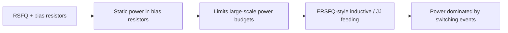
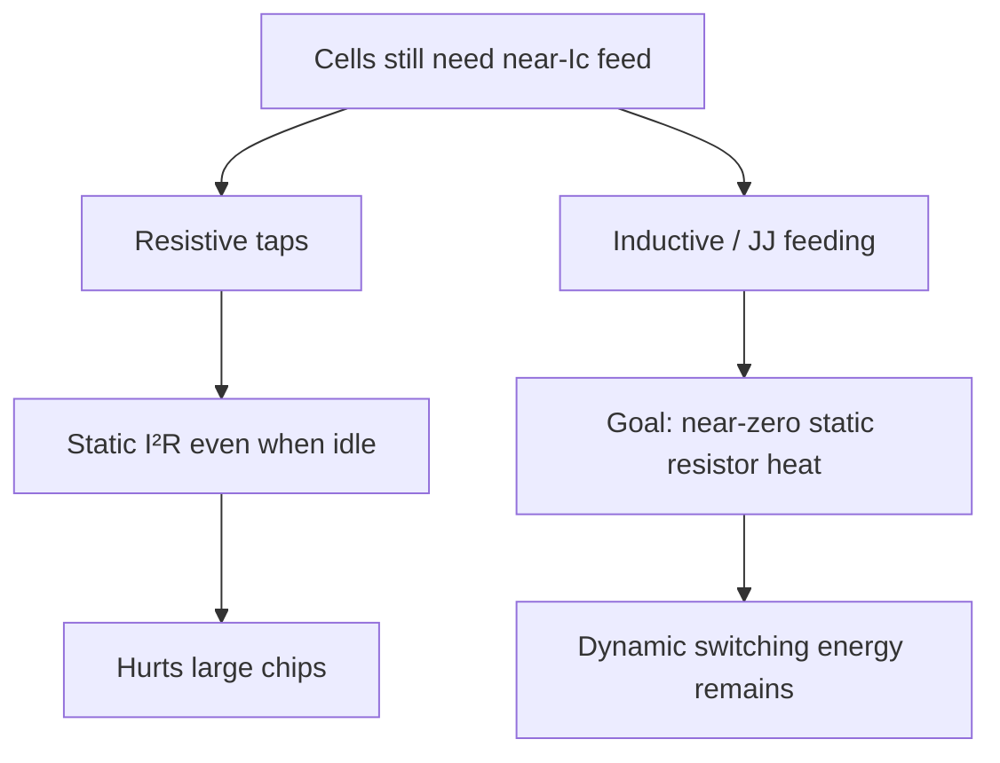

# From Resistive Bias to ERSFQ

**Prereqs:** [Gate-Level Pipelining](gate-level-pipelining.md)  
**Next:** [DC Bias Current Delivery](dc-bias-current-delivery.md) · [ERSFQ Logic](../concepts/ersfq-logic.md)

**TL;DR.**
- Story so far: classic RSFQ needs bias currents.
- This page: static resistor power problem and ERSFQ-style fix intuition.
- Next: how DC bias is delivered on chip.


## Learning goals

After this page you should be able to:

1. Explain why classical [RSFQ](../glossary.md) cells are fed by a DC [bias current](../glossary.md) near the junction [critical current](../glossary.md) $I_c$, and why a **resistive** bias tap dissipates **static** power even when the circuit is idle.
2. State the scaling intuition: many parallel resistive taps → large total bias current **and** continuous $I^2R$-like heat in the bias network.
3. Describe what [ERSFQ](../glossary.md) changes at a field-fundamental level (inductive / Josephson feeding aimed at near-zero static resistor dissipation) without memorizing a paper’s measured watt table.
4. Separate three different problems: static resistor heat, total ampere delivery, and dynamic switching energy — so later pages ([DC bias delivery](dc-bias-current-delivery.md), [serial biasing](../concepts/serial-biasing-current-recycling.md)) each have a clear job.

## Why this matters

Gate-level pipelining taught you that SFQ datapaths are forests of clocked cells. Each overdamped junction in those cells typically sits near its [critical current](../glossary.md) so a small trigger can launch a $2\pi$ slip ([phase to pulse](phase-to-pulse.md)). That operating point is not optional decoration. It is how the pulse machine stays sensitive enough to fire cleanly when a signal arrives, and quiet enough not to fire on noise alone.

That operating point needs **[bias current](../glossary.md)**. In classical [RSFQ](../glossary.md), a common teaching cartoon for feeding each tap is: a bias voltage rail, a **resistor**, then the cell. Resistors are simple and robust — and they burn power **all the time**, whether or not pulses are flying. The cell can be waiting forever for the next clock or data pulse and the resistor still carries a steady DC current. Readiness has a continuous bill.

At textbook scale (a few gates on a lab schematic), nobody cares. At chip scale (thousands to millions of junctions, each needing a feed near $I_c$), resistive bias becomes a **power and cooling wall**. Cryogenic refrigerators have limited cooling power. Continuous heat dumped into the cold stage fights the refrigerator, shrinks what you can put on one chip, and forces awkward tradeoffs between speed, margin, and scale. Energy-efficient RSFQ families — especially **[ERSFQ](../glossary.md)** — exist largely to attack that wall. This bridge teaches the **motivation and the cartoon**, so the [ERSFQ concept card](../concepts/ersfq-logic.md) is not just a mysterious acronym.

Notice the narrative order on the core walk: first invent pulses, then bits, then pipelines — and only then admit that every stage of that pipeline carries a bias tax. If you jump to “ERSFQ is low power” without this story, you will confuse three different power problems and misread every later paper. Papers talk about watts on the cold stage, amperes in cables, and picojoules per switch. Those are related sentences, not synonyms. This page exists so those sentences stop collapsing into one vague worry about “power.”

A second reason the story comes *after* pipelining: gate-level pipelines and path-balancing pads multiply cells. Every pad you insert for epoch correctness can also be another bias tap in the classical picture. Architecture and bias tax are not independent chapters. They are the same forest counted two ways — stages for timing, taps for heat and current.

## Analogy (without false physics)

Classical resistive bias is like leaving a faucet dripping into every sink in a skyscraper, all day, so each sink is “ready.” The dripping wastes water (power) even when nobody washes hands (no switching). The building can be empty at night and still drain the reservoir through readiness alone.

ERSFQ-style biasing aims to feed cells through **superconducting / Josephson feeding networks** so you are not paying continuous resistive drip on every tap. Energy should be spent mainly when events actually switch — still not zero, but the **static bias-resistor bill** shrinks dramatically in intent. Think of replacing always-dripping taps with a pressurized superconducting plumbing system that holds the operating point without a permanent resistive leak at every sink.

A second picture: Christmas lights left on in an empty office tower. The tower can be “idle” as a workplace and still burn power. Classical RSFQ bias resistors are that always-on lighting for readiness. Turning off the office computers (stopping data pulses) does not turn off the hallway lights (bias resistors) unless you redesign the lighting itself.

A third picture, only for the ampere side: many garden hoses running in parallel from one hydrant. Even if each hose’s nozzle were somehow lossless, the hydrant still has to supply the **sum** of the flows. That is the delivery problem you will meet next — related to bias, but not the same as “the nozzle is hot.”

What these analogies must not teach: that ERSFQ literally turns junctions into magic zero-energy devices, that superconducting wires make whole chips free, or that “idle” means “no current anywhere.” The analogies are about **idle waste vs event-driven cost**, and about separating heat-in-resistors from total-flow-in-cables. Exact feeding topologies (feeding JJs, inductors, how regulation works) vary; learn the **why** here and the family card next.

## Classical resistive bias — the cartoon

```text
Classical RSFQ bias sketch (one tap):

  V_bias ──── R_bias ────●──── cell / JJ network
                         │
                        GND

  Even when idle, current I_b through R_bias dissipates power.
  Rough scale: P_tap ~ I_b² R_bias  (or V·I depending how you account)

  Many taps in parallel (chip cartoon):

  V_bias ─┬── R1 ──●── cell 1
          ├── R2 ──●── cell 2
          ├── R3 ──●── cell 3
          └── ...  many more taps ...

  Static heat grows with tap count.
  Total current from the supply also grows with tap count.
```



Why a resistor at all? It softens the bias source, sets the DC current into the cell, and provides a practical way to distribute bias from a shared rail. Superconducting wires alone do not automatically give you independent, well-behaved current taps without a network design. The resistor is an engineering convenience that becomes a cryogenic liability at scale.

Think of $R_{\mathrm{bias}}$ as a current-setting and isolation tool. Designers choose (or process constraints imply) values so that, under the available bias voltage, each branch carries roughly the intended $I_b$ into the Josephson network. That is convenient for classical libraries. Convenience is not free at the cold stage.

### Where the heat actually is

In the teaching cartoon, heat lives in $R_{\mathrm{bias}}$. Real chips also have wiring resistance, connectors, filters, and dynamic switching — but the conceptual villain of *classical* RSFQ idle power is that forest of bias resistors that stay hot while cells wait for pulses that may never come this cycle.

A useful self-check sentence: “If I freeze all clocks and data, do the bias resistors cool to zero dissipation?” In the classical resistive cartoon, the honest answer is **no**, not while DC bias still flows. That single sentence is why energy-efficient bias families exist as a research and product topic rather than a footnote.

### Why “near $I_c$” keeps coming back

From [phase to pulse](phase-to-pulse.md) and the RCSJ intuition, an overdamped junction under bias near $I_c$ can emit a short voltage pulse when a trigger tips it over. Bias too low and the cell is sluggish or unreliable; bias too high and margins collapse toward spontaneous switching. So the feed is not “any small current.” It is a carefully chosen operating point. Classical RSFQ often implements that point with a resistive tap. ERSFQ keeps the *need* for an operating point and changes the *feeding philosophy*.

## Three power ideas you must not mix up

| Idea | Plain meaning | Who attacks it? |
|------|----------------|-----------------|
| **Static bias-resistor heat** | Continuous dissipation in $R_{\mathrm{bias}}$ while cells sit ready | ERSFQ-style feeding (this page → [ERSFQ](../concepts/ersfq-logic.md)) |
| **Total DC amperes delivered** | Sum of bias currents the cryostat must supply in a parallel feed | [DC bias delivery](dc-bias-current-delivery.md), [serial biasing / recycling](../concepts/serial-biasing-current-recycling.md) |
| **Dynamic switching energy** | Energy associated with phase slips / pulse events | Device and logic-family design; never fully “free” |

ERSFQ is primarily a story about the **first** row. It does not magically erase the need to feed junctions near $I_c$, and it does not claim zero energy for every pulse.

Say these out loud until they separate:

1. “My resistors are hot even when idle.” → ERSFQ conversation.  
2. “My cryocable must carry tens of amperes.” → delivery / recycling conversation.  
3. “Each pulse still costs energy.” → dynamics conversation.

If a talk slide says only “low power SFQ,” ask which of the three rows it means. Many slides mix them. Your job as a careful reader is to unmix them.

## Interactive lab

Try this in place. Prefer full-screen? Open the [lab page](../labs/resistive-bias-to-ersfq.html).

1. **Classical RSFQ** + raise tap count N + keep **idle** checked. Static resistor heat stays on; self-check says resistors do **not** cool to zero.
2. Switch to **ERSFQ-style**. Static heat → ~0 (goal); amperes may still scale with N — different problem. Uncheck idle to see dynamic events return.

<iframe
  src="../../labs/resistive-bias-to-ersfq.html"
  title="Resistive bias to ERSFQ lab"
  style="width:100%;height:720px;border:1px solid rgba(0,0,0,0.12);border-radius:0.35rem;background:#fff;"
  loading="lazy"
></iframe>

A tiny algebraic reminder helps the first row stick. For a single resistive tap carrying DC bias $I_b$ through $R_b$,

\[
P_{\mathrm{tap}} \approx I_b^2 R_b
\]

is the static heat idea in one line. For $N$ similar parallel taps,

\[
P_{\mathrm{static}} \sim N\, I_b^2 R_b, \qquad I_{\mathrm{total}} \sim N\, I_b.
\]

Same $N$ and $I_b$ appear in both formulas — that is why people confuse watts and amperes — but the *problems* differ. One is heat in resistors; the other is how much current the plant must deliver. Removing $R_b$ from the cartoon (ERSFQ intent) attacks $P_{\mathrm{static}}$’s resistor term. It does not automatically rewrite $I_{\mathrm{total}} \sim N I_b$ unless the feed topology itself changes.

## Worked example 1 — One tap’s static scale

Suppose a bias tap carries $I_b = 0.1\,\text{mA} = 10^{-4}\,\text{A}$ through $R_b = 10\,\Omega$ (illustrative numbers for arithmetic, not a PDK claim). A crude static power is

\[
P_{\mathrm{tap}} \approx I_b^2 R_b = (10^{-4})^2 \times 10 = 10^{-7}\,\text{W} = 0.1\,\mu\text{W}.
\]

Harmless alone. Now imagine $N = 10^{6}$ similar taps (order-of-magnitude cartoon for a large chip’s worth of bias points):

\[
P_{\mathrm{static}} \sim N \times P_{\mathrm{tap}} = 10^{6} \times 0.1\,\mu\text{W} = 0.1\,\text{W}.
\]

At cryogenic temperatures, **tenths of a watt to many watts** of on-chip static heat is a serious budget conversation — and this sketch ignored wiring, margins, and that real libraries have many junctions per “cell.” The point is the **scaling shape**: static power grows with tap count if every tap is a hot resistor.

You can also account the same tap as $P \approx V_{\mathrm{bias}} I_b$ when the voltage drop across the bias path is the accounting view you prefer. The pedagogy does not hang on which bookkeeping form you like. What matters is that the dissipation is **present while idle**, and that it **multiplies** with how many taps you stamp out.

## Worked example 2 — Amperes vs watts (related but different)

Using the same $I_b = 0.1\,\text{mA}$ and $N = 100{,}000$ parallel taps:

\[
I_{\mathrm{total}} \approx N \times I_b = 100{,}000 \times 0.1\,\text{mA} = 10\,\text{A}.
\]

That is already an **ampere-class** delivery problem for cables and filters — even before you price resistor heat. Serial biasing / current recycling (later) reuses current through stacked [ground islands](../glossary.md). ERSFQ addresses **how** you feed without always-hot resistors; delivery topology addresses **how many amperes** cross the cryostat boundary.

**Takeaway:** do not say “ERSFQ fixes amperes” as a slogan. Say “ERSFQ targets static resistor dissipation; ampere reuse is a related but separate toolkit.”

Notice how the same $N$ and $I_b$ that made watts scary also make amperes scary. That shared scaling is why newcomers mash the problems together. Keep the formulas side by side and ask: “Did today’s fix remove $R_b$, or did it change how currents are summed?” Those are different verbs.

## Worked example 3 — Idle vs busy

Consider two chips with identical resistive bias networks:

- Chip A sits idle (no data pulses) but remains biased ready.
- Chip B runs a dense pulse workload.

With classical resistive bias, **both** pay the static $I^2R$ bill; Chip B pays additional dynamic costs on top. With an ERSFQ-style network that removes the always-hot resistors, idle power can collapse toward leakage / residual mechanisms, and busy power tracks activity more honestly.

This is why papers and talks emphasize **zero static power** language around ERSFQ — as a design **goal of the bias network**, not as a claim that physics stopped requiring energy for switching.

A classroom contrast: in CMOS you often say “dynamic power rises with activity factor.” That sentence still has meaning in SFQ for switching events. Classical resistive bias adds a second sentence CMOS veterans may under-weight: “static bias-resistor power can stay high even when activity factor is near zero.” ERSFQ tries to restore a world where idle is closer to truly quiet on the resistor bill.

## Worked example 4 — Pipelines make more taps

Gate-level pipelining ([previous bridge](gate-level-pipelining.md)) means deep logic → many stages → many cells → many bias taps. Path-balancing pads add still more. So the resistive-bias tax is not independent of architecture: every pad you insert for epoch correctness can also be another hot resistor in the classical picture.

| Architectural choice | Bias-tax intuition |
|----------------------|--------------------|
| Deeper pipeline | More stages → more taps |
| Heavy path balancing | More pads → more taps |
| Wider datapath | More parallel bits → more taps |
| ERSFQ feeding | Attacks resistor heat per tap philosophy |
| Serial recycling | Attacks ampere sum across taps |

Sketch a tiny mental netlist: a 32-bit datapath, ten pipeline stages, plus a few thousand pad DFFs for balancing. You do not need exact library counts. You only need the feeling that “timing correctness” and “bias tap count” rise together. That feeling is why power people and architecture people must talk early on SFQ projects.

## What ERSFQ changes (intuition only)

```text
ERSFQ idea (cartoon — not a schematic to tape out):

  Bias feeding uses inductors and/or feeding Josephson junctions
  so cells still sit near the right DC operating point,
  WITHOUT a forest of always-dissipating bias resistors.

  Idle: aim for ~0 static bias-resistor heat
  Active: pay when junctions switch / feed network responds

  Still true after ERSFQ:
    - cells need an operating point near Ic
    - pulses still cost dynamic energy
    - amperes may still need delivery / recycling tricks
```



| Classical RSFQ bias | ERSFQ-oriented bias |
|---------------------|---------------------|
| Resistor per tap (typical teaching cartoon) | Inductive / JJ feeding network |
| Static power even when idle | Goal: near-zero static resistor power |
| Simple mental model | More subtle regulation and feed dynamics |
| Pulse logic family still RSFQ-like | Still pulse logic; bias philosophy changes |

Related research acronyms (MIDSFQ, RESFQ, and others) appear in papers as variants on energy-efficient biasing. On the **public** curriculum, treat them as “siblings you will meet in private explainers,” not as day-one vocabulary you must master now.

Hold one caution firmly: this page’s ERSFQ picture is a **cartoon**. Real cells have feeding junctions, inductors, regulation details, and margins that deserve their own netlist-level study. Public learning stops at the field-fundamental claim: *replace the always-hot resistive drip with inductive / Josephson feeding aimed at near-zero static resistor dissipation, while preserving RSFQ-like pulse logic.* The [ERSFQ concept card](../concepts/ersfq-logic.md) compresses that claim; private paper explainers unpack measured numbers later.

## Where this sits on the core walk

You already know pulses ([phase to pulse](phase-to-pulse.md)), bits ([pulse to logic state](pulse-to-logic-state.md)), and pipelines ([gate-level pipelining](gate-level-pipelining.md)). Bias is the hidden tax on every stage of that pipeline. Classical RSFQ pays continuously in resistors; ERSFQ tries to stop that meter. Delivery of amperes — with or without ERSFQ — is the next bridge.

Keep the reading order honest:

1. Understand **why resistors hurt** (this page).
2. Understand **why amperes hurt** ([DC bias current delivery](dc-bias-current-delivery.md)).
3. Learn **reuse** ([serial biasing](../concepts/serial-biasing-current-recycling.md)) and the **ERSFQ** card in whichever order your track prefers — both matter.

If you reverse steps 1 and 2, you can still survive, but you will keep asking “is this a heat problem or a cable problem?” at the wrong moments. If you skip both and jump to an ERSFQ acronym in a paper abstract, you will treat “energy-efficient” as a vibe instead of a bias-network redesign.

## CMOS contrast

| Topic | CMOS habit | RSFQ / ERSFQ bias view |
|-------|------------|-------------------------|
| Idle power | Leakage, clock trees, always-on blocks | Classical RSFQ: bias resistors can dominate a different kind of “always on” |
| Supply style | Voltage rails $V_{DD}$ | Current bias near $I_c$ into JJ networks |
| “Low power mode” | Clock gate, power gate | Must rethink bias feeding, not only stop clocks |
| Scaling pain | Capacitance × $V^2$ dynamic + leakage | Junction count × bias strategy (static + delivery) |
| “$R=0$ wire ⇒ free chip” | Tempting myth | False: bias networks and switching still cost |

CMOS engineers hearing “superconducting ⇒ zero resistance ⇒ zero power” need this page badly. Zero DC resistance in a wire does **not** mean a resistively biased JJ chip is free at idle. Superconductivity removes ohmic loss from *ideal* interconnects; it does not remove the need for an operating point near $I_c$, nor the historical habit of setting that point with a resistor that *does* dissipate.

Another CMOS reflex to retire: “clock-gate everything and static power vanishes.” In classical RSFQ, clock gating may quiet pulse traffic while bias resistors keep dripping. Power-gating metaphors transfer only if you redesign the feed, not if you only silence data.

A third reflex: “power is just $CV^2f$.” That formula is a CMOS dynamic-power slogan. SFQ budgeting must also name resistor static heat and ampere delivery. Bring CMOS vocabulary as a contrast, not as a drop-in replacement.

## Bridge to SFQ circuits

When a library or paper says **ERSFQ**:

- Expect **RSFQ-like pulse encoding** (windows, storage loops, gate-level pipelining still apply).
- Expect a **different bias network philosophy** aimed at killing static resistor heat.
- Still ask the delivery question: how do amperes reach every cell? → next bridge.
- Still ask the dynamics question: what energy accompanies each phase slip / pulse? → never “zero forever.”

When a schematic shows a forest of bias resistors into RSFQ cells, you should now see more than “power pins.” You should see a **continuous heat map** waiting to scale with every pad and every pipeline stage.

Continue:

1. [DC bias current delivery](dc-bias-current-delivery.md) — the ampere / island problem.
2. [ERSFQ logic](../concepts/ersfq-logic.md) — compact family card.
3. Later: [serial biasing / current recycling](../concepts/serial-biasing-current-recycling.md).

## Common misconceptions

1. **“Superconducting logic uses no power because $R=0$.”**  
   Bias networks and switching events dissipate. Classical resistive bias is famously not free at idle.

2. **“ERSFQ removes the need for bias current.”**  
   Junctions still need an operating point near $I_c$. ERSFQ changes **how** bias is fed and whether resistors burn statically.

3. **“ERSFQ and serial biasing are the same idea.”**  
   No. ERSFQ ≈ feed without hot resistors. Serial biasing ≈ reuse the same amperes through series islands. Complementary tools.

4. **“Static power and dynamic power are interchangeable words.”**  
   Static here means continuous bias-network dissipation while idle; dynamic means activity-dependent switching. Keep them separate.

5. **“If I clock-gate all data, resistive bias heat vanishes.”**  
   Not if bias resistors still carry DC current into ready cells. Clock inactivity ≠ resistor inactivity.

6. **“Learning ERSFQ means memorizing one paper’s watt number.”**  
   Public curriculum stays qualitative-plus-order-of-magnitude. Measured tables belong in private paper explainers.

7. **“ERSFQ fixes the cryocable ampere problem by itself.”**  
   Ampere totals follow feed topology. Resistor removal targets heat, not automatically $N\times I_b$.

8. **“More pads for balancing are free once ERSFQ arrives.”**  
   ERSFQ may remove resistor heat, but pads still add junctions, area, and delivery complexity.

9. **“Idle chip means zero bias current.”**  
   Idle usually means no useful pulse traffic. Classical cells may still sit biased near $I_c$ through resistors.

10. **“Voltage supply thinking transfers unchanged from CMOS.”**  
    RSFQ teaching centers **current bias** into Josephson networks. Voltage rails appear in the resistive cartoon, but the design intent is a current operating point, not a CMOS-style $V_{DD}$ logic level.

## Check yourself

<details markdown="1">
<summary markdown="span">1. Where does much static power go in classical RSFQ?</summary>

In the resistive bias network that continuously carries bias current into cells — dissipating even when idle.
</details>

<details markdown="1">
<summary markdown="span">2. What does ERSFQ try to eliminate at an intuition level?</summary>

That static bias-resistor dissipation, by using inductive / Josephson feeding approaches instead of always-hot resistors.
</details>

<details markdown="1">
<summary markdown="span">3. Does ERSFQ remove all energy cost of computing?</summary>

No. Switching still costs energy. The headline win is about **static** bias-resistor power at scale.
</details>

<details markdown="1">
<summary markdown="span">4. Why can total bias current be a problem even if someone invents lossless bias resistors?</summary>

Because parallel feeds still require delivering the sum of cell bias currents (amperes) through the cryostat — a delivery / recycling problem, not only an $I^2R$ problem.
</details>

<details markdown="1">
<summary markdown="span">5. In the toy model $I_b=0.1\,\text{mA}$, $N=50{,}000$ parallel taps, what is $I_{\mathrm{total}}$?</summary>

$I_{\mathrm{total}} \approx 5\,\text{A}$.
</details>

<details markdown="1">
<summary markdown="span">6. Name the three power ideas this page told you not to mix.</summary>

Static bias-resistor heat; total DC ampere delivery; dynamic switching energy.
</details>

<details markdown="1">
<summary markdown="span">7. Does gate-level pipelining make bias power better or worse in classical RSFQ, qualitatively?</summary>

Worse at scale: more stages / cells → more bias taps → more static resistor heat and more total current unless feeding and recycling tricks intervene.
</details>

<details markdown="1">
<summary markdown="span">8. Why does clock-gating data not automatically zero classical bias heat?</summary>

Bias resistors can still carry DC current into ready cells even when no data pulses fly.
</details>

<details markdown="1">
<summary markdown="span">9. What should you read next if the question is “how do amperes reach the chip?”</summary>

[DC Bias Current Delivery](dc-bias-current-delivery.md).
</details>

<details markdown="1">
<summary markdown="span">10. Why must junctions sit near $I_c$ in the teaching story?</summary>

So a small trigger can launch a controlled $2\pi$ phase slip / SFQ pulse with useful margins — the operating point that bias current is meant to establish.
</details>

<details markdown="1">
<summary markdown="span">11. Using $I_b=0.1\,\text{mA}$, $R_b=10\,\Omega$, what is one-tap $P_{\mathrm{tap}}\approx I_b^2 R_b$?</summary>

$0.1\,\mu\text{W}$ (as in Worked example 1).
</details>

<details markdown="1">
<summary markdown="span">12. True or false: “ERSFQ means the chip never needs ampere-class cables.”</summary>

False. ERSFQ targets static resistor heat; ampere delivery depends on feed topology and may still need recycling.
</details>

## Next steps

- Ampere delivery, ground islands, why chips ask for amperes: [DC Bias Current Delivery](dc-bias-current-delivery.md).
- Family card: [ERSFQ Logic](../concepts/ersfq-logic.md).
- Later reuse trick: [Serial Biasing and Current Recycling](../concepts/serial-biasing-current-recycling.md).
- Terms: [Glossary](../glossary.md) ([RSFQ](../glossary.md), [bias current](../glossary.md), [ERSFQ](../glossary.md), [critical current](../glossary.md)).
