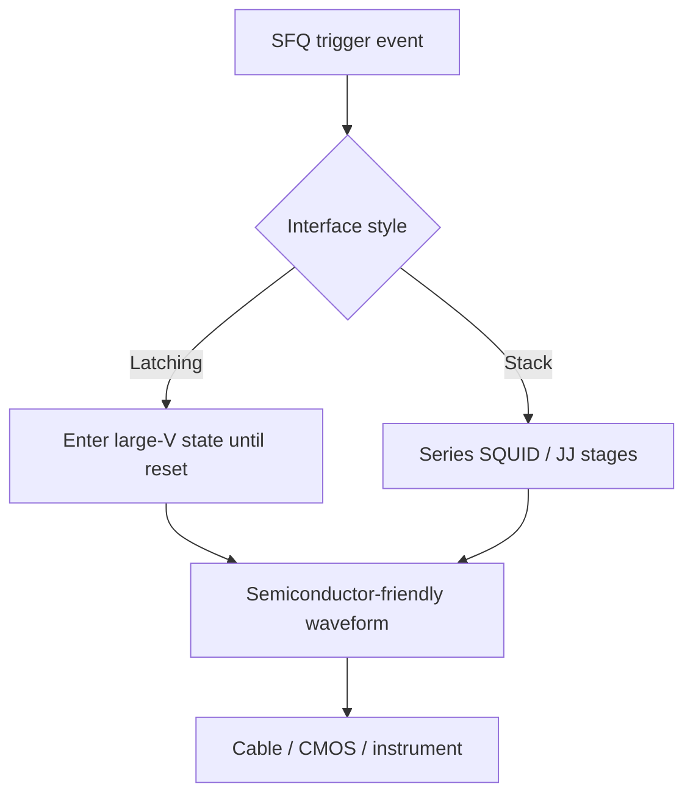
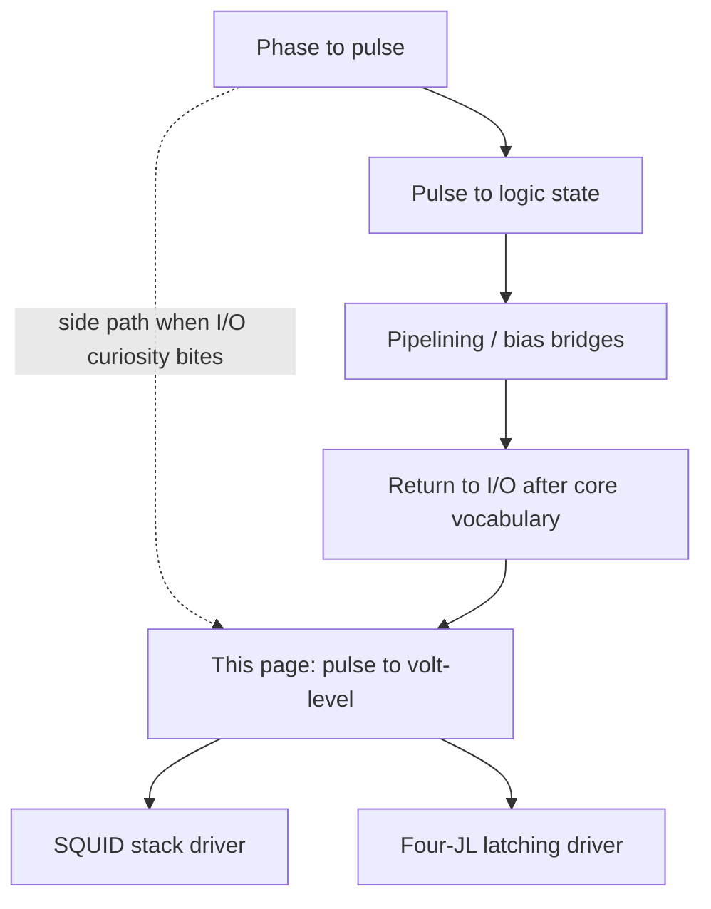

# From SFQ Pulses to Voltage Levels

**Prereqs:** [Phase to Pulse](phase-to-pulse.md) · [Overdamped vs Underdamped JJ](../fundamentals/overdamped-vs-underdamped-jj.md)  
**Next:** [SQUID Stack Driver](../concepts/squid-stack-driver.md) · [Four-JL Latching Driver](../concepts/four-jl-latching-driver.md)

**TL;DR.**
- Story so far: internal bits are pulses; the warm world wants levels.
- This page: boost/interface intuition toward readable voltages.
- Next: I/O concepts (SQUID stack, 4JL) on the concept path.


**Tracks:** `cryogenic-interfaces-io`

## Learning goals

After this page you should be able to:

1. Explain why an on-chip [SFQ pulse](../glossary.md) — roughly millivolts tall and a few picoseconds wide, with voltage–time area $\Phi_0$ — cannot directly drive CMOS pads, room-temperature FPGAs, or typical lab instruments that expect longer, taller swings.
2. Separate the **voltage gap** (height) from the **time / bandwidth gap** (width), and list the interface jobs: amplify, stretch or latch, isolate, and protect error rate at a field-fundamental level.
3. Contrast **overdamped** pulse junctions used in RSFQ gates with **underdamped**, stacked, or [latching](../glossary.md) devices often used for I/O amplification.
4. Preview why [SQUID stacks](../glossary.md) and [4JL / latching](../glossary.md) drivers exist as concept cards — without diving into paper-specific BER tables or measured eye diagrams.
5. Place this chapter correctly as a **side path** relative to the core pulse → logic → bias walk, and distinguish on-chip [JTL](../glossary.md) / [PTL](../glossary.md) pulse routing from off-chip volt-level conversion.

## Why this matters

Inside an RSFQ computational island, everything speaks **fluxon**. Gates click. [JTLs](../glossary.md) regenerate picosecond spikes. Storage loops hold circulating $\Phi_0$ tokens. You learned where those spikes come from on [phase to pulse](phase-to-pulse.md), and how presence or absence of a pulse becomes a logic bit on [pulse to logic state](pulse-to-logic-state.md). That world is self-consistent: millivolt events talking to millivolt listeners on picosecond timescales.

Outside that island wait a stadium of louder, slower electronics. CMOS memory, DACs, room-temperature FPGAs, oscilloscopes, and rack instruments expect **voltage levels** — tens to hundreds of millivolts, or full digital $V_{DD}$ swings — held long enough for ordinary samplers and cables to register them. Nanoseconds are “fast” for that world; picoseconds are a blur.

Without interface circuits, the SFQ chip is a whisper. The whisper is not “a little quiet.” It is a different **signal class**: fixed-area flux packets versus sustained semiconductor levels. This bridge is the public “why I/O amplifiers exist” chapter on the [cryogenic interfaces & I/O](../tracks/cryogenic-interfaces-io/ROADMAP.md) track. It explains the physics gap before the concept cards teach particular driver families.

Two warnings before you fall in love with amplifiers:

1. **On-chip SFQ↔SFQ routing is a different problem.** Moving pulses across a chip with [JTLs](../glossary.md) or [PTLs](../glossary.md) stays in pulse-land. Do not confuse “the wire is long” with “the wire leaves cryogenic SFQ and must wake CMOS.”
2. **This page is a side path relative to the core bias walk.** You can open it after [phase to pulse](phase-to-pulse.md) whenever I/O curiosity bites. Do not let spectacular interfaces replace learning windows, pipelines, and bias delivery. Interfaces are how the island talks to the outside world; they are not the first vocabulary of on-chip computation.

Take a moment to notice how radical the claim is. In CMOS, “drive a pad” is often a stronger buffer of the same logic family. In SFQ, “drive a pad” often means **changing physics class** — leaving the single-fluxon waveform entirely — then managing grounds, islands, and cables so the shout arrives usable and cold-stage-friendly.

## Analogy (without false physics)

Picture SFQ pulses as **snaps of fingers**: sharp, soft, and over before a smartphone microphone meaningfully “hears” them. Interface circuits are megaphones **and** stretchers. They turn a snap into a shout that lasts long enough for ordinary electronics to register.

That megaphone often uses **[underdamped](../glossary.md)** or **stacked** Josephson devices ([overdamped vs underdamped](../fundamentals/overdamped-vs-underdamped-jj.md)), not the same **[overdamped](../glossary.md)** pulse junctions that make clean RSFQ gate clicks. Using a gate-style click as your only I/O tool is like shouting with a camera shutter: beautifully brief, still inaudible across the stadium.

A second picture: translating a telegram written in dots into a billboard. You need more ink and more time on the sign. That is **not** a claim that one telegraph dot already *is* a billboard if the wire is superconducting. Superconductivity keeps resistance low; it does not invent voltage amplitude or stretch duration for free.

A third picture: a postage stamp versus a poster. The stamp’s printed area is fixed by design. Stretching the stamp into poster size without adding ink leaves a pale wash. In SFQ language: stretch a fixed $\Phi_0$ of voltage–time area into nanoseconds and the average height collapses. Real posters need more ink — gain, stacks, latching into larger voltage states — not only a longer exposure of one quantum.

The analogies are about **amplitude and duration matching**, and about **leaving the single-fluxon class** when you need tall and wide together. They are not claims about acoustic physics in niobium, telegraph law, or printing presses inside the fab.

## Two gaps: height and width

An SFQ pulse’s sacred invariant is area $\Phi_0 \approx 2.07\,\text{mV}\cdot\text{ps}$ (from [phase to pulse](phase-to-pulse.md)). That forces a harsh trade: if the event lasts only a few picoseconds, the voltage height is only millivolts.

\[
V_{\mathrm{avg}} \approx \frac{\Phi_0}{\Delta t}.
\]

Narrower ⇒ taller average for fixed area. Wider ⇒ shorter average. CMOS and instruments often want **both** taller **and** wider. Fixed-area geometry alone cannot grant both wishes.

| Rough SFQ pulse | Rough CMOS / instrument need (order-of-magnitude cartoon) |
|-----------------|-------------------------------------------------------------|
| Peak ~$1\,\text{mV}$ (order of magnitude) | Often tens–hundreds of mV, or $\sim V_{DD}$ for digital pins |
| Width ~few ps | Often nanoseconds to be comfortably sampled / cabled |
| Area ~$\Phi_0$ | Not a CMOS design constraint |
| Listener | Next SFQ cell / JTL / storage loop | Semiconductor sampler, FPGA, scope, cable plant |

So you face roughly:

- a **voltage gap** of order $\sim 10^{2}$ (millivolts vs hundreds of millivolts), and
- a **time / bandwidth gap** of order $\sim 10^{3}$ (picoseconds vs nanoseconds),

before any detailed BER, eye diagram, or impedance discussion. Exact amplitudes are library- and paper-specific; this page stays field-fundamental. The **double gap** is why interfaces are hard — and why “just use a superconducting cable” does not erase them.

```text
SFQ domain:     ★  (~mV, ~few ps, area Φ0)
                   │
                   ▼  interface (amplify / latch / stack / isolate)
Volt-level:     ┌──────────────┐  taller and/or wider
                │              │
                └──────────────┘  → cables / CMOS / instruments
```


### Why both gaps matter

Fix only **height** and a picosecond spike may still miss a slow sampler: the event ends before the instrument’s front end settles. Fix only **width** without gain and fixed-area geometry collapses the height (see worked example 2). Real interfaces attack **both**, usually by leaving the single-fluxon waveform class entirely — detecting or converting a fluxon event into a semiconductor-friendly waveform whose enclosed area is no longer forced to equal one $\Phi_0$.

Bandwidth language says the same thing another way. A few-picosecond event has spectral content that ordinary cables, connectors, and room-temperature receivers may not preserve even if the peak looked “almost visible” on an ideal probe tip. Stretching and latching are partly about putting energy into a timescale the cable plant can carry.

## What interfaces must do

Think of the interface as a job list, not as one magic transistor.

| Job | Plain meaning | What it is not |
|-----|---------------|----------------|
| **Amplify** | Produce a larger voltage from tiny SFQ events | Not “fanout a JTL one more hop” |
| **Stretch / latch** | Hold or widen the event so slower electronics can sample | Not “slow one $\Phi_0$ triangle and hope it gets taller” |
| **Isolate** | Manage grounds, impedance, common-mode, and heat on the cable | Not optional polish after gain works |
| **Protect BER** | Keep error rates acceptable under noise, skew, and drift | Not a request for paper BER tables on this page |

Public checklist only. Measured eye diagrams, specific BER targets, and process numbers belong in private paper explainers. Here you only need the reflex: **level conversion without isolation and margin care is an unfinished sentence.**

A useful mental order of operations:

1. Detect that a fluxon event happened (or convert it into a latching / stacked voltage state).
2. Make the waveform **tall enough** and **long enough** for the semiconductor listener.
3. Get the waveform across the cryostat boundary without wrecking grounds or dumping heat carelessly.
4. Keep the decision reliable enough that the link’s error rate does not erase the point of the compute island.

## Overdamped gates vs I/O devices

Classical RSFQ gates want **[overdamped](../glossary.md)** junctions: click, dump about one $\Phi_0$ of area, return to $V\approx 0$, ready for the next event ([overdamped vs underdamped](../fundamentals/overdamped-vs-underdamped-jj.md)). That recover-to-zero behavior is a feature for pulse logic.

Many output amplifiers want the opposite ending: jump to a larger voltage and **stay** there until reset — **[latching](../glossary.md)** — often with **[underdamped](../glossary.md)** dynamics, series stacks, or both. Staying high buys time for a semiconductor sampler. Stacking stages buys height by addition.

| Role | Typical damping / behavior | Why |
|------|----------------------------|-----|
| RSFQ logic gate | [Overdamped](../glossary.md): pulse then $V\to 0$ | Clean fluxon clicks; recover for the next event |
| Many output amplifiers | [Underdamped](../glossary.md) / latching, or stacked junctions | Build taller, longer voltage waveforms |
| [SQUID stack](../glossary.md) | Series stages add voltage swing | Climb out of the millivolt well |
| [4JL](../glossary.md) / Suzuki-style latching driver | Latching Josephson dynamics | Stretch and amplify for semiconductor loads |

You do **not** need to memorize every driver family now. You need the reflex:

> **I/O junctions are often not the same animal as gate junctions.**

Gate-land speaks fluxons. Pad-land often speaks latched or stacked volt-level waveforms triggered *by* fluxons. Mixing those regimes in your head is one of the most common early mistakes on the interfaces track.

```text
  Overdamped (RSFQ gate style)          Underdamped / latching (often I/O)

  V                                     V
  |   /\                                |   /‾‾‾‾‾‾‾‾  (held until reset)
  |__/  \___  back to ~0                |__/
  time                                  time
```

## Worked example 1 — Area says millivolts if picoseconds

If a single-flux event lasts $\Delta t = 4\,\text{ps}$,

\[
V_{\mathrm{avg}} \approx \frac{\Phi_0}{\Delta t} \approx \frac{2.07\,\text{mV}\cdot\text{ps}}{4\,\text{ps}} \approx 0.5\,\text{mV}.
\]

A CMOS input that wants roughly $200\,\text{mV}$ for a few nanoseconds is not “a little pickier.” It is a different signal class. Something must amplify and stretch.

**Gap factor cartoon (height only):**

\[
\frac{200\,\text{mV}}{0.5\,\text{mV}} = 400.
\]

That factor is already large before you admit the sampler also wants nanoseconds, not $4\,\text{ps}$. Real thresholds and swings vary by library; the point is order-of-magnitude mismatch, not a recipe for one paper’s pad.

**Interpretation.** On an idealized scope sketch you might see a spike whose peak exceeds $0.5\,\text{mV}$. Peaks can be taller than the average. That does not turn the pulse into a CMOS level. Ask: can the semiconductor front end integrate, latch, or sample this event reliably on its own timescale? Usually no — hence interfaces.

## Worked example 2 — Stretch alone lowers average height

Suppose you somehow held the same $\Phi_0$ area but stretched duration to $\Delta t = 2\,\text{ns} = 2000\,\text{ps}$:

\[
V_{\mathrm{avg}} \approx \frac{2.07\,\text{mV}\cdot\text{ps}}{2000\,\text{ps}} \approx 1\,\mu\text{V}.
\]

Stretching alone **while preserving only one $\Phi_0$ of area** makes the pulse **shorter in height**, not taller. That is the cruel geometry of a fixed area: wide and tall cannot both grow if area is fixed at one quantum.

| Duration $\Delta t$ | $V_{\mathrm{avg}} \approx \Phi_0/\Delta t$ | Useful as CMOS-like level? |
|---------------------|---------------------------------------------|----------------------------|
| $4\,\text{ps}$ | $\sim 0.5\,\text{mV}$ | No — too short and still tiny |
| $40\,\text{ps}$ | $\sim 50\,\mu\text{V}$ | No — still tiny |
| $2\,\text{ns}$ | $\sim 1\,\mu\text{V}$ | No — worse height |

Therefore real interfaces do **not** merely “slow down one fluxon.” They use **gain mechanisms** — stacks of junctions, latching into a larger voltage state, SQUID series addition, semiconductor helpers at warmer stages, and so on — so the **output waveform is allowed to enclose many $\Phi_0$ of area** or otherwise leave the single-fluxon shape behind.

**Takeaway:** I/O is not “reshape one $\Phi_0$ into a CMOS rectangle.” It is “detect / convert a fluxon event into a semiconductor-friendly waveform.”

## Worked example 3 — On-chip pulse routing vs off-chip level conversion

Three jobs that sound similar in casual speech but are not the same engineering problem:

| Job | Stay in pulse-land? | Need volt-level conversion? | Typical tools |
|-----|---------------------|-----------------------------|---------------|
| [JTL](../glossary.md) hop across a chip | Yes | No | Regenerating overdamped stages |
| [PTL](../glossary.md) across a chip | Yes (with drivers/receivers) | No (still SFQ-ish) | Passive line + SFQ driver/receiver |
| Drive an FPGA pin / CMOS pad | No | Yes | Stacks, latching drivers, isolation |
| Scope a gate node “directly” | Usually impractical | Often yes / careful probing | Interface or specialized probing |

- **On-chip SFQ→SFQ:** use [JTLs](../concepts/jtl-interconnects.md) and [hybrid JTL–PTL routing](../concepts/hybrid-jtl-ptl-routing.md). Stay in pulse land; regenerate fluxons.
- **Off-chip SFQ→CMOS / instrument:** cross **this** bridge. Amplify, stretch, isolate.
- **Hybrid memory stacks:** may need both disciplines — see later [Josephson–CMOS hybrid memory](../concepts/josephson-cmos-hybrid-memory.md).

Mixing these jobs is a common architecture mistake: people route a raw [SFQ pulse](../glossary.md) toward a CMOS pin “because the wire is superconducting,” as if superconductivity amplified voltage. It does not. Superconducting interconnect can move fluxons with low loss; it does not turn a millivolt picosecond packet into a volt-level nanosecond swing by itself.

## Worked example 4 — Why latching helps the time gap

An overdamped gate returns to $V\approx 0$ in picoseconds. An underdamped / latching network can jump to a larger voltage and **hold** until reset. Holding is how you buy nanoseconds for a semiconductor sampler without pretending one $\Phi_0$ triangle got taller by getting wider.

```text
Overdamped click:   ★  (gone in a few ps)
Latching output:    ★████████████  (held until reset)
                         ↑ sampler-friendly width
```

Stacks help the **height** gap by adding stages in series so swings can accumulate. Latching helps the **time** gap by refusing to return to zero immediately. Many practical drivers combine ideas: a trigger fluxon starts a latching or stacked network whose output is allowed to be both taller and longer than a single gate pulse.

Details of particular topologies live on the concept cards. This page only needs the design slogan:

> Latching buys **time**. Stacking buys **height**. Neither is “more of the same overdamped gate click.”

## A second figure — latching vs stacking (intuition)

Two public cartoons show up again and again. Neither is a tape-out schematic; both explain *how* you escape the millivolt well.

```text
Latching driver idea:
  SFQ trigger ──► underdamped / latching JJ network
                      │
                      ▼
                 jumps to a larger voltage state
                 and holds until reset
                      │
                      ▼
                 wider, taller output for sampling

SQUID stack idea:
  SFQ event couples into stage 1  ── V1
                     series with stage 2 ── V2
                     series with stage 3 ── V3
                 output swing can add: V1+V2+V3 ...
```



Read those cartoons as **jobs**, then open [SQUID Stack Driver](../concepts/squid-stack-driver.md) and [Four-JL Latching Driver](../concepts/four-jl-latching-driver.md) for mechanism detail. Do not treat the ASCII boxes as complete netlists; treat them as vocabulary for the next pages.

## Grounds, islands, and cables (why “isolate” is on the checklist)

Even a perfect amplifier fails if the return path is wrong. SFQ blocks may sit on [ground islands](../glossary.md) for bias recycling and series stacking ([DC bias current delivery](dc-bias-current-delivery.md)). Room-temperature gear sits on rack ground. Cables carry heat and noise as well as signal.

So “interface” is not only gain. It is also:

- respecting island offsets when signals leave a series-biased stack,
- choosing impedance and filtering that the cryostat can tolerate,
- not dumping amplifier heat into the coldest stage carelessly,
- remembering that common-mode and ground loops can corrupt a carefully amplified waveform on the way out.

You do not need connector pinouts on this page. You need the reflex: **level conversion and galvanic / thermal hygiene travel together.**

A newcomer-friendly picture:

```text
  [ SFQ island A ]----(local GND A)----
         │  series bias / recycling may offset grounds
  [ SFQ island B ]----(local GND B)----
         │
         ▼  interface must not assume "one global GND"
  [ cable / filters ]
         │
         ▼
  [ rack / CMOS GND ]
```

If your mental model is “everything shares one perfect ground like a breadboard sketch,” islanded SFQ systems will surprise you. Isolation is part of the interface story because **voltage** is always measured relative to a return — and returns may not be the same potential across a current-recycling chip.

## Side path relative to the core walk

It helps to see where this chapter sits among the public curriculum:



- **Core walk:** invent the pulse, turn it into bits and pipelines, learn how bias is fed.
- **This bridge:** explain why leaving the island requires amplify / stretch / isolate.
- **Concept cards next:** concrete driver families.

Branching early is allowed for motivation. Living permanently on the I/O side path before you understand gate pulses and windows is like studying megaphones before learning what a word is.

## CMOS contrast

| Topic | CMOS chip I/O | SFQ → volt-level I/O |
|-------|---------------|----------------------|
| Native signal | Full-swing digital levels / edges | Millivolt picosecond fluxons |
| What “buffer” means | Often stronger drive of the same logic family | Often a **physics-class change** (latch / stack / semiconductor helper) |
| Pad design focus | Drive strength, ESD, impedance, SI | First survive the height + time gaps, then cabling and isolation |
| Same devices as logic? | Often related transistor families | I/O often uses different JJ regimes than gates |
| Failure modes | SI, timing, ESD, EMI | Also: too small, too short, wrong ground island, link BER |
| Fixed quantity | Logic swing is a design choice | On-chip token area $\Phi_0$ is a physical constant; I/O output area is not forced to one quantum |
| Idle after a bit | Can hold a DC high | Gate pulse recovers to ~0; latching I/O may hold until reset |

CMOS can hold a logic high indefinitely with a DC voltage. RSFQ data lines do not park at a millivolt high; they fire events. When you must talk to CMOS, you often **invent** a held voltage on purpose — that is latching I/O — rather than pretending the gate pulse already was one.

If you catch yourself saying “just buffer the SFQ output,” replace the phrase with “convert the fluxon event into a semiconductor-friendly waveform, then cable it with isolation care.” That habit change is half the battle of learning cryogenic interfaces.

## Bridge to SFQ circuits

Concept cards that unpack mechanisms:

- [SQUID Stack Driver](../concepts/squid-stack-driver.md) — series SQUID stages as a voltage-ladder intuition for climbing out of the millivolt well.
- [Four-JL Latching Driver](../concepts/four-jl-latching-driver.md) — latching amplification for larger and longer outputs toward semiconductor loads.

Related context on the public tree:

- Damping refresher: [Overdamped vs Underdamped JJ](../fundamentals/overdamped-vs-underdamped-jj.md).
- Pulse origin story: [Phase to Pulse](phase-to-pulse.md).
- On-chip long wires (not this I/O gap): [Hybrid JTL–PTL Routing](../concepts/hybrid-jtl-ptl-routing.md) and [JTL interconnects](../concepts/jtl-interconnects.md).
- Bias islands that complicate I/O grounds: [DC Bias Current Delivery](dc-bias-current-delivery.md).
- Later hybrid systems: [Josephson–CMOS hybrid memory](../concepts/josephson-cmos-hybrid-memory.md).

AQFP and RSFQ may need different interface recipes; family-specific measured stacks and BER campaigns stay in private explainers. This public bridge only installs the vocabulary: **voltage gap, time gap, amplify, stretch/latch, isolate, overdamped gates vs underdamped/stacked/latching I/O.**

## Common misconceptions

1. **“Superconducting cables will carry my SFQ pulse to the FPGA unchanged and usable.”**  
   Even with ideal cables, the FPGA still needs amplitude and duration it can sense. Conversion is required. Superconductivity is not a free megaphone.

2. **“I only need a voltage amplifier; time is fine.”**  
   Picoseconds versus nanoseconds is as real a gap as millivolts versus hundreds of millivolts. Bandwidth and sampling apertures matter.

3. **“Stretching a single $\Phi_0$ pulse makes it taller.”**  
   Fixed area: longer duration ⇒ **lower** average height. Gain, latching, or stacking is required for tall outputs.

4. **“I/O junctions are just more RSFQ gates in series.”**  
   Often they use underdamped or latching dynamics deliberately — different from overdamped gate clicks. Series stacking of I/O stages is also not the same as a longer JTL of gate-style junctions.

5. **“BER is a CMOS-only worry.”**  
   Interface noise, skew, ground errors, and margin failures create bit errors at the SFQ↔semiconductor boundary too. This page names the job; paper campaigns live elsewhere.

6. **“PTL drivers solve CMOS I/O.”**  
   [PTL](../glossary.md) helps **on-chip** distance. CMOS I/O is a **level / time conversion** problem (plus isolation).

7. **“If I probe carefully, the millivolt pulse is ‘basically CMOS.’”**  
   Probing skill does not erase the physics gap for digital CMOS thresholds and timing. A beautiful probe tip does not invent $V_{DD}$.

8. **“Interfaces are optional polish after the core logic works.”**  
   For any system that must talk to room-temperature electronics, interfaces are part of the architecture — heat, grounds, and reliability included.

9. **“One global ground connects islands, amplifiers, and the rack.”**  
   Series-biased SFQ blocks may use [ground islands](../glossary.md). Leaving to rack ground needs isolation-aware design, not a naive shared-GND assumption.

10. **“If area is sacred on chip, the I/O waveform must also enclose exactly one $\Phi_0$.”**  
    On-chip tokens are single-fluxon events. Off-chip volt-level waveforms are allowed — and usually required — to leave that constraint so they can be both tall and long.

## Check yourself

<details>
<summary>1. Why not wire an SFQ output straight into a CMOS pin?</summary>

SFQ pulses are too small and too short for ordinary CMOS levels and timing; they need interface amplification and stretching (and usually isolation care). Superconducting wiring alone does not create a semiconductor-friendly swing.
</details>

<details>
<summary>2. Do I/O drivers use the same junctions as RSFQ gates?</summary>

Often not — many drivers use underdamped, stacked, or latching behavior rather than overdamped pulse switching. Treat I/O devices as a different tool class from gate clicks.
</details>

<details>
<summary>3. Name two jobs of an SFQ interface.</summary>

Any two of: amplify, stretch/latch, isolate, protect BER (error-rate reliability at the boundary).
</details>

<details>
<summary>4. If you keep area fixed at $\Phi_0$ and increase duration by $100\times$, what happens to average voltage?</summary>

It drops by about $100\times$ — stretching alone does not create a tall CMOS-like level. $V_{\mathrm{avg}} \approx \Phi_0/\Delta t$.
</details>

<details>
<summary>5. What is the invariant of an ideal single SFQ pulse on chip, and why does that constrain I/O?</summary>

Area $\int V\,dt = \Phi_0$. That ties millivolt heights to picosecond widths, so semiconductor loads need conversion, not raw fluxons — and conversion usually leaves the single-$\Phi_0$ waveform class.
</details>

<details>
<summary>6. Is hybrid JTL–PTL routing the same topic as SFQ→CMOS level conversion?</summary>

No. JTL/PTL moves pulses on chip. This bridge is about leaving pulse-land for volt-level electronics outside the SFQ island.
</details>

<details>
<summary>7. Which two concept cards should you open next for concrete driver families?</summary>

[SQUID Stack Driver](../concepts/squid-stack-driver.md) and [Four-JL Latching Driver](../concepts/four-jl-latching-driver.md).
</details>

<details>
<summary>8. Name the two gaps this page separates.</summary>

Voltage (height) gap and time/bandwidth (width) gap.
</details>

<details>
<summary>9. Why might ground islands matter at an interface?</summary>

Series-biased SFQ blocks can have offset local grounds; leaving to rack ground needs isolation-aware design, not a naive shared-GND assumption. Level conversion and return-path hygiene travel together.
</details>

<details>
<summary>10. In one sentence, how does latching help the time gap?</summary>

A latching network can jump to a larger voltage and hold until reset, buying nanoseconds for a semiconductor sampler instead of vanishing in a few picoseconds like an overdamped gate click.
</details>

## Next steps

- SQUID-based amplification: [SQUID Stack Driver](../concepts/squid-stack-driver.md).
- Latching amplification: [Four-JL Latching Driver](../concepts/four-jl-latching-driver.md).
- On-chip interconnect (different problem): [Hybrid JTL–PTL Routing](../concepts/hybrid-jtl-ptl-routing.md).
- Track roadmap: [Cryogenic Interfaces & I/O](../tracks/cryogenic-interfaces-io/ROADMAP.md).
- Return to the core walk if you branched early: [Pulse to Logic State](pulse-to-logic-state.md).
- Bias and islands that complicate returns: [DC Bias Current Delivery](dc-bias-current-delivery.md).
- Terms: [Glossary](../glossary.md) — [SFQ pulse](../glossary.md), [SQUID stack](../glossary.md), [4JL / latching](../glossary.md), [JTL](../glossary.md), [PTL](../glossary.md), [overdamped](../glossary.md), [underdamped](../glossary.md).
