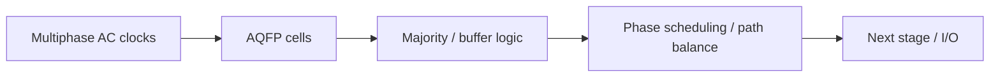
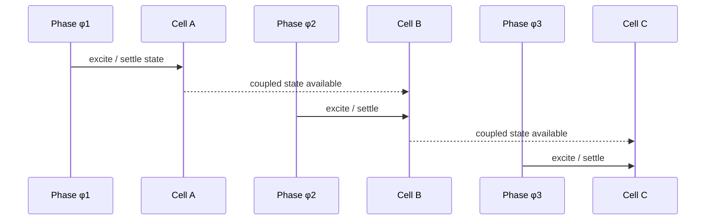

# AQFP Logic Family (Concept)

**Prereqs:** [ERSFQ Logic](ersfq-logic.md) · [DC Bias Current Delivery](../bridge/dc-bias-current-delivery.md)  
**Next:** [Serial Biasing and Current Recycling](serial-biasing-current-recycling.md) · [SFQ Logic Primitives Roadmap](../tracks/sfq-logic-primitives/ROADMAP.md)  
**Tracks:** `sfq-logic-primitives` · `clocking-biasing-power`

**Learning goals.** After this page you should be able to (1) contrast **AQFP** with RSFQ/ERSFQ at a newcomer level without merging the families, (2) explain multiphase **AC excitation** and **adiabatic** switching intuition without memorizing paper schedules, (3) recognize majority/buffer building blocks and **phase scheduling** as the AQFP cousin of path balancing, (4) place AQFP in cryogenic power and clocking conversations, and (5) know what belongs on this public card versus private paper explainers.

## Why this matters

Not all superconducting digital logic is RSFQ pulse wiring. **AQFP** (Adiabatic Quantum Flux Parametron) is another major family you will meet in IEEE TASC, architecture, and cryogenic-computing papers. It uses **multiphase AC clocks**, aims for **adiabatic** (comparatively slow, low-dissipation) switching, and often builds logic from **majority gates** and buffers with transformer coupling.

If you only know [RSFQ](rsfq-logic.md) / [ERSFQ](ersfq-logic.md), AQFP papers feel like a different language: different excitation, different encoding cartoons, different “padding” story. This page is the public decoder ring — field-fundamental teaching, not a substitute for a specific chip paper’s schematics or measured joules.

See also: [Glossary](../glossary.md) — **AQFP**, **bias current** (here AC excitation is the headline), **path balancing**, **flux quantum $\Phi_0$**.

## Intuition — rock the see-saws, do not only pass batons

| Theme | RSFQ / ERSFQ | AQFP (public cartoon) |
|-------|--------------|------------------------|
| Excitation | DC bias (+ pulse clocks for gates) | Multiphase **AC** excitation |
| Energy story | Pulse switching; ERSFQ cuts resistor static | Adiabatic switching intent |
| Bit representation | Pulse in window / loop fluxon storage | Direction / state of circulating current in parametron-like cells |
| Logic style | Pulse gate libraries (AND/OR/XOR/DFF, …) | Majority + buffers (common teaching story) |
| Alignment problem | Epoch / path balancing with DFFs | **Phase scheduling** and buffer insertion |
| Interconnect feel | [JTL](jtl-interconnects.md) / [PTL](hybrid-jtl-ptl-routing.md) pulse hops | Transformer-heavy coupling in many explanations |

Both families are superconducting and cryogenic; they are **not** drop-in schematic replacements. Learning AQFP after RSFQ is like learning a second assembly language that shares cryogenic physics but not opcode charts.

Public energy slogan (intent, not a measured promise):

$$E_{\mathrm{switch}} \text{ tends to shrink when excitation changes slowly relative to intrinsic dynamics.}$$

Faster AC clocks can raise dissipation — the speed–energy tension is part of the family’s identity.

## Analogy — stadium batons vs multiphase see-saws

- **RSFQ:** batons ([SFQ pulses](../glossary.md)) on a DC-powered track; starter pistols (clock pulses) everywhere.
- **AQFP:** many see-saws rocked by a shared multiphase motor; each see-saw settles left/right to encode a bit; gentle rocking (**adiabatic**) saves energy versus slamming.

A second picture: a three-shift factory. Shift $\phi_1$ workers finish a station; shift $\phi_2$ takes over; shift $\phi_3$ continues. Work flows because shifts are staggered — that is **phase handoff**.

Bad analogy: “AQFP is just three RSFQ clocks.” Multiphase AC is not merely “more RSFQ clock pulses.” Device physics, cell library philosophy, and bit encoding cartoons differ. Another bad analogy: “adiabatic means free.” It means a low-dissipation **regime** with tradeoffs.

## Picture — topology and phase handoff

```text
RSFQ/ERSFQ cartoon:   DC bias + SFQ pulses between cells

AQFP cartoon:         AC φ1, φ2, φ3, … excite cells in order
                      bit ≈ direction of circulating current
                      logic often built from majority + buffers
```



```text
Phase handoff cartoon:

  φ1:  cell A evaluates / settles
  φ2:  cell B evaluates (sees A's settled state via coupling)
  φ3:  cell C evaluates
  … then phases repeat for the next wave of computation
```



```text
Majority cartoon (three inputs):

        a ──┐
        b ──┼──► MAJ ──► out = value held by ≥2 inputs
        c ──┘
```

## What an AQFP cell is doing (field-fundamental)

You do not need a full parametron textbook. Keep five sentences:

1. **Excitation:** an AC current (or multiphase family of AC currents) rocks the cell through active windows.
2. **Bistable settle:** under that rocking, the cell settles into one of two circulating-current / fluxoid-related states that encode the bit.
3. **Coupling:** neighboring cells influence each other through transformers / inductive coupling so majority and buffer networks can be built.
4. **Phasing:** information advances when later phases evaluate using earlier cells’ settled states.
5. **Buffers:** inserted not only for drive, but so inputs arrive in the **correct phases** — AQFP’s cousin of [DFF padding](rsfq-dff-and-retiming.md).

Exact transformer turns ratios, $I_c$ values, and measured millivolts stay **process- and paper-specific**. Public takeaway: **AC + settle + couple + schedule**.

### Adiabatic switching (plain language)

**Adiabatic** here means changing the excitation slowly compared with the circuit’s intrinsic dynamics so the system stays near equilibrium and dissipates less per switch. Public takeaways:

1. Faster is not always better for energy in AQFP — there is a speed–energy tension.
2. “Adiabatic” is a **design intent / regime**, not a magic zero.
3. Comparing AQFP energy-per-op numbers to RSFQ without stating activity, temperature, clock frequency, and what was counted is a common paper-reading trap (details private).
4. AC generation and distribution still cost cryogenic budget — “efficient logic” does not erase [power delivery](../bridge/dc-bias-current-delivery.md) engineering (here often AC plant + matching).

## Majority logic intuition

A **majority** gate of three inputs outputs the value held by at least two inputs. In ordinary Boolean algebra:

$$\mathrm{MAJ}(a,b,c) = ab + bc + ca.$$

Boolean completeness comes from majority plus constants / inverters / buffers depending on the library. Why newcomers care:

- AQFP datapaths often look like networks of majority cells and buffers rather than CMOS NAND clouds or RSFQ pulse-gate catalogs,
- buffers are not cosmetic — they exist for **phase alignment** and drive, similar in spirit to RSFQ padding DFFs,
- architecture diagrams that show “MAJ” boxes are asking you to think in majority networks, not to invent new Boolean laws.

Exact transformer coupling schematics stay at private/paper depth.

## Phase scheduling ≈ path balancing’s cousin

An AQFP datapath assigns each gate to an AC phase so information flows forward in order. If two inputs to a majority gate are not ready in the correct phases, designers insert **buffers** (costing junctions, area, and phases of latency).

| RSFQ world | AQFP world |
|------------|------------|
| Match clocked stage counts | Match phase readiness |
| Insert DFFs / JTLs | Insert buffers / retiming phases |
| Concurrent vs counter-flow clocks | Multiphase AC choreography |
| [Path-balancing overhead](path-balancing-overhead.md) | Buffer / phase tax |
| [STA](sfq-static-timing-analysis.md) windows | Phase-legal schedules + delay margins |

Concrete scheduler algorithms and “% buffers” statistics → private explainers. The **tax category** is public: synchronization cells that do not invent new Boolean function.

## Family placement table (keep this straight)

| Family | Headline change vs classical RSFQ teaching | Still needs… |
|--------|--------------------------------------------|--------------|
| RSFQ (resistive bias) | Default pulse vocabulary | Epochs, JTLs, splitters, DFFs, STA |
| [ERSFQ](ersfq-logic.md) | Bias feeding / static resistor heat | Same pulse timing story |
| **AQFP** | AC multiphase + adiabatic parametron-style cells | Phase scheduling, AC plant |
| [Serial biasing](serial-biasing-current-recycling.md) | Reuse amperes across ground islands | Isolation; orthogonal to AQFP-vs-RSFQ |

A large cryogenic system might discuss **several** of these at once. Do not merge them into one slogan.

## CMOS contrast

| Topic | CMOS | RSFQ/ERSFQ | AQFP |
|-------|------|------------|------|
| Clocking | Edge-triggered FFs; combinational clouds | Gate-level pulse clocks | Multiphase AC excitation |
| Logic atom | NAND/NOR/AOI, … | Pulse gates + DFF | Majority + buffer (typical story) |
| Energy knob | VT, voltage, gating | Bias topology (ERSFQ), activity | Adiabatic AC regime |
| Interconnect mindset | RC wires | JTL/PTL pulses | Transformer-heavy coupling common in explanations |
| “Padding” | Pipeline regs / retiming | DFF/JTL pads | Buffers for phase match |
| Idle story | Leakage / clock gating | Bias networks (ERSFQ helps static $R$) | AC still rocks even quiet regions unless gated by design |

Use [CMOS vs SFQ](cmos-vs-sfq.md) for the pulse-vs-level cheat sheet; treat AQFP as a **second column** once you leave pure RSFQ.

## Worked example 1 — Three-phase handoff

Suppose phases $\phi_1,\phi_2,\phi_3$ in order.

1. Gate $G_1$ excited in $\phi_1$ settles its circulating-current state.
2. Gate $G_2$ in $\phi_2$ reads $G_1$ through coupling and settles.
3. Gate $G_3$ in $\phi_3$ continues the chain.

If $G_3$ needed an input that only becomes ready in $\phi_1$ of the *next* cycle without a buffer, the schedule is illegal — insert buffers or reassign phases. That is phase scheduling in one story.

Checklist:

1. List each gate’s assigned phase.
2. For every multi-input gate, ask: are all inputs ready in the required earlier phases?
3. If not, insert buffers or re-phase.
4. Recount latency in phases (AQFP’s cousin of pipeline depth).

## Worked example 2 — Majority truth sketch

For inputs $a,b,c \in \{0,1\}$:

| $a$ | $b$ | $c$ | $\mathrm{MAJ}$ |
|-----|-----|-----|----------------|
| 0 | 0 | 0 | 0 |
| 0 | 0 | 1 | 0 |
| 0 | 1 | 1 | 1 |
| 1 | 1 | 1 | 1 |

In AQFP, physical encoding of $0/1$ is the cell state under AC excitation, not a CMOS $V_{DD}$ level. The Boolean identity still helps you read architecture diagrams that show majority symbols.

## Worked example 3 — Choosing a family for a mental design

| Goal emphasis | Family to study first |
|---------------|------------------------|
| Pulse timing, JTL/PTL, SFQ STA tooling | RSFQ / ERSFQ track |
| Static bias resistor heat | [Resistive bias → ERSFQ](../bridge/resistive-bias-to-ersfq.md) + [ERSFQ](ersfq-logic.md) |
| AC multiphase adiabatic logic & majority | **AQFP (this page)** |
| Ampere delivery into cryostat | [DC bias](../bridge/dc-bias-current-delivery.md), [serial biasing](serial-biasing-current-recycling.md) |

Public curriculum teaches **all** as vocabulary; research focus may specialize later.

## Worked example 4 — Buffer tax on a reconvergent majority

Two inputs to a majority gate: one ready in $\phi_2$, the other only ready in $\phi_1$ of the next AC cycle relative to the sink’s phase. Public fix shape:

- insert buffers so both inputs present in legal phases before the majority evaluates,
- accept extra junctions and extra phase latency,
- do not “hope” the late input is somehow still coupled correctly.

This is the same **synchronization tax** spirit as [path balancing](path-balancing-overhead.md), spoken in AC phases instead of RSFQ epochs.

## Worked example 5 — Reading an energy claim honestly

A paper says “AQFP uses far less energy than RSFQ.” Public checklist before believing the slogan:

1. Same **activity factor** / throughput assumption?
2. What was counted — logic only, or AC generation, cables, interfaces?
3. Temperature and clock/AC frequency stated?
4. Compared against resistive-bias RSFQ, ERSFQ, or both?
5. Is the comparison a gate, an ALU, or a whole chip including I/O?

Numbers stay private; the **honesty checklist** is curriculum content.

## Worked example 6 — Why RSFQ STA vocabulary only partially transfers

[SFQ STA](sfq-static-timing-analysis.md) intuition (windows, skew, pads) still trains you to ask “is information ready when the sink evaluates?” In AQFP that question becomes **phase-legal schedules** plus delay margins under AC excitation. Do not paste a JTL-stage delay sum into an AQFP majority network and call it done — remodel the timing graph for the family you are actually using.

## Common misconceptions

- **“AQFP is ERSFQ with AC clocks.”** No — different encoding/excitation/logic style.
- **“Adiabatic means free.”** It means a low-dissipation regime with speed tradeoffs.
- **“Majority gates replace the need for timing.”** Phase scheduling is still mandatory.
- **“RSFQ knowledge transfers schematic-for-schematic.”** Vocabulary transfers partially; cell libraries do not.
- **“One AC phase is enough.”** Multiphase handoff is part of the standard story.
- **“AQFP needs no power delivery engineering.”** AC generation, distribution, and cryogenic budgets remain hard — different hard.
- **“Buffers are only drive strength.”** Many exist for phase alignment (overhead).
- **“$\Phi_0$ pulses are the native AQFP wire token everywhere.”** Teaching cartoons emphasize circulating-current / parametron states under AC; do not force every AQFP sentence into RSFQ baton language.
- **“Serial biasing is an AQFP feature.”** Serial biasing is an ampere-recycling architecture; it can appear in multiple families’ system stories ([serial biasing](serial-biasing-current-recycling.md)).

## Bridge to SFQ circuits

- Pulse family power story: [ERSFQ](ersfq-logic.md) and [resistive bias → ERSFQ](../bridge/resistive-bias-to-ersfq.md).
- Current into the fridge: [DC Bias Delivery](../bridge/dc-bias-current-delivery.md), [Serial Biasing](serial-biasing-current-recycling.md).
- RSFQ alignment cousin: [Path Balancing](path-balancing-overhead.md), [DFF retiming](rsfq-dff-and-retiming.md).
- Pulse interconnect (different family, related STA habits): [JTL](jtl-interconnects.md), [Hybrid JTL–PTL](hybrid-jtl-ptl-routing.md).
- Track placement: [SFQ Logic Primitives Roadmap](../tracks/sfq-logic-primitives/ROADMAP.md) · [Clocking, Biasing & Power](../tracks/clocking-biasing-power/ROADMAP.md).

## What stays private

Measured energy tables, specific multiphase schemes ($\phi$ counts, duty cycles), transformer layout tricks, RSFQ↔AQFP interfaces, scheduler benchmarks, and named CAD flows → private explainers under `share/private/papers/<slug>/` after the public core walk.

## Check yourself

<details>
<summary>1. Name one big difference vs RSFQ.</summary>

AQFP commonly uses multiphase AC excitation and adiabatic switching; RSFQ uses DC-biased overdamped pulse logic.
</details>

<details>
<summary>2. What logic block is iconic in AQFP libraries?</summary>

Majority gates (with buffers), rather than only NAND/NOR pulse catalogs.
</details>

<details>
<summary>3. Is AQFP “the same as ERSFQ”?</summary>

No — different family, encoding/excitation style, and design constraints.
</details>

<details>
<summary>4. What is phase scheduling?</summary>

Assigning gates to AC phases (and inserting buffers) so data flows in legal order — AQFP’s cousin of path balancing.
</details>

<details>
<summary>5. Does “adiabatic” mean zero energy per operation?</summary>

No — it means aiming for low dissipation by switching slowly relative to intrinsic dynamics; tradeoffs remain.
</details>

<details>
<summary>6. How is an AQFP “bit” often described for newcomers?</summary>

As the direction/state of a circulating current in a parametron-like cell under AC excitation — not as an RSFQ baton pulse by default.
</details>

<details>
<summary>7. Why insert buffers that compute no new Boolean function?</summary>

To align inputs into legal phases (and sometimes for drive) — a synchronization/overhead tax.
</details>

<details>
<summary>8. Write the Boolean identity for three-input majority.</summary>

$\mathrm{MAJ}(a,b,c)=ab+bc+ca$.
</details>

<details>
<summary>9. Name two items on an honest AQFP-vs-RSFQ energy checklist.</summary>

Matched activity/throughput assumptions, and a clear statement of what energy was counted (logic vs AC plant vs I/O).
</details>

<details>
<summary>10. Does learning AQFP let you skip DC bias / serial-biasing pages?</summary>

No — ampere delivery and island recycling are system themes that can still matter; AQFP changes the logic/excitation story, not every cryogenic power problem.
</details>

## Next steps

- Current recycling / islands: [Serial Biasing and Current Recycling](serial-biasing-current-recycling.md).
- Track map: [SFQ Logic Primitives Roadmap](../tracks/sfq-logic-primitives/ROADMAP.md).
- ERSFQ contrast refresh: [ERSFQ Logic](ersfq-logic.md).
- Public index: [Curriculum Home](../index.md).
- Plain terms: [Glossary](../glossary.md).
