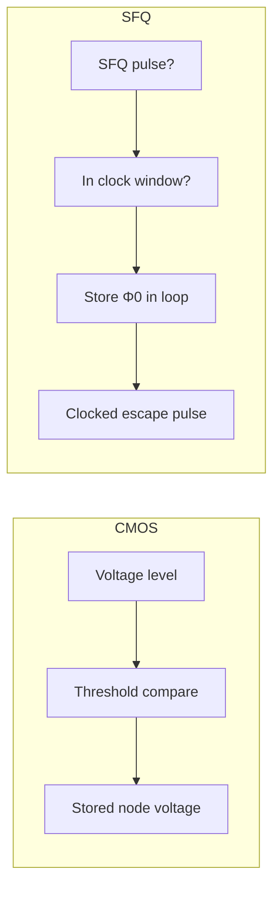
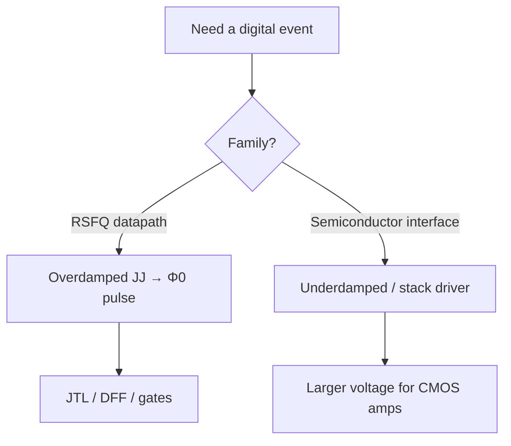

# CMOS vs SFQ Cheat Sheet

**Prereqs:** Full depth — [Pulse to Logic State](../bridge/pulse-to-logic-state.md). Preview anytime from [Why superconducting electronics?](../fundamentals/why-superconducting-electronics.md).  
**Next:** [RSFQ Logic Overview](rsfq-logic.md) · [Curriculum Index](../index.md)

**Learning goals.** After this page you should be able to (1) translate common CMOS digital intuitions into SFQ pulse/loop language, (2) use the comparison tables as a quick reference while reading later concept cards, (3) spot false analogies that cause design mistakes, and (4) know which follow-on pages deepen each row of the cheat sheet.

## Why this page exists

Most newcomers arrive with a working mental model of CMOS: rails, $V_{DD}$, combinational clouds, flip-flops, static timing with setup/hold, and interconnect RC. SFQ reuses English words like **gate**, **clock**, **bit**, and **pipeline**, but the physical objects underneath are different.

This is a **table-heavy field-fundamental cheat sheet**, not a process comparison for choosing a foundry. It assumes you have already walked through flux quanta, loops/SQUIDs, damping, phase→pulse, and pulse→logic state. If a row feels opaque, jump back to the linked fundamental or bridge rather than memorizing slogans.

## One-sentence contrast

**CMOS** encodes bits as **voltage levels** on semiconducting nodes.  
**SFQ (RSFQ-style)** encodes bits as **presence/absence of flux-quantum pulses in timing windows**, and as **circulating flux in superconducting loops**.

Everything else in the tables elaborates that sentence.

## Master comparison table

| Topic | CMOS (typical digital) | SFQ / RSFQ (typical) | Deepen here |
|-------|------------------------|----------------------|-------------|
| Information token | Voltage level / charge on $C$ | Flux quantum $\Phi_0$ (pulse or circulating) | [Flux quantization](../fundamentals/flux-quantization.md) |
| Switching device | MOSFET | Josephson junction (usually overdamped) | [RCSJ](../fundamentals/josephson-junction-rcsj.md), [Overdamped vs underdamped](../fundamentals/overdamped-vs-underdamped-jj.md) |
| Native waveform | Rail-to-rail edges, held levels | Picosecond pulses, area $\Phi_0$; storage as loop current | [Phase to pulse](../bridge/phase-to-pulse.md) |
| Logic “1” | High voltage band | Pulse in window and/or stored $\Phi_0$ | [Pulse to logic state](../bridge/pulse-to-logic-state.md) |
| Logic “0” | Low voltage band | No pulse / empty loop | same |
| Combinational cloud | Deep unsynchronized logic possible | Usually **gate-level pipelined** / clocked cells | [Gate-level pipelining](../bridge/gate-level-pipelining.md) |
| Flip-flop analog | Edge-triggered FF storing voltage state | DFF storing circulating $\Phi_0$ until clock | [RSFQ DFF](rsfq-dff-and-retiming.md) |
| Wire | Metal RC; regenerates with repeaters/buffers | JTL regenerates pulses; PTL for longer hops | [JTL](jtl-interconnects.md) |
| Fanout | Gate capacitance load; buffered trees | Splitter cells copy pulses | [Splitter / confluence](splitter-and-confluence.md) |
| Power delivery | $V_{DD}$/ground grids | DC bias current networks (resistive or inductive ERSFQ) | [Resistive bias → ERSFQ](../bridge/resistive-bias-to-ersfq.md) |
| Temperature | Room temp (usually) | Cryogenic (often $\sim 4\,\text{K}$ for Nb) | [Superconductivity intuition](../fundamentals/superconductivity-intuition.md) |
| I/O to semiconductors | Level shifters / SerDes | Pulse↔voltage converters, latching drivers, stacks | Driver concepts later |

## Encoding and timing

| Question | CMOS answer | SFQ answer |
|----------|-------------|------------|
| What do I measure to read a bit on a wire? | Voltage vs thresholds | Whether a pulse arrived in a **clock window** (or whether a loop holds flux) |
| Are all “1” pulses identical? | Logic highs share a voltage band | Ideal SFQ pulses share area $\Phi_0$; meaning is **which window / which cell** |
| What is a clock for? | Synchronize state updates; allow multi-cycle paths | Often **every gate** is a timed machine; clocking is pervasive |
| Setup / hold intuition | Data stable around capturing edge | Pulses must arrive in legal arrival windows relative to clock pulses |
| Multi-cycle combinational path | Common | Rare as a CMOS-like cloud; path balancing / DFFs dominate |

```text
CMOS level encoding (sketch)          RSFQ pulse encoding (sketch)

V | ¯¯¯¯ 1   ____ 0                   windows |  T1 | T2 | T3 |
  |____/         \____                  pulses |  ★  |    |  ★  |
       time                              bits  |  1  |  0 |  1  |
```



## Interactive lab

Try this in place. Prefer full-screen? Open the [lab page](../labs/cmos-vs-sfq.html).

1. Answer each CMOS→SFQ translation question; wrong picks highlight false analogies.
2. Aim for a clean run — the one-sentence contrast should feel automatic afterward.

<iframe
  src="../../labs/cmos-vs-sfq.html"
  title="CMOS vs SFQ lab"
  style="width:100%;height:720px;border:1px solid rgba(0,0,0,0.12);border-radius:0.35rem;background:#fff;"
  loading="lazy"
></iframe>

## Storage mechanisms

| Aspect | CMOS SRAM | CMOS DRAM | SFQ loop storage |
|--------|-----------|-----------|------------------|
| Physical store | Cross-coupled inverters | Capacitor charge | Circulating supercurrent / fluxoid |
| Volatility | Volatile without power | Volatile; needs refresh | Volatile if warmed above $T_c$; persistent while superconducting and undisturbed |
| Readout | Voltage/current sense | Destructive options exist; sense amps | Often destructive escape as SFQ pulse; NDRO variants exist |
| Natural quantum | Not single-electron usually | Not single-electron usually | One $\Phi_0$ per binary design target |
| “Hold power” intuition | Static leakage / retention | Refresh energy | Persistent current itself ~lossless at DC; bias networks still cost |

## Interconnect and fanout

| Task | CMOS toolkit | SFQ toolkit |
|------|--------------|-------------|
| Move a bit across the chip | Buffered wires, repeaters | JTL chain; PTL for distance |
| Copy to two loads | Net with fanout; buffers | **Splitter** cell (pulse copy) |
| Merge paths | Wired-OR rare; logic merge | **Confluence** with pulse rules |
| Long RC delay | Timing closure nightmare | Pulse timing / path balancing nightmare (different physics, similar project stress) |

## Power, bias, and energy mental models

| Topic | CMOS | SFQ |
|-------|------|-----|
| Dynamic energy slogan | $\sim C V^{2}$ per swing | Switching events involve $\Phi_0$-scale pulse energetics; cell bias dominates many discussions |
| Idle clocked logic | Clock gating / sleep transistors | Bias currents may still flow; ERSFQ / efficient bias are first-class topics |
| Supply style | Voltage supply | **Current bias** taps into cells (classic RSFQ resistive bias) |
| Scaling conversation | Dennard / dark silicon / voltage scaling | Jc, $I_c$, bias current recycling, inductive bias (ERSFQ), serial biasing |

Do not quote fabricated attojoule marketing numbers here — treat energy as a **topic family** you will meet in bias/clocking tracks, not as a single universal constant on this cheat sheet.

## Device regime split CMOS people miss

CMOS designers pick digital FET operation vs analog bias. SFQ designers must also pick:

| JJ regime | Role | CMOS false friend |
|-----------|------|-------------------|
| Overdamped pulse JJ | RSFQ gates, JTLs, DFFs | “Logic transistor” |
| Underdamped latching JJ | Drivers / some I/O / legacy latching logic | “Output buffer with weird DC hold” — incomplete, but directionally less wrong than calling it an RSFQ gate |



## Worked example 1 — Translate a CMOS sentence

**CMOS sentence:** “The AND gate output stays high until the inputs change.”

**Bad SFQ translation:** “The AND cell holds a high voltage on its output wire.”

**Better SFQ translation:** “If the timed AND cell produces a logic 1, it emits an SFQ pulse into the next timing window / pipeline stage; it does not park a CMOS-like high level on the line. If the result must persist across cycles, a storage loop / DFF holds a circulating $\Phi_0$.”

## Worked example 2 — Translate a timing sentence

**CMOS sentence:** “Increase the combinational depth between flip-flops until setup fails.”

**SFQ-aware translation:** “RSFQ libraries are usually gate-level pipelined; you do not freely deepen an unsynchronized Boolean cloud the same way. Timing closure is about pulse arrival windows, path balancing, and clocking style (concurrent vs counter-flow, discussed later), not only about a long static cloud of ANDs.”

## Worked example 3 — Fanout

**CMOS move:** one output node drives three gate inputs; check capacitance and slope.

**SFQ move:** one pulse cannot silently drive arbitrary fanout like a voltage node. Insert **splitter** stages (and account for their latency and bias). Confluence merges need their own rules so pulses do not collide illegally.

## Analogy that helps vs analogies that hurt

| Analogy | Helpful use | Failure mode |
|---------|-------------|--------------|
| Token / conveyor bucket | Pulse in a clock window | Thinking tokens have different “volt sizes” as logic levels |
| Bicycle chain links | Flux quantization by $\Phi_0$ | Believing mechanical gears exist in the metal |
| Frictionless water loop | Persistent circulating current | Assuming zero system power |
| CMOS wire voltage | Only for semiconductor I/O side | Reading RSFQ interconnect as level-based logic |
| CMOS FF | Rough role of DFF | Assuming voltage storage and edge-trigger details match |

## Common misconceptions

1. **“SFQ is just CMOS but superconducting and colder.”**  
   Cold superconductivity enables the devices; the **logic encoding** (flux pulses / loops) is the deeper change.

2. **“$V_{DD}$ in SFQ is the pulse peak height.”**  
   There is no CMOS-style rail encoding for RSFQ bits. Pulse **area** $\Phi_0$ is the invariant; bias networks are current-centric.

3. **“If I wait long enough, a floating SFQ wire will hold a 1 like a capacitor.”**  
   Propagating lines without storage loops are not DRAM capacitors. Store explicitly in a loop/DFF.

4. **“Gate-level pipelining is an optional optimization.”**  
   In RSFQ it is often the default architectural shape, not a fancy add-on.

5. **“Splitters are optional buffers.”**  
   Fanout is a first-class cell problem; forget splitters and your schematic is incomplete.

6. **“Latching I/O means the whole chip is latching logic.”**  
   Hybrid systems often keep overdamped RSFQ internally and use latching/stack drivers only at interfaces.

7. **“Zero DC resistance means zero energy cost.”**  
   Switching and bias dominate real budgets; lossless persistent current is only one piece.

## Quick reference: what to unlearn first

| Unlearn (CMOS habit) | Replace with (SFQ habit) |
|----------------------|--------------------------|
| Levels on wires | Pulses in windows + loop flux |
| Deep combo clouds | Clocked cells / path balance |
| Passive fanout nets | Splitters |
| Voltage PDN only | Current bias networks |
| Room-temp assumption | Cryogenic constraints |
| All JJ alike | Overdamped vs underdamped roles |
| “Quantum” because cold / Josephson | Classical SFQ ≠ qubits — [qubits ≠ SFQ](../fundamentals/fields/superconducting-qubits-and-quantum-computing.md) |

## Bridge to the rest of the curriculum

Use this page as a **bookmarkable decoder ring** while you read:

1. [RSFQ Logic Overview](rsfq-logic.md) — cell map for pulse logic · [lab](../labs/rsfq-logic.html)  
2. [JTL Interconnects](jtl-interconnects.md) — moving pulses  
3. [Gate-level pipelining](../bridge/gate-level-pipelining.md) — why clocks are everywhere  
4. [Resistive bias → ERSFQ](../bridge/resistive-bias-to-ersfq.md) — power delivery evolution  
5. [Qubits ≠ SFQ](../fundamentals/fields/superconducting-qubits-and-quantum-computing.md) — when Josephson words mean quantum information instead  
6. Tracks under [`../tracks/`](../tracks/sfq-logic-primitives/ROADMAP.md) for structured pathways  

Hybrid Josephson–CMOS memory and I/O tracks exist for later; they assume you can already keep the two worlds’ encodings straight.

## Check yourself

<details>
<summary>1. What replaces CMOS voltage levels in RSFQ datapaths?</summary>

Presence/absence of SFQ pulses in clock windows, and circulating flux quanta in storage loops.
</details>

<details>
<summary>2. Why is “the AND output stays high” a dangerous sentence in RSFQ?</summary>

Because RSFQ outputs are pulses / timed events (or stored loop flux), not held CMOS rail levels on logic wires.
</details>

<details>
<summary>3. What SFQ cell family addresses fanout copying?</summary>

Splitter cells (not silent multi-load voltage nets).
</details>

<details>
<summary>4. Name one power-delivery contrast.</summary>

CMOS distributes voltage supplies; classic RSFQ distributes DC bias currents into cells (with resistive or later inductive/ERSFQ schemes).
</details>

<details>
<summary>5. Overdamped vs underdamped: which belongs in core RSFQ gates?</summary>

Overdamped pulse junctions; underdamped latching devices appear more often in drivers/I/O or legacy latching logic.
</details>

<details>
<summary>6. Where does a static SFQ “1” often live between pulses?</summary>

As a persistent circulating current corresponding to about one $\Phi_0$ in a superconducting loop (e.g. DFF storage).
</details>

<details>
<summary>7. What curriculum page should you open next for the RSFQ cell map?</summary>

[RSFQ Logic Overview](rsfq-logic.md).
</details>

<details>
<summary>8. Give one CMOS timing idea that does not transplant unchanged.</summary>

Deep unsynchronized combinational clouds between flip-flops; RSFQ designs are typically gate-level pipelined with pulse arrival windows.
</details>

## Next steps

- Enter the cell vocabulary: [RSFQ Logic Overview](rsfq-logic.md).  
- Return to the map anytime: [Curriculum Index](../index.md).
