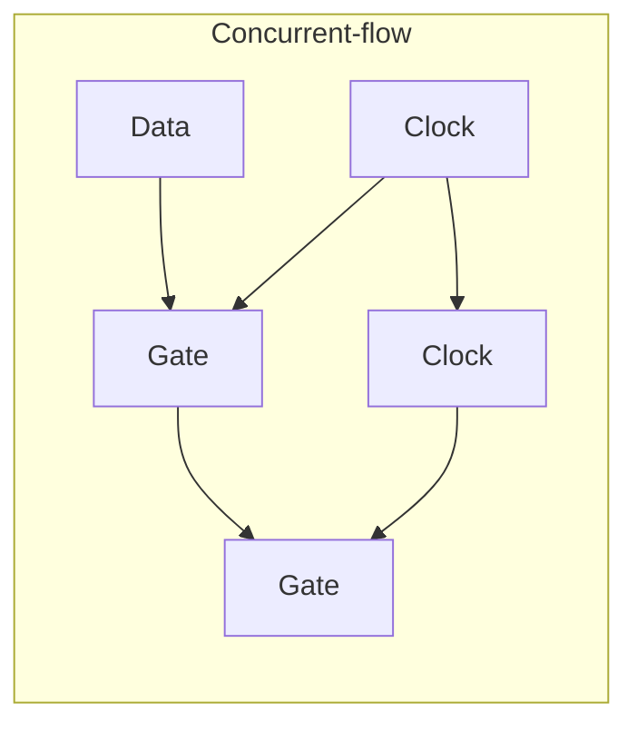
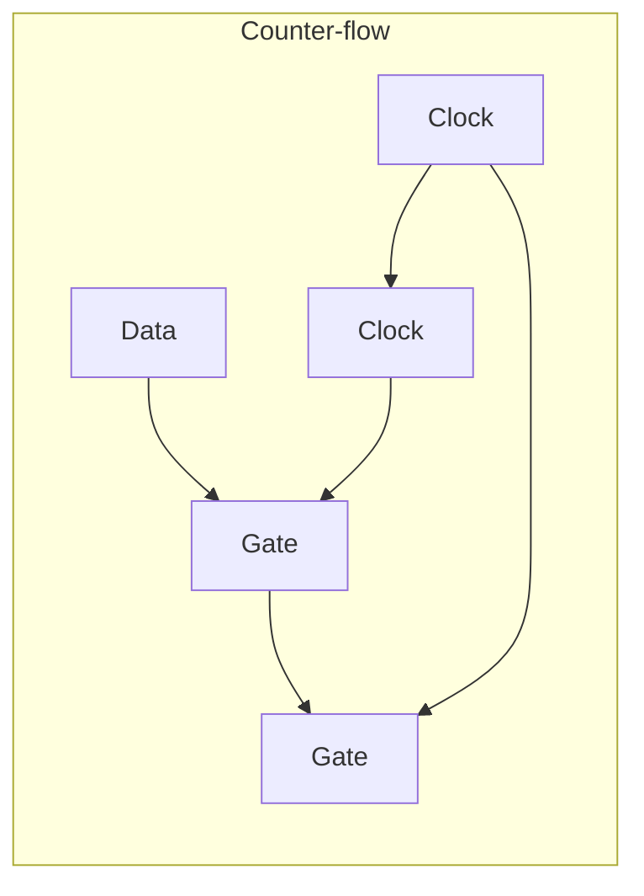
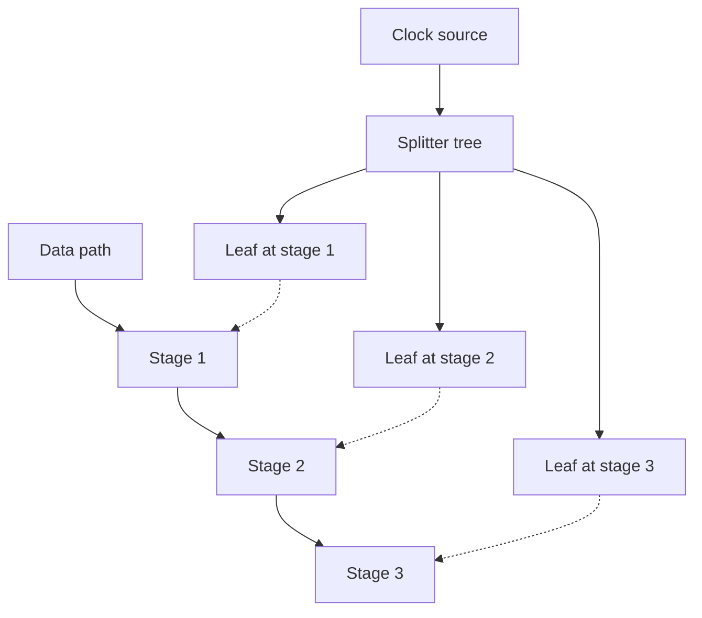

# Concurrent-Flow and Counter-Flow Clocking

**Prereqs:** [RSFQ DFF and Retiming](rsfq-dff-and-retiming.md) · [Gate-Level Pipelining](../bridge/gate-level-pipelining.md)  
**Next:** [Path Balancing Overhead](path-balancing-overhead.md) · [SFQ Static Timing Analysis](sfq-static-timing-analysis.md)  
**Tracks:** `clocking-biasing-power` · `eda-timing-verification`

**Learning goals.** After this page you should be able to (1) tell apart **concurrent-flow** and **counter-flow** clocking, (2) see how clock vs data direction shifts hold vs setup pressure, (3) connect both styles to splitter-tree skew and [path balancing](path-balancing-overhead.md), and (4) avoid thinking that clock style removes reconvergent padding.

## Why this matters

In gate-level-pipelined RSFQ, almost every cell needs a **clock pulse** as well as data pulses. How that clock is routed **relative to data** defines two classic styles. Papers and CAD flows assume you know the cartoons; timing intuition changes with the choice.

Exact library pin names and proprietary "clock-follow-data" CAD strategies vary. This page is the **field-fundamental** cartoon --- enough to read architecture figures and to talk to [STA](sfq-static-timing-analysis.md) without drowning in tool jargon.

Glossary: [Concurrent-flow clocking](../glossary.md), [Counter-flow clocking](../glossary.md), [Gate-level pipelining](../glossary.md), [Clock window](../glossary.md).

## Intuition

- **Concurrent-flow (clock-follow-data direction):** clock pulses travel in roughly the **same** direction as data along a pipeline.
- **Counter-flow:** clock pulses travel roughly **against** the data direction (clock upstream while data goes downstream --- or the reverse drawing of the same idea).

Both can work. They shift where timing is tight (hold vs long-path setup) and how you build the clock tree. Neither deletes the need to balance reconvergent logic.

Public slogan: **style relocates pain; it does not erase physics.**

## Analogy --- hallway of timed doors

Data packets march down a hallway of timed doors (pipeline stages).

- **Concurrent-flow:** a starter-pistol wave (clock) runs **with** the runners --- each door opens as the wave catches up from behind.
- **Counter-flow:** the pistol wave runs the **other** way --- doors are armed by a wave coming from the finish line toward the start.

Same sport, different race-official choreography --- and different ways to trip over early vs late arrivals.

Bad analogy: "One global CMOS edge updates everything." RSFQ distributes **pulses** to many cells via [splitter](splitter-and-confluence.md) trees.

## Picture

```text
Concurrent-flow (cartoon):

  DATA →  [G1] → [G2] → [G3] →
  CLK  →    ↑      ↑      ↑

Counter-flow (cartoon):

  DATA →  [G1] → [G2] → [G3] →
  CLK  ←    ↑      ↑      ↑
```





```text
Skew reminder (both styles):

  clock source ──► splitter tree ──► leaves with Δt skew
  data paths    ──► their own delays
  STA checks windows at each cell vs its local clock leaf
```



## Interactive lab

Try this in place. Prefer full-screen? Open the [lab page](../labs/concurrent-and-counter-flow-clocking.html).

1. **Concurrent-flow** + data path **too fast** → launch wave → hold-race warning.
2. Switch to **Counter-flow** and compare where pressure moves. Note: **pads still needed** at reconvergence either way.

<iframe
  src="../../labs/concurrent-and-counter-flow-clocking.html"
  title="Concurrent and counter-flow clocking lab"
  style="width:100%;height:720px;border:1px solid rgba(0,0,0,0.12);border-radius:0.35rem;background:#fff;"
  loading="lazy"
></iframe>

## Timing pressure --- qualitative comparison

| Concern | Concurrent-flow tendency (cartoon) | Counter-flow tendency (cartoon) |
|---------|--------------------------------------|-----------------------------------|
| Hold / race on short paths | Often watched carefully --- data may rush with the clock wave | Pressure moves; still present if paths are reckless |
| Setup / long paths | Deep logic still must meet the next window | Also present; wave direction changes choreography |
| Clock tree shape | Often follows datapath geography | May be built from the other end |
| Path balancing | Still required at reconvergence | Still required |
| Skew sensitivity | First-class | First-class |

## Why hold shows up so often in concurrent-flow teaching

When clock and data travel together, a **very short** data path can deliver a pulse into the next stage before that stage's clocked machinery is ready --- a race / hold-like hazard. Designers then:

1. add [JTL](jtl-interconnects.md) delay on the short data path,
2. insert a [DFF](rsfq-dff-and-retiming.md) to force an epoch boundary,
3. rematch clock leaves if skew is inventing the race.

Counter-flow relocates the choreography; it does not grant immunity to bad delay ratios.

## CMOS contrast

| Topic | CMOS | SFQ clock-flow styles |
|-------|------|------------------------|
| Clock | Global/regional grid to FFs | Pulse tree into **most cells** |
| Combinational cloud | Common between FFs | Rare as CMOS-like cloud; stages everywhere |
| Hold fix | Delay on short data paths | JTL/DFF pads; tree tweaks |
| "Follow data" language | Sometimes in wave pipelines | Concurrent-flow RSFQ teaching staple |
| Clock = one edge | Often mental model | Many local SFQ clock pulses |

## Worked example 1 --- Three-stage shift register

Bits move left → right through stages $1,2,3$.

**Concurrent-flow:** clock splitter tree feeds stage 1, then 2, then 3 roughly along the data path. A too-fast data path may violate **hold** (data races past a stage before that stage is ready). Designers add delay (JTLs/DFFs) on short paths.

**Counter-flow:** clock arrives first at the last stage and propagates backward. Hold/setup pressure moves; some datapaths prefer it. You still balance reconvergent XOR/majority inputs elsewhere on the chip.

## Worked example 2 --- Skew eats the margin

Suppose concurrent-flow ideal arrival difference between data and clock at a cell is comfortable, but one clock leaf is $10\,\text{ps}$ late from an unmatched splitter branch (illustrative).

Effects:

- effective window shifts,
- a path that was hold-safe may become setup-critical (or vice versa),
- fix matching on the [splitter tree](splitter-and-confluence.md) before blaming Boolean logic.

STA exists to catch this without simulating every pattern ([SFQ STA](sfq-static-timing-analysis.md)).

## Worked example 3 --- Reconvergence still needs pads

Two paths meet at a gate: 2 stages vs 5 stages. Clock style may be concurrent or counter-flow on the chip's highways, but the **stage-count mismatch** still needs about **3** padding stages on the short path ([path balancing](path-balancing-overhead.md)).

Clock style is about **direction of the pistol wave**; balancing is about **equalizing epoch depth** at merges.

## Worked example 4 --- Mixed regions on one chip

Large designs sometimes use concurrent-flow on one datapath highway and different strategies on another block (or different CAD "follow" heuristics). Public discipline:

1. Know the **local** clock-vs-data direction in the block you are timing.
2. Do not assume the whole chip shares one cartoon.
3. At block boundaries, treat clock and data handoff as first-class (skew + epoch).
4. Still balance reconvergences inside each block.

## Worked example 5 --- Choosing a mental default as a newcomer

| If you are learning... | Start with |
|----------------------|------------|
| Hold races, JTL pads, "clock follows data" language | Concurrent-flow cartoon |
| Why papers mention opposite clock wiring | Counter-flow cartoon |
| Reconvergent XOR depth mismatch | [Path balancing](path-balancing-overhead.md) (style-agnostic) |
| Tool reports of slack | [STA](sfq-static-timing-analysis.md) |

You need **both** styles in vocabulary; pick one highway cartoon to visualize first.

## Common misconceptions

- **"Concurrent-flow means no hold problems."** Often the opposite worry appears on short paths.
- **"Counter-flow removes path balancing."** No --- reconvergence still needs matched epochs.
- **"One global CMOS-like edge is enough."** RSFQ distributes **pulses** to many cells.
- **"Clock tree skew is second-order."** Skew is first-class in pulse logic.
- **"Papers using different names contradict the cartoons."** Pin-level CAD names vary; map them back to same-direction vs opposite-direction intuition.
- **"Async SFQ means I can skip this page."** Learn the synchronous cartoons first; async is an advanced branch.
- **"Picking counter-flow makes STA unnecessary."** Windows and skew remain.
- **"Clock style fixes bias current."** Bias/ampere problems are a different track ([serial biasing](serial-biasing-current-recycling.md), [ERSFQ](ersfq-logic.md)).

## Bridge to SFQ circuits

| Topic | Link |
|-------|------|
| Why every gate wants a clock | [Gate-Level Pipelining](../bridge/gate-level-pipelining.md) |
| Fanout of one clock to many cells | [Splitter and Confluence](splitter-and-confluence.md) |
| Padding short paths | [Path Balancing Overhead](path-balancing-overhead.md) |
| Tooling view of clocks vs data | [SFQ Static Timing Analysis](sfq-static-timing-analysis.md) |
| Storage until clocked | [RSFQ DFF](rsfq-dff-and-retiming.md) |
| Ampere / island themes | [Serial Biasing](serial-biasing-current-recycling.md) |
| Track maps | [Clocking, Biasing & Power](../tracks/clocking-biasing-power/ROADMAP.md) · [EDA Timing](../tracks/eda-timing-verification/ROADMAP.md) |

## What stays private

Named CAD "clock-follow-data" algorithms, measured skew histograms, and paper bake-offs of concurrent vs counter-flow on a specific ALU → private explainers.

## Check yourself

<details markdown="1">
<summary markdown="span">1. Concurrent-flow means what?</summary>

Clock pulses propagate in roughly the **same** direction as data along the pipeline.
</details>

<details markdown="1">
<summary markdown="span">2. Counter-flow means what?</summary>

Clock pulses propagate roughly **opposite** to the data direction.
</details>

<details markdown="1">
<summary markdown="span">3. Does picking a clock style remove path balancing?</summary>

No --- reconvergent paths still need matched stage counts / delays; clock style only changes where timing is hardest.
</details>

<details markdown="1">
<summary markdown="span">4. Why can concurrent-flow raise hold concerns?</summary>

Data and clock travel together; a too-fast data path may race into the next stage before it is ready.
</details>

<details markdown="1">
<summary markdown="span">5. How do splitter trees interact with either style?</summary>

They create the leaf clocks; branch mismatch becomes skew that shifts setup/hold windows at cells.
</details>

<details markdown="1">
<summary markdown="span">6. Name two fixes for a short-path race.</summary>

Insert JTL delay and/or extra DFF retiming stages; also rematch clock branches if skew is the culprit.
</details>

<details markdown="1">
<summary markdown="span">7. Depths 2 and 6 meet at a gate under counter-flow. About how many pads on the short path?</summary>

About $4$ --- clock style does not cancel stage-count imbalance.
</details>

<details markdown="1">
<summary markdown="span">8. Is "one global CMOS edge" a good mental model for RSFQ clocking?</summary>

No --- many cells each receive local SFQ clock pulses from a distribution tree.
</details>

## Next steps

- Cost of padding: [Path Balancing Overhead](path-balancing-overhead.md).
- Windows in tools: [SFQ Static Timing Analysis](sfq-static-timing-analysis.md).
- Pipelining refresher: [Gate-Level Pipelining](../bridge/gate-level-pipelining.md).
- Bias current reuse: [Serial Biasing and Current Recycling](serial-biasing-current-recycling.md).
- Plain terms: [Glossary](../glossary.md).
