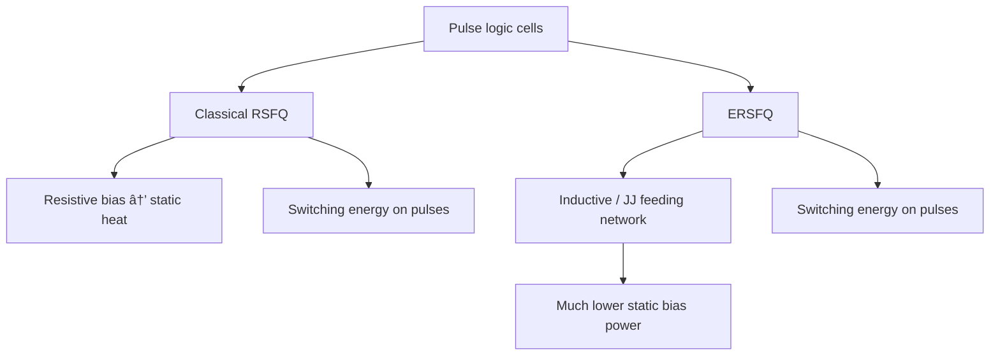
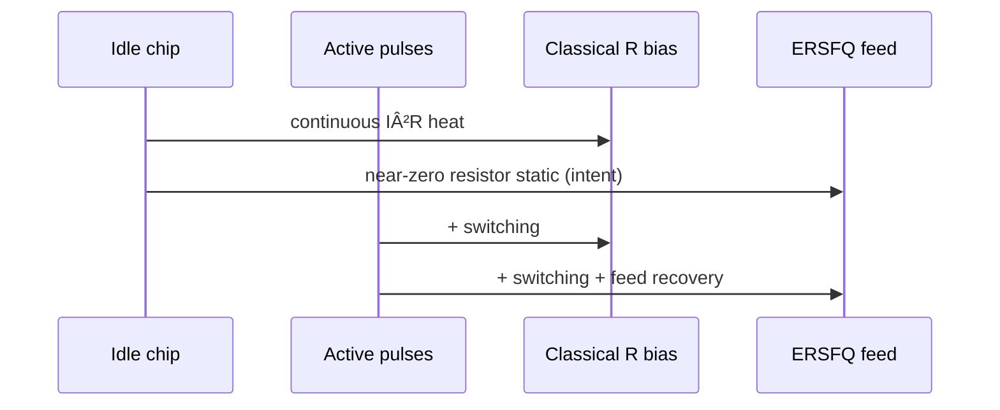

# ERSFQ Logic Family (Concept)

**Prereqs:** [Resistive Bias to ERSFQ](../bridge/resistive-bias-to-ersfq.md) · [RSFQ Logic Overview](rsfq-logic.md)  
**Next:** [DC Bias Current Delivery](../bridge/dc-bias-current-delivery.md) · [AQFP Logic](aqfp-logic.md)  
**Tracks:** `sfq-logic-primitives` · `clocking-biasing-power`

**Learning goals.** After this page you should be able to (1) place **ERSFQ** as RSFQ-like pulse logic with energy-efficient **bias networks**, (2) separate **static resistor heat** from **switching energy**, (3) contrast ERSFQ with classical resistive-bias RSFQ and with [AQFP](aqfp-logic.md) at a newcomer level, and (4) know what belongs in public intuition versus private paper depth.

## Why this matters

Classical RSFQ libraries often feed junctions through **bias resistors**. Those resistors dissipate heat even when the logic is idle — **static power** that grows painfully as junction count grows. At cryogenic budgets, that heat is not a footnote; it can dominate.

**ERSFQ** (Energy-efficient RSFQ) keeps the familiar **SFQ pulse encoding** and much of the cell vocabulary (JTL, DFF, splitters, …) but redesigns **how bias current is delivered** so idle dissipation drops dramatically. Public message: **same pulse-logic language, different power/bias story.**

Read the story bridge first if needed: [Resistive Bias to ERSFQ](../bridge/resistive-bias-to-ersfq.md). Glossary: [ERSFQ](../glossary.md), [Bias current](../glossary.md), [RSFQ](../glossary.md), [JTL](../glossary.md).

## Intuition — attack static bias heat

| Piece | Classical resistive-bias RSFQ | ERSFQ (public cartoon) |
|-------|------------------------------|-------------------------|
| Bit encoding | SFQ pulses / loop flux | Same family of ideas |
| Cell roles | JTL, DFF, gates, … | Still pulse automata |
| Bias feed | Resistors → continuous $I^2R$ heat | Inductive / JJ feeding networks aimed at near-zero static resistor power |
| What remains | Switching energy when pulses fire | Switching energy remains; static resistor tax shrinks |
| Timing story | Epochs, path balance, STA | Still required |

ERSFQ is **not** “a new Boolean algebra.” It is an **implementation family** for pulse logic with a different power-delivery contract.

Static resistor heat cartoon (classical):

\[
P_{\mathrm{static,\,R}} \sim I_b^2 R_{\mathrm{bias}}
\]

per biased path that still drops voltage across a resistor while idle. ERSFQ’s design intent is to drive that class of term toward negligible — without claiming zero switching energy.

## Analogy — city water leaks

Resistive-bias RSFQ ≈ a city water system that **leaks at every junction all night** (static heat).  
ERSFQ ≈ redesign the supply network so **leaks stop**; faucets still splash when someone uses them (switching when pulses occur).

Bad analogy: “ERSFQ uses zero energy always.” Adiabatic or switching energy still exists; the headline win is **static bias**. Another bad analogy: “ERSFQ = AQFP.” Different families.

## Picture



```text
Power cartoon (not to scale):

Classical:  ████████ static resistor heat  ██ switching
ERSFQ:      ░ soft static                  ██ switching

(Exact ratios are paper/process-specific → private)
```

```text
Bias delivery sketch:

Classical:  Vbias ── R ──► junction bias node
ERSFQ:      feeding JJs / inductors ──► bias node
            (designed so idle DC drop in resistors ≈ 0)
```



## Interactive lab

Try this in place. Prefer full-screen? Open the [lab page](../labs/ersfq-logic.html).

1. **Resistive RSFQ**, activity 0% — static bar stays large (leak all night). Raise **N**.
2. Flip to **ERSFQ feed** — static collapses; raise **Activity %** so switching (and soft feed recovery) grow. Encoding stays SFQ pulses.

<iframe
  src="../../labs/ersfq-logic.html"
  title="ERSFQ logic lab"
  style="width:100%;height:720px;border:1px solid rgba(0,0,0,0.12);border-radius:0.35rem;background:#fff;"
  loading="lazy"
></iframe>

## What changes for a designer (public checklist)

1. **Logical thinking** (pulses, epochs, DFFs, path balance) largely carries over from RSFQ.
2. **Bias network design** becomes a first-class architecture problem — feeding junctions, margins, and recovery after bursts of activity.
3. **Power reports** must split static vs dynamic; comparing “RSFQ vs ERSFQ” without that split is misleading.
4. **Total supply current** may still be large — that is why [DC bias delivery](../bridge/dc-bias-current-delivery.md) and [serial biasing](serial-biasing-current-recycling.md) matter even for efficient families.
5. **Timing closure** still uses [STA](sfq-static-timing-analysis.md) and [clock-flow](concurrent-and-counter-flow-clocking.md) intuition.

## CMOS contrast

| Topic | CMOS | RSFQ resistive bias | ERSFQ |
|-------|------|---------------------|-------|
| Idle power | Leakage / static paths | Bias $I^2R$ can dominate | Aims to remove resistor static tax |
| Dynamic power | $CV^2f$-ish | Pulse switching + bias interactions | Pulse switching remains central |
| Rails | $V_{DD}$/GND grid | Current bias network | Current bias with inductive/JJ feed |
| “Low power variant” | Process / VT / clock gating | — | ERSFQ-style feeding (among options) |
| Clock gating cousin | Stops activity | Helps dynamic; may not stop resistor leaks | Feeding topology is the headline move |

CMOS “clock gating” reduces activity; ERSFQ’s headline move is **feeding topology**, not only activity.

## Worked example 1 — Same shift register, different idle bill

Imagine two functionally similar $N$-bit shift registers: one classical RSFQ, one ERSFQ.

Idle (no data activity), public expectation:

- classical: bias resistors still dissipate — heat scales with how the bias network is built,
- ERSFQ: static resistor contribution collapses by design intent; remaining idle draw depends on the feeding network’s nonidealities (paper depth).

During activity, both move $\Phi_0$ pulses; switching energy appears in both. A fair comparison quotes **static** and **dynamic** separately.

## Worked example 2 — Do not confuse ERSFQ with serial biasing

| Technique | Main problem attacked |
|-----------|----------------------|
| ERSFQ feeding | Static heat in bias resistors |
| [Serial biasing / current recycling](serial-biasing-current-recycling.md) | Huge **total ampere** into the cryostat by stacking ground islands |
| AQFP | Different logic family (AC multiphase, adiabatic parametron-style) |

A large chip might care about **both** ERSFQ *and* serial biasing — they are complementary themes, not synonyms.

## Worked example 3 — Margin thinking without numbers

Suppose an ERSFQ feeding network must replenish bias after a burst of $M$ pulses in a local region. Public reasoning:

1. Each switched junction briefly disturbs the bias node.
2. The feeding network must restore bias before the next critical window.
3. If restoration is too slow, margins collapse — errors look like “timing” or “logic” but root cause is **bias dynamics**.

Quantitative recovery times and schematics → private explainers. The **failure mode category** is public.

## Worked example 4 — Reading a power table honestly

A paper quotes “ERSFQ uses $X$× less power than RSFQ.” Public checklist before believing the slogan:

1. Was **static** separated from **dynamic**?
2. Same activity factor / throughput assumption?
3. Same temperature and what was included (bias leads, interfaces)?
4. Same functional block, or apples-to-oranges ALU vs gate?

Numbers stay private; the **honesty checklist** is curriculum content.

## Worked example 5 — Cell vocabulary transfer

You already know [JTL](jtl-interconnects.md), [splitter](splitter-and-confluence.md), [DFF](rsfq-dff-and-retiming.md). In ERSFQ those **roles** still exist. What you re-learn is how bias arrives and how power is budgeted — not a new meaning of “pulse in a window.”

## Bias feeding — public physics cartoon

Classical resistive bias sets a working point by dropping part of a supply voltage across a resistor into a Josephson bias node. Even when **no** SFQ pulse fires, current still flows through that resistor, so heat continues:

\[
P_{\mathrm{static,\,R}} \sim I_b^2 R_{\mathrm{bias}}.
\]

ERSFQ-style feeding replaces that continuous resistor drop with a network built from **inductors and feeding junctions** (exact topology is family- and paper-specific). The public intent:

1. Keep each logic junction near its useful bias point when idle.
2. Avoid a permanent $I^2R$ tax on every biased tap.
3. Allow the feed to **replenish** after local switching events disturb the bias node.

A useful mental split:

| Layer | Question | ERSFQ answer shape |
|-------|----------|-------------------|
| Logic | What is a bit? | Same: pulse in a window / loop flux |
| Cell | What does a JTL/DFF do? | Same roles as RSFQ cousins |
| Feed | How does $I_b$ arrive without resistor heat? | Inductive / JJ feeding network |
| System | Are amperes and islands still a problem? | Often yes — see [DC bias delivery](../bridge/dc-bias-current-delivery.md) |

Do **not** flatten “ERSFQ” into “any circuit that uses an inductor somewhere.” The name points at an **energy-efficient bias-delivery approach** for RSFQ-like pulse logic. Named schematic variants and measured watt tables belong in private explainers.

## Interaction with activity and recovery

When a local cluster fires many pulses in a short burst, each switching event briefly perturbs bias nodes. The feeding network must restore bias before the next critical timing window. Public failure modes (categories, not numbers):

- **Too-slow recovery** → margins collapse; errors look like timing or logic bugs.
- **Too-aggressive activity** in one island → local starvation even if average chip power looks fine.
- **Ignoring feed dynamics in STA** → optimistic windows that silicon-minded bias margins would reject.

So ERSFQ does not delete [STA](sfq-static-timing-analysis.md); it adds a **bias-dynamics** checklist beside pulse-window checks.

```text
Burst cartoon:

  pulses: ★ ★ ★ ★ ★     (local activity)
  bias:   ‾‾\_/‾‾\_/‾‾    (dip + recovery at feed node)
  next window must see bias restored
```

## Relationship to other “efficient SFQ” words

Newcomers meet many acronyms. Keep this public map:

| Family / idea | Bit story | Headline efficiency lever |
|---------------|-----------|---------------------------|
| Classical RSFQ | SFQ pulses / loops | Mature cell libraries; resistor bias often costly at scale |
| **ERSFQ** | Same pulse family | Bias feeding → cut static resistor heat |
| [AQFP](aqfp-logic.md) | AC multiphase parametron-style | Adiabatic / AC excitation family (different encoding choreography) |
| [Serial biasing](serial-biasing-current-recycling.md) | Orthogonal to encoding | Reuse one supply current across stacked ground islands |

You may eventually care about **both** ERSFQ feeding **and** serial biasing on one large system — complementary levers, not synonyms.

## Common misconceptions

- **“ERSFQ invents a new bit encoding.”** No — still SFQ pulses / flux storage.
- **“ERSFQ means zero power.”** Static resistor power ↓; switching and other losses remain.
- **“ERSFQ = AQFP.”** Different families ([AQFP](aqfp-logic.md)).
- **“If I learn ERSFQ I can ignore DC bias delivery.”** Ampere-scale delivery and island recycling are separate scaling problems.
- **“Any inductive bias is automatically ERSFQ.”** ERSFQ refers to a design approach/family; read papers for the exact feeding style — private depth.
- **“MIDSFQ / other names are required on day one.”** Variant taxonomy debates stay private until you study those papers.
- **“ERSFQ deletes path balancing.”** Epoch alignment remains.
- **“Clock gating alone equals ERSFQ.”** Feeding topology is the distinctive public theme.

## Bridge to SFQ circuits

- Story of why resistors hurt: [Resistive Bias to ERSFQ](../bridge/resistive-bias-to-ersfq.md).
- Why amperes matter: [DC Bias Current Delivery](../bridge/dc-bias-current-delivery.md).
- Recycling current across islands: [Serial Biasing](serial-biasing-current-recycling.md).
- Different AC family: [AQFP](aqfp-logic.md).
- Pulse cells still need timing: [STA](sfq-static-timing-analysis.md), [clocking](concurrent-and-counter-flow-clocking.md).
- Track maps: [SFQ Logic Primitives](../tracks/sfq-logic-primitives/ROADMAP.md) · [Clocking, Biasing & Power](../tracks/clocking-biasing-power/ROADMAP.md).

## What stays private

Paper-specific bias-network schematics, quantitative watt tables, process design rules, and named failure modes / variants → `share/private/papers/<slug>/` after the public core walk.

## Check yourself

<details markdown="1">
<summary markdown="span">1. Does ERSFQ invent a new bit encoding?</summary>

No — it still uses SFQ pulses / flux storage; the big change is bias / static power.
</details>

<details markdown="1">
<summary markdown="span">2. What problem does ERSFQ primarily target?</summary>

Static dissipation in classical resistive bias networks at scale.
</details>

<details markdown="1">
<summary markdown="span">3. What energy remains even if static resistor heat vanishes?</summary>

Switching energy (and other nonideal losses) when pulses fire and networks recover.
</details>

<details markdown="1">
<summary markdown="span">4. How is ERSFQ different from serial biasing?</summary>

ERSFQ attacks resistor static heat in the feeding style; serial biasing reuses one current through stacked ground islands to cut total supply amperes.
</details>

<details markdown="1">
<summary markdown="span">5. Where do detailed ERSFQ measurements go in this curriculum?</summary>

Private paper explainers; this public page stays conceptual.
</details>

<details markdown="1">
<summary markdown="span">6. Why might an ERSFQ chip still need careful DC bias delivery engineering?</summary>

Total current, distribution, and margins can still be large; feeding efficiency ≠ “no ampere problem.”
</details>

<details markdown="1">
<summary markdown="span">7. Name two items that should appear when comparing RSFQ vs ERSFQ power fairly.</summary>

Separate static vs dynamic, and matched activity / what was counted.
</details>

<details markdown="1">
<summary markdown="span">8. Do JTLs and DFFs disappear in ERSFQ?</summary>

No — pulse-cell roles largely carry over; the bias/power contract changes.
</details>

## Next steps

- Ampere-scale delivery: [DC Bias Current Delivery](../bridge/dc-bias-current-delivery.md).
- Meet AC multiphase logic: [AQFP Logic](aqfp-logic.md).
- Current recycling: [Serial Biasing and Current Recycling](serial-biasing-current-recycling.md).
- Plain terms: [Glossary](../glossary.md).
