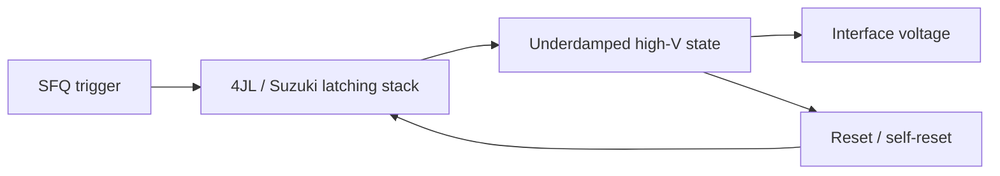
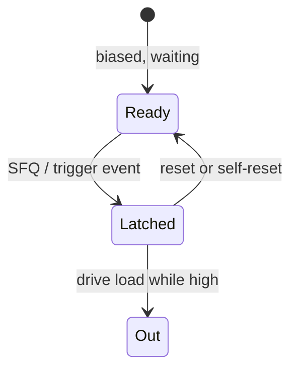

# Four-JL Latching Driver and Suzuki Stacks

**Prereqs:** [From SFQ Pulses to Voltage Levels](../bridge/sfq-pulse-to-volt-level.md) · [SQUID Stack Driver](squid-stack-driver.md) · [Overdamped vs Underdamped JJ](../fundamentals/overdamped-vs-underdamped-jj.md)  
**Next:** [Vortex Transitional RAM](vortex-transitional-ram.md) · [Josephson–CMOS Hybrid Memory](josephson-cmos-hybrid-memory.md) · [SQUID Stack Driver](squid-stack-driver.md) · [From SFQ Pulses to Voltage Levels](../bridge/sfq-pulse-to-volt-level.md)  
**Tracks:** `cryogenic-interfaces-io`

**Learning goals.** After this page you should be able to (1) explain **latching** Josephson drivers as an alternative to [SQUID stacks](squid-stack-driver.md), (2) recognize **4JL** (four-junction latching / four Josephson logic heritage) and **Suzuki stack** as related underdamped voltage-boost ideas, (3) connect latching behavior to [underdamped junctions](../fundamentals/overdamped-vs-underdamped-jj.md) and reset, (4) estimate stack height as a **voltage budget** knob, and (5) know when these drivers appear in SFQ↔CMOS and instrument interfaces — without paper-specific schematics.

## Why this matters

[RSFQ](rsfq-logic.md) gates prefer **overdamped** junctions that emit a short $\Phi_0$ pulse and return to $V \approx 0$. That is perfect for on-chip pulse logic and terrible as a direct shout to CMOS. The bridge [From SFQ Pulses to Voltage Levels](../bridge/sfq-pulse-to-volt-level.md) already said: you need amplify / stretch / latch.

One megaphone family is the [SQUID stack](squid-stack-driver.md): series flux-sensitive stages that add voltage. The other classic family uses **underdamped** junctions that **latch** near a larger voltage (often related to the gap-voltage scale in device physics) until deliberately or automatically reset. Stacking several such junctions multiplies the available swing. Historically this lineage includes **4JL-style latching drivers** and **Suzuki stacks** — names you will see in I/O and hybrid-memory papers.

Public curriculum goal: understand the **mechanism class** (latch + stack + reset). Exact junction counts in a named cell, measured BER, and process recipes stay in private explainers.

Why bother learning both megaphones? Because papers and chip projects pick differently. Amplitude needs, sampler speed, reset complexity, magnetic environment, and library maturity all matter. If you only know one family, half the I/O literature looks like alien vocabulary.

Glossary anchors: [Glossary](../glossary.md) — **4JL / Suzuki stack**, **underdamped**, **SQUID stack**, **SFQ pulse**, $\beta_C$.

## Intuition — stay open until reset

Recall the McCumber picture from [overdamped vs underdamped](../fundamentals/overdamped-vs-underdamped-jj.md):

\[
\beta_C = \frac{2\pi I_c R^2 C}{\Phi_0}.
\]

- $\beta_C \lesssim 1$: overdamped — one $2\pi$ slip → short pulse → $V\approx 0$.
- $\beta_C \gg 1$: underdamped — can run to a **finite-voltage latching state** until reset.

A latching I/O driver **wants** that second behavior. An SFQ trigger kicks underdamped junctions into a high-voltage state. While latched, the voltage is taller and lasts longer than an RSFQ pulse — exactly what slow semiconductor samplers need. A **reset** path (self-resetting bias dynamics, a reset pulse, or load-dependent return) brings the stack back to the ready state for the next event.

**4JL-style latching driver:** a compact latching cell historically associated with four-junction arrangements that turn an SFQ trigger into a taller, longer voltage event.

**Suzuki stack:** a series stack of underdamped junctions used as a voltage multiplier / latching amplifier in Josephson–CMOS and similar interfaces. Stack height is again a **voltage budget** knob:

\[
V_{\mathrm{latched}} \sim N_{\mathrm{JJ}} \cdot V_{\mathrm{one}}
\]

in the cartoon where each junction contributes a comparable latched voltage $V_{\mathrm{one}}$.

Together with SQUID stacks, these are the two public “megaphone” families for pulse → volt-level conversion.

### Three verbs that matter

| Verb | Meaning for latching I/O |
|------|--------------------------|
| **Trigger** | An SFQ / flux event knocks the stack out of the ready state |
| **Hold** | Underdamped junctions stay at a useful high voltage for a while |
| **Reset** | The stack returns to ready so the next event can be reported |

If you remember only “taller voltage,” you miss half the machine. Without reset, the megaphone is stuck on.

### Gap voltage as a teaching landmark

In device physics, an underdamped Josephson junction that runs can sit near a **gap-voltage** scale set by the superconducting energy gap — much larger than a brief overdamped SFQ pulse peak in many cartoons. Public curriculum does **not** quote a universal millivolt number as law; it says: **latching aims at a taller, held finite-voltage state**, and stacking multiplies that contribution. Exact gap voltages and process numbers stay private.

## Analogy — door that stays open

- Overdamped RSFQ = a spring door that opens a crack and slams shut (pulse).
- Latching 4JL / Suzuki = a door that **stays open** at a wide angle until you deliberately close it — louder and longer for someone far down the hall (CMOS or a cable receiver).

A second analogy: a camera shutter vs a light switch. An RSFQ pulse is a shutter click — brief light. A latching driver is a light switch that stays on until you turn it off — useful when the photographer (semiconductor sampler) is slow.

The analogies are about **return vs stick**, not about literal mechanical doors or light bulbs inside the barrier. The RCSJ equations still govern; designers choose damping and topology so the stick is useful rather than accidental.

## Picture — latch, hold, reset

```text
SFQ trigger ★
      │
      ▼
┌──────────────────────────┐
│  latching stack          │
│  (underdamped JJs)       │
│                          │
│   ready ──trigger──► HIGH│──── V_out (taller / wider)
│     ▲                 │  │
│     └──── reset ──────┘  │
└──────────────────────────┘
      │
      ▼
 cable / CMOS / memory IO / instrument
```





```text
Waveform sketch (not to scale)

V |        ___________
  |       /           \____ reset
  |______/  latched high
       ★ trigger              time

Compare RSFQ pulse: narrow spike, area ~ Φ0, then V≈0
Compare SQUID stack: taller peak from series stages; hold time depends on design
```

## Interactive lab

Try this in place (same lab as the [SQUID stack](squid-stack-driver.md) page — two megaphone families). Prefer full-screen? Open the [lab page](../labs/squid-stack-and-four-jl-driver.html).

1. Select **4JL / Suzuki latch**, set stack height **N**, fire **SFQ trigger** — output climbs and **holds**.
2. Click **Reset** to return to ready. Flip to **SQUID stack** and fire again: taller peak, but it dies without a latch/reset machine.

<iframe
  src="../../labs/squid-stack-and-four-jl-driver.html"
  title="SQUID stack vs 4JL latching driver lab"
  style="width:100%;height:760px;border:1px solid rgba(0,0,0,0.12);border-radius:0.35rem;background:#fff;"
  loading="lazy"
></iframe>

## Underdamping as a deliberate I/O tool

In pulse logic, underdamping is often a **bug**: unwanted latching wrecks timing and margins. In I/O drivers, underdamping is often a **feature**: you *want* a finite-voltage state that lasts long enough for a slow neighbor to sample.

That flip in judgment is one of the hardest decoder-ring moments for newcomers:

| Context | Underdamped latching |
|---------|----------------------|
| Inside RSFQ gate library | Usually unwanted |
| At SFQ→CMOS / instrument boundary | Often intentional |
| In AQFP / other adiabatic families | Different story — do not paste 4JL intuition blindly |

The same $\beta_C$ number can mean “danger” or “design goal” depending on **where** the junction sits in the system.

### Isolation matters

If underdamped I/O stacks sit next to overdamped gate cells without careful separation (bias, magnetic environment, layout), accidental latching can **infect** pulse logic. Public habit: treat latching drivers as **quarantined interface blocks**, not as free-floating cells you drop into a JTL chain.

## Worked example 1 — Stack height as voltage budget

Cartoon only: suppose one underdamped junction latches near $V_1 \approx 2\,\text{mV}$ of usable swing into a given load, and a cryo-CMOS sense path wants about $V_{\mathrm{need}} \approx 40\,\text{mV}$ before comfortable discrimination.

Naïve stack count:

\[
N_{\mathrm{JJ}} \gtrsim \frac{V_{\mathrm{need}}}{V_1} \approx 20.
\]

That is the same budget language as SQUID stacks, with a different physical mechanism (latching underdamped junctions vs series SQUID stages). Neither cartoon produces a full $1.8\,\text{V}$ digital rail by itself; both buy **headroom** into the next amplifier or pad circuit.

| One-JJ latched swing (cartoon) | Target | Naïve $N_{\mathrm{JJ}}$ |
|--------------------------------|--------|-------------------------|
| $2\,\text{mV}$ | $20\,\text{mV}$ | $\sim 10$ |
| $2\,\text{mV}$ | $50\,\text{mV}$ | $\sim 25$ |
| $5\,\text{mV}$ | $50\,\text{mV}$ | $\sim 10$ |
| $2\,\text{mV}$ | $100\,\text{mV}$ | $\sim 50$ |

Public takeaway: **stack height ↔ voltage budget ↔ junction count ↔ reset complexity**.

**Follow-on.** If reset recovery takes longer as $N_{\mathrm{JJ}}$ grows (qualitative teaching claim — not a universal law), then chasing amplitude with ever-taller stacks can hurt **event rate**. Sometimes a shorter Josephson stack plus a semiconductor amplifier is the saner system.

## Worked example 2 — Choosing megaphone family (decision sketch)

An SFQ controller must signal a cold CMOS memory chip ([Josephson–CMOS hybrid memory](josephson-cmos-hybrid-memory.md)). Two candidate interface stories:

**Path A — SQUID stack.** Flux-sensitive series stages amplify a weak event; good when the natural trigger is flux / SQUID-like and you want additive swing without committing to a long latched high state.

**Path B — 4JL / Suzuki latching.** An SFQ pulse triggers underdamped junctions into a held high voltage; good when the semiconductor side needs a **wider** event (more time to sample) and your process supports clean latch + reset.

A field-fundamental decision checklist (not a foundry rulebook):

| Question | Tips toward SQUID stack | Tips toward latching stack |
|----------|-------------------------|----------------------------|
| Need longer hold for slow sampler? | Maybe secondary amp | Natural strength |
| Reset / recovery timing critical? | Different constraints | Must design reset carefully |
| Trigger is flux-motif native? | Natural fit | Also possible with pulse trigger |
| Library already has Suzuki cells? | — | Use the mature pattern |
| Accidental latching in nearby pulse logic? | Keep underdamped I/O isolated | Isolate carefully; do not “infect” gate library |

Real projects mix constraints (area, bias current, BER, magnetic environment). Learn both vocabularies so papers are readable.

## Worked example 3 — Reset as part of the transaction

Sketch one SFQ→CMOS write-strobe transaction:

1. SFQ controller emits a legal trigger pulse into the latching driver.
2. Stack enters the latched high state; CMOS side samples the taller/wider event.
3. Reset returns the stack to ready **before** the next command is allowed.
4. If reset is late, the next trigger may be missed, merged, or reported as a stuck-high fault.

Timing intuition (qualitative only):

\[
t_{\mathrm{iface}} \gtrsim t_{\mathrm{trigger}} + t_{\mathrm{hold,useful}} + t_{\mathrm{reset}} + t_{\mathrm{margin}}.
\]

The semiconductor memory array’s own access time sits beside this interface budget. Hybrid memory papers care about both; this concept card only insists that **reset is on the critical path of the interface story**, not an afterthought footnote.

### Reset flavors (public taxonomy)

| Flavor | Plain idea |
|--------|------------|
| Explicit reset pulse | Another SFQ / control event forces return to ready |
| Self-resetting bias | Bias / load dynamics pull the stack back after a hold interval |
| Load-assisted return | The driven circuit helps quench the latched state |

You do not need a PDK schematic to remember: **every latching driver story includes a return path**, named or unnamed.

## Worked example 4 — Height and width together

Recall the I/O bridge’s two gaps. A latching stack often helps **both**:

| Gap | How latching helps (public) |
|-----|-----------------------------|
| Voltage / height | Underdamped latched voltage $\times$ stack count |
| Time / width | Hold until reset → longer event for slow samplers |

A [SQUID stack](squid-stack-driver.md) is the cleaner “series amplitude” story; latching is the cleaner “stick until told to unstick” story. Many systems still use semiconductor gain after either Josephson megaphone.

## Comparison table — the two megaphones and the gate JJ

| | Overdamped RSFQ JJ | SQUID stack | 4JL / Suzuki latching |
|--|--------------------|-------------|------------------------|
| Core idea | Short $\Phi_0$ pulse | Series SQUID stages add response | Underdamped junctions latch high |
| Typical feel | Snap then silence | Flux→voltage amplifier chain | Triggered latch + reset |
| Damping | $\beta_C\lesssim 1$ | Mixed / design-specific | Often $\beta_C\gg 1$ stages |
| Role | Logic / JTL / DFF | SFQ → larger $V$ | SFQ → larger / longer $V$ |
| Failure mode if misused as logic | — | Wrong cell in datapath | Accidental latching in pulse path |
| Extra control | Clock / bias as usual | Bias / matching | Explicit or self **reset** |

## CMOS contrast

| CMOS mental model | Latching Josephson driver |
|-------------------|---------------------------|
| Output buffer holds $V_{DD}$ or $0$ | Holds a **Josephson latched voltage** until reset — not a CMOS rail |
| Edge-triggered flip-flop stores a bit | Here latching is mostly an **I/O waveform** tool; do not confuse with RSFQ DFF loop storage |
| Level shifter between voltage domains | Closest CMOS friend: domain crossing — but physics is underdamped JJ stacks, not FET stacks |
| Tri-state / enable | Reset / ready is the analogous “return to quiet” control |
| Same FETs as core logic, resized | Often **different damping regime** than core RSFQ junctions |
| Schmitt trigger / monostable pulse stretcher | Rough functional cousin: stretch a brief event into something samplers can catch — different devices |

CMOS designers who hear “latch” may think flip-flop. In this I/O chapter, **latch** primarily means **junction voltage state that sticks until reset**. Storage of digital bits in SFQ still prefers loop / DFF language ([pulse to logic state](../bridge/pulse-to-logic-state.md)).

See [CMOS vs SFQ](cmos-vs-sfq.md) for the broader decoder ring.

## Common misconceptions

1. **“Latching driver means the whole chip is latching logic.”**  
   Hybrid systems often keep overdamped RSFQ internally and use latching/stack drivers **only at interfaces**.

2. **“4JL and Suzuki are unrelated inventions.”**  
   For learning purposes, treat them as one **family**: underdamped latching voltage boost with stack height as a knob. Historical naming differs; mechanism class is shared.

3. **“Underdamped latching is always a bug.”**  
   In RSFQ gates, unwanted latching is a bug. In I/O drivers, intentional latching is a **feature**.

4. **“Reset is optional.”**  
   Without reset (or self-reset), the driver stays high and cannot report the next event cleanly. Reset is part of the machine.

5. **“A Suzuki stack replaces SQUID stacks forever.”**  
   Sibling tools. Amplitude, speed, process, and system architecture decide — not slogans.

6. **“Latched high voltage is the logic ‘1’ encoding on chip.”**  
   On-chip RSFQ still encodes with pulses and loop flux. The latched voltage is the **interface shout**, not a new on-chip logic rail.

7. **“Bigger $N_{\mathrm{JJ}}$ always wins.”**  
   Amplitude budget helps until reset time, area, mismatch, and bias cost dominate. Interface design is a **system** trade.

8. **“If CMOS can sample it, BER is automatically fine.”**  
   Sampling success and acceptable error rate are related but not identical. Noise, skew, and recovery all matter ([pulse → volt-level](../bridge/sfq-pulse-to-volt-level.md) checklist). Measured BER curves stay private.

## Bridge to SFQ circuits

- Requires [overdamped vs underdamped](../fundamentals/overdamped-vs-underdamped-jj.md) and the I/O gap on [pulse → volt-level](../bridge/sfq-pulse-to-volt-level.md).
- Sibling: [SQUID stack driver](squid-stack-driver.md).
- Common consumers: cryo I/O instruments and [Josephson–CMOS hybrid memory](josephson-cmos-hybrid-memory.md).
- Memory track neighbor: [Vortex Transitional RAM](vortex-transitional-ram.md) may still need drivers when bits leave the SFQ domain.
- Self-resetting SFQ↔AQFP interfaces and paper BER curves are related leaves — study privately when you hit those articles.
- Do not dump SPICE netlists into this concept card; topology intuition first.

## Check yourself

<details markdown="1">
<summary markdown="span">1. How does a latching driver differ from an RSFQ gate JJ?</summary>

It often uses underdamped switching that holds a larger voltage until reset, instead of a short overdamped SFQ pulse that returns to $V\approx 0$.
</details>

<details markdown="1">
<summary markdown="span">2. What is a Suzuki stack for?</summary>

Series underdamped junctions that boost / hold voltage for interface and Josephson–CMOS loads.
</details>

<details markdown="1">
<summary markdown="span">3. Name the sibling amplifier family to latching stacks.</summary>

SQUID stack drivers.
</details>

<details markdown="1">
<summary markdown="span">4. Why does $\beta_C$ matter for this page?</summary>

Large $\beta_C$ (underdamped) enables the latched high-voltage state that I/O drivers exploit; small $\beta_C$ is what RSFQ pulse gates want.
</details>

<details markdown="1">
<summary markdown="span">5. If one junction latches near $2\,\text{mV}$ and you need $\sim 30\,\text{mV}$, what naïve stack size do you estimate?</summary>

About $N_{\mathrm{JJ}} \gtrsim 15$. Cartoon budget only.
</details>

<details markdown="1">
<summary markdown="span">6. Does using a latching I/O driver mean on-chip bits are stored as latched junction voltages?</summary>

No. On-chip RSFQ storage is still pulse/loop based; latching here is primarily an interface transduction tool.
</details>

<details markdown="1">
<summary markdown="span">7. Why is reset on the interface critical path?</summary>

Until the stack returns to ready, it cannot cleanly report the next event. Hold without reset is a stuck megaphone.
</details>

<details markdown="1">
<summary markdown="span">8. When might underdamping be a bug *and* a feature on the same chip?</summary>

Bug inside overdamped RSFQ gate cells; feature in intentional latching I/O stacks at the domain boundary — if the two regions are kept properly isolated in design.
</details>

<details markdown="1">
<summary markdown="span">9. Name three public reset flavors.</summary>

Explicit reset pulse, self-resetting bias dynamics, and load-assisted return (among related variants).
</details>

<details markdown="1">
<summary markdown="span">10. Which two gaps can a latching stack help close at once?</summary>

Voltage/height (latched swing $\times$ stack) and time/width (hold until reset). Exact numbers are process-specific.
</details>

## Next steps

- SFQ-native memory intuition: [Vortex Transitional RAM](vortex-transitional-ram.md).
- Hybrid density path: [Josephson–CMOS Hybrid Memory](josephson-cmos-hybrid-memory.md).
- SQUID alternative: [SQUID Stack Driver](squid-stack-driver.md).
- Why I/O exists: [From SFQ Pulses to Voltage Levels](../bridge/sfq-pulse-to-volt-level.md).
- Damping contrast: [Overdamped vs Underdamped JJ](../fundamentals/overdamped-vs-underdamped-jj.md).
- Encoding cheat sheet: [CMOS vs SFQ](cmos-vs-sfq.md).
- Plain terms: [Glossary](../glossary.md).
- Track map: [Cryogenic interfaces / I/O](../tracks/cryogenic-interfaces-io/ROADMAP.md).
