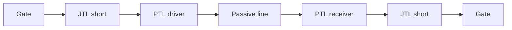
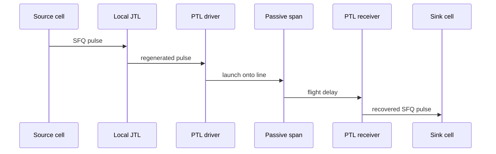

# Hybrid JTL and PTL Routing

**Prereqs:** [JTL Interconnects](jtl-interconnects.md) · [SFQ Static Timing Analysis](sfq-static-timing-analysis.md)  
**Next:** [From SFQ Pulses to Voltage Levels](../bridge/sfq-pulse-to-volt-level.md) · [JTL Interconnects](jtl-interconnects.md)  
**Tracks:** `eda-timing-verification` · `sfq-logic-primitives`

**Learning goals.** After this page you should be able to (1) contrast **JTL** (active) vs **PTL** (passive) interconnects, (2) explain when designers mix them (**hybrid routing**), (3) see how that choice feeds timing, energy, and bias, and (4) keep public tradeoffs separate from private router algorithms.

## Why this matters

Local RSFQ wiring loves [JTLs](jtl-interconnects.md): regenerating pulses is robust. Chip-scale distances make endless JTL chains expensive in junctions, bias, and delay. **Passive transmission lines (PTLs)** — superconducting striplines/microstrips — can carry a pulse over longer spans with far fewer intermediate active junctions, at the cost of **driver** and **receiver** cells and careful matching.

**Hybrid routing** means short/local hops stay on JTLs; longer spans use PTL when the tradeoff wins — and [STA](sfq-static-timing-analysis.md) must understand both delay kinds. Without that vocabulary, floorplans either burn bias on needless regenerations or sprinkle passive lines where fine delay control was needed.

Glossary: [JTL](../glossary.md), [PTL](../glossary.md), [SFQ pulse](../glossary.md), [$\Phi_0$](../glossary.md).

## Intuition — regenerate locally, fly farther when worth it

| | **JTL** | **PTL** |
|--|---------|---------|
| Nature | Active chain of overdamped junctions | Passive superconducting line |
| Pulse integrity | Regenerated each stage | Needs good launch/receive |
| Cost vs length | Grows with number of stages | Flight time + fixed interface cells |
| Typical use | Local abutments, fine delay | Longer trunks / hops |
| Delay feel | Discrete stage sums $n\tau_{\mathrm{JTL}}$ | Ballistic-ish flight + driver/rx |

Hybrid = walk to the gym door (JTL), throw the ball (PTL), then hand it again (JTL).

Public delay cartoon for a hybrid net:

$$t_{\mathrm{net}} \approx t_{\mathrm{JTL,local}} + t_{\mathrm{driver}} + t_{\mathrm{flight}}(\ell) + t_{\mathrm{receiver}} + t_{\mathrm{JTL,far}}$$

where $\ell$ is PTL length. Exact $t_{\mathrm{flight}}(\ell)$ models are process-specific; the **additive structure** is public.

## Analogy — bucket brigade vs gym toss

- **JTL** = bucket brigade hand-to-hand across a room (reliable, many people, pay per handoff).
- **PTL** = tossing a ball across the gym (few people, careful throw and catch, flight time dominates).
- **Hybrid** = walk, throw, walk again.

Bad analogy: “PTL is just CMOS RC interconnect.” Superconducting PTL aims to propagate a **fluxon pulse**, not hold a logic voltage level on a capacitor. Another bad analogy: “PTL means zero Josephson junctions.” Drivers and receivers still use junctions; the **line** is passive.

## Picture — topology and STA view

```text
All-JTL:   gate ─X─X─X─X─X─X─ gate
                (many active stages)

Hybrid:    gate ─X─X─►[driver]══PTL══[rx]─X─ gate
                      long span on passive line
```



```text
STA view:

  t = t_JTL,local + t_driver + t_flight(PTL) + t_receiver + t_JTL,far
```



## Tradeoff table (public)

| | JTL | PTL |
|--|-----|-----|
| Pulse integrity | Regenerated each stage | Needs good drive/receive |
| Long distance | Expensive (many stages) | Often better |
| Delay control | Discrete stage delays | Flight time + discontinuities |
| Bias / JJ count | Grows with length | Concentrated at ends |
| STA view | Sum of stage delays | Wire delay + interface cells |
| Failure modes | Bias/margins per stage | Reflections, mismatch, weak receive |
| Best for | Local, fine pads | Distance-dominated trunks |

## When hybrid wins (decision sketch)

Ask, in order:

1. **Is the hop local abutment or a few stages of intentional delay?** Prefer JTL.
2. **Is the hop long enough that stage count would dominate area/bias/delay?** Consider PTL.
3. **Do you need many fine delay taps along the path?** JTL (or delay cells) — PTL is a coarse flight.
4. **Can you afford driver/receiver cells and matching at both ends?** If not, all-JTL may still win locally.
5. **Will STA and layout tools model the hybrid discontinuity?** If the flow cannot see driver/flight/rx, do not pretend the net is “just wire.”

Public answer shape: **local → JTL; long → consider PTL; hybrid = mix by span.**

## CMOS contrast

| Topic | CMOS | SFQ hybrid interconnect |
|-------|------|-------------------------|
| Short wire | Metal RC | JTL / abutment |
| Long wire | Repeaters / fat wires / SerDes | PTL + driver/receiver |
| Repeater | Restores voltage levels | JTL regenerates $\Phi_0$ pulses |
| Timing model | Elmore / SPEF / SI | Stage sums + ballistic flight abstracts |
| “Buffer tree” | Invert/buffer chain | Splitter + JTL stubs; PTL for long trunks |

CMOS repeaters restore **levels**. JTL stages remake **flux quanta**. PTL is closer to a carefully launched transmission-line hop than to a CMOS RC Elmore wire — still carrying an SFQ token at the digital pins.

## Worked example 1 — 1 mm fantasy path

A path needs $\sim 1\,\text{mm}$ of routing. Ten JTL stages might burn ten regenerations of $\Phi_0$ pulses (energy + bias + area). One PTL hop with a driver/receiver pair might cross the same distance with different delay and fewer intermediate junctions — but adds fixed interface cost and matching work.

Designers (and routers) pick the break-even; **numbers are process- and library-specific** → private explainers. Public answer shape: compare **$n\times$ (JJ + bias + $\tau$)** against **(driver + rx + flight + matching)**.

| Cartoon choice | What you count |
|----------------|----------------|
| All-JTL | $n$ stages × (junctions, bias, $\tau_{\mathrm{JTL}}$) |
| Hybrid | 2 interfaces + $t_{\mathrm{flight}}(\ell)$ + short JTLs at ends |
| Winner | Whichever meets timing with less painful resource total |

## Worked example 2 — Hold pad stays on JTL

You need $+3$ JTL stages of hold delay next to a DFF. Do **not** replace that with a PTL hop “because PTL is fancy.” Fine, local, discrete delay is a JTL job. PTL shines when **distance** dominates, not when you need three regenerations of intentional delay in $100\,\mu\text{m}$.

Checklist:

1. Classify the need: **fine delay** vs **long span**.
2. Fine delay → JTL / delay cell.
3. Long span → estimate hybrid break-even.
4. Re-run [STA](sfq-static-timing-analysis.md) with the chosen model.

## Worked example 3 — STA sees a discontinuity

A hybrid net’s delay is not “$n\times\tau_{\mathrm{JTL}}$” alone. The tool must add:

1. local JTL,
2. driver cell delay,
3. PTL flight time (length / effective speed),
4. receiver delay,
5. far-side JTL.

Missing the interface cells in the timing graph underestimates delay and can flag false optimism on setup. Public lesson: **hybrid nets are multi-segment timing objects.**

## Worked example 4 — Clock trunk candidate

A clock source must reach two distant clusters. Options:

- **Deep splitter + JTL tree everywhere** — many regenerations, skew managed by matching.
- **Splitter locally, PTL trunk between clusters, then local splitter trees** — fewer long active chains; STA must include trunk flight and interfaces.

Neither is universally best. Hybrid clock distribution is common in spirit even when papers use different names. Skew still matters ([splitters](splitter-and-confluence.md)).

## Worked example 5 — Energy intuition without claiming watts

Each JTL stage that fires dissipates switching energy and draws from the bias network. A long all-JTL run fires many stages per pulse transit. A PTL hop moves much of the span into a passive flight; energy concentrates in driver/receiver events plus whatever bias those cells need.

Public caution: do not quote a universal “PTL always saves energy” rule. Activity, length, and cell design decide. The **accounting categories** (per-stage JTL vs interface events) are what you keep straight.

## Common misconceptions

- **“PTL means no Josephson junctions at all.”** Drivers/receivers still use junctions; the **line** is passive.
- **“All-JTL is always simpler/better.”** At length, it can be the expensive choice.
- **“Hybrid routing is only an academic slogan.”** It is a practical distance/energy tradeoff.
- **“PTL pulses are CMOS levels.”** Still SFQ pulse tokens at the digital pins.
- **“Once you have PTL, forget splitters.”** Local fanout still uses splitters; PTL is a span technology.
- **“Router papers belong on this card.”** Algorithms → private explainers.
- **“Flight time is negligible.”** On chip-scale trunks it is first-class in STA.
- **“Any superconducting wire is a PTL interconnect strategy.”** PTL-as-routing implies intentional driver/receiver + matching discipline.

## Bridge to SFQ circuits

- Local cell abutments and path-padding delays → usually JTL ([JTL card](jtl-interconnects.md)).
- Chip-scale data/clock trunks → PTL candidates inside a hybrid flow.
- Timing tools must model both ([STA intuition](sfq-static-timing-analysis.md)).
- Fanout at ends of trunks → [splitters](splitter-and-confluence.md).
- Leaving the pulse domain for I/O → [SFQ pulse to volt level](../bridge/sfq-pulse-to-volt-level.md).
- Track map: [EDA Timing & Verification](../tracks/eda-timing-verification/ROADMAP.md).

## What stays private

Concrete hybrid routers, ColdFlux-style flows, measured break-even lengths, PDK PTL models, and reflection/margin tables → private papers/tools.

## Check yourself

<details>
<summary>1. What does a JTL do that a PTL does not?</summary>

Actively regenerate the SFQ pulse at each stage with Josephson junctions.
</details>

<details>
<summary>2. Why add driver/receiver cells for PTL?</summary>

To launch and recover a clean flux-quantum pulse onto/from the passive line.
</details>

<details>
<summary>3. What is hybrid routing?</summary>

Using JTL for short/local hops and PTL for longer spans when the tradeoff wins.
</details>

<details>
<summary>4. Name two costs that grow with all-JTL length.</summary>

Junction/bias count and accumulated stage delay (also energy).
</details>

<details>
<summary>5. Should a 3-stage hold pad be replaced by PTL by default?</summary>

No — fine local delay is typically a JTL job; PTL is for distance-dominated spans.
</details>

<details>
<summary>6. How does hybrid interconnect change STA?</summary>

Delay graphs must include driver, flight time, and receiver — not only JTL stage sums.
</details>

<details>
<summary>7. Write the public additive delay sketch for a hybrid net.</summary>

$t \approx t_{\mathrm{JTL,local}} + t_{\mathrm{driver}} + t_{\mathrm{flight}} + t_{\mathrm{receiver}} + t_{\mathrm{JTL,far}}$.
</details>

<details>
<summary>8. Does adopting PTL remove the need for splitter trees?</summary>

No — local fanout and clock leaves still use splitters; PTL addresses long spans.
</details>

## Next steps

- Leaving the SFQ pulse domain: [From SFQ Pulses to Voltage Levels](../bridge/sfq-pulse-to-volt-level.md).
- Active interconnects: [JTL Interconnects](jtl-interconnects.md).
- Timing checks: [SFQ Static Timing Analysis](sfq-static-timing-analysis.md).
- Track roadmap: [EDA Timing & Verification](../tracks/eda-timing-verification/ROADMAP.md).
- Plain terms: [Glossary](../glossary.md).
