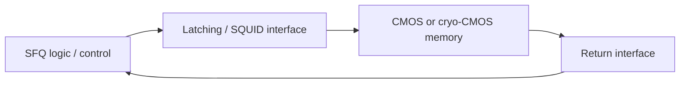
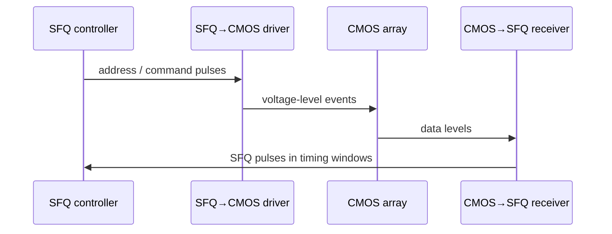

# Josephson–CMOS Hybrid Memory

**Prereqs:** [Vortex Transitional RAM](vortex-transitional-ram.md) · [From SFQ Pulses to Voltage Levels](../bridge/sfq-pulse-to-volt-level.md) · [Four-JL Latching Driver](four-jl-latching-driver.md)  
**Next:** [AQFP Logic](aqfp-logic.md) · [SQUID Stack Driver](squid-stack-driver.md) · [Vortex Transitional RAM](vortex-transitional-ram.md) · [Curriculum Home](../index.md)  
**Tracks:** `cryogenic-memory` · `cryogenic-interfaces-io`

**Learning goals.** After this page you should be able to (1) explain why SFQ systems often pair **Josephson logic / control** with **CMOS (or cryo-CMOS) dense memory**, (2) state what each side contributes in a hybrid, (3) name the interface ideas that glue pulse land to voltage land ([SQUID stacks](squid-stack-driver.md), [4JL / Suzuki latching](four-jl-latching-driver.md)), (4) walk one read/write transaction across the domain boundary, and (5) keep SFQ timing discipline in view even when the bulk bits live in semiconductor arrays.

## Why this matters

Pure SFQ loop memories such as [VT-RAM](vortex-transitional-ram.md) speak the native flux language and sit naturally beside RSFQ datapaths. They struggle to match semiconductor **bit density** at large capacities: every SFQ cell costs junctions, inductors, bias, and cryogenic wiring.

CMOS DRAM / SRAM-style arrays are dense and mature, but they do not natively eat picosecond $\Phi_0$ pulses. A **Josephson–CMOS hybrid memory** keeps dense storage in semiconductor technology (often cooled) while SFQ provides fast digital control, address sequencing, near-memory logic, or a superconducting processor fabric. Interface circuits translate between the two encodings.

This is a **systems architecture** concept card: division of labor + interface checklist. Array sizes, measured latencies, and BER from specific papers stay private.

If you skip this card, the I/O megaphones feel like orphan gadgets. After this card, [SQUID stacks](squid-stack-driver.md) and [4JL / Suzuki](four-jl-latching-driver.md) look like necessary embassy staff between two countries that do not share a language.

Glossary: [Glossary](../glossary.md) — **VT-RAM**, **SQUID stack**, **4JL / Suzuki stack**, **SFQ pulse**, cryo interface intuition from the I/O bridge.

## Intuition — pit crew and warehouse

SFQ is a Formula 1 pit crew: extremely fast, specialized, expensive per “slot.”  
CMOS memory is a warehouse: huge capacity, slower doors.  

Hybrid design: the pit crew runs the gates and conveyors; the warehouse holds the inventory. You need loud radios — I/O drivers — between the track and the warehouse office.

More formally:

| Side | Strength | Typical hybrid role |
|------|----------|---------------------|
| SFQ / Josephson | Ultrafast pulse logic, cryogenic fit | Control, datapath, near-memory logic, address sequencing |
| CMOS / cryo-CMOS | Density, mature arrays | Bulk bit storage |
| Interface | Amplify / latch / isolate / return | Translate pulse ↔ volt domains |

The hybrid does **not** erase the [CMOS vs SFQ](cmos-vs-sfq.md) encoding difference. It **manages** that difference at a deliberate boundary.

### What “hybrid” does *not* mean

| False reading | Correction |
|---------------|------------|
| SFQ and CMOS mixed randomly in every cell | Usually a **domain split**: Josephson control + semiconductor array + interface |
| Cryo-CMOS is RSFQ | Cold FETs ≠ Josephson pulse logic |
| Bulk bits become flux quanta automatically | Bits stay CMOS levels until a return interface regenerates SFQ events |
| Timing becomes “just CMOS STA” | SFQ control/return paths keep pulse timing; interface adds its own latency |

## Analogy — two languages, one embassy

Imagine two offices that must share a filing cabinet. One office speaks only in snap-fingers codes (SFQ pulses). The other speaks only in posted notices on a bulletin board (CMOS voltage levels). The embassy between them employs translators: megaphones that turn snaps into notices ([pulse → volt-level](../bridge/sfq-pulse-to-volt-level.md)) and receivers that turn notices back into snaps.

VT-RAM is “both offices use snap-fingers codes and keep files in superconducting loops.” Hybrid memory is “warehouse files in CMOS; embassy does the translation.”

A second analogy: an airport with two terminals and a shuttle. Terminal A is SFQ; Terminal B is CMOS. The shuttle is the interface. Delaying the shuttle delays the whole journey even if both terminals are excellent.

## Picture — control path and return path

```text
  SFQ processor / controller
           │
           │  SFQ pulses (address, command, data-out intent)
           ▼
     interface drivers
     (SQUID stack and/or 4JL / Suzuki latching)
           │
           ▼  larger / longer voltage events
     CMOS or cryo-CMOS memory array
           │
           ▼  data / status levels
     return interface
           │
           ▼  SFQ pulses again
  SFQ processor / controller
```





```text
Latency budget cartoon (qualitative):

  t_total ≈ t_SFQ_ctrl + t_TX + t_CMOS_access + t_RX + t_SFQ_return
                 ↑ pulse land        ↑ embassy      ↑ volt land
```

## Why not all-SFQ memory? Why not all-CMOS compute?

**All-SFQ memory** keeps one encoding and one cryogenic digital culture. Cost: junction/inductor budget and wiring explode as capacity grows; VT-style cells are wonderful locally and expensive globally.

**All-CMOS compute at room temp** wins density and ecosystem, but then you are not building an SFQ processor. Cryo-CMOS can sit near SFQ at low temperature for memory and support electronics without being Josephson logic.

**Hybrid** is the compromise many research systems explore: SFQ where pulse-speed cryogenic digital shines; CMOS where bits-per-area wins; interfaces where honesty about encodings is mandatory.

| Architecture | Encoding unity | Density | Interface tax |
|--------------|----------------|---------|---------------|
| All VT / SFQ memory | High | Hard at large capacity | Low (same island) |
| Hybrid Josephson–CMOS | Split on purpose | CMOS wins bulk | High (must design) |
| All CMOS (no SFQ CPU) | High (voltage) | Excellent | N/A for SFQ story |

### Thermal packaging (public caution)

Josephson logic needs cryogenic temperatures appropriate to the superconductor. CMOS may be:

- **cryo-CMOS** — cooled near the SFQ island for shorter, colder links, or
- warmer / room-temperature — connected through careful thermal stages and cables.

Public curriculum insists packaging is part of the hybrid problem. Exact Kelvin stages and heat-load tables stay private / system-specific.

## Worked example 1 — Scratchpad capacity cartoon

An SFQ CPU wants a megabit-class scratchpad.

**All VT-RAM estimate (teaching cartoon).** Suppose a VT cell + share of decode costs on the order of tens of Josephson junctions (order-of-magnitude, not a datasheet). Then $10^6$ bits imply tens of millions of junctions **before** the processor itself — a daunting integration and bias story for many processes.

**Hybrid estimate (teaching cartoon).** SFQ implements a fast controller and a modest on-chip SFQ register file / VT cache. Bulk megabit storage lives in a cold CMOS array. SFQ emits address/command pulses → [latching](four-jl-latching-driver.md) or [SQUID stack](squid-stack-driver.md) creates CMOS-readable levels → array stores bits → return path feeds SFQ again.

Exact hierarchies, bank counts, and latencies → private explainers. Public lesson: **hybrids buy capacity by paying an interface tax**.

| Item | All-VT cartoon | Hybrid cartoon |
|------|----------------|----------------|
| Bulk bit storage | SFQ loops | CMOS / cryo-CMOS array |
| Control | SFQ | SFQ |
| Interface megaphones | Mostly internal | Required at boundary |
| Density pressure | Severe at Mbit+ | Relieved for bulk bits |
| New failure modes | Array disturb / DRO | Amplitude, width, BER, sync |

## Worked example 2 — One read transaction, step by step

1. SFQ controller forms an address as a timed pulse pattern (gate-level pipelined like any RSFQ machine).
2. Drivers convert selected pulses into voltage events CMOS wordline / decoder circuits accept.
3. CMOS array performs a normal (cryo) semiconductor read.
4. Data levels return through a receiver that regenerates SFQ pulses into legal timing windows.
5. SFQ side treats those pulses as ordinary datapath events — splitters, DFFs, and STA still apply.

Failure modes to keep in mind (qualitative):

| Failure | Plain meaning |
|---------|----------------|
| Amplitude too small | CMOS never sees the command — need more stack / gain |
| Event too short | Sampler misses — need stretch / latch |
| Return timing skew | Pulses miss SFQ windows — BER / sync failure |
| Thermal / noise | Interface BER degrades — isolation and margins matter |
| Stuck latch (no reset) | Driver cannot issue the next command cleanly |

## Worked example 3 — Where a small VT cache still belongs

Hybrid does **not** mean “delete all SFQ memory.”

Sketch a hierarchy:

| Level | Likely technology (public intuition) | Why |
|-------|--------------------------------------|-----|
| Pipeline registers / tiny scratch | SFQ DFF / small VT | Same encoding, lowest latency |
| Modest on-chip SFQ cache | VT-style / loop arrays | Still native; capacity limited |
| Bulk working set | CMOS / cryo-CMOS | Density |
| Room-temp bulk (if any) | CMOS + long cable I/O | Packaging / thermal stages |

The hybrid story is often **hierarchical**, not a single blunt cut. Papers choose different cut points; the curriculum only needs the pattern.

## Worked example 4 — Latency budget with cartoons

Suppose (teaching numbers only, not measurements):

| Segment | Cartoon latency |
|---------|-----------------|
| SFQ address / command sequencing | $t_{\mathrm{SFQ}} \sim 0.2\,\text{ns}$ |
| SFQ→CMOS driver (TX) | $t_{\mathrm{TX}} \sim 0.3\,\text{ns}$ |
| CMOS array access | $t_{\mathrm{CMOS}} \sim 2\,\text{ns}$ |
| CMOS→SFQ return (RX) | $t_{\mathrm{RX}} \sim 0.4\,\text{ns}$ |
| SFQ return path / capture | $t_{\mathrm{ret}} \sim 0.2\,\text{ns}$ |

Then

\[
t_{\mathrm{total}} \approx 0.2+0.3+2.0+0.4+0.2 = 3.1\,\text{ns}.
\]

Here CMOS access dominates. In another system the interface + SFQ sequencing might dominate. Public habit: **budget both worlds**; never assume “CMOS access is everything” or “interface is free.”

## Division of labor (public table)

| Concern | Prefer SFQ side | Prefer CMOS side | Prefer interface |
|---------|-----------------|------------------|------------------|
| Picosecond pulse logic | ✓ | | |
| Bulk bit density | | ✓ | |
| Native $\Phi_0$ encoding | ✓ | | |
| Mature DRAM/SRAM IP | | ✓ | |
| Pulse ↔ volt translation | | | ✓ |
| Near-memory SFQ ALU | ✓ | | |
| Long cable to room temp | | maybe | ✓ (hard) |
| Tiny ultrafast scratchpad | ✓ | | |

## CMOS contrast (hybrid-specific)

| Pure CMOS SoC habit | Josephson–CMOS hybrid habit |
|---------------------|-----------------------------|
| One digital encoding (voltage) across CPU and memory | **Two encodings** meeting at a designed boundary |
| On-chip bus is voltage levels | SFQ side is pulses/loops; CMOS side is levels |
| Level shifters between voltage domains | Josephson megaphones + semiconductor receivers |
| Memory controller in same FET technology | Memory controller may be **SFQ pulse logic** |
| Timing closure in one STA world | **Two timing worlds** plus interface latency |
| “Buffer the bus” | Choose [SQUID stack](squid-stack-driver.md) vs [latching](four-jl-latching-driver.md) deliberately |

The hybrid is not “CMOS with a superconducting spice.” It is a **multi-domain machine**. If you forget the interface, you have two chips that cannot talk. If you forget SFQ timing on the control side, you have a fast warehouse with a confused pit crew.

## Common misconceptions

1. **“Hybrid means SFQ is obsolete for memory.”**  
   VT-RAM and SFQ registers remain natural for small, ultrafast, encoding-matched storage. Hybrids target **bulk capacity**.

2. **“Cryo-CMOS is the same as RSFQ.”**  
   Cryo-CMOS is semiconductor electronics at low temperature. RSFQ is Josephson pulse logic. Related thermally; different devices and encodings.

3. **“If CMOS holds the bits, SFQ path balancing no longer matters.”**  
   The SFQ control and return paths are still pulse-logic pipelines. Interface latency adds to the timing budget; it does not delete it.

4. **“Any amplifier will do.”**  
   You need the right combination of amplitude, width, impedance, and reset — hence explicit study of [SQUID stacks](squid-stack-driver.md) and [4JL / Suzuki](four-jl-latching-driver.md).

5. **“Hybrid memory removes cryogenics.”**  
   Josephson logic still needs cryogenic temperatures appropriate to the superconductor. CMOS may be cold too (cryo-CMOS) or connected through careful thermal stages — system packaging is part of the problem.

6. **“Paper X’s array size is the universal hybrid size.”**  
   Capacities and banks are paper-specific. Learn the architecture pattern here; read numbers in private explainers.

7. **“Return path is just the forward path run backward.”**  
   CMOS→SFQ regeneration has its own sampling, threshold, and timing-window problems. Design both directions.

8. **“Interface latency is free compared with CMOS access.”**  
   Sometimes CMOS access dominates; sometimes interface + SFQ sequencing dominates. Budget both ([pulse → volt-level](../bridge/sfq-pulse-to-volt-level.md)).

## Bridge to SFQ circuits

- Completes the memory-track entry after [VT-RAM](vortex-transitional-ram.md).
- Pulls in I/O cards: [pulse → volt](../bridge/sfq-pulse-to-volt-level.md), [SQUID stack](squid-stack-driver.md), [4JL latching](four-jl-latching-driver.md).
- Control logic remains gate-level pipelined ([gate-level pipelining](../bridge/gate-level-pipelining.md)); interconnect still uses [JTL](jtl-interconnects.md) / [PTL](hybrid-jtl-ptl-routing.md) ideas on the SFQ side.
- Thermal noise, BER curves, and impedance engineering stay private.
- Tracks: `cryogenic-memory` and `cryogenic-interfaces-io`.

## Check yourself

<details>
<summary>1. Why hybridize instead of all-SFQ memory?</summary>

Semiconductor arrays usually win on bit density / capacity; SFQ wins on ultrafast cryogenic digital control and native flux encoding for the processor side.
</details>

<details>
<summary>2. What must exist between SFQ and CMOS?</summary>

Interface circuits that amplify/stretch SFQ events into voltage levels CMOS can sense, plus a return path that regenerates SFQ pulses (with timing and BER care).
</details>

<details>
<summary>3. Does hybrid memory remove SFQ timing discipline?</summary>

No. The SFQ control and return paths are still pulse logic with clocks, balancing, and STA concerns.
</details>

<details>
<summary>4. Name two public megaphone families used on the SFQ→CMOS path.</summary>

SQUID stack drivers and 4JL / Suzuki latching drivers.
</details>

<details>
<summary>5. In the pit-crew / warehouse analogy, what is the embassy’s job?</summary>

Translate between SFQ pulse language and CMOS voltage-level language (and back) so control and data can cross domains.
</details>

<details>
<summary>6. Is cryo-CMOS the same thing as a Josephson junction logic family?</summary>

No. Cryo-CMOS is cold semiconductor electronics; Josephson SFQ logic uses junctions and $\Phi_0$ pulses / loops.
</details>

<details>
<summary>7. Give one reason a tiny VT / DFF scratchpad might remain even in a hybrid system.</summary>

Same-encoding, ultrafast, low-latency storage for pipeline state or a small working set — hybrids usually target *bulk* capacity, not every last bit.
</details>

<details>
<summary>8. Name a failure mode unique to the interface (not to pure VT cells alone).</summary>

Any of: amplitude too small for CMOS, event too short to sample, stuck latch without reset, return pulses missing SFQ timing windows / BER collapse.
</details>

<details>
<summary>9. Why budget $t_{\mathrm{TX}}$ and $t_{\mathrm{RX}}$ separately from CMOS access?</summary>

Because interface latency can rival or exceed array access in some systems; treating the embassy as free underestimates total delay.
</details>

<details>
<summary>10. Does “hybrid” mean SFQ and CMOS transistors share every memory cell?</summary>

No. Public hybrid intuition is usually a **domain split**: Josephson control + semiconductor bulk array + interface — not random mixing inside each bit cell.
</details>

## Next steps

- Track navigation: [Curriculum Home](../index.md) · [Cryogenic Memory roadmap](../tracks/cryogenic-memory/ROADMAP.md) · [Cryogenic I/O roadmap](../tracks/cryogenic-interfaces-io/ROADMAP.md).
- SFQ-native memory: [Vortex Transitional RAM](vortex-transitional-ram.md).
- I/O bridge: [From SFQ Pulses to Voltage Levels](../bridge/sfq-pulse-to-volt-level.md).
- Drivers: [Four-JL Latching Driver](four-jl-latching-driver.md) · [SQUID Stack Driver](squid-stack-driver.md).
- Encoding cheat sheet: [CMOS vs SFQ](cmos-vs-sfq.md).
- Core walk neighbor: [AQFP Logic](aqfp-logic.md).
- Plain terms: [Glossary](../glossary.md).
