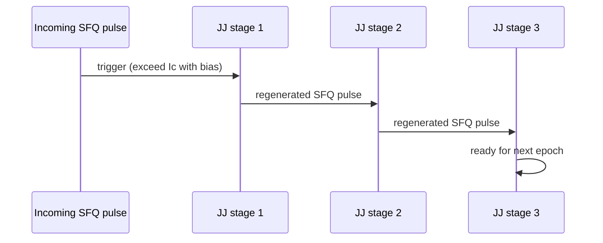
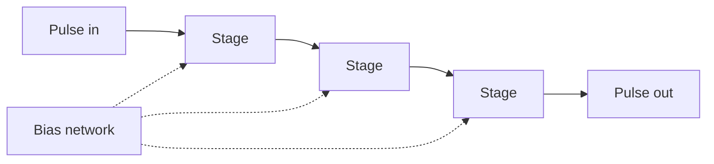

# Josephson Transmission Line (JTL)

**Prereqs:** [RSFQ Logic Overview](rsfq-logic.md)  
**Next:** [Splitter and Confluence](splitter-and-confluence.md) · [Hybrid JTL-PTL Routing](hybrid-jtl-ptl-routing.md)  
**Tracks:** `sfq-logic-primitives` · `eda-timing-verification`

**Learning goals.** After this page you should be able to (1) explain how a JTL forwards and **regenerates** SFQ pulses stage by stage, (2) say why JTLs are both "wires" and **delay elements**, (3) estimate qualitative cost (junctions, bias, delay) when inserting stages for timing, (4) distinguish fine JTL delay from missing-epoch [DFF](rsfq-dff-and-retiming.md) pads, and (5) know when designers switch to passive PTL hops instead ([Hybrid JTL-PTL](hybrid-jtl-ptl-routing.md)).

## Why this matters

In CMOS, a short metal wire is mostly passive RC. In RSFQ, the default local interconnect is often an active **Josephson Transmission Line (JTL)**: a chain of overdamped junctions and inductors that **relaunch** a fresh $\Phi_0$ pulse at each stage. Without that regeneration, picosecond fluxon pulses would not survive long, tidy paths across a chip.

JTLs also become the physical knob for [path balancing](path-balancing-overhead.md) and hold-fix delays: "add three JTL stages" is a common design sentence. Understanding JTLs early prevents treating SFQ interconnect as free metal.

Glossary: [JTL](../glossary.md), [SFQ pulse](../glossary.md), [$\Phi_0$](../glossary.md), [Overdamped](../glossary.md), [Bias current](../glossary.md).

## Intuition --- regenerate, do not just conduct

An incoming SFQ pulse raises the current through the next biased junction. That junction switches (one $2\pi$ phase slip), launching a **new** pulse with area $\approx\Phi_0$ into the following inductor/junction stage. The original pulse is not a fragile voltage traveling forever on lossy metal; each stage **remakes** the token.

Public cartoon of one stage:

- bias current holds the junction near threshold,
- trigger from the previous stage pushes it over $I_c$,
- overdamped dynamics emit a short pulse and return to $V\approx 0$,
- the next stage is ready for the next epoch's pulse.

Ideal stage conservation slogan:

\[
\int V_{\mathrm{out}}(t)\,dt \approx \Phi_0 \quad\text{(successful regeneration)}.
\]

Three jobs one JTL chain can play:

1. **Transport** --- move a pulse from cell A to nearby cell B with integrity.
2. **Delay** --- add an integer number of stage delays for hold matching or branch equalization.
3. **Stub** --- short active segments that clean pulses at cell pins or clock leaves.

## Analogy --- bucket brigade

Each person dumps a **full bucket** into the next person's empty bucket. The "fullness" (flux quantum) is preserved by construction; you pay a little energy and time at each handoff.

Bad analogy to avoid: a garden hose with continuous water pressure. RSFQ JTLs move **discrete tokens**, not a steady voltage rail. Another bad analogy: "superconducting wire alone is a JTL." Passive metal can be superconducting; a **JTL** specifically includes active junctions. A third bad analogy: "JTL delay invents missing clock epochs." Fine delay ≠ [DFF](rsfq-dff-and-retiming.md) epoch pads.

## Picture --- topology and handoff

```text
  in ─ X ─ L ─ X ─ L ─ X ─ out
       JJ     JJ     JJ

  pulse → triggers → new Φ0 pulse → ...
```



```text
Waveform sketch along a 3-stage JTL:

 time →
 in:   ★
 JJ1:     ★
 JJ2:        ★
 JJ3:           ★
        (each ★ has ∫V dt ≈ Φ0)
```



## JTL as wire vs JTL as delay

| Use | What you want | What you pay |
|-----|---------------|--------------|
| Local interconnect | Move pulse from cell A to nearby cell B with integrity | Junctions + bias per stage |
| Timing / hold pad | Add discrete delay so a pulse arrives later | Same, plus extra latency in picoseconds / fractions of a clock |
| Clock distribution stub | Short active segments inside a larger tree | Often mixed with splitters |
| Path matching | Equalize branch delays | Stage count on short branches |
| Long haul (often wrong tool) | Cross millimeters with many regenerations | Usually reconsider [PTL hybrid](hybrid-jtl-ptl-routing.md) |

There is no free "zero-JJ wire" that magically preserves SFQ pulses over arbitrary distance inside the active-logic mindset. Long distance is a different tool: **PTL** with drivers/receivers.

## Interactive lab

Try this in place. Prefer full-screen? Open the [lab page](../labs/jtl-interconnects.html).

1. Leave **active JTL** (myth mode off), set a few stages, and **Launch pulse**. Watch each JJ remake ≈ Φ₀ until OUT.
2. Enable **Myth mode: passive wire** and launch again. Without regeneration the token dies --- interconnect is not free metal.

<iframe
  src="../../labs/jtl-interconnects.html"
  title="JTL hop lab"
  style="width:100%;height:780px;border:1px solid rgba(0,0,0,0.12);border-radius:0.35rem;background:#fff;"
  loading="lazy"
></iframe>

## Qualitative delay model (field-fundamental)

If each JTL stage contributes a characteristic delay $\tau_{\mathrm{JTL}}$ (library- and bias-dependent --- do not memorize a universal number), then $n$ stages contribute roughly

\[
t_{\mathrm{delay}} \approx n\,\tau_{\mathrm{JTL}}
\]

plus any packaging of the pulse into adjacent cells. Designers reason in **integer stage counts** first, then refine with characterized tables in STA ([SFQ STA](sfq-static-timing-analysis.md)).

Public rule of thumb: **more stages ⇒ more delay, more junctions, more bias current** --- never "free wire delay."

Resource sketch for $n$ stages:

| Resource | Scales roughly as |
|----------|-------------------|
| Junctions / area | $n$ (order-of-magnitude) |
| Bias taps | $n$ |
| Delay | $n\tau_{\mathrm{JTL}}$ |
| Switching events per transit | $n$ firings |
| STA graph edges | $n$ abstract delays (or one characterized cell of length $n$) |

## CMOS contrast

| Topic | CMOS metal / buffer | RSFQ JTL |
|-------|---------------------|----------|
| What travels | Voltage edge / level | Regenerated $\Phi_0$ pulse |
| Attenuation fix | Repeaters / buffers restoring levels | Every stage is already a regenerator |
| Delay knob | RC, buffer chains, intentional delay cells | Add JTL stages (or dedicated delay cells) |
| Energy story | CV²-ish switching on nodes | Switching energy per junction firing + bias network |
| Long haul | Fat wires, repeaters, SerDes | Often **PTL** hybrid, not endless JTLs |
| "Wire is free" myth | Already false at advanced nodes | Even more false --- active stages |

## Worked example 1 --- Spacing a short path

Suppose a concurrent-flow pipeline has a hold risk: data arrives too early at stage 2. The library's hold fix is "insert delay on the data pin."

If $\tau_{\mathrm{JTL}} \sim 5\,\text{ps}$ (illustrative only) and you need about $15\,\text{ps}$ of extra delay, insert roughly **3** JTL stages on that short path.

Checklist:

1. Confirm the problem is **early** arrival (hold-like), not late (setup-like).
2. Insert JTLs (or a characterized delay cell) on the short path only.
3. Re-check that you did not push another path into setup failure.
4. Account for the extra bias taps in the power budget.
5. Confirm you did not need a full **epoch** of [DFF](rsfq-dff-and-retiming.md) padding instead.

Exact picoseconds are library-specific; the **reasoning pattern** is public.

## Worked example 2 --- Counting cost for a 1 mm fantasy path

Imagine (purely pedagogical) that a process needs one JTL stage every $100\,\mu\text{m}$ of active routing to keep pulses healthy. A $1\,\text{mm}$ all-JTL run would suggest on the order of **10** regenerations.

Each regeneration:

- fires junctions,
- draws from the bias network,
- adds delay to STA.

A hybrid designer asks: "Would one PTL hop with a driver/receiver pair cross $1\,\text{mm}$ with fewer intermediate junctions?" That tradeoff is the subject of [Hybrid JTL-PTL Routing](hybrid-jtl-ptl-routing.md). Public answer shape: **local → JTL; long → consider PTL**.

## Worked example 3 --- JTL in a clock stub

A clock splitter tree feeds a DFF. Between the last splitter and the DFF clock pin, designers often leave a short JTL or matched stub so:

- the pulse shape is clean,
- branch delays can be tuned,
- layout abutment is easier.

Clock skew between branches is then a sum of splitter delays **plus** these stubs --- first-class timing, not decoration ([splitters](splitter-and-confluence.md), [STA](sfq-static-timing-analysis.md)).

## Worked example 4 --- Do not use PTL for a 3-stage hold pad

You need $+3$ intentional regenerations next to a DFF for hold. Replacing that with a "fancy" PTL hop confuses **fine delay** with **long span**. Keep JTLs for local discrete delay; reserve PTL for distance-dominated trunks ([hybrid card](hybrid-jtl-ptl-routing.md)).

## Worked example 5 --- Epoch pad vs JTL trim

A reconvergent merge is short by **two full epochs** → prefer [DFF](rsfq-dff-and-retiming.md) pads. A path is only a few picoseconds early inside an otherwise matched epoch → prefer JTL trim. Mixing these jobs is normal; swapping them is a common beginner mistake ([path balancing](path-balancing-overhead.md)).

| Symptom | Prefer |
|---------|--------|
| Missing whole epochs at a merge | DFF / clocked pads |
| Hold race of a few $\tau_{\mathrm{JTL}}$ | JTL stages |
| Millimeter trunk | Consider PTL hybrid |

## Worked example 6 --- Bias and margin intuition

If bias is too low, a stage may fail to switch when the trigger arrives --- the pulse dies. If bias is too high, margins against unwanted switching shrink. Public habit: treat JTL health as **bias + layout + stage count**, not as "superconducting metal always works." Quantitative $I_b$ recipes stay private.

## Common misconceptions

- **"JTL is just superconducting wire."** Superconducting metal can be passive; a **JTL** specifically includes active junctions that regenerate pulses.
- **"Adding JTLs is free timing margin."** You spend area, bias, and energy; you may also change race paths elsewhere.
- **"Longer JTL is always better than PTL."** For long spans, endless JTLs are often the expensive choice.
- **"Pulse amplitude drifts like analog RC."** Design intent is discrete $\Phi_0$ regeneration, not analog attenuation of a level.
- **"One junction = one JTL."** A usable line is a **chain** of stages; cell abstracts may hide multiple junctions per "stage."
- **"JTL delay fixes missing epochs."** Fine delay ≠ inserting clocked storage stages.
- **"Bias-free JTL exists because $R=0$."** Stages still need bias near threshold to switch cleanly.
- **"STA can ignore JTLs as zero-delay metal."** Stage delays are first-class in the timing graph.

## Bridge to SFQ circuits

- Fanout cannot be done by "wiring two loads to one JJ" casually --- use [splitters](splitter-and-confluence.md).
- Storage and retiming: [DFF](rsfq-dff-and-retiming.md).
- Timing tools sum JTL delays into windows: [STA](sfq-static-timing-analysis.md).
- Chip-scale trunks: [Hybrid JTL-PTL](hybrid-jtl-ptl-routing.md).
- Hold geography: [Concurrent / counter-flow](concurrent-and-counter-flow-clocking.md).
- Padding cost: [Path balancing](path-balancing-overhead.md).

## What stays private

Process Design Kit delay tables, exact $\tau_{\mathrm{JTL}}(I_b)$, layout rules for inductor geometry, and named router algorithms stay in private explainers / tool docs.

## Check yourself

<details markdown="1">
<summary markdown="span">1. Does a JTL only passively conduct voltage like a resistor?</summary>

No --- overdamped junctions regenerate SFQ pulses stage by stage.
</details>

<details markdown="1">
<summary markdown="span">2. Why do designers insert JTLs even when Boolean logic is already finished?</summary>

To add controlled delay for timing (hold fixes, path matching) while preserving pulse integrity.
</details>

<details markdown="1">
<summary markdown="span">3. What quantity does each successful stage approximately preserve?</summary>

A flux-quantum-sized pulse with $\int V\,dt \approx \Phi_0$.
</details>

<details markdown="1">
<summary markdown="span">4. Name three resources that grow when you add JTL stages.</summary>

Junction count / area, bias current, and path delay (latency).
</details>

<details markdown="1">
<summary markdown="span">5. When might you prefer a PTL segment over a long JTL chain?</summary>

For longer distances where driver/receiver + passive flight time beats many active regenerations --- see hybrid routing.
</details>

<details markdown="1">
<summary markdown="span">6. How does JTL delay enter STA thinking?</summary>

As a sum of characterized stage delays (plus interfaces) checked against setup/hold-like windows at sink cells.
</details>

<details markdown="1">
<summary markdown="span">7. If $\tau_{\mathrm{JTL}}\approx 4\,\text{ps}$ (illustrative) and you need $\approx 20\,\text{ps}$ hold delay, about how many stages?</summary>

About $5$ stages ($20/4$).
</details>

<details markdown="1">
<summary markdown="span">8. Why is "superconducting metal wire" not automatically a JTL?</summary>

A JTL is an **active** regenerating chain of junctions/inductors; passive superconducting line is a different object (PTL territory when used as long interconnect).
</details>

<details markdown="1">
<summary markdown="span">9. Short by two epochs at a merge --- JTLs or DFFs first?</summary>

Prefer DFF / clocked epoch pads; JTLs alone do not invent missing epochs.
</details>

<details markdown="1">
<summary markdown="span">10. Name two non-transport jobs JTLs often play.</summary>

Fine delay / hold pads, and clock or pin stubs for matching and clean pulse shape.
</details>

## Next steps

- Fanout and merge plumbing: [Splitter and Confluence](splitter-and-confluence.md).
- Long-distance passive lines: [Hybrid JTL-PTL Routing](hybrid-jtl-ptl-routing.md).
- Timing windows: [SFQ Static Timing Analysis](sfq-static-timing-analysis.md).
- Plain terms: [Glossary](../glossary.md).
