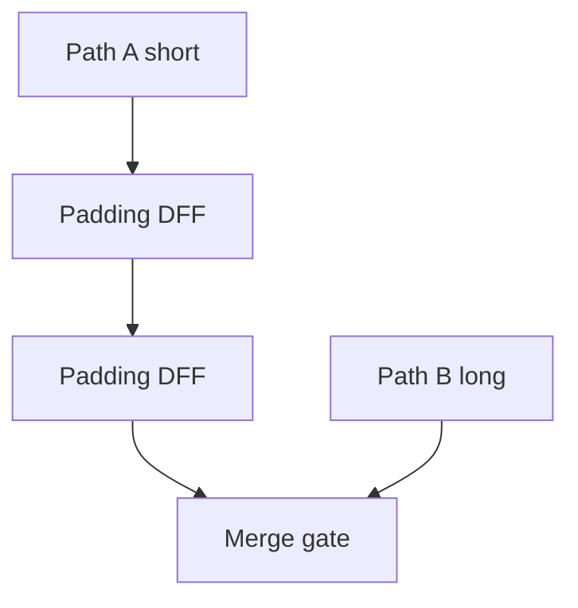
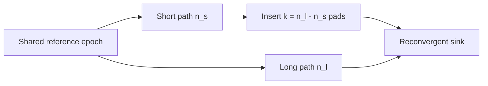

# Path Balancing Overhead

**Prereqs:** [Gate-Level Pipelining](../bridge/gate-level-pipelining.md) · [Concurrent-Flow and Counter-Flow Clocking](concurrent-and-counter-flow-clocking.md) · [RSFQ DFF and Retiming](rsfq-dff-and-retiming.md)  
**Next:** [SFQ Static Timing Analysis](sfq-static-timing-analysis.md)  
**Tracks:** `eda-timing-verification` · `sfq-logic-primitives`

**Learning goals.** After this page you should be able to (1) explain why reconvergent SFQ paths must be **balanced**, (2) define **overhead** as extra DFFs/JTLs that synchronize rather than compute new Boolean function, (3) estimate pad count from stage imbalance, and (4) list chip costs (area, bias, latency, design effort) without quoting paper-specific percentages.

## Why this matters

Because RSFQ is [gate-level pipelined](../bridge/gate-level-pipelining.md), a pulse’s **meaning** depends on which clock epoch it belongs to. When two paths meet at a gate, both inputs must present pulses from the **same** epoch. If one path is shorter, designers insert **padding** — usually DFFs or delay JTLs — until stage counts (or delays) match.

That padding is **path-balancing overhead**: cells that do not compute new Boolean function; they only wait. Large SFQ blocks can spend a startling fraction of junctions on waiting. EDA research obsesses over this tax for good reason — it is not a buzzword; it follows from pulse-window encoding ([Pulse to Logic State](../bridge/pulse-to-logic-state.md)).

Glossary: [Path balancing](../glossary.md), [DFF](../glossary.md), [Gate-level pipelining](../glossary.md), [Clock window](../glossary.md).

## Intuition — same beat at the merge

Epoch alignment is not optional decoration:

- Path depth mismatch ⇒ inputs from different “beats” of the song,
- the merge gate cannot interpret mixed epochs as one Boolean operation,
- insert waits on the fast path until the slow path catches up in stage count.

Clock style ([concurrent / counter-flow](concurrent-and-counter-flow-clocking.md)) changes where hold/setup hurts; it does **not** remove reconvergent balancing.

Public pad rule (stage-count cartoon):

$$k = n_{\mathrm{long}} - n_{\mathrm{short}}$$

padding stages on the short path into a shared sink, when both counts are measured from a common reference epoch.

## Analogy — café meetup

Two friends agree to meet at a café after walking different routes. The friend with the short route must **sit and wait** (padding stages) so they arrive in the same time slot. The chairs they occupy are overhead — useful for synchronization, not for sightseeing.

Bad analogy: “Just walk slower without sitting” as if continuous CMOS cloud delay were free. In RSFQ you usually insert **clocked waits** (DFFs) or discrete JTL delays with timing intent — not an unsynchronized fog of gates.

## Picture

```text
Unbalanced:                         Balanced:

  A --1 stage--------┐                A --1--[DFF]--[DFF]--┐
                     +→ GATE                              +→ GATE
  B --3 stages-------┘                B --3 stages---------┘

  Short path needs 2 padding DFFs → overhead
```



```text
Cost stack cartoon:

  Boolean logic JJ
  + padding DFFs / JTLs     ← overhead
  + clock splitters for pads
  + bias for all of the above
```



## Public rule of thumb

If path $B$ has $n_B$ clocked stages and path $A$ has $n_A$ stages into the same sink, with $n_B > n_A$, then the short path needs about

$$k = n_B - n_A$$

padding stages (DFFs or equivalent epoch delays). Per reconvergent sink, sum pads over short paths. Exact cell choice (DFF vs JTL-only delay) is library- and timing-context-dependent.

**Count clocked stages / epochs**, not only Boolean gate symbols on a CMOS-style schematic.

## What overhead costs

| Resource | Why it grows |
|----------|----------------|
| Junctions / area | Extra DFFs, JTLs, splitters for their clocks |
| Bias current | More cells to feed ([DC bias delivery](../bridge/dc-bias-current-delivery.md)) |
| Latency (epochs) | Deep pipelines get deeper when padded |
| Energy | More switched cells per useful Boolean op |
| Design effort | Every reconvergence is a balancing check |
| CAD complexity | Retiming / balancing algorithms become central |

## DFF pads vs JTL fine delay

| Need | Prefer | Why |
|------|--------|-----|
| Fix a few picoseconds of hold within an epoch | JTL stages | Fine delay without necessarily adding a full epoch |
| Align whole epochs at reconvergence | DFF pads | Moves tokens into the correct window by construction |
| Both | Mix | Common in real chips |

Choosing only JTLs when you are a full epoch short will not invent a missing clocked stage — you still need storage retiming for epoch match. See [JTL](jtl-interconnects.md) and [DFF](rsfq-dff-and-retiming.md).

## CMOS contrast

| Topic | CMOS | RSFQ / SFQ pulse logic |
|-------|------|-------------------------|
| Multi-cycle combinational path | Common | Rare as a deep unsynchronized cloud |
| Register insertion | Architectural / retiming choice | Often **mandatory** for epoch match |
| “Overhead” language | Pipeline regs, FIFO slack | Padding DFFs/JTLs at reconvergence |
| Timing closure | Setup/hold at FFs | Windows at many clocked cells + balance |
| Depth metric | Logic levels between FFs | Clocked stage / epoch counts |

## Worked example 1 — XOR inputs 1 vs 4

Left input reaches an XOR after **1** clocked stage; right after **4**. Insert **3** DFFs on the left (same clocking scheme) so both arrive in epoch 4.

Checklist:

1. Count stages on each path from a shared reference epoch.
2. Insert $k=3$ pads on the short path.
3. Connect clocks via [splitter](splitter-and-confluence.md) taps.
4. Re-run local timing / STA thinking for the new cells.
5. Budget bias for $+3$ DFFs.

Junction counts are library-specific (private); the **$k = \Delta$ stages** rule is public.

## Worked example 2 — Two merges in series

Path depths into gate $G_1$: $2$ vs $5$ ⇒ $3$ pads on the short side.  
Outputs of $G_1$ then meet another path of depth $8$ at $G_2$. Recount depths **including** the pads you already inserted; balancing is incremental and global, not a one-local-fix mindset.

Public warning: fixing one merge can change relative depths downstream — STA/balancing passes iterate.

```text
After balancing G1:

  short→G1 now matches long→G1
  that output’s depth into G2 must be recounted vs the other G2 input
```

## Worked example 3 — JTL delay vs DFF pad

A hold-like race needs $\sim 12\,\text{ps}$ (illustrative) of delay on a short path; $\tau_{\mathrm{JTL}}\sim 4\,\text{ps}$ (illustrative) ⇒ about **3** JTL stages. No full epoch was missing — fine delay suffices.

Separately, a reconvergent merge is short by **two epochs** — insert **2** DFFs even if JTLs could add picoseconds. Epoch match and hold trim are different jobs that often coexist on one chip.

## Worked example 4 — Overhead budget sketch (no fake percentages)

Suppose a block has $N_{\mathrm{logic}}$ junctions in “useful” Boolean/pipeline cells and adds $N_{\mathrm{pad}}$ junctions in padding DFFs/JTLs/clock taps for those pads. Public overhead fraction sketch:

$$f_{\mathrm{pad}} \approx \frac{N_{\mathrm{pad}}}{N_{\mathrm{logic}} + N_{\mathrm{pad}}}$$

Papers quote dramatic $f_{\mathrm{pad}}$ on large designs — those numbers are **private/paper-specific**. Your job as a newcomer is to expect $N_{\mathrm{pad}}$ to be large enough to matter in area, bias, and latency, and to treat balancing as a first-class design loop.

## Worked example 5 — Clock style does not erase pads

Chip A uses concurrent-flow clocking; chip B uses counter-flow. Both implement the same reconvergent XOR with depths 2 and 6. Both need about **4** pads on the short path. Clock style may change where hold/setup pressure sits on highways ([clocking card](concurrent-and-counter-flow-clocking.md)); it does not cancel $k = 6-2$.

## Common misconceptions

- **“Path balancing is only an EDA paper buzzword.”** It is enforced by pulse-window semantics.
- **“Clock style removes padding.”** It relocates timing pain; reconvergence still needs matched epochs.
- **“Overhead DFFs compute OR/AND.”** They wait; Boolean function is unchanged.
- **“Counting gates like CMOS depth is enough.”** Count **clocked stages / epochs**, not only Boolean depth.
- **“Wave-pipelining / clockless families mean I can ignore this.”** Learn the default tax first; alternatives are advanced leaves.
- **“One pad fixes the whole chip.”** Every reconvergence is a site; fixes interact.
- **“JTLs alone always replace DFFs for balancing.”** Fine delay ≠ missing epochs.
- **“Balancing is optional if functional sim looks OK on one vector.”** Static epoch mismatch can hide until other patterns or corners.

## Bridge to SFQ circuits

- Balancing is a physical reason [STA](sfq-static-timing-analysis.md) exists for SFQ.
- Pads are often [DFFs](rsfq-dff-and-retiming.md); fine delay uses [JTLs](jtl-interconnects.md).
- Clock trees for pads: [splitters](splitter-and-confluence.md).
- AQFP cousin: phase scheduling / buffers on [AQFP](aqfp-logic.md).
- Why stages exist: [Gate-Level Pipelining](../bridge/gate-level-pipelining.md).
- Track map: [EDA Timing & Verification](../tracks/eda-timing-verification/ROADMAP.md).

## What stays private

Paper “% of junctions spent on balancing,” named balancer algorithms, and architecture tricks that reduce pads on a specific ALU → private explainers.

## Check yourself

<details>
<summary>1. What does path balancing equalize?</summary>

Clocked stage counts (or matched delays) on reconvergent paths so pulses share one timing epoch.
</details>

<details>
<summary>2. What is “overhead” here?</summary>

Extra DFFs/delay cells added for synchronization rather than new Boolean logic.
</details>

<details>
<summary>3. Name three chip costs of heavy padding.</summary>

More junctions/area, more bias current, and deeper latency in epochs (also energy and design effort).
</details>

<details>
<summary>4. Paths of depth 2 and 7 meet. About how many pads on the short path?</summary>

About $5$ ($7-2$).
</details>

<details>
<summary>5. Does concurrent-flow clocking eliminate balancing?</summary>

No — it changes hold/setup geography; reconvergent epoch match remains.
</details>

<details>
<summary>6. When are JTLs preferred over DFFs for a timing fix?</summary>

When you need fine delay inside/near an epoch (e.g. hold) rather than a full epoch of retiming storage.
</details>

<details>
<summary>7. Why must you recount depths after fixing the first of two series merges?</summary>

Pads change the depth of the first merge’s output into the second merge — balancing is global/iterative.
</details>

<details>
<summary>8. Write the public pad-count formula for one short and one long path into a sink.</summary>

$k = n_{\mathrm{long}} - n_{\mathrm{short}}$ pads on the short path (stage-count cartoon).
</details>

## Next steps

- Timing windows: [SFQ Static Timing Analysis](sfq-static-timing-analysis.md).
- Clock directions: [Concurrent-Flow and Counter-Flow Clocking](concurrent-and-counter-flow-clocking.md).
- Storage used as padding: [RSFQ DFF and Retiming](rsfq-dff-and-retiming.md).
- Track roadmap: [EDA Timing & Verification](../tracks/eda-timing-verification/ROADMAP.md).
- Plain terms: [Glossary](../glossary.md).
