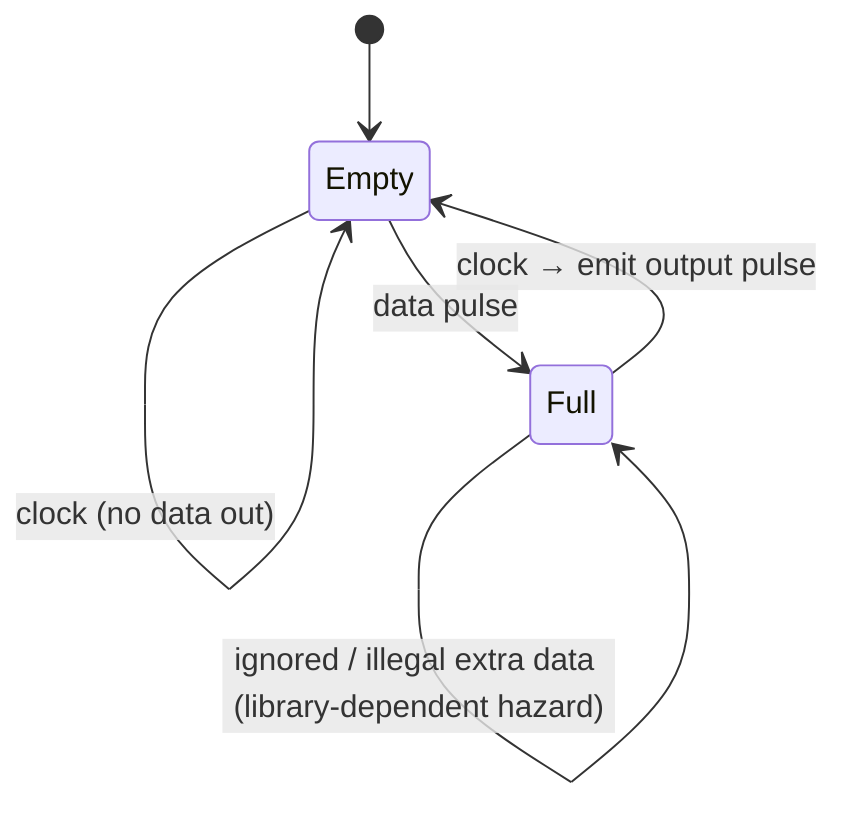
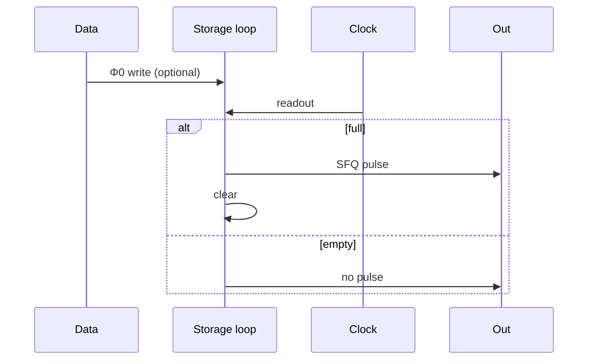

# RSFQ DFF and Retiming

**Prereqs:** [Splitter and Confluence](splitter-and-confluence.md) · [Pulse to Logic State](../bridge/pulse-to-logic-state.md)  
**Next:** [Gate-Level Pipelining](../bridge/gate-level-pipelining.md) · [Path Balancing Overhead](path-balancing-overhead.md)  
**Tracks:** `sfq-logic-primitives` · `eda-timing-verification`

**Learning goals.** After this page you should be able to (1) describe how an RSFQ **D flip-flop** stores one flux quantum and releases it on clock, (2) distinguish destructive readout from the idea of NDRO variants at a vocabulary level, (3) explain why DFFs are the default **retiming / path-balancing** widget, (4) connect DFF timing to [STA](sfq-static-timing-analysis.md) setup/hold intuition, and (5) choose DFF pads vs [JTL](jtl-interconnects.md) fine delay for the right job.

## Why this matters

If RSFQ pulses are batons, the **DFF** is a single-seat waiting room: a data pulse sits as circulating flux until a clock pulse calls it forward. Without DFFs (and cousins), you cannot build reliable pipelines, align reconvergent paths, or hold state across epochs.

In area reports, SFQ chips often look “full of DFFs.” That is not accidental — [gate-level pipelining](../bridge/gate-level-pipelining.md) and [path balancing](path-balancing-overhead.md) make storage cells first-class citizens, not rare register-file extras.

Glossary: [DFF (RSFQ)](../glossary.md), [Clock window](../glossary.md), [Path balancing](../glossary.md), [$\Phi_0$](../glossary.md), [SFQ pulse](../glossary.md).

## Intuition — capture, hold, clocked release

An RSFQ **D flip-flop**:

1. **Capture:** an input data SFQ pulse writes a flux quantum into a superconducting storage loop → state “1”. If no data pulse arrived since the last clear, the loop stays empty → “0”.
2. **Hold:** the circulating current persists (while superconducting and undisturbed) until readout.
3. **Clocked release:** a clock pulse reads the loop. If full, the cell launches an **output SFQ pulse** and typically **clears** the loop (destructive readout). If empty, no data output pulse.

That is the concrete cell behind the story in [Pulse to Logic State](../bridge/pulse-to-logic-state.md).

Public state cartoon:

\[
\begin{align}
\text{empty} &\xrightarrow{\text{data pulse}} \text{full},\\
\text{full} &\xrightarrow{\text{clock}} \text{empty + output pulse},\\
\text{empty} &\xrightarrow{\text{clock}} \text{empty (no data out)}.
\end{align}
\]

While holding a “1”, the **output pin is not a CMOS-like steady high**. The “1” lives as **loop flux**; the pin speaks when the clocked escape happens.

## Analogy — single-seat waiting room

A visitor (data pulse) sits until a receptionist (clock) calls them to the exit. If nobody is waiting, the clock call produces no visitor at the door.

A second picture: a one-token mailbox. Mail arrives (data). Later a courier (clock) empties the box and carries the letter onward — or finds the box empty.

Bad analogy: a CMOS latch that continuously drives a voltage high on a wire. Bad analogy #2: “DFF removes the need for a clock tree” — every DFF still needs a [splitter](splitter-and-confluence.md) leaf.

## Picture

```text
  DATA ──► [ storage loop ] ──► OUT
                 ▲
              CLOCK
```



```text
Timing sketch (one epoch):

  data:   ★
  store:     [==== full ====]
  clock:              ★
  out:                ★   (then empty)
```



## Retiming and path balancing — why DFFs dominate layouts

Because meaning is tied to **epochs**, two inputs to a gate must present related pulses in the **same** window. If one path is shorter in clocked-stage count, insert **padding DFFs** on the short path:

```text
Unbalanced:                         Balanced:

  A --1 stage--------┐                A --1--[DFF]--[DFF]--┐
                     +→ GATE                              +→ GATE
  B --3 stages-------┘                B --3 stages---------┘
```

Those padding DFFs may compute **no new Boolean function**. They only wait. That cost is [path-balancing overhead](path-balancing-overhead.md).

**Retiming** in the EDA sense (moving registers to optimize cycles) has an SFQ cousin: moving or inserting DFFs to satisfy epoch alignment and timing windows. Public takeaway: **registers are the alignment tool**, not an afterthought.

Public pad count:

\[
k \approx n_{\mathrm{long}} - n_{\mathrm{short}}.
\]

### DFF pads vs JTL fine delay

| Need | Prefer | Why |
|------|--------|-----|
| Align whole epochs at reconvergence | DFF pads | Moves tokens into the correct window by construction |
| Fix a few picoseconds of hold within an epoch | JTL stages | Fine delay without necessarily adding a full epoch |
| Both | Mix | Common in real chips |

## NDRO and friends (vocabulary only)

Some cells offer **non-destructive readout (NDRO)**: reading a copy without clearing, or other register semantics. Details are library-specific. For the core walk:

- default mental model = **DFF with destructive clocked escape**,
- when a paper says NDRO / shift register / TFF, map it back to “loop storage + pulse pins,” then read the private explainer for that cell.

## CMOS contrast

| Topic | CMOS FF | RSFQ DFF |
|-------|---------|----------|
| Stored quantity | Voltage state on nodes | Circulating $\Phi_0$ in a loop |
| Clock role | Sample/transfer levels on edges | Launch/clear fluxon readout pulse |
| Output while holding | Q pin holds level | Output pulse appears at readout; hold is internal |
| Use for balancing | Sometimes; multi-cycle paths common | Extremely common padding in gate-level pipelines |
| Setup/hold | Data vs clock edge at FF | Data pulse vs clock pulse windows at cell |
| Fanout of Q | Capacitive | Downstream JTLs / splitters for the **output pulse** |
| Clock pin cost | One net per FF bank often | Each DFF is a clock-tree leaf consumer |

## Worked example 1 — Truth table of one clocked read

| Before clock | Data arrived this epoch? | After data | Clock | Output pulse? | After clock |
|--------------|--------------------------|------------|-------|---------------|-------------|
| empty | no | empty | yes | no | empty |
| empty | yes | full | yes | yes | empty |
| full | (already full) | full | yes | yes | empty |

Interpret output bits across epochs as the released stream. Illegal double-write into a full loop is a **hazard** — treat as forbidden unless a datasheet says otherwise.

## Worked example 2 — Balance by two DFFs

Left input to a gate already has three clocked stages; right input has one. Insert **two** DFFs on the right, clocked in the same scheme, so both present data in epoch 3 (counting from a shared reference).

Resource sketch:

- $+2$ DFFs,
- their clock pins need splitter-tree taps ([splitters](splitter-and-confluence.md)),
- bias current grows,
- latency of the short path increases by two epochs (which is the point).

## Worked example 3 — Hold race without a DFF pad

In concurrent-flow clocking, a combinational-looking short path might race into the next cell before that cell is ready. Fixes include:

- extra **JTL** delay ([JTL](jtl-interconnects.md)),
- an extra **DFF** stage (stronger: moves the token into the next epoch intentionally),
- clock-tree adjustments.

Public rule: **early pulse → delay or retiming storage; late pulse → shorten path or relax clock / reduce stages**.

## Worked example 4 — Destructive readout in a shift register

An $N$-bit RSFQ shift register is often a chain of DFFs: each clock advances stored fluxons one seat. After readout, the previous seat is empty unless a new data pulse wrote it. That destructive rhythm is why “register file like CMOS static Q” is the wrong picture for the default DFF.

## Worked example 5 — Setup/hold language at the cell

STA asks whether the data pulse falls in a legal window relative to the clock pulse at **this** DFF ([STA card](sfq-static-timing-analysis.md)). Same English as CMOS; different signals (pulses, not levels). Clock-flow style changes which violations dominate ([concurrent / counter-flow](concurrent-and-counter-flow-clocking.md)).

Public window cartoon:

\[
t_{\mathrm{data}} \;\text{vs}\; t_{\mathrm{clk}} \pm \text{(setup-/hold-like margins)}.
\]

## Worked example 6 — Cascaded overhead

A block needs $k=6$ padding DFFs for one merge, then those pads’ clocks deepen the splitter tree, then another merge downstream needs recounting depths **including** the pads ([path balancing](path-balancing-overhead.md)). Public habit: treat DFF insertion as a **global** balancing/timing edit, not a local sticker.

## Common misconceptions

- **“DFF output holds a CMOS-like high voltage.”** Holding is loop flux; the pin emits a pulse at readout.
- **“Padding DFFs are wasted area.”** They are often mandatory for epoch alignment.
- **“One DFF per chip like a tiny FSM register.”** Pipelines use DFFs everywhere.
- **“Clock can be omitted if data pulses are timed by hand.”** Some research cells are asynchronous; mainstream RSFQ teaching assumes clocked storage/readout.
- **“NDRO is required to understand RSFQ.”** Useful later; DFF destructive readout is enough for the core walk.
- **“JTLs replace DFFs for all balancing.”** Fine delay ≠ missing epochs.
- **“DFF removes the need for splitter clocks.”** Every padding DFF still needs a clock leaf.
- **“Functional sim of one vector proves DFF timing.”** Window legality is a static/STA concern too.

## Bridge to SFQ circuits

- Why every gate is a stage: [Gate-Level Pipelining](../bridge/gate-level-pipelining.md).
- Cost of pads: [Path Balancing Overhead](path-balancing-overhead.md).
- Clock vs data direction: [Concurrent / counter-flow](concurrent-and-counter-flow-clocking.md).
- Tool checks of windows: [SFQ STA](sfq-static-timing-analysis.md).
- Clock fanout to DFF pins: [Splitters](splitter-and-confluence.md).
- Fine delay cousin: [JTL](jtl-interconnects.md).

## What stays private

Full SPICE schematics, measured margins vs bias, and named cell variants in a foundry kit → private / project netlists — not this concept card.

## Check yourself

<details>
<summary>1. What does an RSFQ DFF store?</summary>

Up to one flux quantum as circulating current in a loop (logic 1), or empty (logic 0).
</details>

<details>
<summary>2. What does the clock pulse typically do on a full DFF?</summary>

Emit an output SFQ pulse and clear the loop (destructive readout).
</details>

<details>
<summary>3. Why are DFFs used even when Boolean logic is already done?</summary>

To retiming / path-balance pulses into the same clock epoch.
</details>

<details>
<summary>4. Path A has 1 stage, path B has 4 into one gate. How many padding DFFs on A?</summary>

About $3$ (imbalance of $k$ stages ⇒ roughly $k$ pads on the short path).
</details>

<details>
<summary>5. While a DFF holds a “1”, is the output pin necessarily a steady high voltage?</summary>

No — the “1” is internal loop flux; the output speaks as a pulse at clocked readout.
</details>

<details>
<summary>6. How do DFF timing checks relate to CMOS setup/hold language?</summary>

Same words, different signals: data SFQ pulses must fall in legal windows relative to the clock pulse at the cell.
</details>

<details>
<summary>7. Name one vocabulary cousin of the DFF you might see in papers.</summary>

NDRO (non-destructive readout), TFF, or shift-register cells — still “loop storage + pulse pins” at heart.
</details>

<details>
<summary>8. Why do padding DFFs increase bias current?</summary>

Each added cell needs bias (and usually a clock splitter tap), so the bias network grows with pad count.
</details>

<details>
<summary>9. When prefer JTLs over DFFs for a timing fix?</summary>

When you need fine delay inside/near an epoch (e.g. hold trim), not a full missing epoch at reconvergence.
</details>

<details>
<summary>10. Why does inserting pads force a clock-tree rethink?</summary>

Each new DFF is another clock leaf — fanout, skew, and bias all grow with pads.
</details>

## Next steps

- Why every gate is a pipeline stage: [Gate-Level Pipelining](../bridge/gate-level-pipelining.md).
- Padding cost at scale: [Path Balancing Overhead](path-balancing-overhead.md).
- Clock styles: [Concurrent-Flow and Counter-Flow Clocking](concurrent-and-counter-flow-clocking.md).
- Plain terms: [Glossary](../glossary.md).
