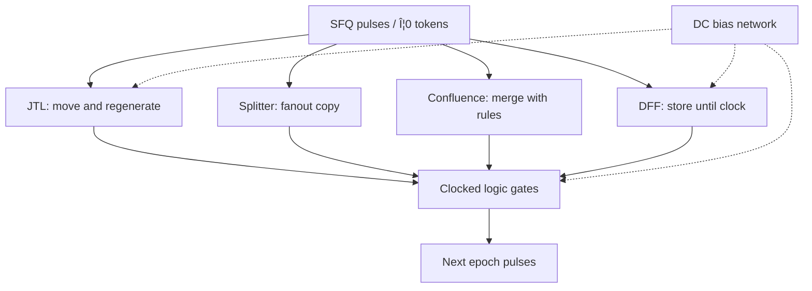
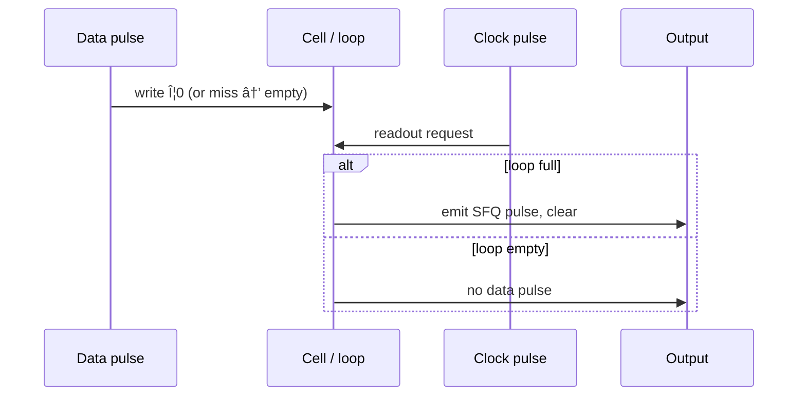

# Rapid Single Flux Quantum (RSFQ) Logic Overview

**Prereqs:** [Pulse to Logic State](../bridge/pulse-to-logic-state.md) · [CMOS vs SFQ Cheat Sheet](cmos-vs-sfq.md)  
**Next:** [JTL Interconnects](jtl-interconnects.md) · [Gate-Level Pipelining](../bridge/gate-level-pipelining.md)  
**Tracks:** `sfq-logic-primitives`

**Learning goals.** After this page you should be able to (1) state RSFQ’s pulse-and-window encoding in one sentence, (2) map the four core plumbing cells (JTL, splitter, confluence, DFF) to roles, (3) explain why RSFQ logic is almost always [gate-level pipelined](../bridge/gate-level-pipelining.md), (4) place ERSFQ and AQFP as related-but-different families, and (5) know which follow-on concept cards deepen each idea without inventing paper-specific numbers.

## Why this matters

Rapid Single Flux Quantum (**RSFQ**) is the default vocabulary of superconducting digital electronics in this curriculum. Papers, cell libraries, and EDA tools assume you already think in **SFQ pulses**, **storage loops**, and **clock epochs**. If those words still feel fuzzy, go back to [Phase to Pulse](../bridge/phase-to-pulse.md) and [Pulse to Logic State](../bridge/pulse-to-logic-state.md) before memorizing cell names.

RSFQ is not “CMOS with colder transistors.” It is a **pulse automaton** family built from overdamped Josephson junctions, inductors, and bias networks. Boolean meaning lives in **whether a $\Phi_0$ event happened in a timing window**, and in **whether a loop still holds circulating flux**.

See also: [Glossary](../glossary.md) — RSFQ, SFQ pulse, clock window, $\Phi_0$, JTL, splitter, confluence, DFF, bias current.

## Intuition — pulses, not rails

In ordinary CMOS digital logic, a wire holds a **voltage level**. In RSFQ:

- **Logic 1:** an SFQ pulse arrives in the relevant timing window, *or* a storage loop holds one flux quantum until a clocked readout.
- **Logic 0:** no pulse in that window / empty storage loop.

A single SFQ voltage spike is brief (picoseconds) and tiny in amplitude, but its time integral is fixed by flux quantization:

\[
\int V(t)\,dt = \Phi_0 \approx 2.07\,\text{mV}\cdot\text{ps}.
\]

That shared “token size” is why designers talk about **fluxons** as information tokens: ideal pulses are interchangeable in area; meaning comes from **which cell** and **which epoch**.

Most RSFQ library cells are **clocked machines**. They do not sit as deep unsynchronized combinational clouds. Each cell waits for data and/or clock pulses, updates internal loop state, and may emit an output pulse in a later window. That is why the bridge [Gate-Level Pipelining](../bridge/gate-level-pipelining.md) sits next to every RSFQ datapath discussion.

Three layers of meaning when you read “RSFQ gate” on a block diagram:

1. **Physics:** overdamped JJ $2\pi$ slips → $\Phi_0$ pulses; loops store fluxoids.
2. **Circuit:** library cell with data/clock pins, bias taps, short interconnect stubs.
3. **System:** one stage in a gate-level pipeline whose legality is about **epochs**, not static levels.

## Analogy — batons on a timed track

Think of each logic “1” as a **baton** handed from runner to runner.

- Empty hands in a time slot = logic 0.
- A baton present when the starter pistol (clock) fires = a stored or launched 1.
- Junctions along the track ([JTL](jtl-interconnects.md) stages) **regenerate** a fresh baton rather than letting a limp rope stretch and fray.
- Waiting rooms ([DFFs](rsfq-dff-and-retiming.md)) hold one baton until the next pistol.

The analogy is about **discrete tokens + timing slots**, not about literal mechanical batons inside niobium. The physics underneath remains Josephson $2\pi$ phase slips and quantized flux in loops.

## Picture — the RSFQ cell map



```text
CMOS-ish cartoon (levels)          RSFQ cartoon (windows)

V | ¯¯¯¯ 1   ____ 0                epochs |  T1 | T2 | T3 |
  |____/         \____               pulse |  ★  |    |  ★  |
       time                         bit    |  1  |  0 |  1  |
```

```text
Minimal one-bit pipeline (field cartoon):

  DC/SFQ ──► JTL ──► DFF ──► JTL ──► SFQ/DC
              │       ▲
              │     CLOCK (via splitter tree)
              └── regenerates Φ0 along the way
```

## Interactive lab

Try this in place. Prefer full-screen? Open the [lab page](../labs/rsfq-logic.html).

1. Click each plumbing cell (JTL / splitter / confluence / DFF) and read its job.
2. Toggle epoch bits and **Generate 3 epochs** — presence/absence in windows is the encoding.

<iframe
  src="../../labs/rsfq-logic.html"
  title="RSFQ logic overview lab"
  style="width:100%;height:720px;border:1px solid rgba(0,0,0,0.12);border-radius:0.35rem;background:#fff;"
  loading="lazy"
></iframe>



## Core building blocks (map)

| Cell | Role in one line | Deepen here |
|------|------------------|-------------|
| **JTL** | Actively move and regenerate pulses; also a delay knob | [JTL Interconnects](jtl-interconnects.md) |
| **Splitter** | One pulse in → two pulses out (fanout) | [Splitter and Confluence](splitter-and-confluence.md) |
| **Confluence** | Merge two lines onto one when timing allows | [Splitter and Confluence](splitter-and-confluence.md) |
| **DFF** | Store up to one $\Phi_0$ until clocked readout | [RSFQ DFF and Retiming](rsfq-dff-and-retiming.md) |

Other library cells (AND, OR, XOR, NDRO, TFF, inverter variants, …) reuse the same vocabulary: overdamped junctions, loops that hold or release flux, and clock/data pulse pins. You do not need every schematic on day one; you need the **roles**.

## What an RSFQ cell is made of (public sketch)

A typical cell is not a single junction. It is a small network:

1. **Overdamped Josephson junctions** — pulse switches with McCumber $\beta_C \lesssim 1$ ([Overdamped vs underdamped](../fundamentals/overdamped-vs-underdamped-jj.md)).
2. **Inductors / superconducting loops** — store circulating current corresponding to $0$ or $1$ flux quantum ([loop / SQUID](../fundamentals/superconducting-loop-squid.md)).
3. **Bias taps** — DC currents that hold junctions near their switching thresholds so a small trigger can launch a pulse ([Resistive bias → ERSFQ](../bridge/resistive-bias-to-ersfq.md)).
4. **Interconnect stubs** — often short JTLs at the pins so pulses enter and leave cleanly.

Public rule: if a schematic shows many “X” marks for junctions and loops between them, you are looking at RSFQ-style pulse automata — not CMOS transistors tied to $V_{DD}$.

### Bias is part of the logic story

Even before you open the [ERSFQ](ersfq-logic.md) card, remember: every ready junction sits near $I_c$ because of **bias current**. Classical resistive taps burn static heat; energy-efficient feeding and [serial biasing](serial-biasing-current-recycling.md) attack different slices of the power problem. RSFQ teaching without bias is unfinished.

## Encoding table (keep this mental model)

| Question | RSFQ answer |
|----------|-------------|
| What is a “1” on a wire? | An SFQ pulse in a defined clock/data window |
| What is a “1” in a register? | Circulating $\Phi_0$ in a storage loop until readout |
| What is a “0”? | No pulse / empty loop |
| Are all “1” pulses identical? | Ideally same area $\Phi_0$; meaning is *which window / which pin* |
| What synchronizes computation? | Pervasive clock pulses (and sometimes asynchronous cousins — advanced) |
| What is interconnect? | Often active [JTL](jtl-interconnects.md); long hops may use [PTL](hybrid-jtl-ptl-routing.md) |
| What is fanout? | [Splitter](splitter-and-confluence.md) trees, not free Verilog wires |
| What aligns reconvergence? | [Path balancing](path-balancing-overhead.md) with DFFs/JTLs |

## CMOS contrast

| Topic | Typical CMOS digital | Typical RSFQ |
|-------|----------------------|--------------|
| Information token | Voltage / charge on $C$ | Flux quantum $\Phi_0$ (pulse or circulating) |
| Combinational cloud | Deep unsynchronized logic possible | Usually **gate-level pipelined** |
| Flip-flop | Edge-triggered FF storing node voltage | DFF storing flux until clocked escape |
| Fanout | Capacitive load; buffers | Splitter trees |
| Wire | Metal RC; repeaters | JTL regenerate; long hops may use PTL |
| Power story | Dynamic + leakage on rails | Bias network heat + switching; ERSFQ later |
| Timing | Setup/hold at FFs | Windows at many clocked cells + path balance |
| Clock | Regional grid to registers | Pulse tree into **most cells** |

Use [CMOS vs SFQ](cmos-vs-sfq.md) as the full cheat sheet; this page is the RSFQ entry point into that table.

## Worked example 1 — Read a three-window trace

Suppose a clocked cell sees the following arrivals in successive epochs $T_1,T_2,T_3$:

| Epoch | Data pulse? | Stored before clock? | Clock arrives? | Output pulse? |
|-------|-------------|----------------------|----------------|---------------|
| $T_1$ | yes | becomes full | yes | yes (reads out the 1) |
| $T_2$ | no | empty | yes | no |
| $T_3$ | yes | full | yes | yes |

Interpreted bit stream at the output windows: **1, 0, 1**.

Notice: the *voltage height* of each spike is not the Boolean value. The Boolean value is **presence vs absence** aligned to the clock. That is the entire encoding lesson in one table.

## Worked example 2 — One-bit instrumented pipeline

A teaching bench often builds:

\[
\text{DC/SFQ} \rightarrow \text{JTL} \rightarrow \text{DFF} \rightarrow \text{JTL} \rightarrow \text{SFQ/DC}.
\]

Step sequence:

1. A slow lab edge enters a **DC/SFQ** converter and becomes one SFQ pulse.
2. **JTL** stages walk the pulse forward, regenerating $\Phi_0$ at each junction.
3. The **DFF** captures the pulse into a loop (stores 1) or stays empty (0).
4. A **clock** pulse (usually from a splitter tree) reads the DFF: stored 1 → output SFQ pulse and clear; empty → no data out.
5. **SFQ/DC** (or a similar monitor) turns the picosecond pulse into something an oscilloscope can see.

Real chips add many splitters (fanout), many DFFs (path balancing), and bias networks. The cartoon above is enough to orient every later card.

## Worked example 3 — Why “combinational depth” is the wrong first question

In CMOS you might ask: “How many gates deep is this ALU cloud before the next FF?”

In RSFQ you more often ask: “How many **clocked stages** sit on each path, and do reconvergent paths share an epoch?”

If path A has 2 stages and path B has 5 stages into the same gate, you insert padding (usually DFFs) on A — see [Path Balancing Overhead](path-balancing-overhead.md). That is not an EDA quirk; it follows from pulse-window encoding.

Public pad cartoon:

\[
k \approx n_{\mathrm{long}} - n_{\mathrm{short}}.
\]

## Worked example 4 — Place ERSFQ and AQFP without confusion

| Family | Encoding / feel | What changes vs classical RSFQ teaching |
|--------|-----------------|----------------------------------------|
| RSFQ (resistive bias) | Pulses / loops | Default vocabulary on this page |
| [ERSFQ](ersfq-logic.md) | Still pulses / loops | Bias feeding / static heat story |
| [AQFP](aqfp-logic.md) | Multiphase AC, parametron-like | Different family — not “RSFQ with AC” |

Public curriculum teaches all three as vocabulary; do not merge them.

## Worked example 5 — Clock is a distributed pulse tree

“Provide a clock” in RSFQ does not mean one CMOS edge into a register file. It means a [splitter](splitter-and-confluence.md) tree delivering SFQ clock pulses to many cells, with skew that [STA](sfq-static-timing-analysis.md) must see, and with a chosen [concurrent- or counter-flow](concurrent-and-counter-flow-clocking.md) geography relative to data.

## Worked example 6 — Design checklist for a tiny block

Before calling a block “done” in your head:

1. Encoding: every wire’s bit meaning is a **window**, not a DC level.
2. Plumbing: data moves on JTLs; fanout uses splitters; merges use confluence carefully.
3. Storage: state lives in DFFs/loops until clocked escape.
4. Balance: reconvergences have matched stage counts.
5. Clock: leaves exist for every clocked cell; skew is budgeted.
6. Bias: taps and heat/ampere story are acknowledged ([ERSFQ](ersfq-logic.md), [DC bias](../bridge/dc-bias-current-delivery.md)).
7. Timing: setup-/hold-like windows are thinkable even before a named STA tool ([STA](sfq-static-timing-analysis.md)).

## Common misconceptions

- **“RSFQ bits are millivolt DC levels.”** No. Levels may appear in *interface* circuits; RSFQ logic itself is pulse/loop based.
- **“One big clock edge updates a CMOS-like register file and the rest is combinational.”** RSFQ defaults to many clocked cells; clocks are everywhere.
- **“A wire is free.”** Active JTLs cost junctions, bias, and delay; long spans may need PTL hybrids ([Hybrid JTL–PTL](hybrid-jtl-ptl-routing.md)).
- **“Splitter = CMOS buffer with infinite fanout.”** Fanout is discrete: each splitter is typically fanout-2; trees add delay and skew.
- **“ERSFQ invents a new Boolean encoding.”** ERSFQ keeps pulse logic; it changes **bias / static power** ([ERSFQ](ersfq-logic.md)).
- **“AQFP is just RSFQ with AC.”** Different family: multiphase AC, adiabatic parametron-style cells ([AQFP](aqfp-logic.md)).
- **“If I memorize cell names I can skip bridges.”** Encoding and pipelining bridges prevent permanent confusion.
- **“$\Phi_0$ area means Boolean magnitude.”** Area fixes the token size; Boolean meaning is presence/absence in a window.
- **“Path balancing is optional EDA fluff.”** Epoch match is part of correctness ([path balancing](path-balancing-overhead.md)).
- **“RSFQ is quantum computing because flux is quantized / Josephson.”** Classical pulse logic. For the QC contrast see [qubits ≠ SFQ](../fundamentals/fields/superconducting-qubits-and-quantum-computing.md).

## Bridge to SFQ circuits

After this overview, the core walk visits plumbing first (move, copy, merge, store), then bias/energy families, then clocking and timing:

1. [JTL Interconnects](jtl-interconnects.md)  
2. [Splitter and Confluence](splitter-and-confluence.md)  
3. [RSFQ DFF and Retiming](rsfq-dff-and-retiming.md)  
4. [Gate-Level Pipelining](../bridge/gate-level-pipelining.md) (bridge)  
5. [Resistive Bias to ERSFQ](../bridge/resistive-bias-to-ersfq.md) → [ERSFQ](ersfq-logic.md) → [AQFP](aqfp-logic.md)

Track map: [SFQ Logic Primitives Roadmap](../tracks/sfq-logic-primitives/ROADMAP.md). Neighbor contrast (optional): [qubits ≠ SFQ](../fundamentals/fields/superconducting-qubits-and-quantum-computing.md).
## What stays private

Measured clock frequencies, process-specific cell margins, full library schematics tied to one PDK, and paper bake-offs of RSFQ vs ERSFQ vs AQFP **numbers** belong in private paper explainers — not on this public overview.

## Check yourself

<details markdown="1">
<summary markdown="span">1. What replaces CMOS voltage levels as the native RSFQ information token?</summary>

Presence or absence of SFQ pulses (area $\Phi_0$) in timing windows, and circulating flux in storage loops.
</details>

<details markdown="1">
<summary markdown="span">2. Name the four core plumbing cells and one verb each.</summary>

JTL (move/regenerate), splitter (copy/fanout), confluence (merge), DFF (store until clock).
</details>

<details markdown="1">
<summary markdown="span">3. Why are RSFQ gates usually not deep unsynchronized combinational clouds?</summary>

Cells are typically clocked pulse machines; meaning is tied to epochs, so designs are gate-level pipelined.
</details>

<details markdown="1">
<summary markdown="span">4. A trace shows pulses in windows $T_1$ and $T_3$ only. What bit string is that?</summary>

$1,0,1$ for those three successive windows (presence = 1, absence = 0).
</details>

<details markdown="1">
<summary markdown="span">5. Does ERSFQ change the bit encoding or mainly the bias/power story?</summary>

Mainly the bias/power story; it still speaks SFQ pulse / flux-storage language.
</details>

<details markdown="1">
<summary markdown="span">6. Why do splitter trees appear even for a “simple” clock?</summary>

One source must fan out to many clocked cells; each splitter is typically fanout-2, so trees are required and they add delay/skew.
</details>

<details markdown="1">
<summary markdown="span">7. What does $\int V\,dt = \Phi_0$ tell you about an ideal SFQ pulse?</summary>

Its time-integrated area is fixed by flux quantization — the shared token size — not that peak voltage is the Boolean bit.
</details>

<details markdown="1">
<summary markdown="span">8. Path A has 2 clocked stages and path B has 5 into one gate. What public fix do you expect?</summary>

About $3$ padding stages (often DFFs) on path A so both share an epoch.
</details>

<details markdown="1">
<summary markdown="span">9. Name three layers of meaning behind “RSFQ gate.”</summary>

Physics (JJ slips / loops), circuit (library cell + bias), system (pipeline stage / epoch legality).
</details>

<details markdown="1">
<summary markdown="span">10. Why is bias part of the RSFQ story even before ERSFQ?</summary>

Junctions sit near $I_c$ because of bias current; without that readiness, pulse automata do not switch cleanly — and bias networks set much of the power story.
</details>

## Next steps

- Move pulses actively and use delay stages: [JTL Interconnects](jtl-interconnects.md).
- Why every gate is a stage: [Gate-Level Pipelining](../bridge/gate-level-pipelining.md).
- Track overview: [SFQ Logic Primitives Roadmap](../tracks/sfq-logic-primitives/ROADMAP.md).
- Quick CMOS remapping: [CMOS vs SFQ](cmos-vs-sfq.md).
- Plain terms: [Glossary](../glossary.md).
