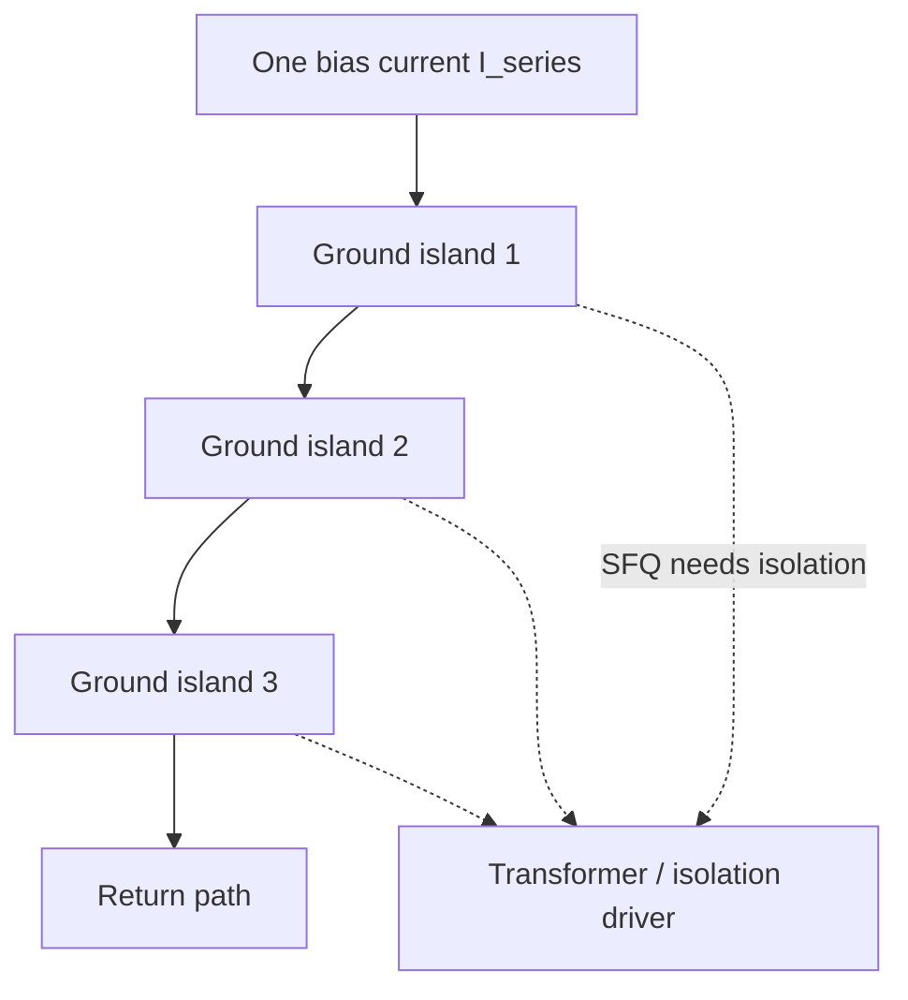

# Serial Biasing and Current Recycling

**Prereqs:** [DC Bias Current Delivery](../bridge/dc-bias-current-delivery.md) · [ERSFQ Logic](ersfq-logic.md)  
**Next:** [AQFP Logic](aqfp-logic.md) · [Concurrent-Flow and Counter-Flow Clocking](concurrent-and-counter-flow-clocking.md)  
**Tracks:** `clocking-biasing-power`

**Learning goals.** After this page you should be able to (1) explain how **serial biasing** reuses one bias current through stacked circuit blocks on **ground islands**, (2) say why that reuse is called **current recycling**, (3) list what you gain (amperes into the cryostat) versus what you pay (isolation, regulation, EDA complexity), and (4) keep serial biasing distinct from [ERSFQ](ersfq-logic.md) feeding and from [AQFP](aqfp-logic.md) AC excitation.

## Why this matters

Cryogenic refrigerators and cable plants do not care how clever your Boolean gates are if the chip still demands **huge DC amperes**. In a **parallel** bias feed, every cell (or every small block) taps the supply somewhat independently, so total current grows roughly with how much logic you bias. At chip scale that becomes a first-order system problem: magnetics, heating in the leads, connector limits, and supply compliance.

**Serial biasing** (often paired with the phrase **current recycling**) stacks blocks so the **same ampere** flows through block 1, then block 2, then block 3. Each block still sees a useful *local* bias current; the *global* supply current no longer has to be the sum of all local needs. The price is architectural: blocks sit on different **ground islands**, and signals that cross islands need isolation.

This page is field-fundamental. Exact recycling networks, measured ampere reductions, and CAD island-assignment algorithms stay in private paper explainers.

Glossary: [Serial biasing / current recycling](../glossary.md), [Ground island](../glossary.md), [Bias current](../glossary.md), [ERSFQ](../glossary.md).

## Intuition --- one loop current, many floors

In parallel feed, think of many faucets on one city main: total flow into the building is roughly the sum of what every faucet draws.

In serial / recycled feed, think of one pipe that runs **through** apartment 1's plumbing, then apartment 2's, then apartment 3's before returning. The **same flow** serves many floors. Each floor still gets water pressure relative to its own local "ground," but the floors no longer share one common ground potential --- so messengers between floors need special bridges.

For SFQ:

- local cells still need bias near their Josephson thresholds,
- the **series string** reuses $I_{\mathrm{series}}$ across islands,
- **grounds step** along the string,
- SFQ pulses that must leave an island need **transformers / isolation drivers** (or equivalent galvanic isolation).

Public slogan:

\[
I_{\mathrm{supply,\,parallel}} \sim \sum_i I_i \qquad\text{vs}\qquad I_{\mathrm{supply,\,serial}} \sim \max_i I_i
\]

(in the ideal cartoon where each island needs comparable current $I_i$ and recycling is perfect). Voltage compliance and margins get harder --- that is the other side of the trade.

## Analogy --- batteries in series vs apartments on one riser

Batteries in series share one loop current while each cell still contributes its own voltage. Serial biasing is the **current** cousin of that idea applied to logic blocks: one bias current threads many islands; the supply must tolerate a taller voltage stack.

The apartment-riser analogy teaches **shared flow + different floor potentials**. It must not teach false physics: water is continuous; SFQ bias is DC current into Josephson networks; inter-floor "messengers" are pulse/flux interfaces, not literal messengers.

## Picture --- parallel vs serial cartoons

```text
Parallel (cartoon):                Serial / recycled (cartoon):

  I1 ─┬─ block A                   I_series ─► island 1 (block A)
  I2 ─┼─ block B                              │
  I3 ─┴─ block C                              ▼
       │                           I_series ─► island 2 (block B)
      GND                                     │
                                              ▼
  I_total ≈ I1+I2+I3               I_series ─► island 3 (block C)
                                              │
                                             return

  I_series can bias many islands; grounds differ
```



```text
Potential step cartoon (not to scale):

  island1 local GND ─────
  island2 local GND  ─────   (offset along series string)
  island3 local GND   ─────
       common "chip GND" is no longer one equipotential for all logic
```

```mermaid
sequenceDiagram
  participant Sup as Bias supply
  participant I1 as Island 1 cells
  participant I2 as Island 2 cells
  participant I3 as Island 3 cells
  Sup->>I1: I_series enters
  I1->>I2: same I_series continues
  I2->>I3: same I_series continues
  I3->>Sup: return
  Note over I1,I3: Local grounds differ; pulse crossing needs isolation
```

## Interactive lab

Try this in place. Prefer full-screen? Open the [lab page](../labs/serial-biasing-current-recycling.html).

1. **Parallel:** raise islands $M$ and $I$ per island --- $I_{\mathrm{supply}}$ is the sum; shared GND, no isolation sites.
2. **Serial recycle:** same $M$ --- $I_{\mathrm{supply}}$ collapses toward one island's $I$; voltage stack grows; **ISO** marks appear between islands. Toggle **Send pulse across islands** and launch.

<iframe
  src="../../labs/serial-biasing-current-recycling.html"
  title="Serial biasing / current recycling lab"
  style="width:100%;height:720px;border:1px solid rgba(0,0,0,0.12);border-radius:0.35rem;background:#fff;"
  loading="lazy"
></iframe>

## What a ground island is (public definition)

A **ground island** is a circuit region whose local return / ground reference is intentionally **not** tied to every other region's ground as one shared equipotential. In serial biasing, islands appear because the series bias string forces potential steps.

Consequences for digital SFQ:

1. **Intra-island** logic can look familiar: JTLs, DFFs, splitters, clocks --- subject to ordinary timing ([STA](sfq-static-timing-analysis.md), [clock flow](concurrent-and-counter-flow-clocking.md)).
2. **Inter-island** nets are special: you cannot casually abut a JTL from island A into island B as if grounds matched.
3. **EDA** must know island membership: placement, routing, and verification treat islands as domains.

Public rule: **island = bias/return domain**, not "just another floorplan rectangle."

## What you gain / what you pay

| Gain | Cost |
|------|------|
| Much smaller supply current into the cryostat | Islands at different ground potentials |
| Easier cable-current / magnetics budget | SFQ signals between islands need isolation |
| Scales large logic better on the ampere axis | Bias regulation, margins, and EDA constraints get harder |
| Complements energy-efficient feeding (ERSFQ theme) | Does not by itself remove all static heat stories |

Rule of thumb only: **series stacking multiplies voltage budget and shrinks current**; parallel does the opposite.

## ERSFQ vs serial biasing vs AQFP (do not merge the words)

| Technique | Main problem attacked | Still need? |
|-----------|----------------------|-------------|
| [ERSFQ](ersfq-logic.md) feeding | Static heat in classical bias **resistors** | Timing, cells, often still large total current |
| **Serial biasing / recycling** | Huge **total ampere** by stacking islands | Isolation, regulation, island-aware EDA |
| [AQFP](aqfp-logic.md) | Different logic family (AC multiphase, adiabatic) | Its own AC delivery and phase scheduling |

A large system may care about **ERSFQ and serial biasing together**. They are complementary themes, not synonyms. AQFP is a different language entirely.

## CMOS contrast

| Topic | CMOS habit | Serial-biased SFQ |
|-------|------------|-------------------|
| Power delivery | Voltage rails; current is consequence | Current bias is first-class; recycling attacks amperes |
| "Ground" | Often one digital GND plane (with IR drop) | Multiple intentional ground islands |
| Crossing domains | Level shifters between voltage domains | Isolation / transformers between islands |
| Scaling pain | Wire IR, electromigration, package pins | Cryostat current, magnetics, island isolation |
| Low-power cousin | Clock gating, VT, DVFS | ERSFQ feeding (heat) + recycling (amperes) |

A CMOS designer who hears "series" may picture stacked FETs for voltage tolerance. Here series means **reusing bias current through stacked return domains**.

## Worked example 1 --- Three islands, parallel vs serial amperes

Suppose three identical islands each need $0.5\,\text{A}$ of bias if fed in parallel:

\[
I_{\mathrm{total,\,parallel}} \approx 1.5\,\text{A}.
\]

Stacked in series with ideal recycling, the supply may provide about **$0.5\,\text{A}$** once, reused through all three. The supply must also provide enough **voltage compliance** for the series string and keep each island inside its bias margins.

Public checklist:

1. Sum parallel currents (upper bound on naïve feed).
2. Estimate serial current ≈ per-island need (ideal cartoon).
3. Ask what voltage headroom and regulation the string requires (paper/private depth for numbers).
4. Budget isolation cells for every necessary inter-island SFQ net.

## Worked example 2 --- Where isolation appears in a pipeline

Imagine a four-stage RSFQ pipeline that does not fit on one island's current budget, so stages 1-2 sit on island A and stages 3-4 on island B.

Data must cross A→B once:

1. Inside A: ordinary JTLs / DFFs / clocks relative to A's ground.
2. At the boundary: an **isolation** interface (transformer-style or other galvanic isolation --- exact cell is library-specific).
3. Inside B: continue the pipeline relative to B's ground.
4. Clocking: either each island has its own clock tree leaf strategy, or clocks also cross with isolation --- both are architectural choices.

If you forget step 2 and "just wire" a JTL across grounds, you have mixed return potentials. That is not a timing tweak; it is a **domain error**.

## Worked example 3 --- Complementary to ERSFQ, not a substitute

A team reports: "We moved to ERSFQ, so we do not need serial biasing."

Public response:

- ERSFQ attacks **static resistor heat** in how junctions are fed.
- Serial biasing attacks **supply ampere** by stacking islands.
- An ERSFQ chip can still draw large total current if many junctions are biased in parallel islands that are not recycled.
- Conversely, a resistively biased chip could recycle current and still burn static $I^2R$ in resistors.

Fair system thinking quotes **both** heat and amperes. See [Resistive Bias to ERSFQ](../bridge/resistive-bias-to-ersfq.md) and [DC Bias Current Delivery](../bridge/dc-bias-current-delivery.md).

## Worked example 4 --- Failure mode categories (no recipes)

When serial biasing "misbehaves," public debugging buckets include:

| Symptom class | Often look at |
|---------------|---------------|
| Logic wrong only on nets that cross islands | Isolation cells, island assignment bugs |
| Whole island loses margins after activity bursts | Bias regulation / recovery on that island |
| Supply hits compliance limit | Series voltage stack taller than expected |
| Timing fails only after floorplanning islands | Clock trees and skew across domains |

Do not jump to "Josephson physics is broken" before checking **domain and bias** hypotheses.

## Design checklist (field-fundamental)

1. Estimate total parallel bias current for the block you want to build.
2. Decide whether ampere delivery into the cryostat forces recycling.
3. Partition into islands with comparable current and manageable communication.
4. Mark every SFQ net that crosses islands --- each needs an isolation plan.
5. Keep timing closure **inside** islands using ordinary [path balance](path-balancing-overhead.md) / [STA](sfq-static-timing-analysis.md) thinking.
6. Coordinate with feeding style: resistive vs [ERSFQ](ersfq-logic.md).
7. Leave measured ampere tables and CAD algorithms to private explainers.

## Common misconceptions

- **"Serial biasing means the logic is wired in series like a shift register."** No --- it is about **bias current** threading islands, not about Boolean series connection.
- **"Current recycling = ERSFQ."** Different problems (amperes vs resistor static heat).
- **"Ground islands are only a layout prettiness."** They are electrical domains required by series potentials.
- **"If grounds differ, ignore it for short wires."** Short does not cancel galvanic domain mismatch.
- **"Recycling removes all power problems."** It shrinks supply current; switching energy, regulation, and (for classical RSFQ) resistor heat may remain.
- **"AQFP already solved this because it uses AC."** AQFP is another family; it does not erase the need to understand DC recycling vocabulary in the RSFQ/ERSFQ world.
- **"One isolation transformer fixes the whole chip."** Every necessary crossing is a site; crossings have delay and margin costs that STA must see.

## Bridge to SFQ circuits

- Why amperes hurt: [DC Bias Current Delivery](../bridge/dc-bias-current-delivery.md).
- Static resistor heat theme: [Resistive Bias to ERSFQ](../bridge/resistive-bias-to-ersfq.md) → [ERSFQ](ersfq-logic.md).
- Different AC family on the same track: [AQFP](aqfp-logic.md).
- Inside an island, clocks still have directionality: [Concurrent / counter-flow](concurrent-and-counter-flow-clocking.md).
- Track map: [Clocking, Biasing & Power](../tracks/clocking-biasing-power/ROADMAP.md).

## What stays private

Concrete recycling network schematics, quantitative ampere/voltage tables, island-assignment CAD, and measured cryostat current reductions for a named chip → private paper explainers.

## Check yourself

<details markdown="1">
<summary markdown="span">1. What does serial biasing reuse?</summary>

The same bias current through multiple series-stacked circuit blocks / ground islands (current recycling).
</details>

<details markdown="1">
<summary markdown="span">2. Why do ground islands appear?</summary>

Series stacking puts local returns at different potentials, so blocks cannot all share one common chip ground equipotential.
</details>

<details markdown="1">
<summary markdown="span">3. Name one new difficulty serial biasing introduces.</summary>

Passing SFQ signals between islands (isolation / transformers / special drivers), plus tighter bias regulation and island-aware EDA.
</details>

<details markdown="1">
<summary markdown="span">4. Three islands each need $0.4\,\text{A}$ in parallel. What is the ideal recycled supply current cartoon?</summary>

About $0.4\,\text{A}$ once through the series string (voltage compliance still required).
</details>

<details markdown="1">
<summary markdown="span">5. Does ERSFQ make serial biasing unnecessary?</summary>

Not automatically --- ERSFQ targets resistor static heat; recycling targets total supply amperes. Chips may need both themes.
</details>

<details markdown="1">
<summary markdown="span">6. What must happen before an SFQ pulse crosses from island A to island B?</summary>

An isolation interface appropriate to the library --- you cannot treat mismatched grounds as ordinary JTL abutment.
</details>

<details markdown="1">
<summary markdown="span">7. In the ideal parallel-vs-serial cartoon, what happens to supply voltage requirements when you stack islands?</summary>

Current shrinks toward a per-island scale, but the supply must support a taller series voltage / compliance budget.
</details>

<details markdown="1">
<summary markdown="span">8. Is path balancing obsolete inside an island once recycling is used?</summary>

No --- epoch alignment and timing windows still apply to pulse logic inside each island.
</details>

## Next steps

- Finish the core family contrast: [AQFP Logic](aqfp-logic.md).
- Clock vs data direction inside pipelines: [Concurrent-Flow and Counter-Flow Clocking](concurrent-and-counter-flow-clocking.md).
- Prior bridge: [DC Bias Current Delivery](../bridge/dc-bias-current-delivery.md).
- Track roadmap: [Clocking, Biasing & Power](../tracks/clocking-biasing-power/ROADMAP.md).
- Plain terms: [Glossary](../glossary.md).
