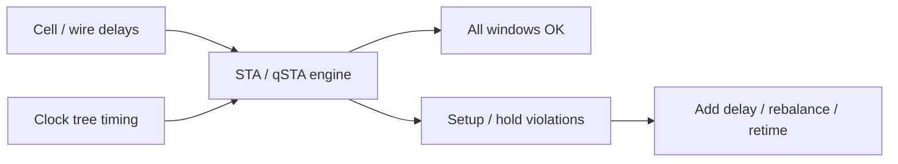
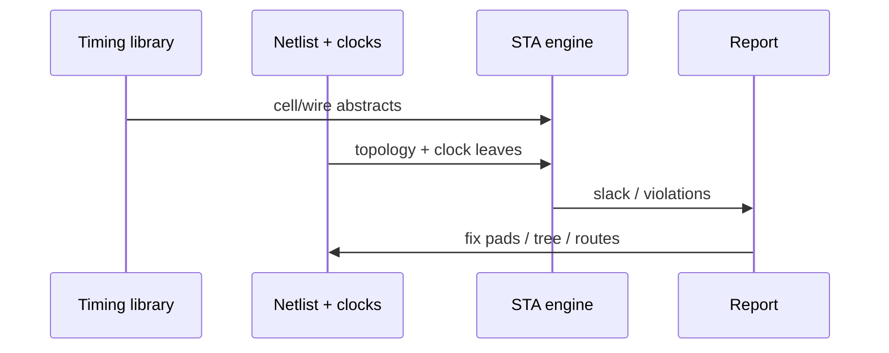

# SFQ Static Timing Analysis (STA Intuition)

**Prereqs:** [Path Balancing Overhead](path-balancing-overhead.md) · [Concurrent-Flow and Counter-Flow Clocking](concurrent-and-counter-flow-clocking.md)  
**Next:** [Hybrid JTL–PTL Routing](hybrid-jtl-ptl-routing.md)  
**Tracks:** `eda-timing-verification`

**Learning goals.** After this page you should be able to (1) map CMOS-like **setup** and **hold** ideas onto SFQ pulse logic, (2) list what an SFQ STA tool checks at a newcomer level, (3) see how clock skew, path balance, and JTL/PTL delays enter the picture, and (4) separate public timing intuition from private tool algorithms (qSTA, CPPR, named flows).

## Why this matters

**Static timing analysis (STA)** asks: given delays on gates and wires, will every pulse arrive in the **legal timing window** relative to clocks — **without** simulating every input pattern?

In RSFQ, the “signal” is an **SFQ pulse** and many cells are themselves clocked stages. STA (and cousins like **qSTA** in the literature) checks pulse arrival times against clock pulses at each cell. Without this mindset, chip bring-up becomes endless waveform guessing — and path-balance bugs masquerade as “mysterious” logic errors.

Glossary: [STA](../glossary.md), [Clock window](../glossary.md), [Path balancing](../glossary.md), [JTL](../glossary.md), [PTL](../glossary.md).

## Intuition — windows, not infinite pattern sim

In CMOS, STA tracks data arrival vs clock edges at flip-flops:

- **Setup** ≈ arrive early enough before the capturing edge,
- **Hold** ≈ do not arrive so early that the previous state is corrupted.

In RSFQ the same English words appear, but:

- data and clocks are **pulses**,
- sinks include DFFs **and** many other clocked gates,
- [path balance](path-balancing-overhead.md) is part of legality, not an optional architectural flourish,
- interconnect may be [JTL](jtl-interconnects.md) stages or [PTL](hybrid-jtl-ptl-routing.md) hops with different delay models.

Public timing sketch at a capturing cell:

\[
t_{\mathrm{data}} \;\text{vs}\; t_{\mathrm{clk}} \pm \text{(setup-/hold-like margins)}
\]

with $t_{\mathrm{data}}$ and $t_{\mathrm{clk}}$ built from library delays along their paths.

## Analogy — subway clerk

A subway system publishes schedules (timing libraries). STA is the clerk who checks whether every transfer still works if each train is a bit slow or fast — **without** simulating every passenger’s day.

- Setup-like = “arrive before the doors close.”
- Hold-like = “don’t board so early that you spoil the previous train’s boarding.”

Bad analogy: “STA = full SPICE of the whole chip.” STA uses **abstract delays**; device-level sim is a different tool.

## Picture

```text
Clock pulse at cell:     ★
Legal data window:          [====]
Too early (hold risk):   ★
Too late (setup risk):                ★

SFQ STA walks paths:
  source → delays → sink cell vs local clock
```



```text
Delay sum cartoon:

  t_data = Σ (gate delays) + Σ (JTL stages) + (PTL flight if any)
  t_clk  = Σ (splitter / clock path delays) + skew terms
  check t_data against t_clk ± window constraints
```



## Interactive lab

Try this in place. Prefer full-screen? Open the [lab page](../labs/sfq-static-timing-analysis.html).

1. Click **Preset: setup fail** — data arrives too late vs the clock; setup slack goes negative. Raise **JTL pads** until setup clears (watch hold).
2. Click **Preset: hold fail** — data is too early; add pads or reduce skew. Toggle **Epoch mismatch** to see balance flagged *before* blaming window numbers.

<iframe
  src="../../labs/sfq-static-timing-analysis.html"
  title="SFQ static timing analysis lab"
  style="width:100%;height:760px;border:1px solid rgba(0,0,0,0.12);border-radius:0.35rem;background:#fff;"
  loading="lazy"
></iframe>

## What SFQ STA cares about (public list)

| Check | Plain meaning |
|-------|----------------|
| Setup-like | Data pulse arrives before the capturing clock window ends |
| Hold-like | Data is not so early it races through incorrectly |
| Clock skew | Different branches of the splitter tree are not identical |
| Path balance | Reconvergent paths share an epoch ([overhead card](path-balancing-overhead.md)) |
| Heterogeneous cells | DFFs, NDROs, clockless gates have different pin rules |
| Interconnect model | JTL stage sums vs PTL flight + driver/receiver |

## Building $t_{\mathrm{data}}$ and $t_{\mathrm{clk}}$ (field-fundamental)

**Data path** may include:

- clocked gate delays,
- [JTL](jtl-interconnects.md) stage sums,
- [splitter](splitter-and-confluence.md)/confluence on data,
- [PTL](hybrid-jtl-ptl-routing.md) driver + flight + receiver when hybrid.

**Clock path** may include:

- splitter-tree levels,
- matching JTL stubs,
- intentional deskew cells,
- (sometimes) PTL trunks for long clock distribution.

Skew between two leaves is roughly the difference of their clock-path delays. Both [concurrent-flow and counter-flow](concurrent-and-counter-flow-clocking.md) styles still need this accounting — only the geography of pain changes.

## CMOS contrast

| Topic | CMOS STA | SFQ STA intuition |
|-------|----------|-------------------|
| Signal | Levels / edges | SFQ pulses |
| Capture points | Mostly FFs/latches | Many clocked cells |
| Wire model | RC / SPEF-like | JTL stages and/or PTL |
| Multi-cycle paths | Common option | Epoch discipline dominates |
| Fix actions | Upsize, retime, pipeline | Add JTL/DFF pads, rebalance, retune tree |
| Balance | Optional architectural | Often mandatory at reconvergence |

## Worked example 1 — Illustrative setup check

Data path delay to a DFF is $20\,\text{ps}$; the clock arrives $5\,\text{ps}$ after the previous stage’s clock (skew). Suppose the cell needs data at least $8\,\text{ps}$ before its clock pulse (setup-like constraint — **numbers illustrative only**).

Public reasoning pattern:

1. Compute data arrival relative to the capturing clock pulse.
2. Subtract required setup-like margin.
3. If negative slack → shorten data path, move clocks, or relax constraints.
4. Re-check hold on the same corner after the fix.

Real tools use characterized tables — private/tool depth.

## Worked example 2 — Illustrative hold check

A short path is only $2\,\text{ps}$ of data delay into the next stage while clock skew makes the capturing clock relatively late. Hold-like risk appears: data may race through.

Fixes (public menu):

- insert [JTL](jtl-interconnects.md) delay on the short path,
- insert a [DFF](rsfq-dff-and-retiming.md) to force an epoch boundary,
- rematch [splitter](splitter-and-confluence.md) branches if skew is the villain,
- revisit [clock-flow style](concurrent-and-counter-flow-clocking.md) geography.

## Worked example 3 — Balance failure looks like “timing”

Two inputs to a gate come from epoch 3 and epoch 5 because pads were forgotten. Pattern simulation might show “wrong XOR results” intermittently. STA/balancing analysis classifies it as **epoch mismatch**, not mysterious device physics.

Public lesson: run balance + window checks before blaming junctions.

## Worked example 4 — Hybrid net underestimates

An engineer models a long net as “$8\times\tau_{\mathrm{JTL}}$” but the router actually inserted driver–PTL–receiver. True delay includes flight and interfaces. Setup slack that looked positive becomes negative in silicon-minded STA.

Fix the **timing graph model**, not only the Boolean netlist. See [Hybrid JTL–PTL](hybrid-jtl-ptl-routing.md).

## Worked example 5 — Fix loop that newcomers should expect

```text
1. Check path balance at reconvergences
2. Run setup-/hold-like window checks
3. If hold fails → add JTL/DFF or fix skew
4. If setup fails → shorten data, retime, or adjust clock
5. Re-check the other constraint (fixes interact)
6. Re-check balance if stages were added/removed
```

This loop is the public “STA lifestyle,” independent of any named academic tool.

## Slack language without a tool vendor

Borrowed CMOS words still help:

- **Slack** ≈ how much margin remains before a window fails.
- **Critical path** ≈ the chain with the worst setup-like slack (or the tightest hold-like path, depending on report).
- **Corner** ≈ a consistent pessimistic or optimistic delay assumption set (bias, temp, process abstract) — exact corner tables are private/PDK.

Public setup-like cartoon at one capturing cell:

\[
t_{\mathrm{slack,setup}} \approx \bigl(t_{\mathrm{clk}} - t_{\mathrm{data}}\bigr) - t_{\mathrm{setup,req}}
\]

(sign conventions vary by tool; learn the **idea**, not a universal equation). Hold-like checks flip the early-arrival worry. After any fix, re-check **both** families — shortening a path to help setup can create hold, and adding [JTL](jtl-interconnects.md) delay to help hold can create setup.

## Multi-clock and multi-domain cautions (field-fundamental)

Large SFQ chips may have:

- multiple clock frequencies or gated regions,
- [concurrent-flow vs counter-flow](concurrent-and-counter-flow-clocking.md) regions side by side,
- [hybrid JTL–PTL](hybrid-jtl-ptl-routing.md) trunks with different delay models,
- [serial-bias](serial-biasing-current-recycling.md) islands that also constrain where clocks and data may cross.

Public discipline at a domain boundary:

1. Name the **clock leaf** that captures each cell.
2. Name the **delay model** on every net (JTL stages vs PTL flight + interfaces).
3. Check **epoch balance** at every reconvergence ([path balancing](path-balancing-overhead.md)).
4. Treat island / level-shifter crossings as first-class timing objects, not invisible wires.

STA that only sees Boolean connectivity without those annotations is incomplete for SFQ.

```text
Boundary checklist:

  [domain A] ──► (model?) ──► [domain B]
       ↑                          ↑
    clk leaf A                 clk leaf B
    balance?                   balance?
```

## What a newcomer should read in a timing report

Ignore vendor chrome; hunt for:

| Report item | Plain meaning |
|-------------|---------------|
| Setup / hold violation at cell X | Pulse vs local clock window failed |
| Skew between leaves | Splitter-tree (or PTL trunk) mismatch |
| Path with many JTLs | Active delay sum may dominate |
| Path with PTL segment | Did the graph include driver/rx/flight? |
| Reconvergent inputs | Epoch counts matched? |
| Suggested fix pads | Often JTL delay or DFF retiming |

If the report never mentions balance or pulse windows, you may be looking at a CMOS-shaped flow incorrectly applied to SFQ — or at a summary that hid the SFQ-specific checks. Ask for the pulse/epoch view.

## Common misconceptions

- **“STA means full SPICE of the chip.”** STA uses delay abstracts; transistor/JJ-level sim is different.
- **“SFQ STA = CMOS STA with a cold PDK.”** Pulses, pervasive clocks, balance, JTL/PTL differ.
- **“If functional sim passes one vector, timing is fine.”** Static checks cover corners vectors miss.
- **“Skew is negligible.”** Splitter trees make skew first-class.
- **“qSTA / CPPR details belong on this page.”** Named algorithms → private explainers when tied to papers.
- **“Hold only happens in concurrent-flow.”** Both styles can create early/late problems with bad delays.
- **“Balance is separate from STA.”** In SFQ practice, epoch match is part of timing legality.
- **“One global clock edge like CMOS is the model.”** Many cells each see a **local clock pulse leaf**.

## Bridge to SFQ circuits

- Timing ↔ [gate-level pipelining](../bridge/gate-level-pipelining.md) and [clock flow](concurrent-and-counter-flow-clocking.md).
- Wire delay choice ↔ [JTL vs PTL](hybrid-jtl-ptl-routing.md).
- Pads ↔ [path balancing](path-balancing-overhead.md).
- Clock fanout ↔ [splitters](splitter-and-confluence.md).
- Paper tool flows (ColdFlux, qSTA variants) → private explainers.
- Track map: [EDA Timing & Verification](../tracks/eda-timing-verification/ROADMAP.md).

## What stays private

Characterized `.lib`-like tables, CPPR internals, qSTA formulations, and named industrial/academic tool chains → private paper explainers.

## Check yourself

<details>
<summary>1. What does STA try to avoid simulating?</summary>

Every possible input pattern; it uses delay constraints/windows instead.
</details>

<details>
<summary>2. Setup-like vs hold-like in one line each?</summary>

Setup-like: pulse too **late** for the clock window. Hold-like: pulse too **early** / race hazard.
</details>

<details>
<summary>3. Why is SFQ STA not identical to CMOS STA?</summary>

Signals are pulses; most gates are clocked pipeline stages; cell types and clock trees differ; path balance is central.
</details>

<details>
<summary>4. Name three inputs an SFQ STA engine needs.</summary>

Cell/wire delay models, clock-tree timing/skew, and the netlist with cell types/pin rules (plus balance views).
</details>

<details>
<summary>5. Give two public fixes for a hold-like violation.</summary>

Add JTL delay on the short path; rematch clock-tree branches; or insert a DFF epoch boundary.
</details>

<details>
<summary>6. How can a path-balance bug appear in the lab?</summary>

As wrong logic at reconvergent gates even when devices are “healthy” — inputs from mismatched epochs.
</details>

<details>
<summary>7. Why must hybrid PTL nets appear explicitly in the timing graph?</summary>

Because delay includes driver, flight, and receiver — not only JTL stage sums.
</details>

<details>
<summary>8. After fixing setup by shortening a path, what should you re-check?</summary>

Hold-like margins (and path balance if stages changed) — fixes interact.
</details>

## Next steps

- When to use passive lines: [Hybrid JTL–PTL Routing](hybrid-jtl-ptl-routing.md).
- Padding cost: [Path Balancing Overhead](path-balancing-overhead.md).
- Clock directions: [Concurrent-Flow and Counter-Flow Clocking](concurrent-and-counter-flow-clocking.md).
- Track roadmap: [EDA Timing & Verification](../tracks/eda-timing-verification/ROADMAP.md).
- Plain terms: [Glossary](../glossary.md).
