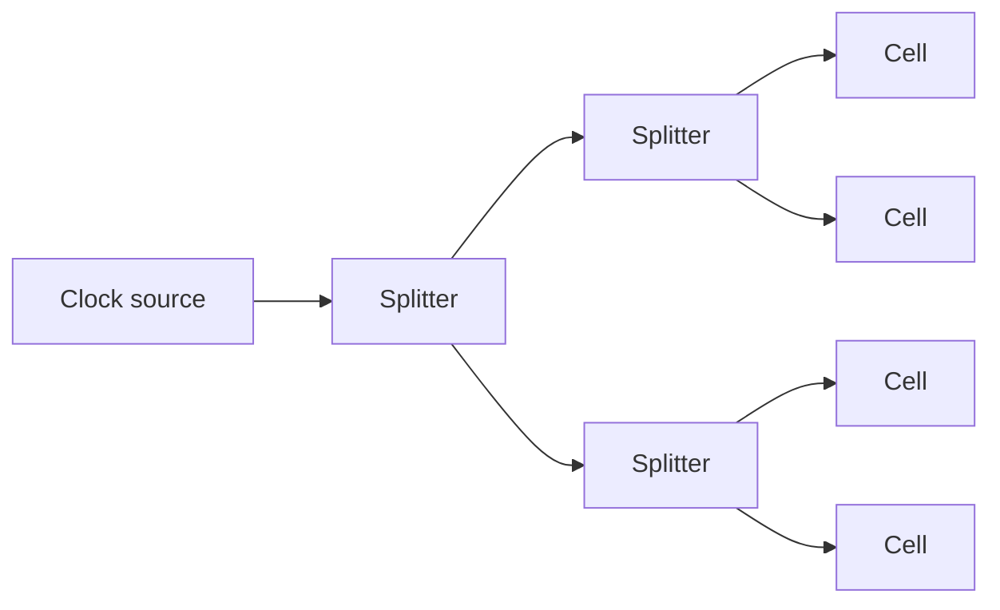
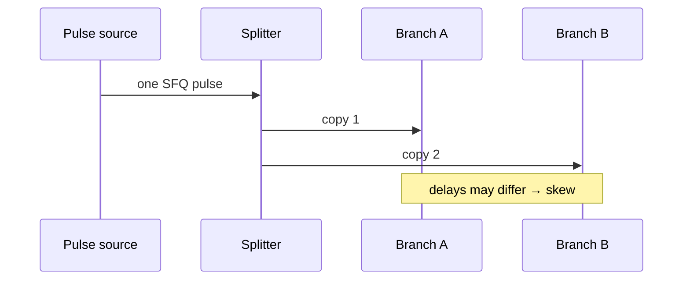

# SFQ Splitters and Confluence Buffers

**Prereqs:** [JTL Interconnects](jtl-interconnects.md)  
**Next:** [RSFQ DFF and Retiming](rsfq-dff-and-retiming.md) · [Concurrent-Flow and Counter-Flow Clocking](concurrent-and-counter-flow-clocking.md)  
**Tracks:** `sfq-logic-primitives` · `clocking-biasing-power`

**Learning goals.** After this page you should be able to (1) use **splitters** as the native fanout mechanism for SFQ pulses, (2) describe **confluence** (merger) cells and why simultaneous arrivals are hazardous, (3) reason about splitter-tree depth, delay, and skew for clocks, (4) connect fanout/merge choices to later [clocking](concurrent-and-counter-flow-clocking.md) and [STA](sfq-static-timing-analysis.md) pages, and (5) budget tree cost in order-of-magnitude thinking without PDK numbers.

## Why this matters

CMOS gates tolerate capacitive fanout within reason; you add buffers when load grows. RSFQ pulses are **discrete tokens**. One junction output does not magically become eight clean $\Phi_0$ pulses on eight wires. The standard library answer is the **splitter**: typically one pulse in, two pulses out.

The dual problem is **merging**: bringing pulses from two lines onto one. That is a **confluence** (merger) cell — safe only with timing discipline. Clock trees, data broadcast, and reconvergent datapaths all lean on these two plumbing cells.

Glossary: [Splitter](../glossary.md), [Confluence](../glossary.md), [Clock window](../glossary.md), [JTL](../glossary.md), [SFQ pulse](../glossary.md).

## Intuition

- **Splitter:** copy one SFQ pulse onto two outputs (fanout-2). Cascaded splitters build binary trees for clocks and wide data fanout.
- **Confluence:** accept pulses from two inputs and emit onto one output when the cell’s timing rules are satisfied. It is **not** a CMOS wired-OR you can abuse casually.

Together with [JTLs](jtl-interconnects.md) and [DFFs](rsfq-dff-and-retiming.md), splitters and confluence cells are the plumbing of pulse logic.

Public tree-depth cartoon for fanout-2:

\[
d \ge \lceil \log_2 N \rceil
\]

to reach $N$ leaves in a balanced binary tree (plus matching delay cells on branches). Ideal full binary tree of $N$ leaves uses $N-1$ fanout-2 splitters.

## Analogy

- **Splitter** = a photocopier for batons: one token in → two tokens out (energy and junctions paid at the machine).
- **Confluence** = two on-ramps onto one highway lane: safe if cars are staggered; disaster if two occupy the same asphalt at once.
- **Clock tree** = a tournament bracket run in reverse: one root pulse becomes many leaf pulses.

The analogy is about **token duplication and merge hazards**, not about literal optics or traffic physics inside the chip.

## Picture

```text
Splitter:                    Confluence (cartoon):

   in──X──┬──out1               inA──X──┐
          └──out2               inB──X──┼──out
```



```text
Fanout tree depth (fanout-2 splitters):

  leaves N = 8  ⇒  need at least ceil(log2 N) = 3 splitter levels
  (plus JTLs/matching on branches)

  full binary tree: N-1 = 7 splitters for 8 leaves
```



## Interactive lab

Try this in place. Prefer full-screen? Open the [lab page](../labs/splitter-and-confluence.html).

1. **Splitter tab:** fire a pulse; raise **extra delay on branch B** and watch leaf skew grow. Check how $N$ leaves set tree depth $\lceil\log_2 N\rceil$ and $N-1$ splitters.
2. **Confluence tab:** set arrival offset, then launch. Large stagger → merge OK; nearly simultaneous → hazard (pedagogical window, not a PDK number).

<iframe
  src="../../labs/splitter-and-confluence.html"
  title="Splitter and confluence lab"
  style="width:100%;height:720px;border:1px solid rgba(0,0,0,0.12);border-radius:0.35rem;background:#fff;"
  loading="lazy"
></iframe>

## Splitter trees — depth, delay, skew

For fanout-2 splitters, reaching $N$ leaves needs tree depth at least

\[
d \ge \lceil \log_2 N \rceil.
\]

Each level adds:

- junction count and bias,
- delay (affects when leaves see the pulse),
- opportunity for **skew** if branches are unmatched.

| Design concern | Why splitters matter |
|----------------|----------------------|
| Clock to many DFFs | Almost every RSFQ chip needs a clock tree |
| Broadcast a data pulse | Same tree idea on data |
| Skew | Mismatched branch delays move setup/hold pressure |
| Power | Every splitter switches and draws bias |
| STA | Leaf arrival times enter every window check |
| Path balancing pads | Every padding [DFF](rsfq-dff-and-retiming.md) needs a clock leaf too |

Public discipline: **draw the tree**, do not assume a star net from one pin to $N$ loads.

### Skew as a first-class number

If branch A after the last common splitter has delay $t_A$ and branch B has $t_B$, the leaf skew is roughly

\[
\Delta t_{\mathrm{skew}} \approx |t_A - t_B|.
\]

Those times include splitter internals **plus** [JTL](jtl-interconnects.md) stubs. [STA](sfq-static-timing-analysis.md) treats $\Delta t_{\mathrm{skew}}$ as part of every setup-/hold-like check at the leaves.

## Confluence — merge with rules

A confluence cell is the pulse-world cousin of a merger. Field-fundamental cautions:

1. **Do not assume** two pulses arriving in the same tiny interval produce two neat outputs later — behavior is cell-specific; treat collisions as **hazards** until a library card says otherwise.
2. Merging is often used when mutually exclusive pulses share a wire (protocol-level exclusivity), or when timing guarantees separation.
3. After a merge, downstream timing still sees **one** line — path balancing and STA still apply at the next sinks.
4. Confluence is **not** a substitute for an OR/XOR datasheet unless the library explicitly defines Boolean behavior that way.

```text
Hazard cartoon:

  inA: ★
  inB:  ★   ← too close
  out: ???  (library-defined; not a free CMOS OR)
```

## CMOS contrast

| Topic | CMOS | RSFQ split / confluence |
|-------|------|-------------------------|
| Fanout | Capacitive load; buffer chain | Discrete splitter cells (often FO2) |
| Wired-OR / open-drain tricks | Sometimes used | Not the mental model; use confluence carefully |
| Clock tree | Buffered H-tree / mesh | Splitter tree (+ JTL stubs) |
| Merge hazard | Contention / X on bus | Pulse collision / illegal double arrival |
| Skew | Buffer mismatch / RC | Splitter + JTL branch mismatch |
| “Wire to N loads” | Often legal until load fails | Illegal mental model — tree required |

## Worked example 1 — Clocking eight DFFs

You need a clock pulse at eight DFFs.

1. Start from one clock source (or one distribution point).
2. Build a balanced fanout-2 tree: depth $3$ reaches $8$ leaves.
3. Match branch JTLs so leaf arrival times are close (skew budget).
4. Feed each DFF clock pin; data pins have their own path-balance story.

Cost sketch (order-of-magnitude thinking, not a PDK):

- splitters in a full binary tree of 8 leaves: $7$ splitters,
- plus matching delay cells on short branches,
- plus bias for all of the above.

Exact junction counts are library-private; the **tree arithmetic** is public.

## Worked example 2 — Unbalanced tree creates skew

Suppose one clock branch has 2 JTL stages after its last splitter and the other has 5. If $\tau_{\mathrm{JTL}}$ is comparable on both, the skew is about $3\tau_{\mathrm{JTL}}$.

Effects:

- one DFF may see clock early → hold pressure on its data,
- the other may see clock late → setup pressure,

even if Boolean logic is identical. Fix by matching delays or redesigning the tree — the same theme as [path balancing](path-balancing-overhead.md) applied to **clock** rather than data.

## Worked example 3 — When confluence is appropriate

Two mutually exclusive event pulses (never both in the same epoch by protocol) share a monitor line through a confluence into one SFQ/DC converter.

Safe pattern:

- upstream logic guarantees at most one pulse per window,
- confluence merges onto one wire,
- instrumentation sees a single stream.

Unsafe pattern:

- two independent data paths that can both fire in one window,
- hope the confluence “ORs” them like CMOS.

Public rule: **exclusivity or separation first; confluence second.**

## Worked example 4 — Data broadcast of one pulse to four sinks

A rare event pulse must reach four monitors. Build a depth-$2$ splitter tree ($3$ splitters for 4 leaves in a full binary tree). Match branch JTLs. Do **not** tie four loads to one junction pin and hope for four clean $\Phi_0$ copies.

## Worked example 5 — Clock style still needs trees

Whether the chip uses [concurrent-flow or counter-flow](concurrent-and-counter-flow-clocking.md) clocking, leaves still come from splitter trees. Style changes the geography of clock vs data; it does not invent infinite fanout.

## Worked example 6 — Padding DFFs multiply clock leaves

A reconvergent merge needs $k=4$ padding DFFs on a short path ([path balancing](path-balancing-overhead.md)). Those four DFFs each need a clock pin. Public cascade:

1. Boolean imbalance → pad DFFs,
2. pad DFFs → more clock leaves,
3. more leaves → deeper or bushier splitter tree,
4. bushier tree → more skew management and bias.

Overhead is not “just four DFFs” — it pulls the clock network with it.

## Common misconceptions

- **“Fanout is free like a Verilog wire.”** Physical fanout is splitter cells.
- **“One big junction drives everything.”** Trees exist because pulses are regenerated/copied locally.
- **“Confluence = XOR or OR of Booleans.”** It is a pulse merger with timing rules, not a substitute for a logic gate datasheet.
- **“Balanced clock tree means zero skew forever.”** Layout, bias, and JTL mismatch still create skew; STA must see it.
- **“Splitters only matter for clocks.”** Data broadcast and multi-sink nets use them too.
- **“Confluence removes path balancing.”** Downstream sinks still need epoch discipline.
- **“Depth formula $d=\lceil\log_2 N\rceil$ includes matching JTLs.”** It counts splitter levels; stubs are extra.
- **“Counter-flow clocking deletes the tree.”** Direction changes; fanout physics does not.

## Bridge to SFQ circuits

- Storage after distribution: [RSFQ DFF](rsfq-dff-and-retiming.md).
- Clock direction relative to data: [Concurrent / counter-flow](concurrent-and-counter-flow-clocking.md).
- Skew and windows in tools: [SFQ STA](sfq-static-timing-analysis.md).
- Active segments on branches: [JTL](jtl-interconnects.md).
- Pads that need clock taps: [Path balancing](path-balancing-overhead.md).
- Long trunks feeding local trees: [Hybrid JTL–PTL](hybrid-jtl-ptl-routing.md).

## What stays private

Named confluence hazard tables, exact splitter schematics per PDK, and CAD clock-tree synthesis algorithms → private explainers.

## Check yourself

<details markdown="1">
<summary markdown="span">1. What is a splitter for?</summary>

Fanout: replicate one SFQ pulse onto (typically) two output lines.
</details>

<details markdown="1">
<summary markdown="span">2. Roughly how many fanout-2 levels are needed to reach 16 leaves?</summary>

$\lceil\log_2 16\rceil = 4$ levels (in a balanced binary tree).
</details>

<details markdown="1">
<summary markdown="span">3. Why are splitter trees common for clocks?</summary>

One source must reach many clocked cells with controlled delay and skew.
</details>

<details markdown="1">
<summary markdown="span">4. Why be careful with confluence?</summary>

Merged pulses need timing discipline; near-simultaneous arrivals are hazards unless the cell/protocol guarantees safety.
</details>

<details markdown="1">
<summary markdown="span">5. Name two costs of a deep clock splitter tree.</summary>

Extra junctions/bias and added delay/skew management burden.
</details>

<details markdown="1">
<summary markdown="span">6. How does an unbalanced clock tree show up in timing?</summary>

As skew between leaves, shifting setup-like and hold-like margins at DFFs/gates.
</details>

<details markdown="1">
<summary markdown="span">7. How many fanout-2 splitters are in a full binary tree with 8 leaves?</summary>

$7$ ($N-1$ for $N=8$).
</details>

<details markdown="1">
<summary markdown="span">8. Can you safely treat confluence as a CMOS wired-OR for two independent data paths?</summary>

No — without exclusivity or guaranteed separation, collisions are hazards.
</details>

<details markdown="1">
<summary markdown="span">9. Why do path-balancing DFFs grow the clock tree?</summary>

Each padding DFF needs a clock leaf, so more pads ⇒ more splitter fanout work.
</details>

<details markdown="1">
<summary markdown="span">10. Write the public skew cartoon between two matched-looking leaves.</summary>

$\Delta t_{\mathrm{skew}}\approx|t_A-t_B|$ after the last common splitter, including JTL stubs.
</details>

## Next steps

- Storage and retiming: [RSFQ DFF and Retiming](rsfq-dff-and-retiming.md).
- Clock flow styles: [Concurrent-Flow and Counter-Flow Clocking](concurrent-and-counter-flow-clocking.md).
- Timing windows: [SFQ Static Timing Analysis](sfq-static-timing-analysis.md).
- Plain terms: [Glossary](../glossary.md).
