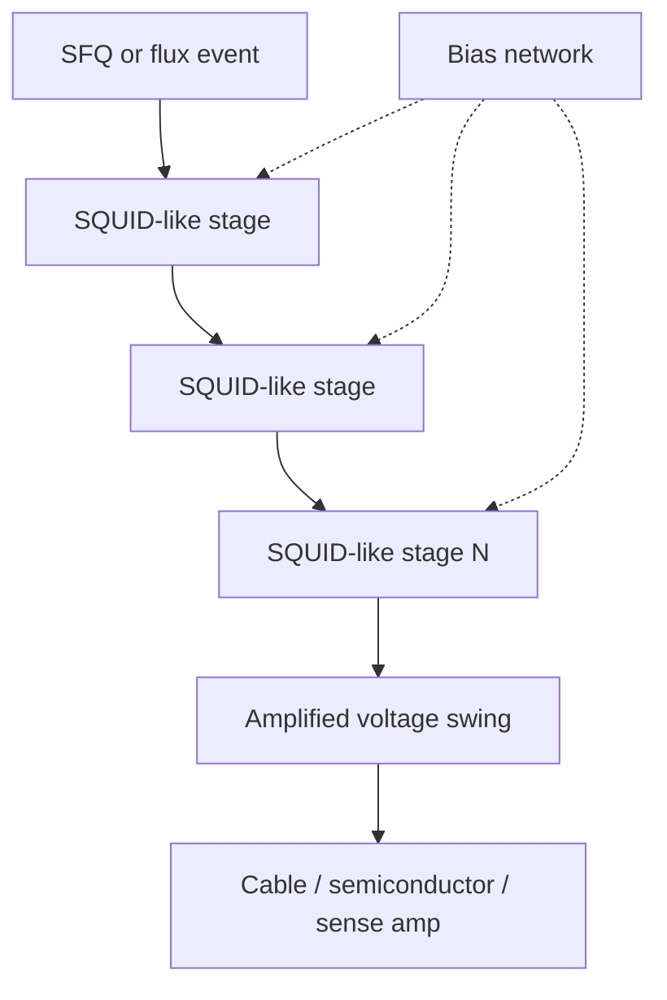

# SQUID Stack Driver

**Prereqs:** [From SFQ Pulses to Voltage Levels](../bridge/sfq-pulse-to-volt-level.md) · [Superconducting Loop / SQUID](../fundamentals/superconducting-loop-squid.md)  
**Next:** [Four-JL Latching Driver](four-jl-latching-driver.md) · [Josephson–CMOS Hybrid Memory](josephson-cmos-hybrid-memory.md) · [From SFQ Pulses to Voltage Levels](../bridge/sfq-pulse-to-volt-level.md)  
**Tracks:** `cryogenic-interfaces-io`

**Learning goals.** After this page you should be able to (1) explain why a single DC SQUID stage is often too weak for semiconductor or cable loads, (2) picture a **SQUID stack** as series flux-sensitive stages whose voltage contributions add, (3) contrast stack drivers with latching [4JL / Suzuki](four-jl-latching-driver.md) megaphones, (4) reason about stack height as a **voltage budget** knob (not a datasheet recipe), and (5) place SQUID stacks in the cryogenic I/O story without memorizing paper-specific schematics.

## Why this matters

On-chip [RSFQ](rsfq-logic.md)-style logic speaks in picosecond $\Phi_0$ pulses — typically millivolt-class peaks that are over before ordinary electronics can sample them. The bridge page [From SFQ Pulses to Voltage Levels](../bridge/sfq-pulse-to-volt-level.md) frames the gap: instruments, cryo-CMOS pads, and room-temperature gear want **taller and/or longer** voltage events.

One classic answer is to use the [DC SQUID](../fundamentals/superconducting-loop-squid.md) motif — two Josephson junctions on a loop — not as a magnetometer for Earth’s field, but as a **flux-to-voltage transducer** triggered by an SFQ event. A single stage’s swing is often still modest. Designers therefore place several SQUID-like stages **in series** so their voltage contributions **add**. That series chain is the **SQUID stack driver**: a field-fundamental I/O building block, not a particular paper’s netlist.

Without some form of megaphone, an SFQ chip is a whisper in a stadium of louder electronics. With a SQUID stack in the right place, the whisper becomes loud enough for the next domain — a cold semiconductor sense amp, a cable receiver, or a second Josephson amplifier stage — to hear.

Terms you will reuse: [Glossary](../glossary.md) — **SQUID**, **SQUID stack**, **SFQ pulse**, $\Phi_0$, **bias current**.

## Intuition — series voltage add-up

A DC SQUID’s effective critical current is modulated by the flux through its loop. When the device is biased near a sensitive working point, a flux / SFQ trigger can drive a voltage response across the SQUID. That response is still “Josephson-sized”: useful locally, often too quiet for a long cable or a CMOS input comparator.

If you put $N$ similar stages in **series** along the signal path (with appropriate bias and matching), the output voltage can scale roughly as

$$V_{\mathrm{out}} \sim N \cdot V_{\mathrm{stage}}$$

in the cartoon where each stage contributes a comparable swing $V_{\mathrm{stage}}$. Reality includes loading, mismatch, and readout bandwidth — but the **public design idea** is simply: **stack height trades junctions and bias for amplitude**.

The stack does **not** invent a new bit encoding. Internally the SFQ domain still thinks in $\Phi_0$ pulses and loop flux. The stack’s job is **interface transduction**: turn a weak SFQ/flux event into a larger voltage event that the next domain can sense.

Think of three layers of meaning when you read a schematic labeled “SQUID stack”:

1. **Physics layer** — each stage is a flux-sensitive Josephson loop pair (or a close cousin).
2. **Circuit layer** — stages sit in series so voltage drops add toward the load.
3. **System layer** — the block sits at a domain boundary, not inside every RSFQ gate.

Confusing those layers is how people end up putting magnetometer intuition into a digital datapath, or treating an I/O stack like “just another RSFQ cell with more junctions.”

## Analogy — dynamos on one wheel

One bicycle dynamo can power a dim lamp. Putting several dynamos in series on the same mechanical drive makes the lamp brighter: the voltages add along the series string. A SQUID stack is the Josephson version of that story — several flux-sensitive stages share the signal path so the **swing grows**.

A second helpful picture: a choir of soft singers. Each singer’s voice is still soft, but if they sing the same note in a carefully arranged chain that adds toward the listener, the room hears something louder. The choir does not invent a new language; it amplifies an existing message.

The analogies must not teach false physics: dynamos make continuous AC; SQUID stages produce short Josephson responses. The shared idea is **series amplitude**, not identical waveforms. Likewise, the choir analogy is about **additivity**, not about acoustic resonance inside the barrier.

## Picture — topology and signal path

```text
  SFQ / flux trigger
           │
           ▼
     ┌─────────────┐
     │ SQUID stage 1│  V1
     └──────┬──────┘
            │ series
     ┌──────▼──────┐
     │ SQUID stage 2│  V2
     └──────┬──────┘
            │
           ...
            │
     ┌──────▼──────┐
     │ SQUID stage N│  VN
     └──────┬──────┘
            ▼
      V_out ≈ V1+V2+…+VN
            │
            ▼
     cable / cryo-CMOS / instrument amp
```



```text
Waveform sketch (not to scale)

V |     /\      N stages → taller peak
  |    /  \     (still short compared with CMOS edges)
  |___/    \___
       ★ SFQ/flux trigger          time

Compare RSFQ gate pulse: tiny spike, area ~ Φ0, then V≈0
Compare latching driver: often taller AND wider until reset
```

## What each stage is doing (field-fundamental)

You do not need a full SQUID magnetometer course. For digital I/O, keep four sentences:

1. **Loop + junctions:** each stage is SQUID-*like* — flux through a loop changes how the junctions respond under bias ([loop / SQUID fundamentals](../fundamentals/superconducting-loop-squid.md)).
2. **Bias working point:** the stage is parked where a small flux change produces a useful voltage response, not parked in a dead zone where nothing moves.
3. **Series readout:** the voltage drops of the stages add toward the load; designers pay for that with more junctions, more bias taps, and matching constraints.
4. **Load awareness:** the “useful swing” is the voltage the **next** block can actually use under real loading — not the open-circuit cartoon peak from a lonely stage.

Exact $I_c$ values, shunt resistors, and measured millivolt-per-stage numbers are **process- and paper-specific** — leave them for private explainers. Public takeaway: **stack = intentional voltage budget**, not a random pile of SQUIDs.

### Bias and matching in plain language

Series stages share a readout path but still need each stage to sit near its sensitive bias point. In teaching language:

- Too little bias → the stage barely responds; stacking more quiet stages stays quiet.
- Too much bias → the stage may be stuck in a wrong regime or generate excess noise / unwanted switching.
- Mismatch between stages → the ideal $N\times$ sum shrinks; one weak stage can bottleneck the chain.

You do not need a foundry bias recipe here. You need the habit: **amplitude comes from physics + bias discipline**, not from drawing a taller box on a block diagram.

### Bandwidth and the time gap

The I/O bridge taught two gaps: **height** and **width**. A SQUID stack primarily attacks **height** by series add-up. It does not automatically stretch a picosecond event into a nanosecond plateau the way a [latching driver](four-jl-latching-driver.md) often does. If your semiconductor sampler is slow, ask whether you need a latching sibling — or a semiconductor stretcher — in addition to stack height.

### What the stack does *not* do

| Job people hope for | Reality |
|---------------------|---------|
| Invent CMOS rails by magic | Still Josephson-scale events; semiconductor gain often follows |
| Replace on-chip RSFQ timing | Interface only; datapath STA still applies on-chip |
| Turn every $\Phi_0$ into a perfect digital edge | Bandwidth, noise, and load still shape the waveform |
| Act as a free magnetometer | Digital I/O stacks are transducers for logic events, not geomagnetic sensors |

## Worked example 1 — Order-of-magnitude stack height

Suppose (cartoon numbers only) one well-biased stage can deliver about $V_1 \approx 1\,\text{mV}$ of useful swing into a light on-chip load, and a following cryo amplifier or latching stage wants something closer to $V_{\mathrm{need}} \approx 10\,\text{mV}$ before it can comfortably discriminate.

A naïve series count is

$$N \gtrsim \frac{V_{\mathrm{need}}}{V_1} \approx 10.$$

Ten stages do **not** magically produce a $1.8\,\text{V}$ CMOS rail. They may move you from “invisible to the next stage” to “usable by a semiconductor sense path or a second Josephson megaphone.” The remaining gap to room-temperature digital levels is often closed by **semiconductor amplifiers**, cable receivers, or [latching stacks](four-jl-latching-driver.md) — see the bridge checklist on [pulse → volt-level](../bridge/sfq-pulse-to-volt-level.md).

| Cartoon stage swing | Target interface swing | Naïve $N$ |
|---------------------|------------------------|-----------|
| $1\,\text{mV}$ | $5\,\text{mV}$ | $\sim 5$ |
| $1\,\text{mV}$ | $20\,\text{mV}$ | $\sim 20$ |
| $2\,\text{mV}$ | $20\,\text{mV}$ | $\sim 10$ |
| $1\,\text{mV}$ | $50\,\text{mV}$ | $\sim 50$ |

Use the table as **budget intuition**, not a PDK recipe. Loading and bandwidth can make the real required $N$ larger. If someone quotes a single millivolt-per-stage number from one paper as universal law, treat it as **local evidence**, not curriculum physics.

**Follow-on question inside the example.** Suppose loading cuts each stage’s useful swing to half of the open-circuit cartoon ($V_1^{\mathrm{eff}} = 0.5\,\text{mV}$) while the need stays $10\,\text{mV}$. Then

$$N \gtrsim \frac{10}{0.5} = 20.$$

Same physics story; the budget just got more honest about the load. That honesty is the point of the exercise.

## Worked example 2 — Where the stack sits in a hybrid path

Walk a bit from an SFQ datapath toward a cold CMOS memory pad ([Josephson–CMOS hybrid memory](josephson-cmos-hybrid-memory.md)):

1. An SFQ control cell emits a $\Phi_0$ pulse (or leaves flux in a loop that a readout junction escapes as a pulse).
2. That event is too small/short for a CMOS gate input.
3. A **SQUID stack** (or a latching driver — sibling choice) amplifies / shapes the event into a larger voltage transient.
4. A semiconductor receiver samples that transient and drives ordinary CMOS bitlines / wordlines.
5. Data returning into SFQ needs a reverse interface (with its own timing and BER discipline).

The stack is only step 3. If you forget steps 4–5, you have a megaphone pointed at nothing. If you forget step 3, CMOS never hears the whisper.

**Timing note (qualitative).** The SFQ side still must deliver the trigger in a legal timing window. The stack does not “fix” path-balancing mistakes upstream ([path balancing](path-balancing-overhead.md), [SFQ STA](sfq-static-timing-analysis.md)). It may *add* its own latency and recovery constraints to the interface budget.

## Worked example 3 — Choosing when *not* to use a SQUID stack

Three quick scenes:

| Scene | Prefer | Why (public) |
|-------|--------|--------------|
| On-chip RSFQ gate → neighboring RSFQ gate | [JTL](jtl-interconnects.md) / abutment | Same encoding; no megaphone needed |
| SFQ → slow semiconductor sampler that needs a **held** high | [4JL / Suzuki latching](four-jl-latching-driver.md) | Longer hold is a latching strength |
| SFQ / flux motif → moderate amplitude boost for a cryo sense amp | SQUID stack | Series flux→voltage add-up is the native story |

The curriculum teaches both megaphone families so you can read papers without treating one family as the only religion.

## Worked example 4 — Height budget vs system cost

Imagine two interface proposals for the same $V_{\mathrm{need}} \approx 20\,\text{mV}$:

| Proposal | Stage swing (loaded) | Naïve $N$ | What you pay (public) |
|----------|----------------------|-----------|------------------------|
| A | $2\,\text{mV}$ | $\sim 10$ | Moderate junction/bias count |
| B | $1\,\text{mV}$ | $\sim 20$ | More matching risk; more area |
| C | $2\,\text{mV}$ + semiconductor amp after a short stack | $\sim 5$ Josephson + FET gain | Split the amplitude job across domains |

Proposal C is often the realistic systems answer: the SQUID stack buys **enough** Josephson-scale headroom for a cold FET amp to finish the job. Public habit: ask “who closes the last decade of voltage?” — not “how tall can I stack forever?”

## Comparison table — SQUID stack vs latching driver vs RSFQ gate

| Aspect | RSFQ gate JJ | SQUID stack driver | 4JL / Suzuki latching |
|--------|--------------|--------------------|------------------------|
| Primary job | Pulse logic / storage escape | Flux→voltage amplitude via series stages | Triggered high-V latch until reset |
| Typical damping story | Overdamped ($\beta_C\lesssim 1$) | Design-specific; SQUID motif | Often underdamped stages |
| Output feel | Short $\Phi_0$ pulse, then $V\approx 0$ | Larger swing from series add-up | Taller / longer held voltage |
| Natural neighbor | JTL, DFF, gates | Cryo I/O, hybrid memory | Cryo I/O, hybrid memory |
| Cost knob | Cell library | Stage count $N$, bias, matching | Stack height, reset path |
| Failure if misused | — | Quiet output / mismatch | Stuck high without reset |

Designers pick SQUID stacks vs latching stacks by amplitude needs, speed, reset complexity, process, and system architecture. Paper bake-offs stay private; the public curriculum only needs both families on the map.

## CMOS contrast

| Question | CMOS “output buffer” habit | SQUID stack habit |
|----------|----------------------------|-------------------|
| What grows amplitude? | Wider FETs, higher $V_{DD}$, cascaded inverters | More **series SQUID-like stages** (and/or later semiconductor gain) |
| What is the input token? | Voltage level / edge | SFQ pulse or flux event |
| Does the buffer “hold a rail”? | Often yes (static high/low) | Not like CMOS rails; it produces a usable Josephson-scale voltage event for the next domain |
| Fanout mental model | Drive capacitance with current | Match stages, bias, and load impedance carefully |
| Same transistors as logic? | Often same FET family, sized differently | Often **not** the same overdamped pulse JJ story as RSFQ gates |
| “Stack” in the name | Might mean stacked FETs for voltage tolerance | Means **series Josephson/SQUID stages for voltage add-up** |

A CMOS designer who hears “stack” may picture stacked FETs for voltage tolerance. Here “stack” means series flux-sensitive stages — related English, different physics. See also [CMOS vs SFQ](cmos-vs-sfq.md).

## Common misconceptions

1. **“One SQUID is always enough for I/O.”**  
   Magnetometers can be exquisitely sensitive, but digital interface loads and cable environments often need explicit amplitude budget — hence stacks.

2. **“A SQUID stack turns SFQ into 1.8 V CMOS by itself.”**  
   Stacks buy millivolt-to-tens-of-millivolts class headroom in many cartoons; full CMOS rails usually still need semiconductor stages or different driver families.

3. **“SQUID stack = RSFQ gate with more junctions.”**  
   RSFQ gates are pulse machines. Stacks are **interface transducers**. Confusing them makes schematics unreadable.

4. **“Series stages always give exactly $N\times$ voltage.”**  
   Loading, mismatch, and bandwidth break the ideal sum. $N\times$ is a planning slogan, not a theorem.

5. **“If I use a SQUID stack, I do not need latching drivers (or vice versa).”**  
   Systems may use one family, the other, or both in different places. They are sibling megaphones, not mutually exclusive religions.

6. **“Bias is free because superconductors have zero DC resistance.”**  
   Stages still need bias networks; zero loop $IR$ drop does not mean zero system power ([bias / ERSFQ track](../bridge/resistive-bias-to-ersfq.md) for the broader story).

7. **“A taller stack always means a better interface.”**  
   Extra stages cost area, junctions, bias, matching difficulty, and often bandwidth. Past a point you may prefer a semiconductor amplifier or a latching sibling instead of endless series stages.

8. **“SQUID stack I/O is the same problem as on-chip JTL routing.”**  
   [JTL](jtl-interconnects.md) / [PTL](hybrid-jtl-ptl-routing.md) move $\Phi_0$ pulses inside the SFQ encoding domain. Stacks shout **out** of that domain. Different jobs.

## Bridge to SFQ circuits

- **Prerequisite physics:** [superconducting loop / SQUID](../fundamentals/superconducting-loop-squid.md) and the I/O gap on [pulse → volt-level](../bridge/sfq-pulse-to-volt-level.md).
- **Sibling megaphone:** [Four-JL latching driver / Suzuki stacks](four-jl-latching-driver.md) — underdamped latch story instead of (or in addition to) series SQUID add-up.
- **Who consumes the louder signal:** often [Josephson–CMOS hybrid memory](josephson-cmos-hybrid-memory.md) or instrument / DAC paths in the `cryogenic-interfaces-io` track.
- **What stays on-chip pulse land:** [JTL](jtl-interconnects.md) / [PTL](hybrid-jtl-ptl-routing.md) interconnect — no stack required until you leave the SFQ encoding domain.
- **Memory neighbor:** [Vortex Transitional RAM](vortex-transitional-ram.md) may stay entirely in flux language until a bit must leave the SFQ island.
- **Simulation netlists** are not pedagogy here; learn the idea first, then open process-specific drivers in projects or private explainers.

## Check yourself

<details>
<summary>1. Why stack SQUID stages instead of using one?</summary>

To add voltage swings so the output is large enough for the next interface stage (cable, cryo-CMOS, instrument amp). One stage is often too small.
</details>

<details>
<summary>2. What kind of input does a SQUID stack typically amplify?</summary>

A weak SFQ pulse or flux event from the superconducting logic / storage domain — not a CMOS rail voltage.
</details>

<details>
<summary>3. Is a SQUID stack the only SFQ I/O amplifier family?</summary>

No. Latching drivers (4JL / Suzuki stacks) are the main sibling family on this curriculum’s I/O map.
</details>

<details>
<summary>4. If each stage contributes about $1\,\text{mV}$ and you need about $15\,\text{mV}$, what naïve stage count do you estimate?</summary>

$N \gtrsim 15$. Treat it as a cartoon budget; loading may demand more.
</details>

<details>
<summary>5. Does a SQUID stack replace path balancing inside the SFQ datapath?</summary>

No. It is an **interface** block. On-chip SFQ timing, splitters, and clocking discipline remain unchanged until the signal leaves pulse land.
</details>

<details>
<summary>6. Name one CMOS-habit mistake when reading “stack.”</summary>

Thinking of stacked FETs for voltage tolerance / same-as-logic buffering, instead of series SQUID-like stages that add Josephson-scale voltage for transduction.
</details>

<details>
<summary>7. Loading halves each stage’s useful swing from $1\,\text{mV}$ to $0.5\,\text{mV}$, and you still need $10\,\text{mV}$. What happens to naïve $N$?</summary>

It doubles: $N \gtrsim 20$. The $N\times$ slogan must be evaluated at the *loaded* swing, not the open-circuit fantasy.
</details>

<details>
<summary>8. When should you *not* reach for a SQUID stack?</summary>

When the signal stays inside the SFQ domain (use JTL/PTL), or when the semiconductor side needs a long held high that latching drivers provide more naturally — among other system reasons.
</details>

<details>
<summary>9. Does stacking primarily close the time/width gap or the voltage/height gap?</summary>

Primarily the **height** gap via series add-up. Longer hold for slow samplers is often a latching-driver or stretcher job.
</details>

## Next steps

- Latching alternative: [Four-JL Latching Driver](four-jl-latching-driver.md).
- Why amplification is needed: [From SFQ Pulses to Voltage Levels](../bridge/sfq-pulse-to-volt-level.md).
- SQUID basics: [Superconducting Loop / SQUID](../fundamentals/superconducting-loop-squid.md).
- Hybrid consumer of I/O: [Josephson–CMOS Hybrid Memory](josephson-cmos-hybrid-memory.md).
- SFQ-native memory (often still needs drivers at the exit): [Vortex Transitional RAM](vortex-transitional-ram.md).
- Encoding decoder ring: [CMOS vs SFQ](cmos-vs-sfq.md).
- Plain terms: [Glossary](../glossary.md).
- Track map: [Cryogenic interfaces / I/O](../tracks/cryogenic-interfaces-io/ROADMAP.md).
