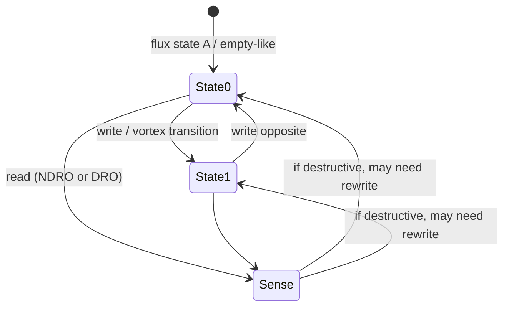
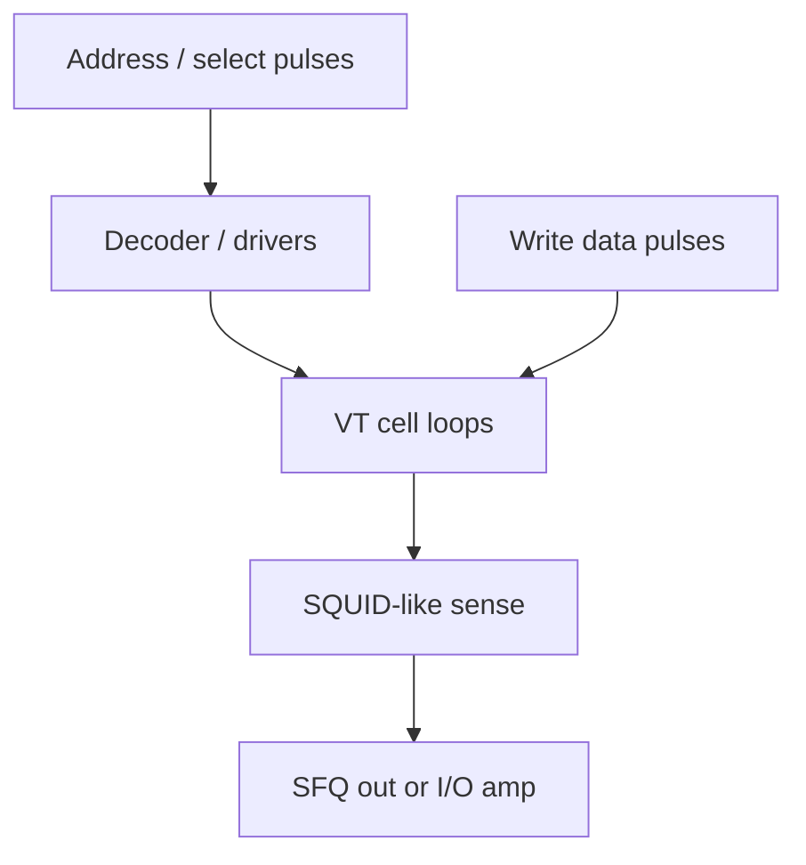

# Vortex Transitional RAM (VT-RAM Intuition)

**Prereqs:** [Superconducting Loop / SQUID](../fundamentals/superconducting-loop-squid.md) · [Pulse to Logic State](../bridge/pulse-to-logic-state.md)  
**Next:** [Josephson–CMOS Hybrid Memory](josephson-cmos-hybrid-memory.md) · [Four-JL Latching Driver](four-jl-latching-driver.md) · [SQUID Stack Driver](squid-stack-driver.md) · [From SFQ Pulses to Voltage Levels](../bridge/sfq-pulse-to-volt-level.md)  
**Tracks:** `cryogenic-memory`

**Learning goals.** After this page you should be able to (1) explain **vortex transitional memory** as SFQ-native RAM that stores bits as flux / vortex states in superconducting loops, (2) contrast that storage with CMOS DRAM capacitor charge and SRAM voltage feedback, (3) describe write as a **transition** between flux states and readout as sensing which state is present, (4) estimate circulating current from $I_{\mathrm{circ}}\approx\Phi_0/L$, and (5) see why density pressure later pushes systems toward [Josephson–CMOS hybrids](josephson-cmos-hybrid-memory.md).

## Why this matters

Logic without memory is a calculator that forgets. SFQ processors need scratchpads, register files, and caches just like CMOS systems — but the native token is the flux quantum $\Phi_0$, not a CMOS voltage rail.

**Vortex transitional (VT) RAM** is a classic SFQ-family approach: each cell stores information as a **flux / vortex configuration** in superconducting loops. Writing moves the cell between those configurations (a **transition**). Reading senses which configuration is present, often with a SQUID-like sensor, and may return an SFQ pulse into the logic domain.

This page teaches the **field-fundamental idea**. Cell schematics, measured density, margins, and array timings belong in private paper explainers — not here.

Why learn VT-RAM before hybrids? Because hybrids only make sense once you feel what “native SFQ memory” would be. Otherwise “Josephson–CMOS hybrid” sounds like a buzzword sandwich instead of a deliberate division of labor.

Glossary: [Glossary](../glossary.md) — **VT-RAM**, **SQUID**, $\Phi_0$, **SFQ pulse**, loop storage.

## Intuition — the bit is a flux state

CMOS DRAM stores charge on a capacitor. Many superconducting memories instead store a **fluxoid state** — a circulating-current / vortex configuration in a loop — readable by a SQUID-like sensor ([loop / SQUID fundamentals](../fundamentals/superconducting-loop-squid.md)).

You already know from [pulse to logic state](../bridge/pulse-to-logic-state.md) that an SFQ “1” can live as:

- a pulse in a timing window, or
- a circulating $\Phi_0$ held in a storage loop until clocked out.

VT-RAM extends the **loop storage** idea into an **array-oriented memory** vocabulary: address lines, write sequences, and sense paths built around vortex / flux transitions rather than $CV$ charge packets.

“Vortex” here is the condensed-matter / Josephson language for quantized flux entities in superconducting systems. For binary memory pedagogy, treat a vortex / fluxoid occupation as the thing that distinguishes state A from state B — you do not need a full Ginzburg–Landau course to use the word correctly at this depth.

### Write, hold, read in one paragraph

**Write** = force a transition between stable flux configurations using control pulses.  
**Hold** = leave the circulating state alone while the loop remains superconducting and undisturbed.  
**Read** = ask a sense element which configuration is present; optionally rewrite if the read was destructive.

That three-verb spine is enough to read most VT-style discussions without drowning in cell art.

### Why “transitional”?

The adjective highlights the **write mechanism**: you do not “charge a capacitor to $V$”; you **transition** the cell from one allowed fluxoid / vortex configuration to another. The stored information is *which state you left the cell in*, not a continuous analog charge.

## Analogy — snowboard half-pipe

A snowboard half-pipe can hold a rider on the left wall or the right wall. Writing is pushing the rider over the lip to the other side (a **transition**). Reading is peeking which wall they are on without (ideally) knocking them off.

VT-RAM is that story with magnetic flux vortices / fluxoid states instead of snowboarders. Destructive readout is like peeking so hard you knock the rider down and must rewrite; nondestructive readout is the careful peek.

A second analogy: a railroad switch with two stable tracks. Writing throws the switch. Reading looks which track the car is on. Disturbs are neighboring trains rattling the switch when you did not mean to throw it.

Neither analogy invents new physics; both emphasize **bistable configuration + transition + sense**.

## Picture — cell in an array, and state machine

```text
  Word / bit / control lines (SFQ pulses)
                 │
                 ▼
          ┌─────────────┐
          │   VT cell   │  ← loop(s) with vortex / flux states
          │   0 or 1    │
          └──────┬──────┘
                 │ readout SQUID / sense
                 ▼
          SFQ pulse out  and/or  interface amp
                 │
                 ├─► back into SFQ datapath
                 └─► [SQUID stack] / [4JL] if leaving SFQ domain
```





```text
Array cartoon (not a layout):

   cols →
 rows  [cell][cell][cell] ...
  ↓    [cell][cell][cell] ...
       ...
         ↑
    select / write / sense lines (pulse sequences)
```

## Interactive lab

Try this in place. Prefer full-screen? Open the [lab page](../labs/vortex-transitional-ram.html).

1. Select a cell, **Write 1** — loop shows circulating Φ₀; $I_{\mathrm{circ}}\approx\Phi_0/L$ updates with **L**.
2. **Read / sense** (NDRO vs toggle **DRO**). DRO empties then rewrites. Sweep addresses to fill the 8-cell strip.

<iframe
  src="../../labs/vortex-transitional-ram.html"
  title="Vortex transitional RAM lab"
  style="width:100%;height:740px;border:1px solid rgba(0,0,0,0.12);border-radius:0.35rem;background:#fff;"
  loading="lazy"
></iframe>

## Storage physics in one page of math intuition

For a storage loop of inductance $L$ holding about one flux quantum,

\[
I_{\mathrm{circ}} \approx \frac{\Phi_0}{L}.
\]

With $\Phi_0 \approx 2.07\,\text{mV}\cdot\text{ps}$, loop inductances of order $5$–$20\,\text{pH}$ give circulating currents of order $0.1$–$0.4\,\text{mA}$ — the same ballpark as many junction $I_c$ values. That matching is intentional: junctions must be able to **insert or remove** the circulating quantum when writing or reading.

| Loop $L$ | $I_{\mathrm{circ}}\approx\Phi_0/L$ |
|----------|----------------------------------|
| $5\,\text{pH}$ | $\sim 0.41\,\text{mA}$ |
| $10\,\text{pH}$ | $\sim 0.21\,\text{mA}$ |
| $20\,\text{pH}$ | $\sim 0.10\,\text{mA}$ |
| $40\,\text{pH}$ | $\sim 0.05\,\text{mA}$ |

VT cells are not “just a lone inductor.” Real cells combine loops, junctions, and bias so that two (or more) flux configurations are stable, and control pulses can force transitions with usable margins. The table is order-of-magnitude intuition shared with the SQUID fundamental page.

**Energy intuition (qualitative).** Changing flux state costs switching energy associated with junction events and inductive rearrangements. Holding a circulating supercurrent in an ideal superconducting loop has ~0 DC $IR$ loss in the loop itself — but the **array** still burns energy in drivers, bias, clocks, and sense. “Persistent current” is not a free-memory slogan.

### Fluxoid quantization reminder

From [flux quantization](../fundamentals/flux-quantization.md), the fluxoid through a superconducting loop is quantized in units of $\Phi_0$. Binary VT pedagogy usually uses **two** stable occupations (or empty vs occupied) as the bit labels. Multi-fluxoid cells exist in research; treat them as later leaves, not the first mental model.

## Worked example 1 — One-bit write / read story

**Setup.** A 1-bit VT cell encodes “0” as flux configuration A and “1” as configuration B.

**Write 1.** An SFQ write sequence (address select + data) drives a **vortex transition** A → B. Energy is spent in the switching events; the new circulating state then persists while the loop remains superconducting and undisturbed.

**Read.** A readout SQUID / sense junction asks “which state?” Two public outcomes:

- **NDRO-like story:** sense without destroying the stored configuration (ideal half-pipe peek).
- **DRO-like story:** sense by escaping the quantum as a pulse; the cell may return to empty / A and need a rewrite (knocked snowboarder).

**If the bit must leave the SFQ domain** — for instruments or semiconductor memory hierarchies — the sense event may feed a [SQUID stack](squid-stack-driver.md) or [4JL / Suzuki latching driver](four-jl-latching-driver.md) ([pulse → volt-level](../bridge/sfq-pulse-to-volt-level.md)).

**Check against CMOS habits.** In DRAM, read is often destructive and rewrite is routine. In VT-RAM, destructiveness is also a first-class design question — but the stored quantity is flux configuration, not capacitor charge.

## Worked example 2 — Why an array is harder than one cell

One cell teaches encoding. An array teaches **systems**:

1. **Decode:** turn address pulses into select events without illegally colliding pulses ([splitter / confluence](splitter-and-confluence.md) culture applies).
2. **Disturb:** neighboring cells must not flip when you write this one (magnetic / inductive coupling, shared bias).
3. **Timing:** write and read sequences are timed machines — same STA / path-balancing mindset as logic ([SFQ STA](sfq-static-timing-analysis.md), [path balancing](path-balancing-overhead.md)), plus memory-specific hazards.
4. **Density:** every cell costs junctions, inductors, and wiring. Capacity per chip is limited by cryogenic integration constraints — one reason hybrids appear next.

Cartoon capacity thought: if a cell costs on the order of tens of junctions (order-of-magnitude teaching number, not a datasheet), a megabit-class array is a **huge** Josephson budget. That pressure pushes architects toward semiconductor backing stores.

| Scale (cartoon) | Junctions if ~$30$ JJ/bit | Feeling |
|-----------------|---------------------------|---------|
| $1\,\text{kbit}$ | $\sim 3\times 10^4$ | Smallish SFQ island |
| $1\,\text{Mbit}$ | $\sim 3\times 10^7$ | Enormous Josephson / bias story |
| $64\,\text{Mbit}$ | $\sim 2\times 10^9$ | Why hybrids exist as an idea |

These are **teaching cartoons**, not process roadmaps. The qualitative cliff is the lesson.

## Worked example 3 — NDRO vs DRO decision sketch

Suppose a scratchpad is read much more often than written.

| Choice | Upside | Cost |
|--------|--------|------|
| Aim NDRO | Fewer rewrite cycles; simpler soft-error / rewrite bookkeeping | Harder sense design; may cost area / margins |
| Accept DRO | Sense can be simpler / louder in some topologies | Must rewrite; read latency and energy grow; hazards if rewrite fails |

Public curriculum does not crown a winner. It insists you **ask** the question every time you hear “VT cell readout.”

## Worked example 4 — Circulating current vs junction $I_c$

Suppose $L = 10\,\text{pH}$ and the cell is designed around one $\Phi_0$:

\[
I_{\mathrm{circ}} \approx \frac{\Phi_0}{L} \sim 0.21\,\text{mA}.
\]

If the write/escape junction has $I_c \approx 0.1\,\text{mA}$, it can be switched by control currents of similar scale — the numbers “talk to each other.” If someone proposed $L = 1\,\mu\text{H}$ for the same one-$\Phi_0$ storage, then

\[
I_{\mathrm{circ}} \approx \frac{\Phi_0}{10^{-6}} \sim 2\,\mu\text{A},
\]

which is an awkward match to typical SFQ junction currents and a poor fit for dense cryogenic digital cells. Public lesson: **loop size and $I_c$ are co-designed**; VT-RAM is not “any inductor with a label.”

## Where VT-RAM sits among memories

| Style | Stores | Typical neighbor |
|-------|--------|------------------|
| VT-RAM / SFQ loop memory | Flux / vortex states | Pure SFQ datapaths |
| RSFQ DFF / register | Circulating $\Phi_0$ until clock | Gate-level pipelines |
| Magnetic JJ memory | Magnetic barrier states | Cryogenic MRAM-like leaves (later) |
| Josephson–CMOS hybrid | SFQ control + CMOS density | [Hybrid memory card](josephson-cmos-hybrid-memory.md) |
| CMOS DRAM | Capacitor charge | Room-temp / cryo-CMOS arrays |
| CMOS SRAM | Cross-coupled voltage levels | Fast on-chip caches |

## CMOS contrast

| Question | CMOS DRAM / SRAM | VT-RAM intuition |
|----------|------------------|------------------|
| Where is the bit? | Cap charge (DRAM) or cross-coupled voltages (SRAM) | Flux / vortex configuration in superconducting loops |
| Natural quantum | Not usually single-electron | Designed around $\sim\Phi_0$ |
| Refresh? | DRAM needs refresh against leakage | Persistent supercurrent while superconducting; thermal / disturb issues differ |
| Readout | Sense amps on bitlines | SQUID-like sense; may be destructive |
| Wordline / bitline | Voltage / current domain | SFQ pulse control sequences + sense |
| Scaling hero | Lithography / cell capacitance | Junction count, inductors, bias, cryogenic wiring |
| “1” encoding | Voltage high / charge present | Flux configuration / pulse presence in a window |

Do not claim “zero power memory.” Persistent current in a superconducting loop has ~0 DC $IR$ loss in the loop itself, but arrays still need bias, drivers, and clocking energy. The contrast is **storage mechanism**, not free computation.

## Common misconceptions

1. **“VT-RAM is just CMOS DRAM fabricated in niobium.”**  
   The storage physics is fluxoid / vortex states, not capacitor charge.

2. **“Vortex means the bit is a swirling fluid you can see.”**  
   Pedagogically it means a quantized flux / fluxoid occupation used as a binary state label — not a weather animation.

3. **“If the loop is superconducting, readout never disturbs the bit.”**  
   Many superconducting memories have destructive or disturb-prone reads; NDRO is a design goal, not an automatic free lunch.

4. **“One $\Phi_0$ estimate sizes the whole memory chip.”**  
   $I_{\mathrm{circ}}\approx\Phi_0/L$ sizes a loop’s circulating current intuition. Arrays add decode, sense, bias noise, and coupling.

5. **“VT-RAM removes the need for I/O drivers.”**  
   Only while bits stay in the SFQ domain. Crossing to CMOS or room-temp gear still needs [pulse → volt](../bridge/sfq-pulse-to-volt-level.md) megaphones.

6. **“Hybrids exist because VT-RAM does not work.”**  
   VT-RAM works as a concept family; hybrids exist largely because **density and capacity** favor semiconductor arrays for bulk storage.

7. **“Persistent current means zero system energy.”**  
   Loop $IR$ loss can be ~0 while superconducting; drivers, bias, clocks, and sense still cost energy.

8. **“A DFF is already VT-RAM.”**  
   A DFF is loop storage for pipelining. VT-RAM is the **array memory** vocabulary built from related physics — address, disturb, density, sense paths.

## Bridge to SFQ circuits

- Builds on [loop storage](../fundamentals/superconducting-loop-squid.md) and [pulse ↔ state](../bridge/pulse-to-logic-state.md).
- Arrays need decoders, drivers, and timing — same pulse-logic culture as [RSFQ](rsfq-logic.md), plus memory hazards (destructiveness of read, disturb).
- Dense semiconductor arrays behind SFQ interfaces → [Josephson–CMOS Hybrid Memory](josephson-cmos-hybrid-memory.md).
- When bits exit SFQ: [SQUID stack](squid-stack-driver.md) and [4JL latching](four-jl-latching-driver.md).
- Track: `cryogenic-memory`.

## Check yourself

<details>
<summary>1. What does VT-RAM store instead of capacitor charge?</summary>

Flux / vortex (fluxoid) states in superconducting loops — circulating-current configurations around $\Phi_0$-scale quanta.
</details>

<details>
<summary>2. What does “transitional” refer to?</summary>

Writing by transitioning the cell between vortex / flux states.
</details>

<details>
<summary>3. Why might designers still want CMOS in the memory story?</summary>

For density / capacity beyond what pure SFQ loop arrays easily provide — hence Josephson–CMOS hybrids.
</details>

<details>
<summary>4. Estimate $I_{\mathrm{circ}}$ for $L = 10\,\text{pH}$ holding about one $\Phi_0$.</summary>

$I_{\mathrm{circ}} \approx \Phi_0/L \sim 0.21\,\text{mA}$ (order-of-magnitude).
</details>

<details>
<summary>5. Name one array-level hazard that a single-cell sketch hides.</summary>

Any of: address decode pulse collisions, disturb of neighbors, destructive read requiring rewrite, bias / timing margins across many cells.
</details>

<details>
<summary>6. Does VT-RAM use the same “bit = voltage rail” encoding as CMOS SRAM?</summary>

No. Bits are flux configurations / pulse events in the SFQ sense, not held CMOS logic levels on the storage element.
</details>

<details>
<summary>7. What is the difference between NDRO-like and DRO-like readout stories?</summary>

NDRO aims to sense without destroying the stored configuration; DRO senses in a way that may clear / alter the bit and require rewrite.
</details>

<details>
<summary>8. Why does a megabit-class all-VT cartoon look scary?</summary>

If each bit costs tens of junctions (teaching order-of-magnitude), megabits imply tens of millions of junctions before the processor — a huge integration and bias burden, which motivates hybrid architectures.
</details>

<details>
<summary>9. Why should $L$ and junction $I_c$ “talk to each other”?</summary>

Because $I_{\mathrm{circ}}\approx\Phi_0/L$ should be in a range junctions can insert/remove under control currents; wildly mismatched $L$ makes awkward cells.
</details>

<details>
<summary>10. Is a pipeline DFF the same thing as VT-RAM?</summary>

No. A DFF is loop storage for pipelining; VT-RAM is array-memory vocabulary (address, disturb, density, sense) built from related flux physics.
</details>

## Next steps

- Dense semiconductor backing store: [Josephson–CMOS Hybrid Memory](josephson-cmos-hybrid-memory.md).
- Loop storage basics: [Superconducting Loop / SQUID](../fundamentals/superconducting-loop-squid.md).
- I/O out of the SFQ domain: [From SFQ Pulses to Voltage Levels](../bridge/sfq-pulse-to-volt-level.md).
- Driver cards: [Four-JL Latching Driver](four-jl-latching-driver.md) · [SQUID Stack Driver](squid-stack-driver.md).
- Encoding decoder ring: [CMOS vs SFQ](cmos-vs-sfq.md).
- Plain terms: [Glossary](../glossary.md).
- Track map: [Cryogenic memory](../tracks/cryogenic-memory/ROADMAP.md).
