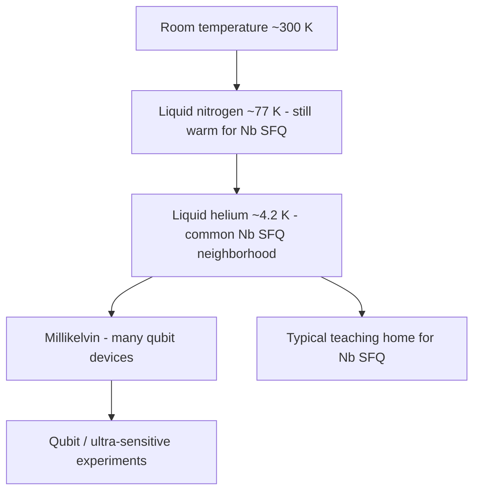

# Cryogenics for Electronics (Light)

**Prereqs:** [SFQ among logic families](sfq-among-logic-families.md)  
**Next:** [SFQ symbol card](sfq-symbol-card.md) · [How to read SFQ notation](reading-sfq-notation.md)

**In one minute.** ~4 K is a common Nb SFQ neighborhood; many qubits need mK. Fridge wall power and cables dominate systems. Next: symbol card / notation.

**Learning goals.** After this page you should be able to (1) explain why Nb-based SFQ logic commonly targets liquid-helium temperatures around ~4 K, (2) contrast that with millikelvin stacks used for many superconducting qubits, (3) list practical system taxes (coolers, heat leaks, connectors, turnaround time), and (4) carry a “thermal stage” mindset into later I/O and quantum-interface topics without becoming a cryogenics engineer yet.

## Why this matters

Every superconducting electronics advantage sits behind a wall labeled **cold**. If you skip cryogenics, later sentences — “4 K Nb process,” “mK qubit,” “heat load of cables” — sound like flavor text. They are not flavor text. They are **design constraints** as real as fanout or timing.

This page is intentionally **light**. It will not size cryocoolers or teach cryostat vacuum practice. It will give electronics learners a durable thermal map.

## Analogy: air-conditioned factory floors

Imagine chip design as a factory:

- **CMOS** usually works on the normal factory floor (room temperature).
- **Nb SFQ** often needs a deep walk-in freezer (~liquid helium temperatures).
- **Many superconducting qubits** need a nested set of colder rooms (dilution refrigerator stages down toward millikelvin).

Moving people (signals) between floors costs energy and complexity — elevators, doors, coats (attenuators, filters, thermalization). Co-locating work on one floor can help, but building that floor was expensive.

```text
  Room temp (~300 K)     warm electronics, most CMOS
        |
     50–4 K stages       shields, some cryo-CMOS / amplifiers
        |
      ~4 K               many Nb SFQ digital demos live here
        |
     1 K → mK            many qubit devices + ultra-sensitive stages
```

## Picture 1 — Temperature landmarks for this curriculum



### Why ~4 K shows up for Nb SFQ

Niobium’s critical temperature is near **9 K**. Liquid helium at atmospheric pressure is about **4.2 K**, giving comfortable margin for many Nb circuits to remain superconducting with practical cryostat technology. That is why so much classical SFQ literature sounds like a **4 K story**.

Liquid nitrogen (~77 K) is cold compared with room temperature but **far too warm** for bulk Nb superconductivity. Do not equate “cryogenic” with “cold enough for Nb SFQ.”

### Why millikelvin shows up for qubits

Superconducting qubits and some ultra-sensitive experiments need much colder stages to reduce thermal noise and to operate the quantum devices as designed. A dilution refrigerator is a different beast than a simple 4 K immersion or cryocooler setup.

**Teaching consequence:** an SFQ helper circuit at 4 K and a qubit at 20 mK are **neighbors in a thermal stack**, not roommates on the same plate by default.

## Picture 2 — System taxes (the bill you pay for cold)

```text
  Tax                    What it feels like to an electronics team
  ---------------------  ------------------------------------------
  Cooler power           Wall-plug watts >> chip milliwatts
  Turnaround time        Warm-up / cool-down cycles slow bring-up
  Heat leaks             Every cable is a suspicion
  Connectors / I/O       Room-temp FPGA ↔ cold chip is a project
  Vibration / EMI        Mechanical coolers can be noisy neighbors
  Access                 You cannot probe like a PCB on a bench
```

### Worked example 1 — “The chip uses microwatts, so the system is green”

**Prompt:** A demo quotes tiny on-chip dissipation.

**Correction steps:**

1. Ask whether the quote includes **bias networks**.  
2. Ask whether it includes **cryocooler wall power**.  
3. Ask about **duty cycle** and I/O activity.  

**Moral:** microwatts at 4 K can still sit behind hundreds of watts at the wall. Both numbers can be true.

### Worked example 2 — Cable counting as architecture

**Prompt:** A quantum system needs thousands of control lines from room temperature.

**Electronics intuition:** each line can inject heat and noise. That pushes architectures toward **multiplexing, proximal classical logic (SFQ or cryo-CMOS), and careful filtering** — which is why [landscape](superconducting-electronics-landscape.md) terminals meet in the cryostat.

## Comparison table — thermal homes

| Platform | Typical teaching temperature home | Cold enough for Nb SFQ? |
|----------|-----------------------------------|-------------------------|
| Bulk CMOS products | ~300 K | N/A (different devices) |
| Cryo-CMOS research | Often tens of K to ~4 K depending on work | Devices differ; temperature may overlap |
| Nb SFQ digital | Often ~4 K class | Yes (by design intent) |
| Many superconducting qubits | Millikelvin stages | Nb SFQ helpers may sit warmer in the stack |

## Common misconceptions

1. **“Cryogenic means liquid nitrogen.”**  
   LN2 is cryogenic but not Nb-SFQ-cold.

2. **“If the chip is superconducting, fridge power is negligible.”**  
   Fridge power often dominates system energy.

3. **“4 K and mK are basically the same.”**  
   Orders of magnitude apart in temperature and in refrigerator technology.

4. **“SFQ chips are tested like USB gadgets.”**  
   Cool-down cycles and limited access change lab culture.

5. **“Co-locating logic in the cold always wins.”**  
   It can win on cables/heat/latency, but you must budget cooler capacity and complexity.

6. **“Only physicists need to care about stages.”**  
   Digital architects meet stages when planning I/O and partitioning.

## CMOS contrast

| CMOS bring-up habit | Cryogenic bring-up habit |
|---------------------|--------------------------|
| Power the board, probe pins | Plan cool-down; limited live probing |
| Heat sink / fan thinking | Heat *leak* thinking (into the cold) |
| Iterate in minutes | Iterate in hours/days per cycle |
| Room-temp I/O is default | I/O across thermal stages is a first-class problem |

## Bridge to SFQ circuits

You now have motivation, history, landscape, family names, and a thermal map. The next page finally teaches **symbols and sketches** used throughout SFQ schematics:

→ [How to read SFQ notation](reading-sfq-notation.md)

After that, [superconductivity intuition](superconductivity-intuition.md) will reuse the ~4 K Nb comfort story with device meaning.

## Check yourself

<details>
<summary>1. Why is ~4 K a common neighborhood for Nb SFQ teaching?</summary>

Nb $T_c$ is near 9 K; liquid helium ~4.2 K provides practical margin for many Nb circuits.
</details>

<details>
<summary>2. Is liquid nitrogen cold enough for bulk Nb SFQ?</summary>

No — ~77 K is far above Nb $T_c$.
</details>

<details>
<summary>3. Why do qubit talks emphasize millikelvin?</summary>

Many superconducting qubit devices need much colder stages than 4 K digital Nb demos.
</details>

<details>
<summary>4. Name three system taxes of cryogenics for electronics teams.</summary>

Examples: cooler wall power, slow thermal cycles, cable heat leaks, hard I/O, limited probing, vibration/EMI.
</details>

<details>
<summary>5. Does a microwatt chip dissipation imply a microwatt system?</summary>

No — refrigeration and bias/I/O can dominate the wall-plug story.
</details>

<details>
<summary>6. What should you learn next?</summary>

[How to read SFQ notation](reading-sfq-notation.md), then superconductivity and Josephson device fundamentals.
</details>

## Glossary spot-links

Glossary: critical temperature $T_c$, cryogenic, Nb / niobium (as process metal), SFQ.

## Next steps

- Enter the symbol layer: [How to read SFQ notation](reading-sfq-notation.md).  
- Orientation complete — device intuition begins after notation.
