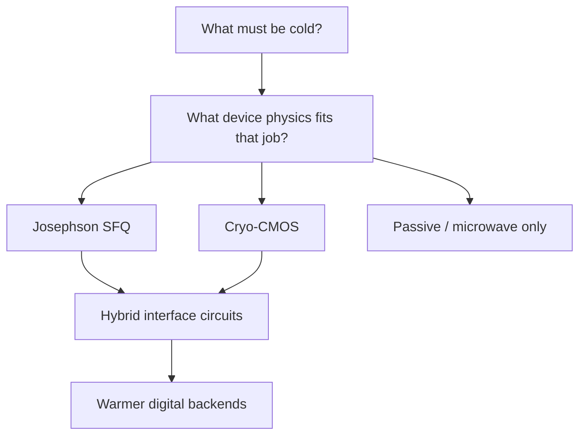

# Field: Cryo-CMOS & Hybrid Systems

**Prereqs:** [Superconducting photon detectors](superconducting-photon-detectors.md) · [Field map hub](README.md)  
**Next:** [SFQ among logic families](../sfq-among-logic-families.md) · [Cryogenics for electronics](../cryogenics-for-electronics.md)

**Learning goals.** After this page you should be able to (1) explain why people run CMOS cold, (2) contrast cryo-CMOS with classical SFQ as two different cryogenic electronics toolkits, (3) describe hybrid architectures (SFQ + CMOS, warm + cold partitioning), and (4) use “which stage / which device?” questions when reading system papers.

## Why this field exists

**Cryo-CMOS** means operating complementary MOS transistors at cryogenic temperatures — often tens of kelvin to ~4 K depending on the project — to place semiconductor electronics closer to cold sensors, detectors, or quantum devices.

Motivations include:

- reducing cable count and heat leak to room temperature,
- lowering some noise/leakage behaviors in certain regimes,
- using the enormous CMOS design ecosystem (PDKs, digital/analog IP) inside the fridge.

**Hybrids** combine technologies on purpose: SFQ for ultra-fast pulse logic or dense timed datapaths; CMOS for memory density, complex control, or mature I/O; warmer FPGAs for software-heavy layers.

## Analogy: two specialist crews on one ship

SFQ specialists bring **picosecond pulse tools**.  
CMOS specialists bring **dense, tool-rich silicon**.  

A cryogenic system is often a **ship** that needs both crews on different decks (temperature stages), plus runners (cables, amplifiers) between decks. Arguing which crew “wins” misses the ship.

```text
  300 K:   servers / FPGAs / user software
   4 K:    possible cryo-CMOS control / SFQ logic / some detectors
   mK:     many qubit devices / ultra-sensitive front-ends
```

## Picture 1 — Partitioning questions



### When cryo-CMOS is attractive

- Complex finite-state control near cold payloads  
- Mixed-signal blocks with mature CMOS flows  
- Memory density that superconducting memory cannot yet match  
- Teams already fluent in CMOS design

### When SFQ is attractive

- Ultra-fast pulse datapaths / specialized timed logic  
- Natural fit to flux-quantum tokens and Josephson cell libraries  
- Certain interface and digitization niches at cryogenic speed

Neither list is absolute. Papers argue case-by-case.

## Picture 2 — Hybrid patterns you will see

```text
  Pattern A:  SFQ core  ↔  CMOS memory / decode   (Josephson-CMOS memory stories)
  Pattern B:  qubit chip ↔ cryo-CMOS controller ↔ warm FPGA
  Pattern C:  SNSPD array ↔ SFQ time-tagger ↔ warm DAQ
  Pattern D:  all-CMOS cold control, no SFQ at all
```

Orientation skill: name the pattern before diving into schematics.

## Worked example 1 — “We put the controller at 4 K”

**Ask:**

1. Is the controller CMOS, SFQ, or mixed?  
2. What heat budget did they claim?  
3. What stayed at 300 K?

**Teaching point:** “at 4 K” is not a technology choice by itself — it is a **placement** choice.

## Worked example 2 — False competition

**Prompt:** Slide says “SFQ vs cryo-CMOS: who wins?”

**Better framing:** For *which block*, at *which temperature*, under *which metric* (latency, power at stage, density, noise, design time)? Hybrids often win by refusing the false binary.

## Comparison table

| | Cryo-CMOS | Classical SFQ |
|--|-----------|---------------|
| Device | Semiconductor MOSFET stack | Josephson junctions + superconductors |
| Bit style | Usually voltage/charge CMOS logic | Pulses / flux packets (RSFQ-like) |
| Ecosystem | Huge CMOS tooling | Specialty superconducting tooling |
| Strength sketch | Density, IP reuse, mixed-signal | Extreme timed switching / flux tokens |
| Shared constraint | Cryogenics + I/O across stages | Same |

## Common misconceptions

1. **“Cryo-CMOS replaces SFQ.”**  
   Sometimes for a block; not universally.

2. **“SFQ replaces CMOS.”**  
   Same — false universal.

3. **“Cold CMOS is automatically low power at the wall.”**  
   Refrigerator costs still apply.

4. **“Hybrid means failure to pick a side.”**  
   Hybrid is often the engineered answer.

5. **“If transistors work at 4 K, Nb SFQ is obsolete.”**  
   Different physics and niche metrics remain.

6. **“I/O problems vanish if everything is CMOS.”**  
   Thermal stages and noise still dominate system design.

## CMOS contrast (room-temp vs cryo)

| Room-temp CMOS habit | Cryo-CMOS habit |
|----------------------|-----------------|
| Models/PDKs at 300 K | Device parameters shift; need cryo characterization |
| Heat sinks dump heat to air | Heat is a budget *into* the cold stage |
| Probe freely | Cool-down cycles constrain iteration |

## Bridge to SFQ circuits

After fields, this curriculum returns to **SFQ-first depth**, but will keep pointing at hybrids in memory and I/O concepts (for example Josephson–CMOS memory cards). You are ready for family dialects and then device notation.

## Check yourself

<details>
<summary>1. What is cryo-CMOS?</summary>

CMOS electronics operated at cryogenic temperatures to sit closer to cold payloads and reuse silicon design ecosystems.
</details>

<details>
<summary>2. Why do hybrids appear so often?</summary>

Different blocks prefer different device physics and ecosystems; thermal stages force partitioning.
</details>

<details>
<summary>3. Does placing logic at 4 K tell you whether it is SFQ?</summary>

No — placement ≠ technology.
</details>

<details>
<summary>4. Name one SFQ-favoring and one CMOS-favoring sketch reason.</summary>

SFQ: ultra-fast pulse/flux logic niches. CMOS: density, mature IP, complex control/mixed-signal.
</details>

<details>
<summary>5. What should you do after finishing the fields survey?</summary>

Continue orientation: [SFQ among logic families](../sfq-among-logic-families.md), then [cryogenics](../cryogenics-for-electronics.md), then [notation](../reading-sfq-notation.md).
</details>

## Glossary spot-links

Glossary: cryo-CMOS, cryogenic, SFQ, hybrid (concept).

## Next steps

- Finish orientation dialects: [Where SFQ sits among logic families](../sfq-among-logic-families.md).  
- Or revisit any field from the [hub](README.md).
