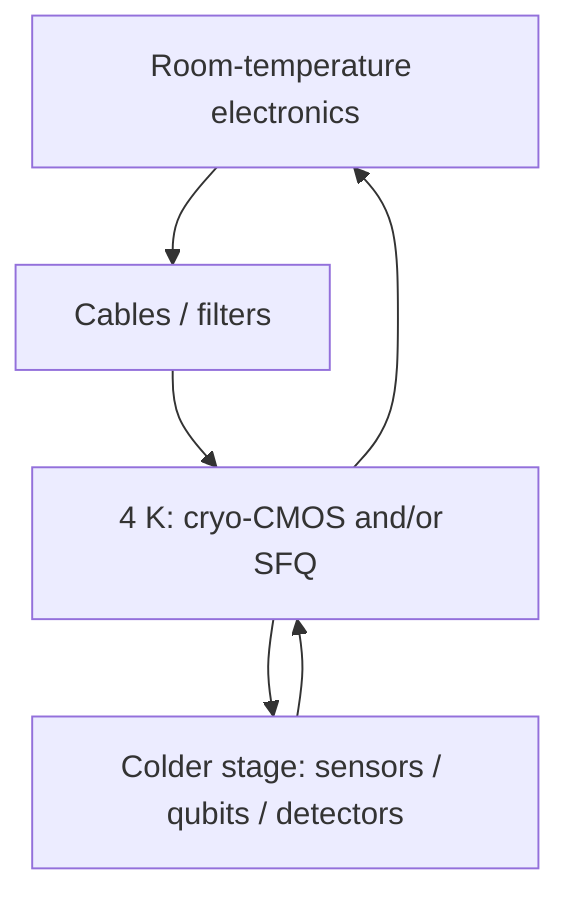

# Field: Cryo-CMOS & Hybrid Systems

**Prereqs:** [Photon detectors](superconducting-photon-detectors.md) · [Field map hub](README.md)  
**Next:** [Logic families](../sfq-among-logic-families.md) · [Cryogenics](../cryogenics-for-electronics.md)

**In one minute.** **Cryo-CMOS** means silicon CMOS operated **cold** (often near ~4 K stages, sometimes colder experiment-dependent). **Hybrids** mix SFQ, cryo-CMOS, and warm electronics by temperature deck and metric. "At 4 K" is a **placement**, not a technology name --- ask which device sits there.

## Learning goals

1. Define cryo-CMOS in one sentence without confusing it with SFQ.
2. Sketch a temperature-deck hybrid (warm ↔ cold ↔ colder) and assign example blocks.
3. Name why hybrids appear (cables, heat, density, design-time, noise).
4. Triage titles: cryo-CMOS controller vs RSFQ ALU vs qubit chip.

## Why this field exists

Many payloads already live cold: SNSPDs, SQUID sensors, superconducting qubits, precision cryo instruments. Shipping every decision to a warm rack burns cable heat load, latency, and noise margin. Moving **classical** electronics closer --- cryo-CMOS and/or SFQ --- is a systems response. Cooling physics tax: [cryogenics for electronics](../cryogenics-for-electronics.md).

## Analogy: two crews on one ship

Temperature decks are floors of an airport stack (palette: airport). Cryo-CMOS is a dense silicon crew that still speaks **voltage levels**. Classical SFQ is a telegraph crew that speaks **clicks / flux**. Both can serve the same ship; they are not the same trade.

```text
  ~300 K:   FPGAs, servers, warm DACs/ADCs
    |
  ~4 K:     amplifiers, cryo-CMOS control, sometimes Nb SFQ helpers
    |
  mK:       many qubit chips (and ultra-sensitive stages)
```



## Cryo-CMOS vs classical SFQ

| | Cryo-CMOS | Classical SFQ |
|--|-----------|---------------|
| Device | MOSFETs at cryogenic $T$ | Josephson + superconductors |
| Bit style | Usual CMOS levels | Pulses / flux packets |
| Sketch strength | Density, IP reuse, mixed-signal | Ultra-fast timed flux logic |
| Design culture | Silicon PDKs, EDA familiarity | Specialty Nb processes, pulse timing |

## Worked example 1 --- Partition a qubit stack

| Block | Often assigned to | Why (teaching) |
|-------|-------------------|----------------|
| Qubit chip | mK stage | Needs coherence environment |
| First amps / filters | Cold stages | Noise and heat trade-offs |
| Fast classical serialization | Cryo-CMOS and/or SFQ | Reduce warm cable count |
| Algorithms / OS | 300 K servers | Software ecosystem |

Teaching question: "Who sits at 4 K?" is incomplete until you name **SFQ vs cryo-CMOS vs passives**.

## Worked example 2 --- Title triage

| Title fragment | Likely emphasis |
|----------------|-----------------|
| "cryo-CMOS qubit controller at 4 K" | Cold silicon control |
| "20 GHz RSFQ microprocessor" | Classical digital SFQ |
| "SFQ↔CMOS hybrid memory" | Mixed classical stack |
| "transmon coherence at 20 mK" | Qubit device physics |

## Common misconceptions

1. **"At 4 K means SFQ."** Temperature ≠ device family.
2. **"Cryo-CMOS is just SFQ with a different name."** Different device physics and bit styles.
3. **"Cooling CMOS automatically beats Josephson logic."** Different jobs; compare metrics honestly.
4. **"Hybrids are a failure of pure SFQ."** Often a deliberate systems partition under thermal budgets.
5. **"I must master cryo-CMOS before symbols."** Express lane can skip; return when system papers appear.

## CMOS contrast

| Room-temp CMOS habit | Cryo-CMOS / hybrid habit |
|----------------------|---------------------------|
| Board is warm | Thermal budget of each stage matters |
| "Put the ASIC anywhere convenient" | Cable heat and noise dominate placement |
| One chip does most roles | Roles split across SFQ / cryo-CMOS / warm FPGA |

## Bridge to this curriculum

Expect hybrids in later [I/O](../../tracks/cryogenic-interfaces-io/ROADMAP.md) and [memory](../../tracks/cryogenic-memory/ROADMAP.md) tracks. Deep SFQ path still teaches Josephson pulse logic first. Orientation siblings: [digital SFQ](digital-sfq-overview.md), [qubits](superconducting-qubits-and-quantum-computing.md).

## Check yourself

<details markdown="1">
<summary markdown="span">1. What is cryo-CMOS?</summary>

CMOS operated at cryogenic temperatures near cold payloads.
</details>

<details markdown="1">
<summary markdown="span">2. Does "4 K controller" tell you SFQ vs CMOS?</summary>

No --- ask which device.
</details>

<details markdown="1">
<summary markdown="span">3. Why hybrids?</summary>

Different blocks prefer different physics and ecosystems under thermal and cable constraints.
</details>

<details markdown="1">
<summary markdown="span">4. Name one strength often associated with cryo-CMOS vs SFQ.</summary>

Examples: transistor density, mixed-signal IP, familiar silicon tooling.
</details>

<details markdown="1">
<summary markdown="span">5. Where should you read about cooling costs next on the express lane?</summary>

[Cryogenics for electronics](../cryogenics-for-electronics.md).
</details>

<details markdown="1">
<summary markdown="span">6. Is a qubit chip itself "cryo-CMOS"?</summary>

No --- qubits are quantum hardware; cryo-CMOS may help control/read them classically.
</details>

## Glossary spot-links

[Glossary](../../glossary.md): cryogenic, cryo-CMOS, SFQ, hybrid (systems sense), Josephson junction.

## Next steps

Express lane: [Logic families](../sfq-among-logic-families.md) → [Cryogenics](../cryogenics-for-electronics.md).
