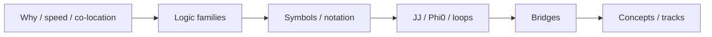

# Field: Digital SFQ Overview

**Prereqs:** [Field map hub](README.md) · [Landscape](../superconducting-electronics-landscape.md)  
**Next:** [Qubits & quantum computing](superconducting-qubits-and-quantum-computing.md) · [Logic families](../sfq-among-logic-families.md)

**In one minute.** **Digital SFQ** is classical cryogenic digital electronics built from Josephson junctions: short voltage pulses whose area is about one flux quantum $\Phi_0$, and/or flux stored in loops. It is **this curriculum's deep path**. It is **not** quantum computing. Dialects (RSFQ / ERSFQ / AQFP / latching) live on [logic families](../sfq-among-logic-families.md). Express lane can skip this recap after landscape.

## Learning goals

1. State what digital SFQ is for in one teaching sentence (classical bits with Josephson devices).
2. Contrast pulse/flux tokens with CMOS held levels and with qubits (link, do not re-derive).
3. Know where cell, timing, bias, and I/O depth live later (bridges → concepts → tracks).
4. Avoid the vocabulary traps: "quantum" in flux quantum ≠ quantum computer.

## Why this field exists

Ordinary CMOS digital chips won density, cost, and software. Digital SFQ remains a specialty because Josephson devices can switch in **picoseconds**, encode bits as **flux packets**, and sit next to **already-cold** instruments. Honest costs --- cryogenics, specialty fabs, smaller tooling --- keep it niche. Motivation detail: [Why superconducting electronics?](../why-superconducting-electronics.md).

This page is a **home-field orientation**, not a second copy of every later chapter.

## Analogy: telegraph clicks (not a music hall)

Classical SFQ is a **telegraph**: timed clicks that mean 0/1 if they arrive in the right window. Superconducting qubits are a **music hall** of fragile quantum states --- different terminal ([qubits page](superconducting-qubits-and-quantum-computing.md)). The airport map of siblings is [landscape](../superconducting-electronics-landscape.md).

```text
  CMOS-ish:   ____----____----     held voltage levels
  SFQ-ish:    .. /\ .... /\ ..     clicks in timing windows
```



## What is in / out of "digital SFQ"

| In this branch (classical) | Usually a different terminal |
|----------------------------|------------------------------|
| RSFQ / ERSFQ / AQFP-style logic | Superconducting qubits / QC algorithms |
| JTLs, splitters, DFFs, pulse pipelines | SQUID magnetometers as sensors |
| Bias networks, path balance, STA | Josephson voltage standards |
| Cryo helpers for sensors/qubits (classical) | SNSPD photon detectors themselves |

## Where details live

| Topic | Go to |
|-------|--------|
| Airport map of siblings | [Landscape](../superconducting-electronics-landscape.md) · [Hub](README.md) |
| RSFQ vs ERSFQ vs AQFP vs latching | [Logic families](../sfq-among-logic-families.md) |
| Qubits ≠ SFQ (canonical) | [Qubits page](superconducting-qubits-and-quantum-computing.md) |
| Device symbols | [Symbol card](../sfq-symbol-card.md) · [Notation](../reading-sfq-notation.md) |
| Pulse story | [Phase to pulse](../../bridge/phase-to-pulse.md) |
| Later cells / timing / I/O | Concepts + tracks on [Home](../../index.md) |

## Worked example 1 --- Title triage

| Title fragment | Likely terminal |
|----------------|-----------------|
| "20 GHz RSFQ microprocessor" | Digital SFQ |
| "transmon $T_1$ improvement" | Qubits |
| "SQUID magnetometer for MEG" | Sensing |
| "JAWS waveform synthesizer" | Metrology |
| "SNSPD array readout with SFQ" | Detectors + classical SFQ helper |

## Worked example 2 --- Two meanings of "quantum" + speed

| Meaning | Digitals SFQ claim? |
|---------|---------------------|
| Device-fast Josephson pulses / pipelines | Yes --- this branch |
| Algorithmic QC speedup (superposition / entanglement / interference) | No --- see [qubits page](superconducting-qubits-and-quantum-computing.md#how-quantum-mechanics-can-accelerate-some-computations) |

## CMOS contrast

| CMOS habit | Digital SFQ habit |
|------------|-------------------|
| Hold a logic high as a voltage | Fire a short pulse / store flux |
| Combinational clouds between flip-flops | Heavy gate-level pipelining |
| Rail-to-rail clarity | Timing window + pulse presence |
| Room-temp board bring-up | Cryostat, bias currents, careful I/O |

## Common misconceptions

1. **"Digital SFQ is quantum computing."** False --- classical digital engineering with superconducting devices.
2. **"Flux quantum means we run Grover/Shor."** $\Phi_0$ is a device physics token size; algorithmic QC is a different branch.
3. **"Any Josephson paper is RSFQ."** Sensors, standards, detectors, and qubits also use junctions.
4. **"SFQ replaces laptops."** Cooling and specialty ecosystems make consumer replacement a non-goal here.
5. **"I must finish every fields/ page before symbols."** Express lane may skip this folder.

## Bridge to the SFQ path

After this orientation: [logic families](../sfq-among-logic-families.md) → [cryogenics](../cryogenics-for-electronics.md) → [symbol card](../sfq-symbol-card.md) → device fundamentals → bridges. Cell cards come later; do not expect every gate schematic on this page.

## Check yourself

<details markdown="1">
<summary markdown="span">1. Is digital SFQ quantum computing?</summary>

No --- classical digital electronics using superconducting devices.
</details>

<details markdown="1">
<summary markdown="span">2. What bit "shape" does RSFQ-style SFQ emphasize?</summary>

Short $\Phi_0$-area pulses and/or stored loop flux, timed into windows.
</details>

<details markdown="1">
<summary markdown="span">3. Name one CMOS contrast for a data wire.</summary>

CMOS can hold a DC high; RSFQ-style data lines talk in events, not parked millivolt highs.
</details>

<details markdown="1">
<summary markdown="span">4. Where do RSFQ vs ERSFQ vs AQFP differences live?</summary>

[Logic families](../sfq-among-logic-families.md) --- not duplicated in full here.
</details>

<details markdown="1">
<summary markdown="span">5. Can the express lane skip this page?</summary>

Yes --- after landscape, go to logic families → cryogenics → symbols; return here for an SFQ-only recap.
</details>

<details markdown="1">
<summary markdown="span">6. A title says "SFQ pulse generator for qubit control." Digital SFQ or qubit physics?</summary>

Classical SFQ (or cryo helper) supporting a quantum stack --- hero may still be the qubit; ask which object is optimized.
</details>

## Glossary spot-links

[Glossary](../../glossary.md): SFQ, RSFQ, ERSFQ, AQFP, Josephson junction, $\Phi_0$, bias current, cryogenic.

## Next steps

- Optional sibling survey: [Qubits](superconducting-qubits-and-quantum-computing.md).  
- Express lane: [Logic families](../sfq-among-logic-families.md).
