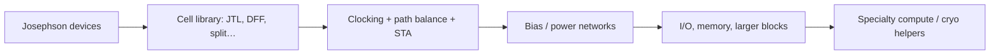

# Field: Digital SFQ Overview

**Prereqs:** [Field map hub](README.md) · [Landscape](../superconducting-electronics-landscape.md)  
**Next:** [Superconducting qubits & quantum computing](superconducting-qubits-and-quantum-computing.md) · [Logic families](../sfq-among-logic-families.md)

**Learning goals.** After this page you should be able to (1) state what classical digital SFQ is for in one sentence, (2) name the default family dialect this curriculum teaches (RSFQ-style pulses), (3) list what “done” looks like later (cells, timing, bias, I/O, memory), and (4) know this is the **deep path** after orientation — not a complete course by itself.

## Why this field exists

**Digital Single Flux Quantum (SFQ) electronics** uses Josephson junctions to process **classical** information: bits represented as short voltage pulses (area one flux quantum $\Phi_0$) and/or flux stored in superconducting loops.

It is not quantum computing. It is a specialty digital platform that can be extremely fast, can sit next to other cryogenic hardware, and pays taxes in cooling and tooling.

This curriculum’s long path after orientation is almost entirely this field.

## Analogy: a click language for bits

Imagine bits spoken as **clicks** timed into slots, not as held “high voltage” tones. RSFQ-style SFQ is that click language. Loops can remember a click by trapping a flux quantum. Pipelines become dense because almost every gate is also a timed stage.

```text
  CMOS-ish:   ____----____----     held levels
  SFQ-ish:    .. /\ .... /\ ..     events in windows
```

## Picture 1 — What this field optimizes



### Success metrics (teaching list)

- Correct pulses in correct **timing windows** (not rail-to-rail voltage)
- Energy accounting that admits bias + refrigeration boundaries
- Scalability via libraries and EDA (not only hand schematics)
- Interfaces to warmer electronics and, sometimes, to quantum/detector neighbors

### What you will learn later in this curriculum

| Stage | Examples |
|-------|----------|
| Device fundamentals | Notation, superconductivity, RCSJ, $\Phi_0$, loops, damping |
| Bridges | Phase→pulse, pulse→logic state, pipelining, bias→ERSFQ, I/O voltage |
| Concepts | RSFQ cells, ERSFQ, AQFP, STA, routing, drivers, memory cards |
| Tracks | Logic primitives, clocking/bias, EDA, I/O, memory, … |

## Picture 2 — Where digital SFQ sits among siblings

```text
  Digital SFQ (this page)     Qubits          Detectors      Sensing
  ----------------------      ------          ---------      -------
  Classical bits              Quantum states  Photon clicks  Flux noise
  Pulse / parametron dialects Coherence       Jitter/PDE     nT / fT goals
```

## Worked example 1 — Classify an abstract

**Abstract keywords:** “20 GHz RSFQ ALU,” “JTL,” “path balancing.”  
**Field:** digital SFQ.  
**Not primarily:** qubit coherence, SNSPD efficiency, MEG noise floor.

## Worked example 2 — “SFQ controller for a quantum chip”

**Prompt:** Is that digital SFQ or quantum computing?

**Answer:** Usually **both appear**: the **qubit chip** is quantum hardware; the **SFQ controller/serializer** is classical digital SFQ (or cryo-CMOS) acting as a helper. Read which metrics the paper optimizes.

## Comparison table — digital SFQ vs common mix-ups

| Mix-up | Correction |
|--------|------------|
| SFQ = qubit | No — classical vs quantum information |
| SFQ = any Josephson circuit | No — sensing/metrology/detectors are siblings |
| One SFQ family covers all talks | No — see [logic families](../sfq-among-logic-families.md) |
| Cold CMOS is the same field | Related hybrid — see [cryo-CMOS](cryo-cmos-and-hybrids.md) |

## Common misconceptions

1. **“Finishing orientation means I know SFQ design.”**  
   Orientation only maps the airport; device and cell pages do the flying lessons.

2. **“Digital SFQ papers must mention qubits.”**  
   Most classical SFQ work never does.

3. **“AQFP and RSFQ are interchangeable labels.”**  
   Sibling dialects — learn RSFQ pulse intuition first here.

4. **“Φ₀ only matters for quantum computing.”**  
   $\Phi_0$ is central to classical SFQ pulse area and loop storage.

5. **“If it is Nb and 4 K, it is digital SFQ.”**  
   Temperature/material overlap many branches.

## CMOS contrast

| CMOS digital field | Digital SFQ field |
|--------------------|-------------------|
| Voltage-level logic ecosystem | Pulse/flux logic ecosystem |
| Huge foundry + EDA base | Specialty Nb (etc.) + growing EDA |
| Room-temp default | Cryogenic default |

## Bridge to the deep SFQ path

After you finish surveying fields (or skip ahead):

1. [Logic families](../sfq-among-logic-families.md)  
2. [Cryogenics](../cryogenics-for-electronics.md)  
3. [Reading SFQ notation](../reading-sfq-notation.md) → device fundamentals → bridges → concepts  

## Check yourself

<details>
<summary>1. Is digital SFQ quantum computing?</summary>

No. It is classical digital electronics using superconducting devices.
</details>

<details>
<summary>2. What bit “shape” does RSFQ-style SFQ emphasize?</summary>

Short pulses with area $\sim\Phi_0$ and/or stored flux in loops, timed into windows.
</details>

<details>
<summary>3. Name three later topics on the deep path.</summary>

Examples: RCSJ, flux quantization, JTL/DFF, path balancing, ERSFQ bias, I/O drivers, cryogenic memory.
</details>

<details>
<summary>4. A paper about SNSPD jitter — is it this field?</summary>

Primarily detectors; digital SFQ may appear only in readout helpers.
</details>

<details>
<summary>5. What should a newcomer read next in the fields survey?</summary>

[Superconducting qubits & quantum computing](superconducting-qubits-and-quantum-computing.md) (clearest sibling), or continue the survey then return to logic families.
</details>

## Glossary spot-links

Glossary: SFQ, RSFQ, ERSFQ, AQFP, $\Phi_0$, JTL, DFF.

## Next steps

- Clearest sibling: [Qubits & quantum computing](superconducting-qubits-and-quantum-computing.md).  
- Or skip to dialects: [SFQ among logic families](../sfq-among-logic-families.md).
