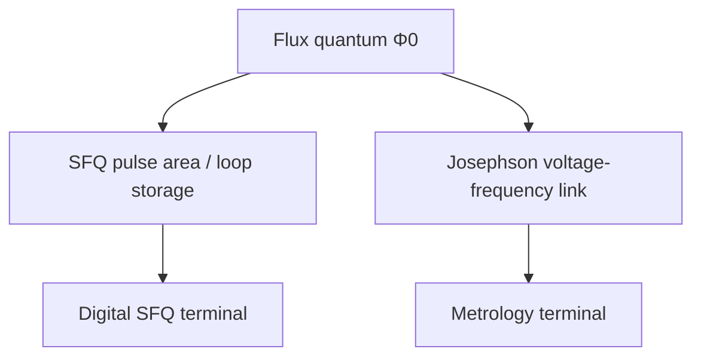

# Field: Josephson Metrology & Voltage Standards

**Prereqs:** [SQUID sensing & magnetometry](squid-sensing-magnetometry.md) · [Field map hub](README.md)  
**Next:** [Superconducting photon detectors](superconducting-photon-detectors.md)

**Learning goals.** After this page you should be able to (1) explain why national labs care about Josephson voltage standards, (2) connect the Josephson voltage–frequency idea to the same $\Phi_0$ you will meet in SFQ pulses, (3) contrast metrology goals with digital SFQ goals, and (4) recognize JAWS / programmable Josephson voltage language as a sibling terminal.

## Why this field exists

Metrology is the science of **measurement standards**. Electrical metrology needs a way to realize the **volt** with extraordinary accuracy and reproducibility.

Josephson junctions provide a physics-based link between voltage and frequency. In teaching form, a junction driven so that its phase evolves steadily relates average voltage to frequency through the flux quantum:

\[
\langle V\rangle = n\,f\,\Phi_0
\]

(with integer step index $n$ in the classic Shapiro-step picture). Because frequency can be referenced to atomic clocks, this becomes a **quantum voltage standard** path used by standards laboratories.

**Programmable Josephson voltage standards** and **JAWS** (Josephson Arbitrary Waveform Synthesizer) style systems extend the idea toward synthesized waveforms with metrological intent — accuracy and spectral purity, not ALU throughput.

## Analogy: a tuning fork for voltage

Digital SFQ cares whether a click happened in a time slot. Metrology cares whether a voltage tone is **exactly the pitch** the definition says it should be.

A Josephson voltage standard is closer to a **tuning fork / atomic clock for volts** than to a microprocessor.

```text
  Digital SFQ:  "Did the pulse arrive in the window?"
  Metrology:    "Is this voltage accurate to parts in 10^N?"
```

## Picture 1 — Shared constant, different product



### Success metrics

| Metric | Teaching meaning |
|--------|------------------|
| Accuracy / uncertainty | How true the volt realization is |
| Stability | Does it wander? |
| Spectral purity (AC/JAWS) | Unwanted harmonics/spurs |
| Practicality | Cryogenics, arrays, microwave drive complexity |

## Picture 2 — What a newcomer hears in titles

```text
  "Josephson voltage standard"     → metrology
  "JAWS waveform synthesizer"      → metrology / precision AC
  "Φ0 pulse area in RSFQ gate"     → digital SFQ
  "quantum voltage" in a QC talk   → often qubit jargon - different meaning!
```

Careful: the word **quantum** in “quantum voltage standard” means physics-based electrical standard, not “quantum computing algorithm.”

## Worked example 1 — Same $\Phi_0$, two homework questions

1. **SFQ:** Integrate a pulse; show area $\Phi_0$.  
2. **Metrology:** Drive at frequency $f$; relate step voltage to $f\,\Phi_0$.

Both use $\Phi_0$; only one is about logic tokens.

## Worked example 2 — Why SFQ designers still peek here

Understanding that $\Phi_0$ is a **defined physical constant** (not a lab folklore number) strengthens later flux-quantization pages. Metrology is the community that treats that constant as a legal/industrial anchor.

## Comparison table

| | Digital SFQ | Josephson metrology |
|--|-------------|---------------------|
| Hero output | Bits / pulses | Accurate volts / waveforms |
| $\Phi_0$ role | Token size | Volt–Hz conversion factor |
| Typical audience | Circuit/architecture labs | Standards labs + precision AC |
| “Error” | Logic/timing error | Uncertainty / distortion |

## Common misconceptions

1. **“Quantum voltage standard means quantum computer.”**  
   False — metrological quantum standard ≠ QC.

2. **“JAWS is an SFQ CPU.”**  
   False — waveform synthesis for precision, not general digital compute.

3. **“SFQ pulse area and voltage standards are unrelated.”**  
   Related through $\Phi_0$; unrelated as products.

4. **“Metrology is only DC.”**  
   Modern work includes synthesized AC / arbitrary waveforms.

5. **“If accuracy matters, use RSFQ clocks.”**  
   Different problem; do not force digital SFQ tools onto standards design.

## CMOS contrast

| Semiconductor voltage reference habit | Josephson metrology habit |
|---------------------------------------|---------------------------|
| Bandgaps, Zeners, trimmed refs | Physics link via $\Phi_0$ and frequency |
| Drift/temperature coefficients | Cryogenic arrays + microwave control |
| Product electronics focus | National measurement system focus |

## Bridge to SFQ circuits

You will reuse $\Phi_0$ constantly on the digital path. When a paper says “quantum voltage,” check whether it is **metrology** or **qubit** slang before importing assumptions.

## Check yourself

<details>
<summary>1. What is Josephson metrology trying to anchor?</summary>

Accurate, reproducible voltage (and related AC waveforms) using Josephson physics.
</details>

<details>
<summary>2. How does $\Phi_0$ appear differently than in RSFQ pulses?</summary>

As a volt–frequency conversion factor for standards, not primarily as a digital pulse token.
</details>

<details>
<summary>3. What does JAWS point to in orientation vocabulary?</summary>

Josephson Arbitrary Waveform Synthesizer-style precision waveform metrology.
</details>

<details>
<summary>4. Is “quantum voltage standard” the same as superconducting qubits?</summary>

No.
</details>

<details>
<summary>5. What is next?</summary>

[Superconducting photon detectors](superconducting-photon-detectors.md).
</details>

## Glossary spot-links

Glossary: $\Phi_0$, Josephson junction, JAWS / Josephson voltage standard.

## Next steps

- [Superconducting photon detectors](superconducting-photon-detectors.md).
