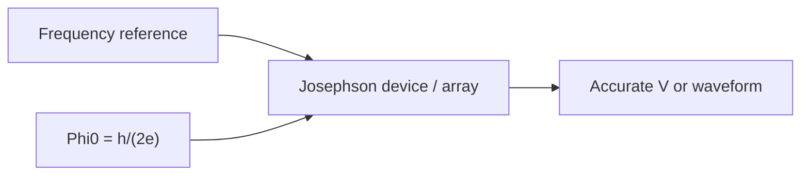

# Field: Josephson Metrology & Voltage Standards

**Prereqs:** [SQUID sensing](squid-sensing-magnetometry.md) · [Field map hub](README.md)  
**Next:** [Photon detectors](superconducting-photon-detectors.md)

**In one minute.** Josephson **metrology** uses junction physics to realize **accurate volts** (and precision AC waveforms). The same flux quantum $\Phi_0$ that sizes SFQ pulses appears here as a **volt--frequency** factor. "Quantum voltage standard" ≠ quantum computer. JAWS-style systems synthesize waveforms --- they are not SFQ CPUs.

## Learning goals

1. Say what Josephson metrology is for (reproducible voltage / precision waveforms).
2. Recognize the teaching link $\langle V\rangle \sim n f \Phi_0$ without treating it as an SFQ gate equation sheet.
3. Contrast metrology's use of $\Phi_0$ with digital SFQ's pulse-token use.
4. Triage JAWS / voltage-standard titles vs RSFQ logic titles.

## Why this field exists

Electrical standards need a volt that does not drift with a particular artifact resistor. Josephson junctions link voltage to frequency through fundamental constants. Standards labs and precision instrumentation lean on that link. Digital SFQ leans on the **same** $\Phi_0$ as a packet size for pulses --- different product, shared constant. Deeper $\Phi_0$ story: [flux quantization](../flux-quantization.md).

## Analogy: tuning fork for volts vs telegraph for bits

Metrology ≈ a **tuning fork** for electrical units (stable reference). Digital SFQ ≈ **telegraph clicks** (information events). Airport terminals differ ([hub](README.md)).

## Teaching relation (Shapiro-style)

A common teaching form on Shapiro steps is:

\[
\langle V\rangle \sim n f \Phi_0
\]

with integer step index $n$, drive frequency $f$, and flux quantum $\Phi_0$. Read it as: **frequency in → accurate voltage out** (idealized teaching slogan). Real standards engineering (arrays, bias, filtering, uncertainty budgets) is a full profession --- not required for SFQ orientation.

```text
  frequency reference --> Josephson array --> accurate voltage / waveform
```



## Metrology vs digital SFQ

| | Metrology | Digital SFQ |
|--|-----------|-------------|
| $\Phi_0$ role | Volt--Hz factor | Pulse / token size |
| Hero output | Accurate V / spectra | Bits / timing |
| Success | Traceability, uncertainty | Correct logic events |

## Worked example 1 --- Order-of-magnitude recognition

$\Phi_0 \approx 2.07\,\text{mV}\cdot\text{ps}$ also equals about $2.07\,\mu\mathrm{V}/\mathrm{GHz}$ in volt-per-frequency language (teaching conversion). So a gigahertz-scale drive and a small integer $n$ already produce **microvolt-to-millivolt** scale steps --- the metrology world --- not a CMOS rail. You do not need a lab certificate to remember: **same constant, volt-shaped product**.

## Worked example 2 --- Title triage

| Title fragment | Likely terminal |
|----------------|-----------------|
| "Programmable Josephson voltage standard" | Metrology |
| "JAWS for quantum voltage metrology" | Metrology / waveforms |
| "20 GHz RSFQ microprocessor" | Digital SFQ |
| "SQUID magnetometer" | Sensing |

## Common misconceptions

1. **"Quantum voltage standard means quantum computing."** False --- classical precision measurement using Josephson physics.
2. **"JAWS is an SFQ CPU."** No --- precision waveform / standards tooling.
3. **"Metrology $\Phi_0$ is a different constant from RSFQ $\Phi_0$."** Same $\Phi_0$; different engineered use.
4. **"If I learn SFQ pulses, I have learned volt standards."** Shared constant ≠ shared product requirements.

## Bridge to the SFQ path

When [flux quantization](../flux-quantization.md) introduces $\Phi_0$, remember metrology as the "accurate volts" sibling. Digital SFQ will treat $\Phi_0$ as pulse area. Do not merge the scoreboards.

## Check yourself

<details markdown="1">
<summary markdown="span">1. What is Josephson metrology anchoring?</summary>

Accurate, reproducible voltage (and related AC waveforms).
</details>

<details markdown="1">
<summary markdown="span">2. Is JAWS an SFQ CPU?</summary>

No --- precision waveform / standards tooling.
</details>

<details markdown="1">
<summary markdown="span">3. Shared constant with RSFQ pulses?</summary>

$\Phi_0$ --- different engineered use.
</details>

<details markdown="1">
<summary markdown="span">4. Teaching slogan for Shapiro-style steps?</summary>

$\langle V\rangle \sim n f \Phi_0$ (frequency in, accurate voltage out --- idealized).
</details>

<details markdown="1">
<summary markdown="span">5. Tuning fork vs telegraph --- which is metrology?</summary>

Tuning fork (stable electrical reference); telegraph is classical SFQ clicks.
</details>

<details markdown="1">
<summary markdown="span">6. Where does the deep $\Phi_0$ lesson live on the core walk?</summary>

[Flux quantization](../flux-quantization.md).
</details>

## Glossary spot-links

[Glossary](../../glossary.md): Josephson junction, flux quantum $\Phi_0$, SFQ, cryogenic.

## Next steps

[Photon detectors](superconducting-photon-detectors.md) · [Hub](README.md)
