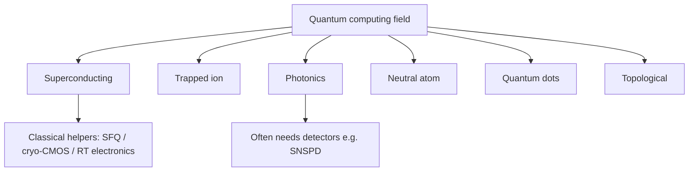

# Field: Quantum Computing Hardware Platforms

**Prereqs:** [Superconducting qubits & quantum computing](superconducting-qubits-and-quantum-computing.md) · [Field map hub](README.md)  
**Next:** [SQUID sensing & magnetometry](squid-sensing-magnetometry.md) · [Field map hub](README.md)

**In one minute.** QC field ≠ one hardware. Algorithmic speedup (when it exists) uses superposition, entanglement, interference — see [qubits page](superconducting-qubits-and-quantum-computing.md#how-quantum-mechanics-can-accelerate-some-computations). Superconducting overlaps SFQ toolbox; ions/atoms weak; photonics via detectors; dots via cryo-CMOS; topological awareness-only.

**Learning goals.** After this page you should be able to (1) name major **qubit hardware platforms** beyond superconducting circuits, (2) separate the **quantum computing field** from any one platform, (3) rank each platform’s relevance to *this* SFQ / superconducting-electronics curriculum, and (4) triage talk titles without assuming “quantum = Josephson qubits = SFQ.”

## Why this matters

People say “quantum computing” as if it were one machine. In practice it is a **field** implemented on several **hardware platforms**: trapped ions, superconducting circuits, photonics, neutral atoms, semiconductor quantum dots, topological proposals, and more.

Only the **superconducting** platform shares Josephson junctions and deep cryogenics tightly with classical SFQ. The others are still “related” as QC siblings — but usually **not** as SFQ cell-library cousins.

This page is an **orientation map**. It is not a course in ion trapping, integrated photonics, or topological materials.

## Analogy: one sport, many vehicles

Quantum computing is the **sport** (the rules of quantum information).

Hardware platforms are different **vehicles**:

- superconducting circuits → a cryogenic microwave race car,
- trapped ions → a precision laser-guided craft,
- photonics → a light-based flyer,
- …and so on.

Hardware platforms are different **vehicles** for the same sport rules (including superposition / entanglement / interference on the algorithm side). Classical SFQ is often a **pit-crew telegraph** — it does not play the quantum-algorithm sport itself.

```text
  Quantum computing (field / algorithms / information model)
           |
           +-- Superconducting qubits     ← strongest link to SFQ toolbox
           +-- Trapped ions
           +-- Photonics
           +-- Neutral atoms
           +-- Quantum dots
           +-- Topological (early / research)
```

## Picture 1 — Three layers (do not collapse them)



| Layer | Question |
|-------|----------|
| Field | What information model / algorithms? |
| Platform | What physical object is the qubit? |
| Classical helpers | How do we control, readout, serialize, thermalize? |

Classical SFQ lives mainly in the **helpers** row for superconducting (and sometimes detector) systems — not as a sixth “SFQ qubit platform” in the list above.

## Picture 2 — Platforms at teaching resolution

### Superconducting qubits

**Physical idea:** Josephson circuits + resonators encode quantum states; microwave control/readout; typically millikelvin device stages.

**Relevance to us:** **Strong.** Same Josephson/cryogenic neighborhood as classical SFQ. Deep page: [Superconducting qubits & quantum computing](superconducting-qubits-and-quantum-computing.md).

### Trapped ions

**Physical idea:** Individual ions held in electromagnetic traps; quantum states in internal energy levels; gates and readout often use lasers.

**Relevance to us:** **Weak.** Important QC sibling; little overlap with RSFQ cell design. Shared only at the abstract “classical control computer” layer.

### Photonics

**Physical idea:** Quantum information in photonic states (modes, polarization, time bins, cluster states, etc.); heavy use of sources, interferometers, and detectors.

**Relevance to us:** **Medium (via detectors / readout).** Superconducting nanowire detectors ([SNSPD page](superconducting-photon-detectors.md)) often appear in photonic and quantum-optics experiments. Classical SFQ may help time-tag or serialize — the photonic qubit is still not an RSFQ gate.

### Neutral atoms

**Physical idea:** Arrays of neutral atoms (often in optical tweezers); interactions engineered (e.g. Rydberg) for gates; laser control.

**Relevance to us:** **Weak.** QC sibling; not a Josephson digital family.

### Quantum dots

**Physical idea:** Semiconductor nanostructures confine charge/spin states used as qubits; often cryogenic; closer to the semiconductor ecosystem.

**Relevance to us:** **Weak–medium.** More kinship with [cryo-CMOS / hybrids](cryo-cmos-and-hybrids.md) and semiconductor thinking than with RSFQ pulse logic. Still not “SFQ.”

### Topological qubits

**Physical idea:** Seek qubits protected by topological properties of engineered quantum matter (popular teaching pointer: Majorana-based proposals and related research). Still largely a research frontier rather than a routine cell-library platform.

**Relevance to us:** **Mostly none for SFQ gates.** Awareness only — do not import “topological” buzzwords into RSFQ schematics.

## Comparison table — relevance to this curriculum

| Platform | Holds the qubit how? (sketch) | Typical control flavor | Link to SFQ / this lab |
|----------|-------------------------------|------------------------|------------------------|
| Superconducting | JJ circuit levels | Microwaves + mK fridge | **Strong** sibling; SFQ as possible helper |
| Trapped ion | Ion internal states in a trap | Lasers + vacuum apparatus | Weak — QC field only |
| Photonics | Photonic degrees of freedom | Optics + detectors | Medium — SNSPD / readout overlap |
| Neutral atom | Atom array states | Lasers / tweezers | Weak — QC field only |
| Quantum dots | Semiconductor confined states | Electrical / MW + cryo | Weak–medium — cryo-CMOS story |
| Topological | Proposed protected modes | Platform-specific / research | Mostly out of scope |

## Worked example 1 — Title triage

| Title fragment | Platform guess | Our takeaway |
|----------------|----------------|--------------|
| “transmon $T_1$ at 20 mK” | Superconducting | Read [qubits page](superconducting-qubits-and-quantum-computing.md); SFQ may appear in control papers |
| “ion shuttling QCCD” | Trapped ion | QC sibling; not SFQ curriculum deep path |
| “silicon spin qubit in a quantum dot” | Quantum dots | Semi/cryo story; not RSFQ |
| “Rydberg gates in atom arrays” | Neutral atom | QC sibling only |
| “SNSPD for photonic boson sampling” | Photonics + detectors | Detector field + possible SFQ helper |
| “SFQ microwave pulse generator for qubits” | Helper for superconducting QC | **Classical SFQ**, not a qubit platform |
| “Majorana zero mode candidate” | Topological research | Awareness; not SFQ cells |

## Worked example 2 — “Are these related to us?”

**Short answer:** Related as **quantum computing context**, especially superconducting + photonic-detector overlap.  

**Not related as:** alternate RSFQ/ERSFQ/AQFP logic families. Those stay on [digital SFQ](digital-sfq-overview.md) and [logic families](../sfq-among-logic-families.md).

## Common misconceptions

1. **“All quantum computing is superconducting.”**  
   False — several platforms compete and coexist.

2. **“SFQ is one of the qubit platforms.”**  
   False in the usual classical-SFQ sense — SFQ is classical digital electronics.

3. **“Photonic quantum computing means we must teach RSFQ.”**  
   False — teach detectors/interfaces if needed; not pulse-logic ALUs by default.

4. **“Quantum dots are Josephson SFQ.”**  
   False — semiconductor nanostructures ≠ Nb RSFQ cells.

5. **“Topological qubits replace the need to learn coherence.”**  
   Over-simplified marketing; still a research story.

6. **“If I master all platforms, I have mastered SFQ.”**  
   False — SFQ deep path is classical Josephson digital design.

## CMOS contrast

| CMOS learner habit | QC platforms habit |
|--------------------|--------------------|
| One dominant digital device family (MOSFET) | Multiple qubit modalities in parallel |
| “Process node” tells much of the story | Platform choice changes lasers vs microwaves vs traps |
| Room-temp default | Many platforms need vacuum, cryogenics, or both |

## Bridge to SFQ circuits

After this map:

- Stay on the **superconducting** QC sibling if you care about Josephson overlap.  
- Use [SNSPD](superconducting-photon-detectors.md) / [cryo-CMOS](cryo-cmos-and-hybrids.md) when titles mention detectors or cold silicon control.  
- Return to the SFQ deep path via [logic families](../sfq-among-logic-families.md) → [cryogenics](../cryogenics-for-electronics.md) → [notation](../reading-sfq-notation.md).

We **defer** full courses for ions, atoms, photonics, dots, and topological hardware — on purpose.

## Check yourself

<details markdown="1">
<summary markdown="span">1. Name three qubit platforms besides superconducting circuits.</summary>

Examples: trapped ions, photonics, neutral atoms, quantum dots, topological proposals.
</details>

<details markdown="1">
<summary markdown="span">2. Which platform shares the strongest toolbox overlap with classical SFQ?</summary>

Superconducting qubits (Josephson + cryogenics).
</details>

<details markdown="1">
<summary markdown="span">3. Why might photonics still show up in this lab’s orbit?</summary>

Because superconducting photon detectors (SNSPD/SSPD) and cryogenic readout helpers often support photonic/quantum-optics experiments.
</details>

<details markdown="1">
<summary markdown="span">4. Is a paper titled “SFQ controller for transmons” about a new qubit platform called SFQ?</summary>

No — classical SFQ helper for a superconducting qubit system.
</details>

<details markdown="1">
<summary markdown="span">5. Should this curriculum teach a full trapped-ion course?</summary>

No — orientation awareness only; deep path stays SFQ digital.
</details>

<details markdown="1">
<summary markdown="span">6. What is next in the fields survey?</summary>

[SQUID sensing & magnetometry](squid-sensing-magnetometry.md), or return to the [hub](README.md).
</details>

## Glossary spot-links

Glossary: qubit, quantum computing, trapped ion, photonic qubit, neutral atom, quantum dot, topological qubit, SNSPD, SFQ, cryo-CMOS.

## Next steps

- Continue fields: [SQUID sensing](squid-sensing-magnetometry.md).  
- Or deepen superconducting QC only: re-read [qubits & QC](superconducting-qubits-and-quantum-computing.md).
