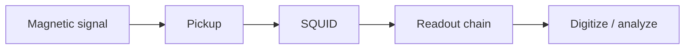

# Field: SQUID Sensing & Magnetometry

**Prereqs:** [QC hardware platforms](quantum-computing-hardware-platforms.md) · [Field map hub](README.md)  
**Next:** [Josephson metrology](josephson-metrology-voltage-standards.md)

**In one minute.** **SQUID sensing** measures tiny magnetic signals. **Digital SFQ** uses flux as classical bits. Same **SQUID** word ≠ same job. Scoreboard: noise floor, bandwidth, dynamic range --- not ALU GHz. Device path still teaches loops/SQUIDs for **bits** later: [loop / SQUID](../superconducting-loop-squid.md).

## Learning goals

1. State the sensing job of a SQUID in one sentence.
2. Separate "flux as measurand" from "flux as digital token."
3. Triage titles that say SQUID / magnetometer / MEG vs RSFQ logic.
4. Know that this page is orientation --- not a sensor design course.

## Why this field exists

Many sciences need to measure extremely small magnetic fields or flux changes. A **SQUID** (Superconducting Quantum Interference Device) --- a superconducting loop with Josephson junctions --- is an exquisitely sensitive flux-to-voltage transducer. That sensitivity is why the word appears in biomedical MEG, geophysics, materials labs, and cryogenic instrumentation.

Digital SFQ also draws SQUID-like loops, but the **product** is a logic event or stored bit, not a calibrated field reading.

## Analogy: microphone vs telegraph key

Sensing SQUID ≈ **microphone** (turn a physical signal into an electrical waveform). Digital SFQ gate ≈ **telegraph key** (send intentional clicks). Both may use loops and junctions; the airport terminal differs ([hub](README.md)).

```text
  B-field → pickup coil → SQUID → cryo amp → warmer digitize
```



## Sensing vs digital use of flux

| | Sensing SQUID | Digital SFQ loop / SQUID cell |
|--|---------------|-------------------------------|
| Flux is... | The **measurand** | An **information token** |
| Hero plot | Noise vs frequency, field resolution | Timing diagram, cell schematic |
| Success looks like | Faithful weak-signal capture | Correct bits in timing windows |

## Metrics you will see (teaching)

| Metric family | Rough meaning |
|---------------|---------------|
| Field / flux noise | How small a signal is buried in noise |
| Bandwidth | How fast the sensor can follow changes |
| Dynamic range | Weak signals vs overload |
| Shielding / cryostat | Practical limits of real installs |

These rarely match RSFQ "GHz pipeline" scoreboards.

## Worked example 1 --- Title triage

| Title fragment | Likely emphasis |
|----------------|-----------------|
| "SQUID magnetometer for MEG" | Sensing |
| "RSFQ ALU with SQUID-stack driver" | Digital SFQ / I/O |
| "SQUID readout of a qubit" | Instrument / QC helper --- ask which hero |
| "Nb SQUID for geophysical survey" | Sensing |

## Worked example 2 --- Same word, two questions

Ask of any "SQUID" paper:

1. Is flux **what we measure**, or **what we compute with**?
2. Is the figure a noise spectrum --- or a timing diagram?

If (1) is measure and (2) is noise, you are on this terminal.

## Common misconceptions

1. **"SQUID in the title means SFQ computer."** Often means a sensor.
2. **"SQUID means quantum computing."** Sensing SQUIDs are classical transducers; "quantum" in the acronym is historical device naming --- not Grover/Shor.
3. **"Learning SFQ loops teaches MEG sensor design."** Shared vocabulary, different engineering goals.
4. **"Lower noise always means better digital SFQ."** Digital metrics are timing, margins, BER --- different scoreboard.

## Bridge to the SFQ path

When the core walk reaches [superconducting loop / SQUID](../superconducting-loop-squid.md), you will reuse loop + junction intuition for **bits**. Keep the sensing terminal in mind so paper titles do not derail you. Hybrids/readout neighbors: [cryo-CMOS](cryo-cmos-and-hybrids.md).

## Check yourself

<details markdown="1">
<summary markdown="span">1. What is SQUID sensing for?</summary>

Measuring tiny magnetic flux/field with low noise.
</details>

<details markdown="1">
<summary markdown="span">2. Does "SQUID" in a title prove SFQ logic or quantum computing?</summary>

No --- ask whether flux is measured or used as a bit.
</details>

<details markdown="1">
<summary markdown="span">3. Name one sensing metric rare in RSFQ ALU papers.</summary>

Examples: field noise density, MEG shielding performance.
</details>

<details markdown="1">
<summary markdown="span">4. Microphone vs telegraph --- which is sensing?</summary>

Microphone (transduce a physical signal); telegraph is the SFQ click metaphor.
</details>

<details markdown="1">
<summary markdown="span">5. Where does this curriculum teach loops for digital SFQ?</summary>

[Superconducting loop / SQUID](../superconducting-loop-squid.md) on the device path.
</details>

<details markdown="1">
<summary markdown="span">6. What is next in the optional field survey?</summary>

[Josephson metrology](josephson-metrology-voltage-standards.md).
</details>

## Glossary spot-links

[Glossary](../../glossary.md): SQUID, Josephson junction, flux quantum, cryogenic, SFQ.

## Next steps

[Josephson metrology](josephson-metrology-voltage-standards.md) · [Hub](README.md)
