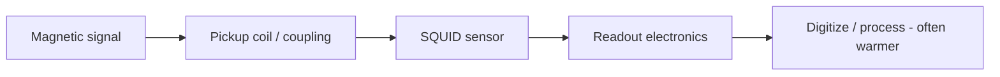

# Field: SQUID Sensing & Magnetometry

**Prereqs:** [QC hardware platforms](quantum-computing-hardware-platforms.md) · [Field map hub](README.md)  
**Next:** [Josephson metrology & voltage standards](josephson-metrology-voltage-standards.md)

**Learning goals.** After this page you should be able to (1) state what SQUID sensing is *for*, (2) explain why a SQUID loop is a natural magnetometer building block, (3) contrast sensing success metrics with digital SFQ metrics, and (4) avoid assuming every SQUID schematic is an SFQ microprocessor cell.

## Why this field exists

A **SQUID** (Superconducting Quantum Interference Device) is a superconducting loop interrupted by one or more Josephson junctions. Its electrical response is exquisitely sensitive to magnetic **flux** through the loop.

**SQUID sensing / magnetometry** uses that sensitivity to measure tiny magnetic fields or field changes — in laboratories, geophysics, materials science, and biomedical imaging (for example MEG-style brain magnetic signals), among other niches.

Shared vocabulary with digital SFQ (“SQUID,” “flux,” “junction”) does **not** mean shared goals. Sensors optimize **noise floor and bandwidth**; digital SFQ optimizes **timed logic events**.

## Analogy: a microphone vs a telegraph key

A digital SFQ gate is a **telegraph key**: it should click cleanly when told.

A SQUID magnetometer is a **microphone**: it should hear the quietest magnetic “sound” possible without adding its own hiss. You would not judge a microphone by how many telegraph words per minute it sends.

```text
  Digital SFQ SQUID-like cell     Sensing SQUID
  ---------------------------     --------------
  Store/steer flux tokens         Transduce B-field → electrical signal
  Timing windows matter           Noise spectral density matters
```

## Picture 1 — Sensing chain sketch



### What people optimize

| Metric | Teaching meaning |
|--------|------------------|
| Field / flux noise | How small a signal you can see |
| Bandwidth / slew rate | How fast the signal can change |
| Dynamic range | Weak signals and larger excursions |
| Cryogenic practicality | Cooler, wiring, vibration, shielding |

## Picture 2 — Same word, different paper

```text
  Paper A: "SQUID" in RSFQ memory cell diagram  → digital SFQ context
  Paper B: "SQUID magnetometer for MEG"         → sensing field
  Paper C: "SQUID stack driver for I/O"         → SFQ interface concept
```

Always ask: **is flux the bit, or is flux the measurand?**

## Worked example 1 — Abstract triage

**Keywords:** “fT/√Hz,” “magnetically shielded room,” “MEG.”  
**Field:** SQUID sensing.  
**Not:** ALU throughput or path balancing.

## Worked example 2 — Why digital SFQ learners still meet SQUIDs

Loop/SQUID intuition appears in [superconducting loop / SQUID](../superconducting-loop-squid.md) because **storage and interference** matter for bits. Sensing papers push the same physics toward **measurement**. Learning one helps the other; they are still different terminals.

## Comparison table

| Question | Digital SFQ | SQUID sensing |
|----------|-------------|---------------|
| Flux means… | Information token / state | Quantity to measure |
| Hero figure | Cell library / timing diagram | Noise vs frequency plot |
| “Error” | Wrong pulse / missed window | Excess noise / drift |
| Typical neighbor | I/O, memory, EDA | Shielding, pickup coils, warm readout |

## Common misconceptions

1. **“SQUID always means quantum computer.”**  
   No — sensing is a huge classical/measurement use (despite the historical name).

2. **“SQUID always means SFQ logic.”**  
   No — logic may *use* SQUID-like loops; sensing *is* measuring with them.

3. **“More junctions always make a better sensor.”**  
   Sensor design is a noise and coupling craft, not a gate-count race.

4. **“If I skip sensing, I can ignore flux physics.”**  
   Digital SFQ still needs flux quantization — different application, shared constant.

5. **“Biomedical SQUID systems are just cold CMOS amps.”**  
   The superconducting front-end is the point of the sensitivity story.

## CMOS contrast

| CMOS sensing habit | SQUID sensing habit |
|--------------------|---------------------|
| Hall / AMR / search-coil trade-offs | Flux quantization + interference as the transducer |
| Often room-temp | Cryogenic front-end common |
| Noise referred to volts/amps | Noise often quoted in field units |

## Bridge to SFQ circuits

This curriculum deepens **digital** loop/SQUID use. Sensing remains an orientation sibling so you can name the terminal correctly. If your research is MEG/magnetometry, treat this page as a doorway, not the full specialty.

## Check yourself

<details>
<summary>1. What is SQUID sensing trying to do?</summary>

Measure tiny magnetic flux/field signals with very low noise using SQUID transducers.
</details>

<details>
<summary>2. How does that differ from digital SFQ’s use of SQUID-like loops?</summary>

Sensing treats flux as the measurand; digital SFQ treats flux packets as information tokens.
</details>

<details>
<summary>3. Name two sensing metrics that rarely headline RSFQ ALU papers.</summary>

Examples: field noise density, magnetically shielded performance, MEG-relevant bandwidth.
</details>

<details>
<summary>4. Does the word SQUID in a title prove the paper is quantum computing?</summary>

No.
</details>

<details>
<summary>5. What is next?</summary>

[Josephson metrology & voltage standards](josephson-metrology-voltage-standards.md).
</details>

## Glossary spot-links

Glossary: SQUID, flux quantum $\Phi_0$, Josephson junction.

## Next steps

- [Josephson metrology](josephson-metrology-voltage-standards.md).
