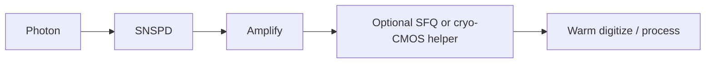

# Field: Superconducting Photon Detectors (SNSPD / SSPD)

**Prereqs:** [Josephson metrology](josephson-metrology-voltage-standards.md) · [Field map hub](README.md)  
**Next:** [Cryo-CMOS & hybrids](cryo-cmos-and-hybrids.md)

**In one minute.** **SNSPDs** (and related SSPDs) detect **single photons**. Success metrics: detection efficiency, dark counts, jitter, array scale. A detector **click** is not an RSFQ logic token. Classical **SFQ** or **cryo-CMOS** may appear later as readout / time-tag helpers --- pit crew, not the photon sensor itself.

## Learning goals

1. State what SNSPDs are for in one sentence.
2. Separate detector clicks from SFQ logic pulses.
3. Explain why large arrays create demand for cryogenic classical electronics.
4. Triage photonics / SNSPD titles vs RSFQ ALU titles.

## Why this field exists

Quantum optics, quantum communications testbeds, and other photon-starved experiments need detectors that fire on single photons with good timing. A biased superconducting nanowire can go normal (or otherwise switch) when a photon is absorbed, producing an electrical pulse for the readout chain. That is a **sensor terminal** on the airport map --- sibling to digital SFQ, not a synonym.

Photonic **qubit platforms** are a different vehicle again: [QC hardware platforms](quantum-computing-hardware-platforms.md).

## Analogy: tripwire vs telegraph office

SNSPD ≈ **tripwire** (physical event → electrical click). Classical SFQ ≈ **telegraph office** that may sort, serialize, or time-tag many clicks. Cryo-CMOS may play a dense silicon sorter on a warmer deck ([cryo-CMOS](cryo-cmos-and-hybrids.md)).

```text
  Photon → SNSPD click → amp → (optional SFQ / cryo-CMOS) → warm FPGA
```



## Metrics you will see

| Metric | Meaning (teaching) |
|--------|---------------------|
| PDE / efficiency | Fraction of photons caught |
| Dark counts | False clicks without photons |
| Jitter | Timing uncertainty of the click |
| Array scale | Many pixels → cable and readout crisis |
| Reset / recovery | How soon the pixel is ready again |

Digital SFQ papers instead obsess over clock, path balance, pulse BER --- different scoreboard.

## Worked example 1 --- Title triage

| Title fragment | Likely emphasis |
|----------------|-----------------|
| "SNSPD with 90% system detection efficiency" | Detector physics |
| "SFQ time-tagging for SNSPD arrays" | Classical SFQ helper |
| "cryo-CMOS readout ASIC for SNSPDs" | Cryo-CMOS helper |
| "20 GHz RSFQ microprocessor" | Digital SFQ (no detector required) |

## Worked example 2 --- Why helpers appear

One pixel → one coax may be tolerable. **Thousands** of pixels → cable heat and connector chaos. Systems papers then introduce cryogenic classical serialization (SFQ and/or cryo-CMOS). The hero may still be the detector; the helper is classical electronics co-located cold.

## Common misconceptions

1. **"An SNSPD is an SFQ gate."** No --- it is a photon sensor.
2. **"Detector click = RSFQ logic token."** Different objects; helpers may encode timing into SFQ pulses later.
3. **"Photonic quantum computing is the same as SNSPD metrology."** Platforms vs detectors --- related neighborhood, different goals ([platforms](quantum-computing-hardware-platforms.md)).
4. **"If SFQ reads out the array, the paper is an SFQ CPU paper."** Ask which figure of merit is central: PDE/jitter vs ALU throughput.

## Bridge to this curriculum

Deep path stays Josephson **digital** logic. This terminal explains why cryogenic classical electronics get pulled into photon experiments. Next sibling systems page: [cryo-CMOS & hybrids](cryo-cmos-and-hybrids.md).

## Check yourself

<details markdown="1">
<summary markdown="span">1. What are SNSPDs for?</summary>

Detecting single photons with high timing resolution (and related photon-starved tasks).
</details>

<details markdown="1">
<summary markdown="span">2. Is an SNSPD an SFQ gate?</summary>

No.
</details>

<details markdown="1">
<summary markdown="span">3. How might SFQ still appear?</summary>

As classical cryogenic readout / time-encoding helpers.
</details>

<details markdown="1">
<summary markdown="span">4. Name two SNSPD metrics.</summary>

Examples: PDE, dark count rate, jitter, array size.
</details>

<details markdown="1">
<summary markdown="span">5. Tripwire vs telegraph --- which is the detector?</summary>

Tripwire; telegraph is the classical SFQ metaphor.
</details>

<details markdown="1">
<summary markdown="span">6. Why do large SNSPD arrays pressure cryo electronics?</summary>

Many pixels imply many cables; cold serialization reduces heat and connector load.
</details>

## Glossary spot-links

[Glossary](../../glossary.md): cryogenic, SFQ, cryo-CMOS, Josephson junction (neighbor stacks).

## Next steps

[Cryo-CMOS & hybrids](cryo-cmos-and-hybrids.md) · [Hub](README.md)
