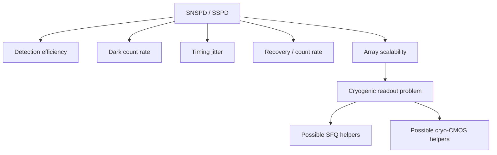

# Field: Superconducting Photon Detectors (SNSPD / SSPD)

**Prereqs:** [Josephson metrology](josephson-metrology-voltage-standards.md) · [Field map hub](README.md)  
**Next:** [Cryo-CMOS & hybrids](cryo-cmos-and-hybrids.md)

**Learning goals.** After this page you should be able to (1) state what SNSPD/SSPD detectors are for, (2) name the metrics that define “good” in this field, (3) explain why detector arrays create a **cryogenic readout / serialization** problem that can involve SFQ or cryo-CMOS, and (4) keep detector physics distinct from digital SFQ cell design.

## Why this field exists

**SNSPD** (Superconducting Nanowire Single-Photon Detector) and related **SSPD** devices detect extremely weak optical signals — often down to single photons — with excellent timing resolution. They matter for quantum optics experiments, quantum communication testbeds, astronomy/lidar-style niches, and other photon-starved measurements.

The detector is typically a superconducting nanowire biased near a critical current. An absorbed photon can create a localized normal hotspot, producing an electrical pulse that readout electronics register as a click.

That click is **not** an RSFQ $\Phi_0$ logic token by default — even though both live in cryogenic labs and both may later be digitized by SFQ circuits.

## Analogy: a tripwire vs a telegraph office

The nanowire detector is a **tripwire**: a photon trips it and raises an alarm pulse.

Digital SFQ is the **telegraph office** that might later sort, timestamp, and ship many alarms upstairs. Confusing the tripwire with the telegraph office mixes terminals.

```text
  Photon → SNSPD click → amp / discriminator → (optional) SFQ serializer → warm FPGA
```

## Picture 1 — Detector field scoreboard



### Metrics in plain language

| Metric | Teaching meaning |
|--------|------------------|
| PDE / efficiency | Fraction of photons you actually catch |
| Dark counts | False clicks with no photon |
| Jitter | Timing uncertainty of the click |
| Recovery / max count rate | How soon ready for the next photon |
| Array scale | Many pixels without drowning in cables |

## Picture 2 — Where digital SFQ may enter

```text
  Detector papers often end with: "we need scalable cryogenic readout."
  That sentence is a bridge to:
    - cryo-CMOS amplifiers / TDCs
    - SFQ time-taggers / serializers
    - warmer FPGA farms
```

Orientation skill: classify whether the paper’s **hero metric** is PDE/jitter (detectors) or BER/timing closure (digital SFQ).

## Worked example 1 — Title triage

| Title | Primary field |
|-------|----------------|
| “WSi SNSPD with 3 ps jitter” | Detectors |
| “SFQ-based photon arrival time encoder” | Digital SFQ helper for detectors |
| “ERSFQ ALU at 4 K” | Digital SFQ (usually unrelated to photons) |

## Worked example 2 — Why cable count explodes

**Prompt:** A 1024-pixel superconducting detector array at cold stage.

**Issue:** One coax per pixel to room temperature is a thermal and connector nightmare.  
**Architecture response:** proximal digitization / multiplexing — exactly where hybrids and SFQ interfaces become interesting.

## Comparison table

| | Photon detectors | Digital SFQ |
|--|------------------|-------------|
| Input | Photons | Electrical bias + SFQ pulses |
| Output | Detection clicks | Logic tokens / processed bits |
| Hero plots | PDE, jitter, dark counts | Timing, energy, cell demos |
| Shared need | Cryogenics + clean readout | Cryogenics + clean I/O |

## Common misconceptions

1. **“SNSPD is an SFQ gate.”**  
   No — different device and purpose.

2. **“Single-photon detector means quantum computer.”**  
   Related ecosystem often; not the same field definition.

3. **“If readout uses SFQ, the detector paper is an SFQ logic paper.”**  
   Check the hero metric.

4. **“All superconducting detectors are SNSPDs.”**  
   SNSPD/SSPD are major examples; other detector types exist in the wider cryogenic menagerie.

5. **“Jitter is the same as SFQ clock jitter.”**  
   Related word; different measurement context.

## CMOS contrast

| Semiconductor photodetector habit | SNSPD habit |
|-----------------------------------|-------------|
| Si/InGaAs photodiodes/SPADs at various T | Superconducting nanowire front-ends |
| Often integrated CMOS readout | Cryogenic detector + separate readout craft |
| Room-temp common | Cold required for superconductivity |

## Bridge to SFQ circuits

Later I/O and quantum/detector tracks may revisit **time-tagging and serialization**. For now, remember detectors as a sibling that creates demand for cryogenic classical electronics — including possible SFQ helpers.

## Check yourself

<details>
<summary>1. What are SNSPDs for?</summary>

Detecting single photons (or photon-starved light) with high timing resolution using superconducting nanowires.
</details>

<details>
<summary>2. Name three detector metrics.</summary>

Examples: detection efficiency, dark count rate, timing jitter, recovery time, array scalability.
</details>

<details>
<summary>3. How might digital SFQ appear in a detector system?</summary>

As classical cryogenic readout/serialization/time-encoding helpers — not as the photon absorber itself.
</details>

<details>
<summary>4. Is every photon-detector paper a quantum-computing paper?</summary>

No — though QC/quantum optics experiments often use such detectors.
</details>

<details>
<summary>5. What is next?</summary>

[Cryo-CMOS & hybrids](cryo-cmos-and-hybrids.md).
</details>

## Glossary spot-links

Glossary: SNSPD / SSPD, cryogenic, SFQ.

## Next steps

- [Cryo-CMOS & hybrids](cryo-cmos-and-hybrids.md), then return via the [hub](README.md) to [logic families](../sfq-among-logic-families.md).
