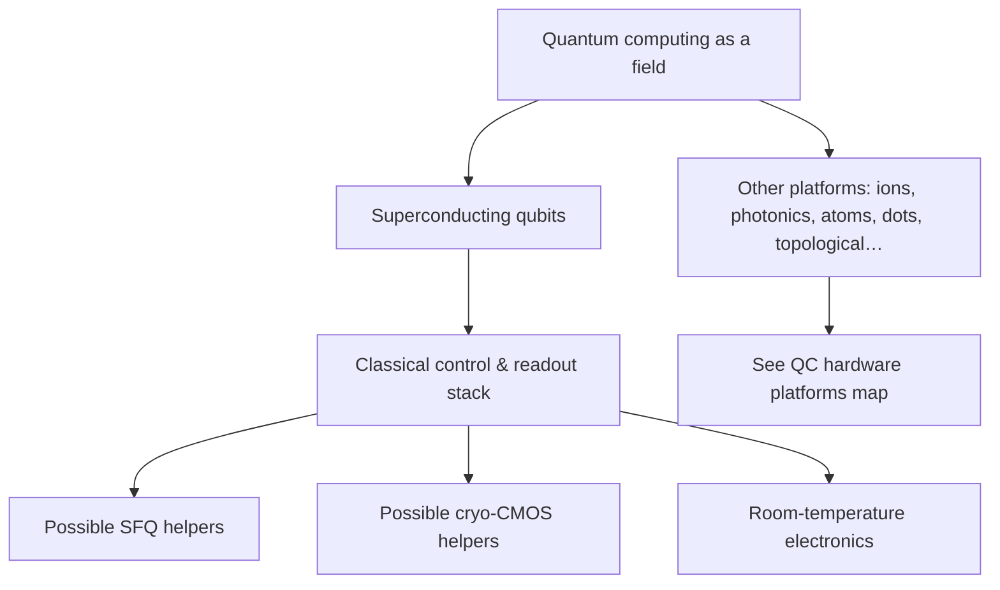

# Field: Superconducting Qubits & Quantum Computing

**Prereqs:** [Digital SFQ overview](digital-sfq-overview.md) · [Field map hub](README.md)  
**Next:** [QC hardware platforms](quantum-computing-hardware-platforms.md) · [SQUID sensing](squid-sensing-magnetometry.md)

**Learning goals.** After this page you should be able to (1) say what a **qubit** is for at a teaching level, (2) sketch how **superposition, entanglement, and quantum interference** can enable *algorithmic* speedups for some problems, (3) place **superconducting qubits** as one hardware platform inside **quantum computing**, (4) explain why this is a **different branch** from classical SFQ digital logic (**canonical contrast**), and (5) describe how SFQ or cryo-CMOS may appear as **classical helpers** without becoming the qubit.

**In one minute.** QC algorithms may gain from superposition + entanglement + interference — that is *not* how classical SFQ gets picosecond speed. SFQ uses Josephson devices for fast **classical** pulses; it may help control a quantum fridge, but it does not run Grover/Shor-style quantum steps. Platforms: [map](quantum-computing-hardware-platforms.md).

## Why this field exists

**Quantum computing** aims to process information in ways that use quantum states — superposition, entanglement, and carefully engineered gate operations — to attack certain computational problems differently from classical bits.

A **qubit** is the basic quantum information unit (the quantum analogue of a bit, but with a richer state space). Many physical platforms can host qubits. **Superconducting qubits** are circuits built from Josephson junctions and superconducting resonators/wires that encode quantum information in engineered energy levels.

This field shares cryogenics and Josephson vocabulary with classical SFQ, which is exactly why newcomers confuse them. The jobs differ:

| Classical SFQ | Superconducting qubits |
|---------------|------------------------|
| Reliable classical bits | Fragile quantum states |
| Pulse timing / BER | Coherence / gate fidelity |
| Often ~4 K digital Nb demos | Often millikelvin device stages |

## Analogy: a quiet music hall vs a click telegraph

Classical SFQ is like a **telegraph**: loud, timed clicks that mean 0/1 if they arrive in the right window.

A superconducting qubit processor is more like a **music hall**: you carefully prepare delicate tones (quantum states). Any extra noise, heat, or clumsy cable can ruin the performance. You may still station telegraph operators (classical SFQ / cryo-CMOS) in side rooms to send instructions and write down results — but the concert is not the telegraph.

```text
  mK stage:   qubit chip (the "music")
  warmer:     amplifiers, filters, maybe SFQ/cryo-CMOS helpers
  300 K:      control electronics, servers
```

## Picture 1 — Quantum computing ⊃ superconducting qubits



**Teaching sentence:** quantum computing is the discipline; superconducting qubits are one hardware choice; SFQ is usually classical electronics that might support that hardware.

**Other platforms (ions, photonics, neutral atoms, quantum dots, topological):** see the comparison map → [Quantum computing hardware platforms](quantum-computing-hardware-platforms.md).

## How quantum mechanics can accelerate *some* computations

Classical digital computers (including **classical SFQ**) evaluate one definite bit-string path at a time (or many in parallel with more hardware). **Quantum computing**, when it helps, usually does *not* mean “the transistors vibrate faster.” It means the **information model** can use three core quantum properties so that, for **certain** problems, the number of useful steps scales better than the best known classical approach.

Teaching caution: these properties do **not** make every program faster. They enable **algorithmic** advantages on selected tasks (search, factoring, simulation, sampling, … — names you will meet later if you study QC algorithms). Hardware must stay coherent long enough for the algorithm to finish.

### 1. Superposition

A classical bit is 0 **or** 1. A qubit can be prepared in a **superposition**: a combination of $\lvert 0\rangle$ and $\lvert 1\rangle$ until you measure it.

**Speed intuition (careful):** with $n$ qubits you can represent a state that involves $2^n$ amplitudes. Algorithms can arrange gates so many candidate answers are “present” in that state at once — not by printing $2^n$ classical copies, but by evolving one quantum state. Measurement still yields one outcome; clever design makes the **useful** outcomes more likely.

**Not SFQ’s speed story:** an RSFQ pulse is a classical event (present/absent in a window), not a superposition bit.

### 2. Entanglement

Entanglement correlates qubits so the joint state is not just a product of independent single-qubit states. Operations on one subsystem can be meaningfully tied to another.

**Speed intuition (careful):** many quantum algorithms need entanglement to create the structured correlations that classical bit-strings cannot cheaply mimic. It is a **resource** for multi-qubit computation, not a slogan for “instant communication of usable answers.”

**Not SFQ’s speed story:** classical SFQ links gates with timed pulses and shared clocks; that is classical correlation of events, not entanglement.

### 3. Quantum interference

Amplitudes can add or cancel. Algorithms steer interference so paths leading to **wrong** answers cancel and paths leading to **right** answers reinforce — then measurement is more likely to report a useful result.

**Speed intuition (careful):** interference is how “trying many possibilities in superposition” becomes a **biased** sample toward the answer, instead of a uniform random guess. Without interference engineering, superposition alone does not hand you the solution.

**Not SFQ’s speed story:** SFQ “interference” in SQUID sensors is a different, measurement-oriented use of superconducting loops — not Grover-style algorithmic interference.

```text
  Algorithmic QC speedup (this section)
    superposition  →  rich state over many basis strings
    entanglement   →  non-classical multi-qubit correlations
    interference   →  boost good amplitudes, cancel bad ones
         ↓
    fewer *algorithmic* steps for some problems (in theory / suitable workloads)

  Classical SFQ speed (this curriculum's deep path)
    Josephson switching + Φ0 pulses + dense pipelines
         ↓
    finer *device/timing* texture (picoseconds / high internal clock ambition)
```

### How *our* SFQ work relates

| Topic | Relation to the three properties |
|-------|----------------------------------|
| Classical SFQ digital path | **Does not use** superposition / entanglement / interference for logic speedup. Speed = fast Josephson **classical** switching + pulse pipelines ([why page](../why-superconducting-electronics.md)). |
| Shared toolbox | Josephson junctions, cryogenics, packaging — same *hardware neighborhood* as many superconducting qubits. |
| Co-location | SFQ (or cryo-CMOS) may sit in the fridge as a **classical helper** for control, readout, or serialization — supporting a quantum stack that *does* use the three properties. |
| Vocabulary trap | “Flux quantum” and “quantum” in SFQ names refer to **device physics tokens**, not “we run quantum algorithms.” |

**One sentence for lab talks:** *Our SFQ curriculum teaches classical cryogenic digital electronics that can neighbor quantum processors; algorithmic quantum speedup lives on the qubit/algorithm side, powered by superposition, entanglement, and interference.*

## Picture 2 — What “good” means here

```text
  Metric people obsess over     Rough meaning (teaching)
  --------------------------    ---------------------------------
  T1 / T2 / coherence           How long the quantum state survives
  Gate fidelity                 How accurately you rotate/entangle
  Readout fidelity              How correctly you measure 0/1
  Crosstalk / scalability       Many qubits without ruining each other
  Heat load / wiring            Can the fridge and cables keep up?
```

Contrast with SFQ metrics (clock rate, path balance, pulse BER). Different scoreboard.

### Light device intuition (no full QC course)

Many teaching superconducting qubits use Josephson junctions to create a **nonlinear circuit** whose quantum energy levels can be addressed with microwave pulses. Names you will hear (transmon and relatives) are engineering trade-offs among anharmonicity, charge noise sensitivity, and manufacturability.

You do **not** need Hamiltonian homework to finish orientation. You need:

1. Qubit ≠ classical bit.  
2. Superconducting qubit ≠ RSFQ gate.  
3. Same fridge can host both a quantum chip and classical helpers.

## Worked example 1 — Title triage

| Title fragment | Likely emphasis |
|----------------|-----------------|
| “transmon $T_1$ improvement” | Qubit device physics |
| “SFQ pulse generator for qubit control” | Classical SFQ helper for QC |
| “20 GHz RSFQ microprocessor” | Classical digital SFQ (often no qubits) |
| “cryo-CMOS qubit controller at 4 K” | Hybrid classical control for QC |

## Worked example 2 — “Is SFQ a type of quantum computer?”

**Short answer:** **No.**

**Longer answer:** SFQ processors discussed in classical literature are **classical**. Some research explores quantum information ideas with Josephson circuits, but the mainstream RSFQ/ERSFQ/AQFP teaching path in this curriculum is classical digital. When SFQ appears in quantum labs, ask whether the paper’s hero is the **qubit** or the **classical interface**.

## Comparison table — three layers people blur

| Layer | Question it answers |
|-------|---------------------|
| Quantum computing (field) | What algorithms / information model? |
| Superconducting qubits (platform) | What physical object holds the qubit? |
| SFQ / cryo-CMOS (classical helpers) | How do we control, readout, serialize, thermalize? |

## Common misconceptions

1. **“Josephson junction ⇒ qubit.”**  
   Junctions also make classical SFQ gates, SQUIDs, and standards.

2. **“SFQ is quantum because flux is quantized.”**  
   Flux quantization appears in classical SFQ too; “quantum computing” means quantum *information processing* using superposition / entanglement / interference.

2b. **“SFQ is fast because of superposition and entanglement.”**  
   False for classical SFQ. Device-fast pulses ≠ algorithmic quantum speedup. See [How quantum mechanics can accelerate some computations](#how-quantum-mechanics-can-accelerate-some-computations).

3. **“All superconducting electronics is millikelvin.”**  
   Classical Nb SFQ often lives near ~4 K; qubits often need colder stages.

4. **“If I learn SFQ, I have learned quantum computing.”**  
   You learned a possible classical neighbor skill — not qubit physics or QC algorithms.

5. **“Qubit control must be SFQ.”**  
   Many stacks use room-temp electronics + cryo-CMOS; SFQ is one option among helpers.

6. **“Quantum computing replaced classical SFQ historically.”**  
   Classical SFQ is older as a digital program; QC is a major new demand signal.

## CMOS contrast

| CMOS digital learner habit | Qubit-field habit |
|----------------------------|-------------------|
| Bits are robust voltage levels | States are fragile; noise is the enemy |
| Clock domains and setup/hold | Microwave control pulses and decoherence |
| Bring-up on a bench | Dilution fridge schedules and wiring budgets |

Classical SFQ sits between these worlds: more “digital” than qubits, more “cryo-specialized” than room-temp CMOS.

## Bridge to SFQ circuits

This curriculum will **not** turn into a full quantum computing course. It will:

- keep teaching classical SFQ deeply, and  
- treat qubit systems as an important **customer/neighbor** in I/O and systems tracks.

If your goal is qubit device physics, use this page as orientation, then seek a dedicated QC curriculum. If your goal is SFQ, continue the field survey and return to [logic families](../sfq-among-logic-families.md).

## Check yourself

<details>
<summary>1. What is a qubit in one teaching sentence?</summary>

A physical system that stores quantum information (richer than a classical 0/1), used as the building block of quantum computers.
</details>

<details>
<summary>2. Are superconducting qubits the same as RSFQ logic?</summary>

No. Qubits are quantum hardware; RSFQ is a classical pulse-logic family.
</details>

<details>
<summary>3. Why do qubit setups emphasize millikelvin stages?</summary>

To reduce thermal noise and operate the quantum devices as designed — colder than typical ~4 K Nb SFQ digital demos.
</details>

<details>
<summary>4. How can classical SFQ still appear in a quantum lab?</summary>

As a helper for control, readout, serialization, or reducing cable heat — optimizing classical metrics beside the qubit chip.
</details>

<details>
<summary>5. Name two non-superconducting qubit platforms (awareness only).</summary>

Examples: trapped ions, photonic qubits, neutral atoms, quantum dots. Full map: [QC hardware platforms](quantum-computing-hardware-platforms.md).
</details>

<details>
<summary>6. What is next in the fields survey?</summary>

[QC hardware platforms](quantum-computing-hardware-platforms.md), then [SQUID sensing](squid-sensing-magnetometry.md).
</details>

## Glossary spot-links

Glossary: qubit, quantum computing, Josephson junction, cryogenic, SFQ, cryo-CMOS.

## Next steps

- Map other QC hardwares: [Quantum computing hardware platforms](quantum-computing-hardware-platforms.md).  
- Then continue survey: [SQUID sensing](squid-sensing-magnetometry.md).  
- Thermal map reminder: [Cryogenics for electronics](../cryogenics-for-electronics.md).
