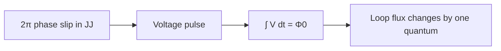
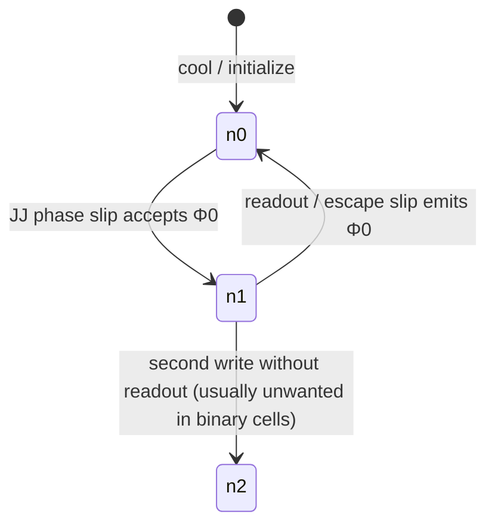

# Magnetic Flux Quantization in Superconductors

**Prereqs:** [Josephson Junction (RCSJ)](josephson-junction-rcsj.md)  
**Next:** [Superconducting Loop / SQUID](superconducting-loop-squid.md)

**Learning goals.** After this page you should be able to (1) state what $\Phi_0$ is and why it has the engineering form $2.07\,\text{mV}\cdot\text{ps}$, (2) connect one $2\pi$ Josephson phase slip to a voltage pulse whose area is exactly one flux quantum, (3) explain why a closed superconducting loop cannot stably hold half a quantum, and (4) contrast flux-packet information with CMOS continuous voltage levels.

## Why this matters

CMOS stores and moves information as **voltage levels** on wires and capacitors. Single Flux Quantum (SFQ) electronics stores and moves information as **discrete packets of magnetic flux**. Those packets are not a design style preference; they are forced by superconducting quantum mechanics.

The size of one packet is the **magnetic flux quantum**

$$\Phi_0 = \frac{h}{2e} \approx 2.067833848\times 10^{-15}\,\text{Wb}.$$

In circuit units that engineers actually use day-to-day,

$$\Phi_0 \approx 2.07\,\text{mV}\cdot\text{ps}.$$

Every RSFQ pulse you will meet later — every JTL hop, every DFF write, every clocked gate event — is one of these packets being created, moved, or annihilated. If $\Phi_0$ is fuzzy, the rest of SFQ will feel like magic. This page makes the packet size inevitable and concrete.

## Analogy (without false physics)

Imagine a bicycle chain that can advance only by whole links. You can push harder or softer; you can change how fast the pedals turn; but the chain still advances by integer links. A closed superconducting loop is similar: its magnetic flux is locked to **integer multiples** of $\Phi_0$. You cannot park a stable “half link” of flux in that loop.

A Josephson junction in the loop is the place where the chain can advance by one link. When the junction’s superconducting phase slips by $2\pi$, exactly one $\Phi_0$ transfers through that weak link — like advancing the chain by one tooth — and the voltage across the junction briefly spikes so that the **area** of that spike equals $\Phi_0$.

The analogy is about **discreteness and counting**, not about mechanical gears inside the metal. The physics underneath is the single-valuedness of the superconducting wave function around a closed path.

## What “flux” means here

Magnetic flux through a surface $S$ bounded by a loop is

$$\Phi = \int_S \mathbf{B}\cdot d\mathbf{A}.$$

In SI units, flux is measured in webers (Wb). One weber is one volt-second: if a voltage $V$ appears across an inductive path while flux changes, Faraday’s law ties them together. That is why $\Phi_0$ can be written as a **voltage–time product**. A pulse that lasts a few picoseconds with millivolt-scale height can still enclose one whole flux quantum under its curve.

In superconductors the relevant carriers are **Cooper pairs** with charge $2e$, not single electrons with charge $e$. That is why the denominator is $2e$, not $e$. The same factor appears in the Josephson relations you met on the RCSJ page.

## Why the flux must be quantized

A superconducting condensate is described by a complex order parameter (a macroscopic wave function) with a **phase** $\theta$. Around any closed superconducting path, that phase must return to the same physical state after one full trip. Phase is defined only modulo $2\pi$, so the total phase winding around the loop must be an integer multiple of $2\pi$:

$$\oint \nabla\theta\cdot d\mathbf{l} = 2\pi n,\qquad n\in\mathbb{Z}.$$

In a thick superconducting wire with negligible interior magnetic field (Meissner screening), that winding condition becomes a condition on the enclosed flux: the flux through the loop is forced to

$$\Phi = n\,\Phi_0,\qquad n = 0,\pm 1,\pm 2,\ldots$$

This is **flux quantization** in a superconducting ring. The integer $n$ is sometimes called the fluxoid quantum number. Idealized perfect loops sit in these discrete states; real SFQ loops are interrupted by Josephson junctions so that $n$ can change when a junction switches — that is how you write and erase a bit.

When the loop contains Josephson junctions, the precise statement is **fluxoid quantization**: the sum of the Josephson phases plus the inductive flux term is still locked to $2\pi n$. For intuition on this curriculum’s core walk, remember:

- empty storage loop $\leftrightarrow$ $n=0$ (no circulating flux quantum),
- stored logic “1” $\leftrightarrow$ roughly one circulating $\Phi_0$ ($n=\pm 1$ in the usual design ballpark).

## The Josephson phase slip and the pulse area

The AC Josephson relation connects voltage across a junction to the rate of change of the Josephson phase $\phi$:

$$V(t) = \frac{\Phi_0}{2\pi}\frac{d\phi}{dt}.$$

Integrate both sides over the duration of one switching event in which $\phi$ advances by exactly $2\pi$:

$$\int V(t)\,dt = \frac{\Phi_0}{2\pi}\int_{0}^{2\pi} d\phi = \Phi_0.$$

That identity is the heart of SFQ pulse logic:

**one $2\pi$ phase slip $\Leftrightarrow$ one voltage pulse whose area is $\Phi_0$.**

Shape does not have to be rectangular. Peaks can be higher or lower; widths can stretch or compress with junction parameters. The invariant is the **area**, not a CMOS-like logic voltage threshold.

```text
   Voltage pulse (sketch)

   V
   |     /\
   |    /  \
   |___/    \____  time
        <~ few ps>

   Area under the pulse = ∫ V dt = Φ0 ≈ 2.07 mV·ps
```



## Engineering form: why mV·ps is useful

Writing $\Phi_0 \approx 2.07\times 10^{-15}\,\text{Wb}$ is correct but hard to visualize on a picosecond scope. Because $1\,\text{Wb} = 1\,\text{V}\cdot\text{s}$,

$$\Phi_0 \approx 2.07\times 10^{-15}\,\text{V}\cdot\text{s} = 2.07\,\text{mV}\cdot\text{ps}.$$

That tells you, roughly, what an SFQ pulse “looks like” on a plot:

| Rough pulse width | Rough average height if area $= \Phi_0$ |
|-------------------|----------------------------------------|
| $2\,\text{ps}$ | $\sim 1\,\text{mV}$ |
| $4\,\text{ps}$ | $\sim 0.5\,\text{mV}$ |
| $10\,\text{ps}$ | $\sim 0.2\,\text{mV}$ |

Real pulses are not flat-top averages; peaks can be larger than the average. The table is only for order-of-magnitude intuition: **picoseconds × millivolts ≈ one flux quantum**.

## CMOS contrast: continuous volts vs discrete flux packets

| Idea | CMOS (typical digital intuition) | SFQ (this page) |
|------|----------------------------------|-----------------|
| What carries a bit | Voltage level on a node / capacitor charge | Presence of a flux quantum (pulse or circulating current) |
| Is the token size fundamental? | Logic swing is a design choice ($V_{DD}$) | Token size $\Phi_0$ is a physical constant |
| Continuous intermediates? | Analog voltages exist; noise margins define digital regions | Closed superconducting loops stabilize integer $n\Phi_0$ |
| Switching event | Charge dumped through transistors | $2\pi$ phase slip $\Rightarrow$ pulse area $\Phi_0$ |
| “How big is one bit physically?” | Depends on capacitance and $V_{DD}$ | One bit package is always $\Phi_0$ in ideal pulse logic |

CMOS can use any convenient supply voltage; SFQ cannot invent a different flux quantum. Designers choose inductances, critical currents, and timing so that **one** $\Phi_0$ is the useful digital object — they do not resize $\Phi_0$ itself.

## Worked example 1 — Estimate pulse area from a triangle sketch

Suppose a nearly triangular SFQ-like pulse lasts about $\Delta t = 4\,\text{ps}$ and peaks near $V_p = 1.0\,\text{mV}$. A triangle’s area is

$$A \approx \tfrac{1}{2}\,V_p\,\Delta t = \tfrac{1}{2}\times 1.0\,\text{mV}\times 4\,\text{ps} = 2.0\,\text{mV}\cdot\text{ps}.$$

Compare to $\Phi_0 \approx 2.07\,\text{mV}\cdot\text{ps}$. The sketch is already within a few percent of one flux quantum. That is not a coincidence: overdamped junctions used in RSFQ are designed so each switching event dumps approximately one $\Phi_0$ of voltage–time area.

**Takeaway:** when you see a picosecond spike on an SFQ waveform plot, ask “what is the area?” before asking “what is the peak?” Peak height alone is not the digital invariant.

## Worked example 2 — How many quanta for a given inductive flux?

A superconducting storage loop with inductance $L$ carrying circulating current $I_{\mathrm{circ}}$ stores flux

$$\Phi_{\mathrm{ind}} = L\,I_{\mathrm{circ}}$$

(ignoring junction phase contributions for a first estimate). Suppose $L = 8\,\text{pH}$ and $I_{\mathrm{circ}} = 250\,\mu\text{A} = 0.25\,\text{mA}$. Then

$$\Phi_{\mathrm{ind}} = (8\times 10^{-12}\,\text{H})(0.25\times 10^{-3}\,\text{A}) = 2.0\times 10^{-15}\,\text{Wb} \approx 0.97\,\Phi_0.$$

So this circulating current is about **one** flux quantum — the usual ballpark for a stored RSFQ “1”. If someone claimed the same loop stably held $0.5\,\Phi_0$ as a long-term digital state, that would contradict flux quantization (idealized closed superconducting path). Transient dynamics during switching can pass through non-integer flux briefly; **stable** storage states sit near integer quanta.

**Takeaway:** $L$ and $I_{\mathrm{circ}}$ are design knobs that place a stored bit near $1\cdot\Phi_0$; they do not create half-quantum stable states.

## Worked example 3 — From Faraday intuition to $\Phi_0$

Faraday’s law says an average voltage $\langle V\rangle$ lasting time $\Delta t$ changes flux by about $\langle V\rangle\Delta t$. Setting that product equal to one quantum,

$$\langle V\rangle \approx \frac{\Phi_0}{\Delta t}.$$

For $\Delta t = 5\,\text{ps}$,

$$\langle V\rangle \approx \frac{2.07\,\text{mV}\cdot\text{ps}}{5\,\text{ps}} \approx 0.41\,\text{mV}.$$

Again: millivolts and picoseconds, not volts and nanoseconds. SFQ pulses are tiny in amplitude and extremely short — yet each carries a **complete** digital token because the token is flux, not a CMOS $V_{DD}$ level.

## Picture of loop states

```text
  Superconducting loop (idealized)

      n = 0              n = +1
   ┌────────┐         ┌────────┐
   │        │         │   ↑    │  circulating current
   │   ○    │         │  ↻ Φ0  │  corresponding to one quantum
   │        │         │        │
   └────────┘         └────────┘
   empty / "0"         stored / "1" (typical SFQ storage story)
```



Binary SFQ storage cells are designed so that $n=0$ and $n=1$ are the useful states. Accidentally trapping extra quanta is a margin / timing failure mode, not a new logic level you freely use like multi-level CMOS flash.

## Bridge to SFQ circuits

RSFQ logic treats “pulse present in this clock window” as logic 1 and “no pulse” as logic 0. Storage cells hold a circulating current corresponding to about one $\Phi_0$ until a clocked junction lets that quantum escape as an output pulse. Transmission lines made of junctions and inductors (JTLs) **move** pulses without intending long-term storage.

Everything downstream — splitters, DFFs, ERSFQ bias, AQFP — inherits this same packet size. Next you will see how a loop and a SQUID actually hold and sense that circulating flux.

## Common misconceptions

1. **“Half a flux quantum can be a stable stored bit.”**  
   Not in an idealized closed superconducting loop. Stable flux (fluxoid) states are integer multiples of $\Phi_0$. Designers may talk about fractions during switching transients or in normalized circuit equations; that is not the same as a long-lived half-quantum digital state.

2. **“$\Phi_0$ is just another name for the pulse peak voltage.”**  
   No. $\Phi_0$ is an **area** in voltage–time (or a flux in webers). Peaks vary; the integrated area for one $2\pi$ slip is what equals $\Phi_0$.

3. **“Bigger pulses mean bigger flux quanta.”**  
   The quantum size is fixed by $h$ and $2e$. A “bigger” looking pulse is usually wider, taller, or both while still enclosing about one $\Phi_0$ — or it is a multi-junction / latching waveform that is not a single RSFQ fluxon event.

4. **“Flux quantization only matters in SQUID magnetometers.”**  
   Magnetometers made the effect famous, but digital SFQ logic **is** flux quantization applied as an information technology. Storage loops, pulse emission, and pulse absorption are the same physics wearing a computing hat.

5. **“Zero resistance means information costs zero energy.”**  
   A persistent circulating current in a lossless loop does not need a continuous resistive voltage drop to keep flowing. Creating, moving, and annihilating flux quanta still involves switching events and bias networks that dissipate energy. Quantization explains the **token**, not a free lunch.

6. **“CMOS already has quantized charge ($e$), so this is the same idea.”**  
   Single-electron charge quantization exists, but mainstream CMOS logic does not encode bits as single-electron packets. SFQ logic **does** encode bits as single flux quanta. The analogy is conceptual, not a claim that CMOS gates are single-electron devices.

## Check yourself

<details>
<summary>1. What is $\Phi_0$ approximately in mV·ps, and why is that unit natural?</summary>

About $2.07\,\text{mV}\cdot\text{ps}$. Because $1\,\text{Wb} = 1\,\text{V}\cdot\text{s}$, a flux quantum is naturally a voltage–time area — matching how SFQ pulses are plotted.
</details>

<details>
<summary>2. What does one $2\pi$ Josephson phase slip transfer?</summary>

Exactly one flux quantum through the junction: the voltage pulse satisfies $\int V\,dt = \Phi_0$.
</details>

<details>
<summary>3. Can a superconducting loop stably hold $0.5\,\Phi_0$ as a long-term state?</summary>

No. For a closed superconducting path, flux (fluxoid) quantization locks stable states to integer multiples of $\Phi_0$.
</details>

<details>
<summary>4. Why is the factor $2e$ in $\Phi_0 = h/(2e)$ instead of $e$?</summary>

Because the superconducting condensate involves Cooper pairs with charge $2e$, not single electrons with charge $e$.
</details>

<details>
<summary>5. A triangular pulse is $3\,\text{ps}$ wide and $1.4\,\text{mV}$ tall. Is its area near one $\Phi_0$?</summary>

Area $\approx \tfrac{1}{2}\times 1.4\,\text{mV}\times 3\,\text{ps} = 2.1\,\text{mV}\cdot\text{ps}$, yes — on the order of $\Phi_0 \approx 2.07\,\text{mV}\cdot\text{ps}$.
</details>

<details>
<summary>6. In CMOS you might say “this node is at 0.9 V, almost a solid 1.” What is the closest SFQ translation of that sentence?</summary>

Not “0.9 of a flux quantum.” A valid story is “a pulse arrived in this clock window” or “the storage loop holds about one circulating $\Phi_0$.” Intermediate analog voltages on a scope during a pulse are not intermediate logic levels in the CMOS sense.
</details>

<details>
<summary>7. If a junction slips by $4\pi$ instead of $2\pi$, what pulse area do you expect in the ideal Josephson picture?</summary>

Two flux quanta: $\int V\,dt = 2\Phi_0$. RSFQ cells are designed to avoid uncontrolled multi-slip events in normal operation.
</details>

## Next steps

- See how loops store circulating current and how a DC SQUID uses two junctions on a loop: [Superconducting Loop / SQUID](superconducting-loop-squid.md).
- Later, reconnect phase speed to pulse shape: [Phase to Pulse](../bridge/phase-to-pulse.md).
