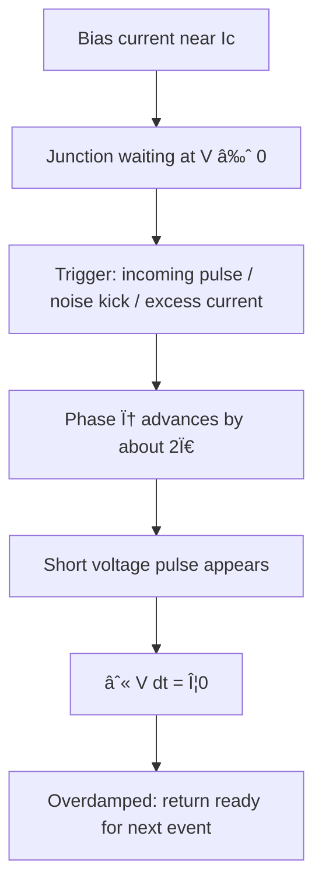

# Josephson Junction (RCSJ Intuition)

**Prereqs:** [Superconductivity Intuition](superconductivity-intuition.md)  
**Next:** [Flux Quantization](flux-quantization.md)

**In one minute.** JJ = weak link with Ic. Overdamped → short Φ0-area pulse; underdamped → can latch. RCSJ = JJ + R + C damping story.

**Only three ideas (if the equations feel heavy):** (1) weak link + $I_c$, (2) ~$2\pi$ slip ↔ pulse click, (3) area $=\Phi_0$. Full dialect: [Symbol card](sfq-symbol-card.md) · [Notation](reading-sfq-notation.md).

**Learning goals.** By the end of this page you should be able to (1) describe a Josephson junction as a weak link with a critical current $I_c$, (2) use the RCSJ picture (ideal Josephson element plus parallel $R$ and $C$) as a damping story, (3) contrast overdamped pulsing ($\beta_C \lesssim 1$) with underdamped latching ($\beta_C \gg 1$), (4) connect a ~$2\pi$ phase slip to a short voltage pulse whose area is one flux quantum $\Phi_0$, and (5) explain why Rapid Single Flux Quantum (RSFQ) logic prefers overdamped junctions for its pulse tokens.

## Why this matters

A uniform superconducting wire can carry supercurrent, but it does not give you a convenient digital **switch**. The Josephson junction (JJ) is that switch: a **weak link** between two superconductors — often a thin insulator in an S–I–S stack — that can pass supercurrent up to a maximum **critical current** $I_c$. When the total current through the junction tries to exceed $I_c$, the junction **switches** and a voltage appears: briefly as a pulse if the junction is overdamped, or as a latched larger voltage if it is underdamped and not reset.

That switching event is the heartbeat of SFQ electronics. JTLs, splitters, DFFs, and almost every RSFQ cell are arrangements of junctions, inductors, and bias currents that steer these events in time.

You already have the symbol vocabulary from [How to Read SFQ Notation](reading-sfq-notation.md) and the superconducting platform from [Superconductivity Intuition](superconductivity-intuition.md). This page puts $I_c$, $\phi$, $\beta_C$, and $\int V\,dt$ onto one device.

## Analogy: a turnstile with friction and inertia

Picture a subway turnstile between two superconducting “stations”:

- **Below $I_c$:** people (supercurrent) can pass in the Josephson sense while the voltage across the gate stays ideally near zero — the turnstile has not flung itself into a free spin.
- **Push harder than $I_c$ (or add a sharp kick while biased near $I_c$):** the turnstile rotates. In phase language, $\phi$ advances. A rapid advance of about **$2\pi$** is one meaningful digital click.
- **Friction and inertia** decide what happens next. In the **RCSJ** model, a parallel resistor provides damping (friction) and a parallel capacitor provides inertia-like energy storage. Together they set whether the turnstile **clicks once and stops** (short voltage pulse) or **keeps spinning** (latches at a voltage until something resets it).

```text
  bias near Ic          small trigger
        |                    |
        v                    v
   [ turnstile JJ ] ---- spins once? ---> short V pulse (overdamped)
                   \--- keeps spinning? -> latched V (underdamped)
```

The analogy must not be over-read: real junctions are quantum devices with rich physics. For digital intuition, “threshold + damping decides pulse vs latch” is the payload.

## Picture 1 — Device sketch and RCSJ elements

```text
   superconductor A          barrier          superconductor B
  ====================|::::::::::::::::::::|====================
                      |        JJ          |
                      +---- R (shunt) -----+
                      +---- C -------------+
                           (RCSJ model)
```

**Ideal Josephson branch:** relates supercurrent and phase (teaching form $I = I_c \sin\phi$).  
**Resistor $R$:** damping path for voltage. External shunt resistors are common in RSFQ layouts to enforce overdamped dynamics.  
**Capacitor $C$:** junction capacitance (and any parallel C); stores energy and affects how violently the phase can accelerate.

The **McCumber parameter** $\beta_C$ summarizes the damping regime for teaching:

- $\beta_C \lesssim 1$: **overdamped** — favor single-slip pulses that recover toward $V \approx 0$.
- $\beta_C \gg 1$: **underdamped** — favor ringing / latching near a larger voltage until reset.

You will reuse this contrast on [Overdamped vs Underdamped JJ](overdamped-vs-underdamped-jj.md). Here the goal is recognition and story, not a full parameter derivation.

## Picture 2 — Event sequence for an RSFQ-style pulse



## Interactive lab

Try this in place. Prefer full-screen? Open the [lab page](../labs/josephson-junction-rcsj.html).

1. **Overdamped:** bias near $I_c$, **Trigger kick** — particle slips one well; $V(t)$ pulse with area $\Phi_0$; returns ready.
2. Switch to **Underdamped** and kick again — particle keeps running (latched voltage) until **Reset**.

<iframe
  src="../../labs/josephson-junction-rcsj.html"
  title="RCSJ washboard lab"
  style="width:100%;height:780px;border:1px solid rgba(0,0,0,0.12);border-radius:0.35rem;background:#fff;"
  loading="lazy"
></iframe>

```text
φ:  ____/‾‾‾‾‾‾‾‾     advances by ~2π during the slip
         rapid

V:       /\
     ___/  \___       area ≈ Φ0 ; then quiet again if overdamped
```

## The three equations worth recognizing (without fear)

You do not need to solve differential equations to continue the curriculum. You do need to recognize what each statement is *for*:

1. **Current–phase (DC Josephson idea):**

\[
I = I_c \sin\phi
\]

Teaching read: phase controls how much supercurrent the weak link can carry; $I_c$ is the amplitude ceiling.

2. **Voltage–phase (AC Josephson idea):**

\[
V = \frac{\Phi_0}{2\pi}\frac{d\phi}{dt}
\]

Teaching read: voltage is proportional to how fast the phase is changing. A fast $2\pi$ slip makes a short pulse.

3. **Area rule for one slip:** integrating (2) over a $2\pi$ advance gives

\[
\int V\,dt = \Phi_0
\]

Teaching read: **one digital click ↔ one flux quantum of pulse area**, independent of the exact pulse shape in the idealization.

The RCSJ *dynamics* add capacitor and resistor currents so that $I_{\mathrm{bias}} = I_c\sin\phi + V/R + C\,dV/dt$ (schematic form). Damping lives in that balance. Remember the **story**, not a demand that you integrate it by hand on this page.

## Worked example 1 — Bias near $I_c$, then a trigger

**Setup (qualitative):** An overdamped junction is biased at a standing current $I_b$ slightly below $I_c$. An incoming SFQ pulse briefly adds current through the junction.

**Step-by-step story:**

1. **Waiting:** $I_b < I_c$, $V \approx 0$, phase nearly stuck on the washboard (phase landscape) in the usual teaching metaphor.
2. **Trigger arrives:** total current tries to exceed $I_c$ (or kicks the phase over the barrier).
3. **Switch:** $\phi$ runs forward by about $2\pi$.
4. **Pulse:** $V(t)$ spikes for a few picoseconds (order-of-magnitude language for Nb-scale teaching).
5. **Area:** $\int V\,dt = \Phi_0$ in the ideal single-slip picture.
6. **Recover:** overdamping returns the junction toward $V \approx 0$, ready for another event later.

**What to say in a design conversation:** “We park near $I_c$ so a small timed kick produces one clean fluxon pulse.”

## Worked example 2 — Same $I_c$, different $\beta_C$

**Prompt:** Two junctions share a similar $I_c$ but differ in shunt resistance / capacitance so that one has $\beta_C \lesssim 1$ and the other $\beta_C \gg 1$. A switching event is forced in both.

**Compare:**

| Feature | Overdamped ($\beta_C \lesssim 1$) | Underdamped ($\beta_C \gg 1$) |
|---------|-----------------------------------|-------------------------------|
| After switching | Short pulse, returns toward $V\approx 0$ | May latch at larger voltage |
| Typical RSFQ internal gates | Preferred | Not the default pulse token |
| Some I/O / latching families | — | Historically / still used where latching voltage helps |
| Teaching symbol | Pulse spike with area $\Phi_0$ | Step to a voltage until reset |

**Takeaway:** $I_c$ sets the **threshold scale**; $\beta_C$ sets the **personality after crossing the threshold**. Confusing the two is a common early mistake.

## Worked example 3 — Reading $\int V\,dt = \Phi_0$ on a sketch

Suppose a notebook shows a rounded pulse lasting roughly a few picoseconds with millivolt-scale height (illustrative, not a PDK claim). Estimate area as “order $1\,\text{mV} \times \text{few ps}$” and compare with $\Phi_0 \approx 2.07\,\text{mV}\cdot\text{ps}$.

**Pedagogical point:** you are checking that the sketch is **dimensionally an SFQ pulse**, not extracting a lab measurement. Shape details vary; the invariant to carry forward is the area rule tied to a $2\pi$ slip.

## Comparison table — JJ vocabulary vs nearby ideas

| Term | Means in this page | Does *not* mean |
|------|--------------------|-----------------|
| $I_c$ | Max supercurrent before switching | CMOS VDD or a logic-high voltage |
| $\phi$ | Phase difference across the JJ | The flux $\Phi$ in a loop (related but distinct symbol) |
| $\beta_C$ | Damping regime parameter | BJT current gain |
| Shunt $R$ | Damping tool (often added) | “The bit resistor” that stores the logic level |
| SFQ pulse | Event with area $\Phi_0$ | A held CMOS plateau |

## Common misconceptions

1. **“A Josephson junction is just a tunnel diode with a critical current.”**  
   Related family resemblance in “threshold,” but the digital SFQ story centers on **phase slips** and **flux quanta**, not on CMOS-like voltage rails.

2. **“Any junction automatically emits SFQ pulses.”**  
   Pulse-and-recover behavior wants **sufficient damping** (overdamped RCSJ). Underdamped junctions can latch.

3. **“Bigger $I_c$ always means a better gate.”**  
   $I_c$ interacts with inductance, noise margins, and damping targets. Larger is not automatically wiser; it is a design parameter.

4. **“$V = 0$ below $I_c$ means nothing is happening inside.”**  
   Phase can still be the state variable of interest; bias points and incoming pulses matter. “$V\approx 0$” means no junction voltage pulse *yet*, not “the circuit is idle in every sense.”

5. **“Phase advancing by $2\pi$ is a continuous analog rotation we digitize later.”**  
   In the RSFQ teaching story, one $2\pi$ slip **is** the digital event (one fluxon). Later encoding pages explain windows and storage; they do not require inventing a separate ADC onto phase.

6. **“RCSJ is only for simulators.”**  
   Simulators use it, yes — but pedagogically RCSJ is the reason people draw $R$ and $C$ beside the JJ and talk about $\beta_C$.

## CMOS contrast

| CMOS transistor habit | Josephson junction habit (RSFQ-oriented) |
|-----------------------|------------------------------------------|
| Gate voltage modulates channel | Bias current relative to $I_c$ sets proximity to switching |
| Output often a restored voltage level | Output often a **pulse event** (or a change in stored loop flux) |
| “Rail-to-rail” swing as bit clarity | **Pulse area** $\Phi_0$ and correct **timing window** as bit clarity |
| Saturation / linear regions language | Overdamped pulse vs underdamped latch language |
| Static high still burns leakage depending on tech | Quiet $V\approx 0$ between pulses is normal on many nodes |

```text
CMOS:   level -------- level -------- level
SFQ:    . . . /\ . . . . . /\ . . .     (events)
```

## Bridge to SFQ circuits

In RSFQ logic, an overdamped JJ biased near $I_c$ waits for a trigger. One ~$2\pi$ phase slip launches a picosecond-scale voltage pulse whose area is one flux quantum $\Phi_0$. That pulse is the digital token moved by Josephson transmission lines and steered by gates.

Two follow-on questions appear immediately:

1. **Why is the token size exactly $\Phi_0$?** → [Flux Quantization](flux-quantization.md)  
2. **How does a loop hold that token as circulating current?** → later loop / SQUID pages after flux quantization  
3. **When do we *want* underdamped latching instead?** → [Overdamped vs Underdamped JJ](overdamped-vs-underdamped-jj.md) and some I/O concepts

## Check yourself

<details markdown="1">
<summary markdown="span">1. What is $I_c$?</summary>

The largest supercurrent the junction can carry before it switches into a voltage-producing state (the critical current).
</details>

<details markdown="1">
<summary markdown="span">2. Why add a shunt resistor in many RSFQ junctions?</summary>

To overdamp the junction (reduce $\beta_C$) so it emits a short pulse and returns toward $V \approx 0$, instead of latching at a large voltage.
</details>

<details markdown="1">
<summary markdown="span">3. What does RCSJ stand for as an intuition?</summary>

Resistively and Capacitively Shunted Junction — an ideal Josephson element plus parallel $R$ and $C$ that set damping and dynamics.
</details>

<details markdown="1">
<summary markdown="span">4. A junction undergoes one $2\pi$ phase slip. What pulse invariant should you quote?</summary>

$\int V\,dt = \Phi_0$ in the ideal single-slip picture — one flux quantum of voltage–time area.
</details>

<details markdown="1">
<summary markdown="span">5. How does $\beta_C \gg 1$ behavior differ from $\beta_C \lesssim 1$ after switching?</summary>

Large $\beta_C$ (underdamped) can latch at larger voltage until reset; small $\beta_C$ (overdamped) favors a short recovering pulse used as an RSFQ token.
</details>

<details markdown="1">
<summary markdown="span">6. Why bias “near $I_c$” rather than far below it for a sensitive pulse gate?</summary>

So a small timed trigger can push the junction over threshold; if bias is far below $I_c$, the same trigger may not switch reliably (qualitative teaching point).
</details>

<details markdown="1">
<summary markdown="span">7. Name one way JJ thinking differs from asking for a CMOS logic-high voltage on the output node.</summary>

RSFQ-oriented JJ outputs are often judged as **whether a $\Phi_0$-area pulse occurred in a timing window** (and whether loops hold flux), not as whether a rail voltage is held high.
</details>

## Glossary spot-links

[Glossary](../glossary.md): Josephson junction, $I_c$, phase $\phi$, $\beta_C$, RCSJ, overdamped, underdamped, SFQ pulse, bias current.

## Next steps

- Quantize the magnetic token size and reconnect $\int V\,dt$ to loops: [Flux Quantization](flux-quantization.md).
- When ready for the damping deep-dive: [Overdamped vs Underdamped JJ](overdamped-vs-underdamped-jj.md).
