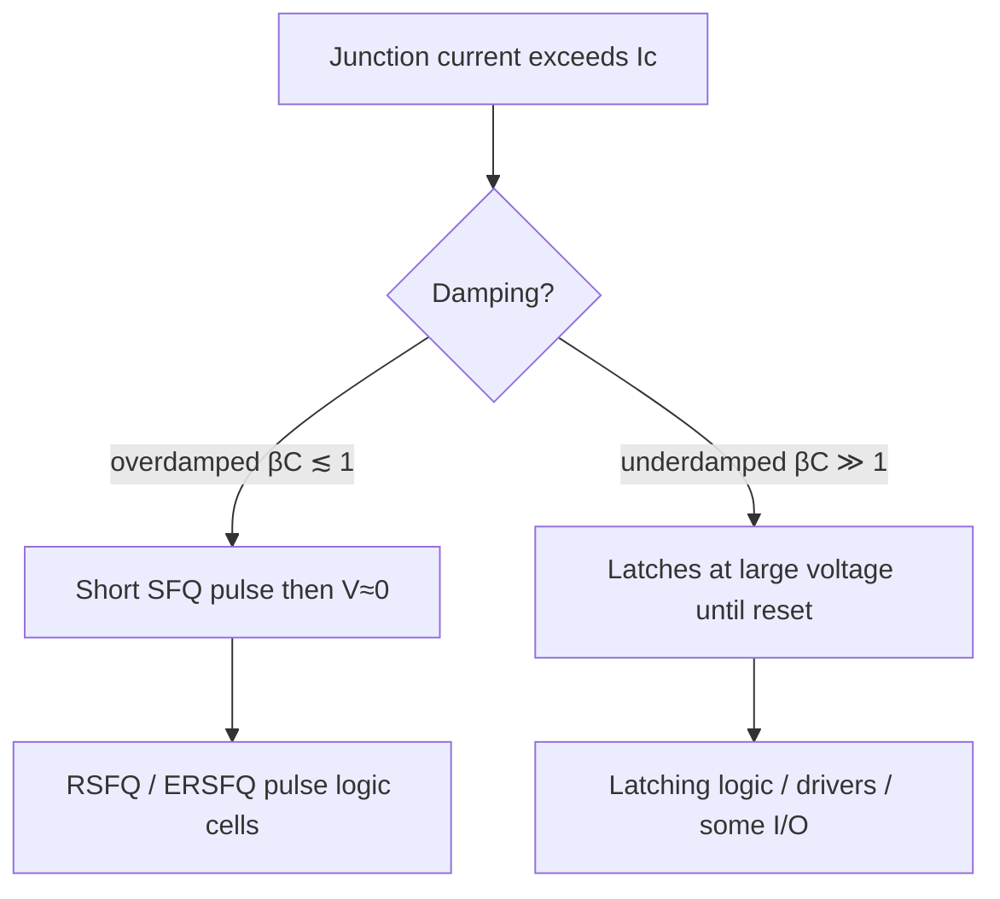
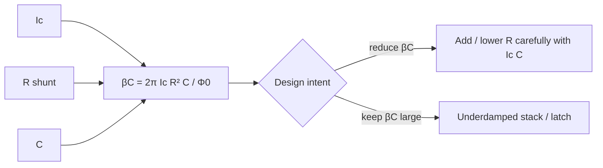

# Overdamped vs Underdamped Josephson Junctions

**Prereqs:** [Superconducting Loop / SQUID](superconducting-loop-squid.md)  
**Next:** [Phase to Pulse](../bridge/phase-to-pulse.md)

**In one minute.** βC small → recover to V≈0 (RSFQ pulses). βC large → latching voltage until reset (some I/O). Same Ic, different personality.

**Learning goals.** After this page you should be able to (1) tell overdamped (pulse) junctions from underdamped (latching) junctions using damping intuition, (2) state what the McCumber parameter $\beta_C$ is summarizing, (3) explain why RSFQ libraries shunt junctions toward $\beta_C\lesssim 1$, and (4) recognize when latching / underdamped behavior is intentional (often I/O and drivers) rather than a bug.

## Why this matters

Not every Josephson junction behaves the same after it switches. RSFQ needs junctions that **fire a short pulse and return to zero voltage**. Some interface circuits instead **latch** near a larger voltage until deliberately reset. Mixing those behaviors without noticing causes confusion when reading papers, schematics, and scope traces.

You already know from the RCSJ page that a real junction has capacitance and can be resistively shunted. This page makes the **damping choice** the main character. Everything about “SFQ pulse logic” vs “latching Josephson logic / drivers” hangs on that choice.

## Analogy — two screen doors

- **Overdamped (RSFQ pulse JJ):** a screen door with a strong damper. It swings once and stops. One trigger → one short motion → quiet again at $V\approx 0$.
- **Underdamped (latching JJ):** a screen door that flies open and keeps bouncing / stays open until you pull it shut. One trigger → a high-voltage state that persists until reset.

Designers summarize damping with the **McCumber–Stewart parameter** $\beta_C$ (often just “McCumber $\beta_C$”). Smaller $\beta_C$ means more damping.

The analogy is about **return vs stick**, not about literal mechanical bounce inside the barrier. The RCSJ equations are still the model; $\beta_C$ packages their inertial vs frictional balance into one dimensionless number.

## RCSJ reminder and $\beta_C$

The Resistively and Capacitively Shunted Junction (RCSJ) picture places an ideal Josephson element in parallel with capacitance $C$ and resistance $R$ (often an intentional shunt $R_s$ plus other resistive paths). Qualitatively:

- $C$ gives the junction **inertia** (phase wants to keep evolving once it starts moving fast),
- $R$ gives **damping** (energy leaves the oscillating plasma / switching transient),
- the Josephson relation ties voltage to $\dot\phi$.

A standard definition is

\[
\beta_C = \frac{2\pi I_c R^2 C}{\Phi_0}.
\]

You do not need to memorize derivations for the core walk. You need the sorting rule:

| $\beta_C$ regime | Name | After exceeding $I_c$ (typical story) |
|------------------|------|----------------------------------------|
| $\beta_C \lesssim 1$ | Overdamped | One $2\pi$ slip → short pulse → returns to $V\approx 0$ |
| $\beta_C \gg 1$ | Underdamped | Can run to a finite-voltage latching state until reset |

RSFQ library cells intentionally **shunt** junctions so $\beta_C$ is order-1 or below. Classic latching logic and some stacked drivers intentionally keep junctions underdamped to obtain larger, longer voltage excursions useful for interfacing.

## Picture — waveforms

```text
Overdamped pulse (RSFQ-like)          Underdamped latch (sketch)

V |   /\                              V |  ________ high / gap-ish
  |  /  \                               | /
  |_/    \____ 0                        |/__________ until reset
       time                                   time

∫V dt ≈ Φ0 for one slip                Voltage stays nonzero; not a
                                        single clean RSFQ fluxon token
```





## Interactive lab

Try this in place. Prefer full-screen? Open the [lab page](../labs/overdamped-vs-underdamped-jj.html).

1. **RSFQ preset** (β_C ≲ 1): **Trigger kick** — short pulse, returns to V≈0; ∫V dt ≈ Φ₀ cartoon.
2. **Latch preset** (β_C ≫ 1): kick again — voltage holds until **Reset latch**. Same Ic story, different personality.

<iframe
  src="../../labs/overdamped-vs-underdamped-jj.html"
  title="Overdamped vs underdamped JJ lab"
  style="width:100%;height:740px;border:1px solid rgba(0,0,0,0.12);border-radius:0.35rem;background:#fff;"
  loading="lazy"
></iframe>

## IV-curve intuition (without a full course)

Underdamped junctions often show **hysteresis** on a DC $I$–$V$ trace: the current where the junction switches up to a voltage state differs from the current where it returns to zero voltage. Overdamped junctions are much less hysteretic — they are built to be **nonlatching** pulse switches.

You may also hear “gap voltage” language for the finite-voltage branch of underdamped SIS junctions. For digital SFQ pulse logic, treat that as a reminder that underdamped devices can sit on a **nonzero voltage branch**. RSFQ gates are not trying to live there during normal Boolean operation.

## Why RSFQ insists on overdamping

RSFQ encoding assumes:

1. a logic event is a **brief** pulse with area $\Phi_0$,
2. after the event the junction is ready again at $V\approx 0$,
3. timing is about **when pulses occur**, not about holding a CMOS-like voltage high for half a cycle.

If a gate junction latches, it violates those assumptions: bias networks see a persistent voltage, subsequent timing windows break, and the cell is no longer a clean pulse automaton. Shunt resistors are therefore not optional decoration in RSFQ — they are part of making the device speak the pulse language.

## When underdamped / latching is the point

Latching is not “wrong.” It is a different tool:

- historical **latching Josephson logic** families used underdamped junctions as voltage-state devices,
- modern **hybrid interfaces** often need larger voltage swings than a single millivolt-scale SFQ pulse to talk to semiconductor amplifiers,
- stacked junctions / SQUID-stack drivers / 4JL-style ideas (met later in concepts) lean on underdamped or multi-junction voltage development.

Rule of thumb while reading:

- words like **SFQ pulse, RSFQ, JTL, DFF** → assume overdamped pulse switching,
- words like **latching driver, Suzuki stack, gap voltage latch** → expect underdamped or stacked finite-voltage behavior.

## CMOS contrast: edge vs level, pulse vs rail

| Topic | CMOS | Overdamped SFQ JJ | Underdamped / latching JJ |
|-------|------|-------------------|---------------------------|
| Native digital object | Voltage level vs $V_{DD}/2$ | Picosecond pulse / flux quantum | Sustained finite voltage until reset |
| After switching | Rails stay high/low until driven otherwise | Returns to $V\approx 0$ awaiting next event | May stay on voltage branch |
| Damping story | RC on nodes; not Josephson $\beta_C$ | Shunt sets $\beta_C\lesssim 1$ | Large $\beta_C$, hysteretic IV |
| Typical logic family role | Almost all mainstream digital | RSFQ / ERSFQ pulse datapaths | Drivers, I/O, legacy latching logic |
| Mistaken transplant | — | Treating pulses like CMOS levels | Using a latching JJ where a pulse JJ was required |

CMOS does not have a McCumber parameter, but it does have an analogous design discipline: you pick device regimes (saturated MOSFET digital switching vs analog bias) on purpose. SFQ’s first regime split is **pulse vs latch**.

## Worked example 1 — What $\beta_C$ is telling you

Suppose a junction has $I_c = 200\,\mu\text{A}$, an effective parallel $R = 1\,\Omega$, and $C = 0.5\,\text{pF}$. Using

\[
\beta_C = \frac{2\pi I_c R^2 C}{\Phi_0},
\]

plug in SI units carefully in a real calculator when you design. For learning, notice the **knobs**:

- raising $R$ (less damping conductance) **increases** $\beta_C$ strongly ($R^2$),
- raising $C$ increases $\beta_C$,
- raising $I_c$ increases $\beta_C$.

RSFQ shunts push $R$ downward (more damping) until $\beta_C$ is acceptable, while still leaving enough $I_c R$ product for a healthy pulse height/speed. That is a trade space, not a single universal resistor.

**Qualitative check:** if someone removes the shunt from an RSFQ junction schematic “to simplify,” they may accidentally move the device into a latching regime — a conceptual disaster for pulse logic even if the netlist still “has a JJ.”

## Worked example 2 — Same trigger, two outcomes

A bias current sits near $0.7 I_c$. An incoming SFQ pulse briefly pushes the junction over $I_c$.

- **Overdamped case:** phase advances $\sim 2\pi$, a picosecond-scale voltage spike of area $\Phi_0$ appears, voltage returns to $\approx 0$, cell ready for the next clock window.
- **Underdamped case:** phase keeps running; the junction lands on a finite-voltage state; a reset procedure (current reduction, opposite pulse, stack reset protocol, etc.) is required before the device is “armable” again like a pulse switch.

Same word “switches,” opposite system-level meaning. Always ask: **did it return?**

## Worked example 3 — Reading a paper sentence

Sentence A: “The JTL uses shunted Nb junctions with $\beta_C\approx 1$.”  
→ Pulse-propagation interconnect; expect SFQ pulses.

Sentence B: “The output stage is a latching stack providing millivolt-to-tens-of-millivolt swing for the semiconductor amplifier.”  
→ Underdamped / latching behavior on purpose; not an RSFQ gate failure.

Sentence C: “Unexpected latching was observed in the XOR cell at high bias.”  
→ Overdamped design intent failed; margins or damping insufficient — a bug relative to RSFQ assumptions.

Training yourself to classify those three sentences is most of the practical skill this page exists to teach.

## Bridge to SFQ circuits

When a page says “SFQ pulse,” assume overdamped switching with $\int V\,dt=\Phi_0$. When a page says “latching driver / 4JL / Suzuki stack,” expect underdamped or stacked junction behavior aimed at bigger voltage, not RSFQ-style pulse logic.

Next bridge page turns the overdamped $2\pi$ slip into an explicit picosecond pulse story using the AC Josephson relation as narrative glue.

## Common misconceptions

1. **“Underdamped junctions are obsolete / always bad.”**  
   They are the wrong default for RSFQ gates, but they remain useful for drivers and interfaces that need larger voltage excursions.

2. **“Overdamped means the junction is slow or weak.”**  
   Overdamped means the transient is damped so it does not latch. RSFQ pulses are still picosecond-class events.

3. **“$\beta_C\approx 1$ is a magical exact requirement.”**  
   It is an order-of-magnitude design region. Libraries target nonlatching pulse behavior with margins; published cells quote specific $\beta_C$ values as engineering choices.

4. **“Any voltage spike on a scope is an SFQ pulse.”**  
   Latching excursions, reset transients, and measurement artifacts can look spiky. An SFQ pulse in the RSFQ sense is an overdamped $\Phi_0$-area event in the digital token story.

5. **“Shunt resistors waste power, so ideal RSFQ would omit them.”**  
   Without adequate damping, the pulse token model collapses into latching dynamics. Shunts are part of the logic device definition for RSFQ.

6. **“CMOS already solved damping with careful RC design, so SFQ damping is the same topic.”**  
   Related only at the highest level (energy storage vs dissipation). The Josephson phase particle on a washboard, plasma frequency, and $\beta_C$ hysteresis are specific to JJ dynamics.

## Check yourself

<details>
<summary>1. Which damping style fits RSFQ pulse logic?</summary>

Overdamped ($\beta_C\lesssim 1$): short pulse, return to $V\approx 0$.
</details>

<details>
<summary>2. What goes wrong if an RSFQ gate junction latches?</summary>

It may stay at nonzero voltage and break pulse-logic timing and bias assumptions — cells are designed to avoid that.
</details>

<details>
<summary>3. Are latching junctions “wrong”?</summary>

No — they are used for other roles (often I/O / drivers). They are just not the default RSFQ gate switch.
</details>

<details>
<summary>4. What does increasing the shunt resistance $R$ tend to do to $\beta_C$?</summary>

Increase $\beta_C$ (less damping), moving toward underdamped / latching behavior if taken too far.
</details>

<details>
<summary>5. Name one CMOS contrast for overdamped SFQ switching.</summary>

CMOS digital nodes hold rail voltages; overdamped SFQ junctions return to $V\approx 0$ after emitting a flux-quantum pulse.
</details>

<details>
<summary>6. A paper reports hysteretic JJ IV curves in an output driver stack. Is that automatically a contradiction of RSFQ practice?</summary>

Not if the driver is intentionally underdamped/latching. It would be concerning if the same hysteretic latching appeared inside a supposed RSFQ JTL gate junction.
</details>

<details>
<summary>7. What invariant still characterizes one overdamped $2\pi$ slip?</summary>

Pulse area $\int V\,dt=\Phi_0$, even though the detailed shape depends on $I_c$, $R$, and $C$.
</details>

## Next steps

- Turn a $2\pi$ phase slip into a picosecond pulse story: [Phase to Pulse](../bridge/phase-to-pulse.md).
- Later interface reading: driver / stack concepts such as [SQUID Stack Driver](../concepts/squid-stack-driver.md) and [Four-JL Latching Driver](../concepts/four-jl-latching-driver.md) (after more core walk).
