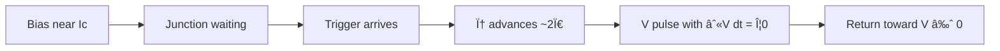

# How to Read SFQ Notation

**Prereqs:** [Cryogenics for electronics](cryogenics-for-electronics.md) (express lane) · or [Symbol card](sfq-symbol-card.md)  
**Next:** [Superconductivity Intuition](superconductivity-intuition.md)

**In one minute.** Five symbols (Φ0, Ic, φ, βC, ∫V dt) describe timed events, not held CMOS rails. Shape of the spike is secondary to area. Next: superconductivity; then only three ideas into RCSJ.

**Learning goals.** By the end of this page you should be able to (1) recognize the five symbols that appear on almost every SFQ whiteboard sketch ($\Phi_0$, $I_c$, $\phi$, $\beta_C$, $\int V\,dt$), (2) read ASCII and Mermaid pulse drawings without mistaking shape for meaning, (3) interpret a **clock window** as a timing slot rather than a CMOS voltage rail, and (4) translate a short “pulse present / absent” story into the language you will meet on later fundamentals pages.

## Why this matters

Single Flux Quantum (SFQ) papers, lecture notes, and lab notebooks look cryptic at first glance. Authors draw tiny spikes, write $\Phi_0$ next to a loop, and say “the junction switches when the bias exceeds $I_c$.” None of that is meant to be mystical. It is a compact dialect for **events in time**, not for steady voltage levels.

If you skip this dialect, every later page feels like a wall of Greek letters. If you learn it once, carefully, the rest of the curriculum becomes a conversation about physics and circuits instead of a fight with symbols.

This page is deliberately **notation-first**. You do not need superconductivity theory yet. You need a map of the alphabet. The next page ([Superconductivity Intuition](superconductivity-intuition.md)) starts the physics story; this page ensures you can read the labels on that story.

## Analogy: a score, not a voltmeter

Classical CMOS thinking asks: “What is the voltage on this wire right now — high or low?” SFQ thinking asks: “Did a brief event happen in this time slot?”

A useful analogy is a **musical score**:

- A CMOS rail is like a sustained note held for many measures.
- An SFQ pulse is like a short percussion hit: it has almost no duration compared with the clock bar, but its **presence** in that bar is what matters.
- The **area** under the voltage spike (not its peak height) is the conserved quantity — like saying each hit carries one “unit of loudness energy,” no matter whether the stick struck a bit harder or softer.

Keep that picture. When someone draws:

```text
V
|   /\
|__/  \____  time
```

they are not claiming a precise triangle formula. They are saying: “a short voltage event occurred; treat its area as one flux quantum.”

## Interactive lab

Same five-symbol drill as the [Symbol card](sfq-symbol-card.md). Prefer full-screen? Open the [lab page](../labs/sfq-symbol-card.html).

1. Tap to peek, then pick the meaning for $\Phi_0$, $I_c$, $\phi$, $\beta_C$, $\int V\,dt$.
2. Misses highlight the “not” column (e.g. $\Phi_0$ is not $V_{DD}$).

<iframe
  src="../../labs/sfq-symbol-card.html"
  title="SFQ symbol card lab"
  style="width:100%;height:700px;border:1px solid rgba(0,0,0,0.12);border-radius:0.35rem;background:#fff;"
  loading="lazy"
></iframe>

## The five symbols you will see everywhere

### 1. Flux quantum $\Phi_0$

**Spoken name:** “phi-zero” or “flux quantum.”

**Idea:** the smallest stable packet of magnetic flux that a closed superconducting loop likes to hold. In SFQ digital talk, one $\Phi_0$ is the usual **information token** — the thing that moves, stores, or is absent.

**Useful engineering form:**

\[
\Phi_0 = \frac{h}{2e} \approx 2.07 \times 10^{-15}\,\text{Wb} = 2.07\,\text{mV}\cdot\text{ps}
\]

You will see both units. Weber (Wb) is the SI magnetic-flux unit. Millivolt·picosecond is the **circuit designer’s** form: it reminds you that a voltage pulse with that time-area carries one quantum.

**How it appears in sketches:**

```text
   loop with circulating current
        ○━━━━○
       /  Φ0  \      ← “this loop holds one quantum”
```

You do **not** need to memorize the derivation of $h/(2e)$ to start. Memorize the **role**: $\Phi_0$ is the size of one digital flux packet.

[Glossary](../glossary.md): **Flux quantum $\Phi_0$**, **Fluxon**.

### 2. Critical current $I_c$

**Spoken name:** “I-sub-c” or “critical current.”

**Idea:** the largest supercurrent a Josephson junction can carry before it switches into a voltage-producing state. Think of it as a **threshold** on a current axis, not as a CMOS “logic-high voltage.”

**How it appears:**

```text
bias I_b ──────► JJ (Ic)
                 |
                 └── if I_b + trigger > Ic → switch / emit pulse
```

Authors often say “biased near $I_c$.” That means the standing bias is close to the threshold so a small extra kick can trigger switching. Exact numbers are process- and design-dependent; this curriculum stays qualitative unless a later page introduces a specific teaching example.

[Glossary](../glossary.md): **Critical current $I_c$**, **Bias current**.

### 3. Josephson phase $\phi$

**Spoken name:** “phi” (the phase difference across a junction).

**Idea:** a dimensionless angle that describes the superconducting state across the weak link. In the simplest digital story:

- $\phi$ can sit nearly still while the junction carries supercurrent at $V \approx 0$;
- when the junction switches in the usual RSFQ way, $\phi$ advances by about **$2\pi$** (one full turn);
- that one turn is tied to transferring one $\Phi_0$.

You will later meet the AC Josephson relation $V = (\Phi_0 / 2\pi)\, d\phi/dt$. For notation purposes now: **$\phi$ is the angle; a $2\pi$ slip is one digital event.**

```text
φ
|
|          /‾‾‾‾   ← after slip, phase is higher by ~2π
|    _____/
|___/
         time
```

[Glossary](../glossary.md): **Phase $\phi$**.

### 4. McCumber parameter $\beta_C$

**Spoken name:** “beta-C” or “McCumber beta.”

**Idea:** a dimensionless damping parameter for the junction dynamics in the RCSJ model (resistively and capacitively shunted junction). Rough teaching contrast:

| $\beta_C$ regime | Everyday label | What the junction tends to do after switching |
|------------------|----------------|-----------------------------------------------|
| $\beta_C \lesssim 1$ | **overdamped** | Emit a short pulse and return toward $V \approx 0$ |
| $\beta_C \gg 1$ | **underdamped** | Can **latch** at a larger voltage until reset |

RSFQ-style gates lean on overdamped behavior. Some drivers and older latching families lean on underdamped behavior. You do not need the full formula for $\beta_C$ on day one; you need to recognize the **symbol as a damping dial**.

[Glossary](../glossary.md): **β_C (McCumber)**, **Overdamped**, **Underdamped**, **RCSJ**.

### 5. Pulse area $\int V\,dt$

**Spoken name:** “integral of V dt” or “voltage–time area.”

**Idea:** for one ideal SFQ switching event,

\[
\int_{-\infty}^{\infty} V(t)\,dt = \Phi_0
\]

The **shape** of $V(t)$ can change with bias, load, and junction parameters. The **area** is the invariant that matches one flux quantum. That is why sketches often look sloppy on purpose: the triangle or Gaussian blob is a reminder of an **event with area $\Phi_0$**, not a claim about exact millivolt peaks.

```text
   V(t)
   |     /\
   |    /  \      shaded area = ∫ V dt ≈ Φ0
   |___/    \____
            time
```

[Glossary](../glossary.md): **SFQ pulse**.

## Picture gallery: how to read common sketches

### A. Single pulse on a wire

```text
time →
line A:  ____/\_________     ← one SFQ pulse (logic “1” in its window)
line B:  _______________     ← no pulse (logic “0” in that same window)
```

**Do not read** “high forever after the spike.” After the spike, the line is quiet again. The information was the **event**, not a held voltage.

### B. Pulse train and missing beats

```text
clock epochs:  |  1  |  2  |  3  |  4  |
data pulses:   |  /\ |     |  /\ |     |
meaning:         1     0     1     0
```

Each vertical slot is a **clock window** (also called an epoch). Presence → 1, absence → 0. This is the central encoding idea of many RSFQ discussions.

### C. Mermaid as a causal sketch (not a SPICE netlist)



Mermaid boxes here are **storyboards**. They do not imply a particular schematic topology. When a later page draws a real cell, it will say so.

### D. Loop holding $\Phi_0$

```text
        I_circ
     ┌─────►─────┐
     │           │
     â—‹           â—‹  JJ
     │           │
     └─────◄─────┘
        stores ~1 × Φ0
```

Circulating current is how a loop “remembers” a quantum. Details live on later loop/SQUID pages; for notation, connect the symbol $\Phi_0$ to **storage in a loop**.

## Worked example 1 — Decoding a whiteboard sentence

**Sentence you might see:**

> “Bias the overdamped JJ near $I_c$; a data pulse advances $\phi$ by $2\pi$, launching a pulse with area $\Phi_0$ inside the clock window.”

**Unpack, symbol by symbol:**

1. **Overdamped** → $\beta_C$ is small enough that the junction should pulse and recover, not latch.
2. **Near $I_c$** → standing current is close to the switching threshold.
3. **Data pulse** → a short voltage event arrives from upstream.
4. **$\phi$ by $2\pi$** → one digital switching turn of the Josephson phase.
5. **Area $\Phi_0$** → $\int V\,dt$ matches one flux quantum.
6. **Clock window** → the time slot in which that presence counts as logic 1.

If you can restate the sentence in that six-step way, you are reading SFQ notation successfully.

## Worked example 2 — Two sketches, same physics, different ink

Sketch A (triangle):

```text
V
|  /\
|_/  \__
```

Sketch B (rounded):

```text
V
|   ⌒
|__/  \__
```

**Question:** which one is the “correct” SFQ pulse?

**Answer:** neither shape is sacred. Both claim the same teaching content if the author intends $\int V\,dt = \Phi_0$. Real pulses are smoother than ASCII art; simulators show rounded spikes. When comparing figures across notes, compare **area and timing**, not triangle angles.

## Worked example 3 — Clock window vs pulse width

Suppose a teaching sketch shows:

```text
epoch width ~ 20 ps (illustrative spacing only)
pulse width ~ a few ps
```

**Reading rule:** the pulse is narrow; the **window** is the allowed time for “did it arrive?” Decisions in gates are about **which epoch** contained a pulse, not about holding a CMOS plateau for the whole epoch.

Numbers here are order-of-magnitude teaching props, not a process specification. Later pages refine timing language (setup/hold-like windows, path balancing) without requiring you to memorize a foundry’s measured margins.

## Comparison table — CMOS words vs SFQ words

| Everyday CMOS phrase | SFQ-oriented reading |
|----------------------|----------------------|
| “The wire is high.” | “A pulse occurred in this window,” or “this loop holds a flux quantum.” |
| “Logic swing is 1 V.” | “Pulse area is $\Phi_0$ (~$2.07\,\text{mV}\cdot\text{ps}$).” Peak volts are small and not the bit definition. |
| “Gate delay from A to Y.” | “Time for a pulse to be regenerated / steered to the next cell.” |
| “Setup time before clock edge.” | “Pulse must arrive inside the accepted window relative to clock.” |
| “Rail voltage VDD.” | “Bias currents near $I_c$; power/bias networks are their own topic.” |
| “Metastable voltage mid-level.” | Different failure modes (timing misses, wrong pulse counts) — do not map 1:1. |

## Common misconceptions

1. **“$\Phi_0$ is a voltage.”**  
   No. $\Phi_0$ is a **flux**. The form $2.07\,\text{mV}\cdot\text{ps}$ is an **area** unit (voltage × time), which equals flux in these units.

2. **“$I_c$ is like VDD.”**  
   No. $I_c$ is a **device threshold current**. Bias sits near it; it is not a logic-high voltage.

3. **“$\phi$ is the magnetic flux.”**  
   Careful. $\phi$ is the **Josephson phase**. Flux in a loop is related, but the symbol $\phi$ on a junction means phase difference. Flux is usually $\Phi$ or “$n\Phi_0$.”

4. **“$\beta_C$ is beta of a BJT.”**  
   No relation. Here $\beta_C$ is the McCumber damping parameter.

5. **“If the ASCII pulse looks taller, the bit is somehow ‘more 1’.”**  
   Digital SFQ talk is about presence/absence (and correct timing), not about analog height as a logic level. Height can matter for analog margins in design practice, but the bit encoding idea taught here is still the event in the window.

6. **“Quiet line after a pulse means the bit was forgotten.”**  
   Not necessarily. Storage often lives in **loops** as circulating current, while interconnect lines carry **mobile** pulses. A quiet wire can be normal between events.

## CMOS contrast (notation habits)

CMOS schematics train you to stare at **nets and levels**. SFQ sketches train you to stare at **arrows in time**:

```text
CMOS mental model:   0/1 voltage ---------------- time
SFQ mental model:    .  .  /\  .  .  /\  .     time
                     windowed events
```

When you catch yourself asking “what is the DC voltage of that SFQ node?”, pause and rephrase: “is there a stored quantum, and did a pulse fire in this epoch?”

## Only three ideas before the next pages

You do **not** need every formula on this page to continue. Carry only:

1. **Weak link + $I_c$** — a Josephson junction switches when pushed past its critical current.  
2. **~$2\pi$ phase slip ↔ one digital click** — that event launches the SFQ pulse story.  
3. **Pulse area $=\Phi_0$** — the conserved token size; peak shape is secondary.

Cheatsheet: [Symbol card](sfq-symbol-card.md). Depth: [RCSJ](josephson-junction-rcsj.md) → [Flux quantization](flux-quantization.md).

## Bridge to SFQ circuits

Everything downstream — Josephson transmission lines, splitters, DFFs, bias networks — assumes you can read $\Phi_0$, $I_c$, $\phi$, $\beta_C$, and $\int V\,dt$ at a glance. The physics pages will explain **why** those symbols deserve starring roles. This page’s job was only to make the **ink** transparent.

## Check yourself

<details markdown="1">
<summary markdown="span">1. In one sentence, what does $\Phi_0$ represent for an SFQ learner?</summary>

The size of one magnetic-flux information packet (about $2.07\,\text{mV}\cdot\text{ps}$ of voltage–time area), the usual digital token moved or stored in SFQ talk.
</details>

<details markdown="1">
<summary markdown="span">2. Someone writes “biased near $I_c$.” What are they claiming?</summary>

That the standing current through the junction is close to its switching threshold, so a small extra trigger can cause a switching event.
</details>

<details markdown="1">
<summary markdown="span">3. A sketch shows a triangular $V(t)$ spike and a rounded one. Which must be wrong?</summary>

Neither, as teaching art: both can stand for an SFQ pulse if the intended invariant is $\int V\,dt = \Phi_0$. Shape in ASCII is not a precision claim.
</details>

<details markdown="1">
<summary markdown="span">4. What does a $2\pi$ advance of $\phi$ signify in the basic digital story?</summary>

One Josephson switching turn tied to transferring one flux quantum (one SFQ pulse event in the overdamped picture).
</details>

<details markdown="1">
<summary markdown="span">5. How should you read a clock window that contains no pulse?</summary>

As logic 0 for that epoch (in the usual pulse-presence encoding), not as “the wire is stuck at a mid voltage.”
</details>

<details markdown="1">
<summary markdown="span">6. If $\beta_C \gg 1$, what qualitative behavior should you expect compared with $\beta_C \lesssim 1$?</summary>

Strongly underdamped junctions can latch at larger voltage until reset; overdamped ones tend to emit a short pulse and recover toward $V \approx 0$.
</details>

<details markdown="1">
<summary markdown="span">7. Why do designers write $\Phi_0$ as $2.07\,\text{mV}\cdot\text{ps}$ instead of only in webers?</summary>

Because it makes the pulse-area statement $\int V\,dt = \Phi_0$ easy to check with voltage and time on circuit timescales.
</details>

## Glossary spot-links

Browse plain-English one-liners anytime in the [Glossary](../glossary.md): $\Phi_0$, $I_c$, $\phi$, $\beta_C$, SFQ pulse, clock window, overdamped / underdamped.

## Next steps

- Start the physics story: [Superconductivity Intuition](superconductivity-intuition.md).
- Keep this page open as a cheat sheet while you learn junctions and flux quantization.
