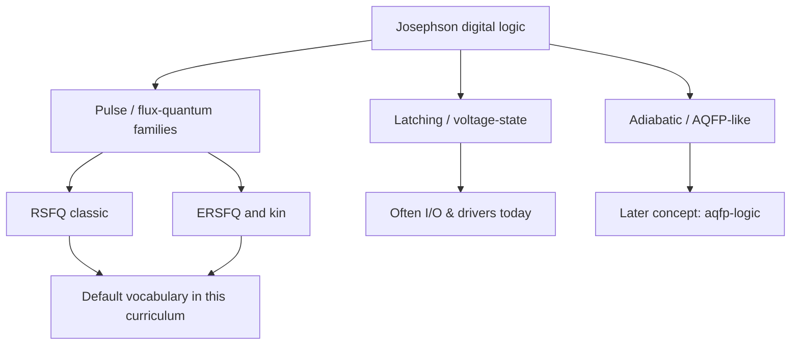

# Where SFQ Sits Among Logic Families

**Prereqs:** [Field map hub](fields/README.md) · [Cryo-CMOS & hybrids](fields/cryo-cmos-and-hybrids.md) (end of fields survey)  
**Next:** [Cryogenics for electronics](cryogenics-for-electronics.md)

**In one minute.** Default dialect here is RSFQ-style Φ0 pulses. ERSFQ rethinks bias; AQFP is another dialect (often AC). Latching still matters for some I/O. Next: cryogenics.

**Learning goals.** After this page you should be able to (1) explain that “SFQ” is both a broad brand and a cluster of digital families, (2) contrast latching, RSFQ/ERSFQ pulse logic, and AQFP-style adiabatic logic at a teaching level, (3) know which family this curriculum treats as the default vocabulary, and (4) avoid mixing AC-excitation AQFP intuition with DC-biased RSFQ pulse intuition too early.

## Why this matters

Talks casually say “SFQ” the way people say “CMOS” — as if one schematic style covered everything. Inside digital superconducting logic you will meet **several families** with different:

- excitation (DC bias vs multiphase AC),
- bit representation (pulse events vs flux-parametron states),
- power stories (static resistive bias vs near-zero static vs adiabatic ideals),
- timing disciplines.

If you assume every Josephson gate is an RSFQ DFF, later AQFP or latching I/O pages will feel like contradictions. They are not contradictions; they are **siblings**.

## Analogy: dialects of one language family

Think of Josephson digital design as a **language family**:

- **Latching dialect** — shout and hold a voltage until told to stop.
- **RSFQ dialect** — speak in short clicks ($\Phi_0$ pulses) timed into windows.
- **ERSFQ dialect** — mostly the same click language, redesigned power supply grammar.
- **AQFP dialect** — different rhythm (often AC phases) and energy-reuse poetry.

This curriculum teaches you to become fluent in the **RSFQ click dialect** first, then introduces ERSFQ and AQFP as related dialects — not as week-one simultaneous immersion.

```text
  Josephson digital dialects
  --------------------------
  Latching   : hold V
  RSFQ       : Φ0 pulses + DC bias (classic)
  ERSFQ      : Φ0 pulses + low-static bias networks
  AQFP       : adiabatic / multiphase AC parametron style
  Others     : named variants you will meet later as needed
```

## Picture 1 — Family tree (teaching)



### Latching Josephson logic

**Idea:** underdamped junctions switch to a larger voltage and **remain** until reset.

**Where it still matters:** some **output drivers** and historical designs; pedagogical contrast with pulse logic.

**Risk if overused internally:** reset overhead, different timing story than RSFQ pipelines.

### RSFQ — Rapid Single Flux Quantum

**Idea:** overdamped junctions emit a short pulse with area $\sim\Phi_0$; loops store flux; logic is pulse presence/absence in a **clock window**.

**Default in this curriculum:** yes — JTL, splitter, confluence, DFF, gate-level pipelining.

### ERSFQ — energy-efficient RSFQ-style pulse logic

**Idea:** keep pulse tokens; change **bias delivery** so idle static dissipation in bias resistors is attacked.

**Teaching stance:** learn RSFQ pulse intuition first; then [resistive bias → ERSFQ](../bridge/resistive-bias-to-ersfq.md) and the ERSFQ concept card.

### AQFP — Adiabatic Quantum Flux Parametron

**Idea:** logic based on flux parametron dynamics with **adiabatic** switching ideals and typically **multiphase AC** excitation — a different cadence than DC-biased RSFQ pipelines.

**Teaching stance:** respect it early as a major sibling; deepen later on [AQFP logic](../concepts/aqfp-logic.md) after RSFQ vocabulary exists.

### Other named families

You will see additional acronyms in papers (reciprocal quantum logic styles, variants of bias and clocking, laboratory-specific cell libraries). Treat unknown acronyms as **“dialect labels”**: ask excitation, bit encoding, and power story before assuming RSFQ schematics.

## Picture 2 — What a newcomer should compare

```text
  Question                 RSFQ-ish                         AQFP-ish
  -----------------------  -------------------------------  ---------------------
  Typical excitation       DC bias (+ clocks as pulses)     Multiphase AC
  Bit "shape"              Short Φ0 pulse / stored flux     Parametron flux state
  Pipeline feel            Gate-level pulse epochs          Phase-slot discipline
  First intuition page     RCSJ overdamped pulse            After RSFQ core walk
```

## Worked example 1 — Hearing “SFQ chip” in a talk

**Prompt:** Speaker says “our SFQ processor.”

**Checklist:**

1. Do schematics show JTLs and pulse DFFs? → RSFQ-like.  
2. Do they emphasize AC multiphase clocks and parametron cells? → AQFP-like.  
3. Do they highlight zero static power bias networks? → ERSFQ-like concern on a pulse family.  
4. Are large voltage steps used at the boundary? → may include latching I/O even if internals are pulsed.

## Worked example 2 — Choosing a learning order

**Prompt:** Should you learn AQFP before RSFQ because adiabatic sounds “more advanced”?

**Answer for this curriculum:** **No.** Learn shared Josephson/flux intuition, then RSFQ pulse tokens (the densest classical literature for digital SFQ), then ERSFQ bias story, then AQFP as a deliberate second dialect. “Advanced” is not the same as “first.”

## Worked example 3 — Three “efficiency” words that are not synonyms

**Prompt:** A slide says the chip is “efficient” because it uses ERSFQ, serial biasing, and AQFP ideas.

**Separate the jobs:**

| Word | Main problem attacked | Interactive check |
|------|----------------------|-------------------|
| **ERSFQ** | Static heat in classical bias **resistors** | [ERSFQ lab](../labs/ersfq-logic.html) |
| **Serial biasing / recycling** | Total **amperes** into the cryostat (islands) | [Serial biasing lab](../labs/serial-biasing-current-recycling.html) |
| **AQFP** | Different **logic dialect** (often multiphase AC) | [AQFP lab](../labs/aqfp-logic.html) |

**Moral:** one chip project may combine stories, but newcomers must not merge the words. Pulse encoding (RSFQ/ERSFQ) ≠ AC parametron encoding (AQFP) ≠ ampere recycling (serial bias).

## Comparison table — families at teaching resolution

| Family | Bit / event style | Excitation sketch | Role in this curriculum |
|--------|-------------------|-------------------|-------------------------|
| Latching | Held voltage | Underdamped switch + reset | Contrast + I/O later |
| RSFQ | $\Phi_0$ pulses + loops | DC bias + pulse clocks | **Core walk default** |
| ERSFQ | Pulses (RSFQ-like) | Low-static bias networks | After resistive-bias bridge |
| AQFP | Adiabatic parametron states | Multiphase AC | Concept after RSFQ base |
| Other acronyms | Ask | Ask | Classify, don’t panic |

## Common misconceptions

1. **“SFQ means AQFP.”**  
   SFQ is broader; AQFP is one major family.

2. **“ERSFQ invents a new bit physics.”**  
   It primarily rethinks bias/energy while keeping pulse logic kinship.

3. **“Latching is obsolete, never mentioned.”**  
   Still useful for history and some interfaces.

4. **“All Josephson logic uses the same clock story.”**  
   Pulse epochs vs AC phases are different mental models.

5. **“If I learn one family, papers in another will be readable automatically.”**  
   Shared device physics helps; schematic dialect still matters.

6. **“Family names are marketing only.”**  
   They encode real circuit constraints.

7. **“ERSFQ removes amperes the way serial biasing does.”**  
   Different axes: resistor static heat vs supply-current stacking. See worked example 3.

## CMOS contrast

| CMOS “family” talk | Josephson “family” talk |
|--------------------|-------------------------|
| Static CMOS vs pass-transistor vs adiabatic CMOS ideas | RSFQ vs AQFP vs latching |
| Mostly one temperature / PDK class for a product | Same fridge, different excitation and cell libraries |
| Flip-flop + combo cloud defaults | RSFQ gate-level pipeline defaults vs AQFP phase timing |

## Bridge to SFQ circuits

Default path after orientation and cryogenics:

**notation → superconductivity → RCSJ → $\Phi_0$ → loops → overdamped/underdamped → phase-to-pulse → … → RSFQ concepts**, then ERSFQ/AQFP cards.

You now know why those later names are not synonyms.

## Check yourself

<details markdown="1">
<summary markdown="span">1. What is the default digital dialect of this curriculum?</summary>

RSFQ-style $\Phi_0$ pulse logic (with ERSFQ/AQFP introduced as siblings afterward).
</details>

<details markdown="1">
<summary markdown="span">2. How does latching differ from RSFQ in one sentence?</summary>

Latching holds a switched voltage until reset; RSFQ speaks in short flux-quantum pulses and stored loop flux.
</details>

<details markdown="1">
<summary markdown="span">3. What is ERSFQ mainly trying to improve relative to classic RSFQ?</summary>

The static power / bias-network story while remaining in the pulse-logic family.
</details>

<details markdown="1">
<summary markdown="span">4. Why not start with AQFP on day one here?</summary>

Different excitation and timing dialect; RSFQ vocabulary covers more of the classical digital SFQ literature this path uses first.
</details>

<details markdown="1">
<summary markdown="span">5. A paper says “SFQ” but shows multiphase AC parametron gates. What should you suspect?</summary>

AQFP-like family — do not force RSFQ DFF intuition onto every symbol.
</details>

<details markdown="1">
<summary markdown="span">6. What is next before device symbols?</summary>

[Cryogenics for electronics](cryogenics-for-electronics.md), then [reading SFQ notation](reading-sfq-notation.md).
</details>

## Glossary spot-links

Glossary: RSFQ, ERSFQ, AQFP, latching, SFQ pulse, overdamped, underdamped, $\Phi_0$.

## Next steps

- Practical cold: [Cryogenics for electronics](cryogenics-for-electronics.md).
