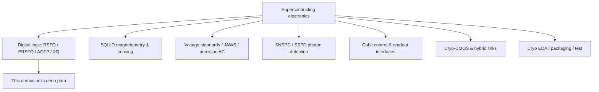

# Superconducting Electronics Landscape

**Prereqs:** [History of superconducting electronics](history-of-superconducting-electronics.md)  
**Next:** [Field map — branches in more detail](fields/README.md) · [Logic families](sfq-among-logic-families.md) (after fields)

**In one minute.** Airport map: digital SFQ is one terminal among sensing, metrology, detectors, qubits, cryo-CMOS, EDA. Express lane may skip fields/. Next: logic families or optional fields.

**Learning goals.** After this page you should be able to (1) sketch the field as a tree with several major branches — not only digital SFQ, (2) say in one sentence what each sibling discipline is *for*, (3) spot which papers/talks are “SFQ logic,” “sensing,” “metrology,” “detectors,” or “quantum interfaces,” (4) **separate classical SFQ from superconducting qubits**, and (5) know where to open the deeper [fields](fields/README.md) guides.

## Why this matters

Newcomers often hear “superconducting electronics” and picture **one** thing: a cold computer chip. In reality, the same physical platform — superconducting films, Josephson junctions, cryogenics, microwave hygiene — supports **multiple disciplines** with different success metrics.

If you only study SFQ gates, you will misread half the conference hallway. If you only study qubits, you will miss classical SFQ tools that may sit beside them. This page is the map.

## Analogy: one airport, many terminals

Think of superconducting technology as an **airport**:

- shared runways and fuel = cryogenics, Nb (or other) processes, packaging skills,
- different terminals = digital logic, magnetometry, voltage standards, photon detectors, quantum processors, hybrid CMOS links.

Passengers (applications) fly to different destinations. Confusing terminals wastes time. Your boarding pass for *this* curriculum is mostly the **digital SFQ terminal**, but you should recognize the signs for the others.

## Classical SFQ vs superconducting qubits

**Canonical full contrast:** [Superconducting qubits & quantum computing](fields/superconducting-qubits-and-quantum-computing.md).

One line for the map: classical SFQ = **telegraph clicks** (bits); superconducting qubits = **music hall** (fragile quantum states). Same fridge possible; different scoreboards. Other QC hardwares: [platforms map](fields/quantum-computing-hardware-platforms.md).

```text
                    Superconducting electronics
                               |
     +-------------+-----------+-----------+-------------+
     |             |           |           |             |
  Digital SFQ   SQUID      Metrology    Detectors    Quantum /
  families      sensing    (voltage)    (SNSPD…)     cryo I/O
```

**Optional detail:** [fields/](fields/README.md) (express lane may skip).## Picture 1 — Branch map



### Branch A — Digital SFQ and Josephson logic

**Job:** classical digital computation and signal processing using Josephson devices — often with **flux-quantum pulses** or adiabatic flux parametron styles.

**Success metrics:** clock rate, energy per operation (carefully defined), bit error rate, scalability, cell-library completeness.

**Deeper orientation:** [Digital SFQ overview](fields/digital-sfq-overview.md)  
**You are here later:** RSFQ cells, timing, bias, memory, I/O concepts.

### Branch B — SQUID sensing and magnetometry

**Job:** measure tiny magnetic flux / field changes with extraordinary sensitivity using SQUID loops.

**Success metrics:** noise floor, bandwidth, slew rate, cryogenic practicality — **not** ALU throughput.

**Deeper orientation:** [SQUID sensing & magnetometry](fields/squid-sensing-magnetometry.md)

### Branch C — Metrology and voltage standards

**Job:** turn Josephson physics into **accurate voltage** (DC and synthesized AC), anchoring electrical standards.

**Success metrics:** accuracy, stability, spectral purity — national-lab energy.

**Deeper orientation:** [Josephson metrology & voltage standards](fields/josephson-metrology-voltage-standards.md)

### Branch D — Superconducting detectors (e.g. SNSPD)

**Job:** detect single photons (or other quanta) with high timing resolution using superconducting nanowires / related devices.

**Success metrics:** efficiency, dark counts, jitter, array scalability.

**Deeper orientation:** [Superconducting photon detectors](fields/superconducting-photon-detectors.md)

### Branch E — Quantum computing interfaces (and superconducting qubits)

**Job:** build **superconducting qubits** (quantum hardware) and/or the **classical control/readout stack** that talks to them across thermal stages.

**Success metrics:** for qubits — coherence and fidelities; for interfaces — heat load, latency, multiplexing.

**Critical distinction:** the qubit chip is quantum information hardware; an SFQ serializer beside it is still classical digital SFQ.

**Deeper orientation:** [Superconducting qubits & quantum computing](fields/superconducting-qubits-and-quantum-computing.md) · [QC hardware platforms](fields/quantum-computing-hardware-platforms.md) (ions, photonics, atoms, dots, topological — relevance ranking)

### Branch F — Cryo-CMOS and hybrid systems

**Job:** run semiconductor electronics cold (or across the thermal gradient) for control, memory, and I/O; combine with SFQ when useful.

**Success metrics:** power at temperature, noise, integration with superconducting chips.

**Deeper orientation:** [Cryo-CMOS & hybrids](fields/cryo-cmos-and-hybrids.md)

### Branch G — EDA, packaging, and test

**Job:** make anything above manufacturable: timing analysis, place-and-route, inductance extraction, cryopackages, connectors.

**Success metrics:** turnaround time, correlation to measurement, yield thinking.

**Deepened later** in EDA timing concepts and tracks (not a separate fields page yet).

## Picture 2 — How to classify a talk title in 20 seconds

```text
  Title contains…                    Likely terminal
  ---------------------------------  ------------------------
  RSFQ, ERSFQ, AQFP, JTL, DFF        Digital SFQ
  magnetometer, MEG, flux noise      SQUID sensing
  Josephson voltage standard, JAWS   Metrology
  SNSPD, single-photon, nanowire     Detectors
  qubit, transmon, readout, mK       Quantum interface
  cryo-CMOS, 4K CMOS                 Hybrid semiconductor
  qSTA, router, cell library         EDA / digital SFQ tools
```

## Worked example 1 — Same fridge, different papers

**Scenario:** One cryostat hosts an SNSPD array and a small SFQ serializer.

**Questions:**

1. Is the “science result” the detector efficiency or the serializer BER?  
2. Which branch owns the headline?

**Teaching answer:** both can be valid papers. Do not force every cryogenic result into the digital-SFQ narrative. Ask what was *optimized*.

## Worked example 2 — $\Phi_0$ appears in three terminals

| Terminal | How $\Phi_0$ shows up (intuition) |
|----------|-----------------------------------|
| Digital SFQ | Pulse area / stored flux bit |
| SQUID sensing | Flux response / periodicity |
| Voltage metrology | Josephson voltage–frequency link involving $\Phi_0$ |

**Moral:** shared constants ≠ shared research goals.

## Comparison table — branches vs what this curriculum deepens

| Branch | Orientation detail | Deep curriculum path |
|--------|--------------------|----------------------|
| Digital SFQ | [fields/digital-sfq-overview](fields/digital-sfq-overview.md) | Core walk → bridges → concepts → tracks |
| SQUID sensing | [fields/squid-sensing…](fields/squid-sensing-magnetometry.md) | Loop/SQUID fundamentals only (not MEG course) |
| Metrology | [fields/josephson-metrology…](fields/josephson-metrology-voltage-standards.md) | $\Phi_0$ reuse in fundamentals |
| Detectors | [fields/…photon-detectors](fields/superconducting-photon-detectors.md) | I/O / detector track pointers later |
| Qubits / QC interfaces | [qubits](fields/superconducting-qubits-and-quantum-computing.md) · [platforms](fields/quantum-computing-hardware-platforms.md) | Cryo I/O concepts + track |
| Cryo-CMOS hybrids | [fields/cryo-cmos…](fields/cryo-cmos-and-hybrids.md) | Memory/I/O concepts; CMOS contrast |
| EDA | Landscape Branch G | STA, routing, path balancing concepts |

## Common misconceptions

1. **“Superconducting electronics = quantum computing.”**  
   Quantum is one terminal; classical SFQ and sensors are others. Qubits ≠ RSFQ gates.

2. **“If it uses a SQUID, it is an SFQ microprocessor.”**  
   SQUIDs are building blocks for many jobs.

3. **“Detectors are unrelated to digital SFQ.”**  
   Related at the *system* layer (readout), different at the *device optimization* layer.

4. **“Learning SFQ means ignoring CMOS forever.”**  
   Hybrid links are part of the landscape.

5. **“One paper venue covers everything equally.”**  
   TASC, quantum conferences, metrology journals, and photonics venues emphasize different terminals.

6. **“The landscape is only Nb at 4 K.”**  
   Materials and temperatures vary by application (mK qubits vs ~4 K digital Nb stacks).

## CMOS contrast

| CMOS world map habit | Superconducting world map habit |
|----------------------|---------------------------------|
| Digital / analog / RF / power / memory | Digital SFQ / SQUID / metrology / detectors / quantum I/O / cryo-CMOS |
| Mostly one temperature class | Explicit thermal stages |
| Huge overlapping industry taxonomy | Smaller community; names collide more often |

## Bridge to SFQ circuits

You now know **SFQ digital is a branch**, not the whole tree. Next:

1. Open the [fields hub](fields/README.md) and skim each terminal guide (especially [qubits](fields/superconducting-qubits-and-quantum-computing.md)).  
2. Then [logic families](sfq-among-logic-families.md) → [cryogenics](cryogenics-for-electronics.md) → [notation](reading-sfq-notation.md).

When you later open a paper from the [paper map](../paper-map.md), classify its terminal before drowning in equations.

## Check yourself

<details markdown="1">
<summary markdown="span">1. Name at least four branches besides digital SFQ.</summary>

Examples: SQUID sensing, voltage metrology, SNSPD detectors, quantum interfaces, cryo-CMOS hybrids, cryo EDA/packaging.
</details>

<details markdown="1">
<summary markdown="span">2. A paper optimizes SNSPD jitter. Is it automatically an SFQ logic paper?</summary>

No — detector terminal. It may *interface* with SFQ readout, but the headline metric is detection.
</details>

<details markdown="1">
<summary markdown="span">3. Why can $\Phi_0$ appear in metrology and in RSFQ?</summary>

Same Josephson/flux physics constant; different engineered uses (voltage standards vs pulse tokens).
</details>

<details markdown="1">
<summary markdown="span">4. What is this curriculum’s primary deepened branch?</summary>

Digital SFQ / Josephson logic (RSFQ-centered path with ERSFQ/AQFP and systems concepts).
</details>

<details markdown="1">
<summary markdown="span">5. How should you use this map when reading conference programs?</summary>

Classify the terminal from title/keywords in ~20 seconds before investing in details.
</details>

<details markdown="1">
<summary markdown="span">6. What is next?</summary>

[Field map — branches in more detail](fields/README.md), especially the qubits page if that was your confusion.
</details>

## Glossary spot-links

Glossary: SFQ, RSFQ, SQUID, SNSPD (concept name), cryo-CMOS (name), qubit, $\Phi_0$, Josephson junction.

## Next steps

- Survey terminals: [fields/](fields/README.md).  
- Then dialects: [SFQ among logic families](sfq-among-logic-families.md).
