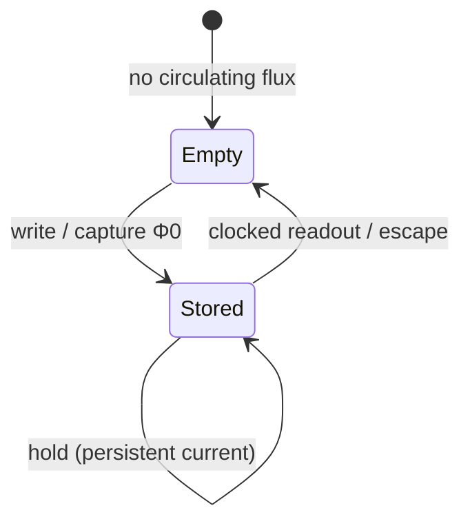
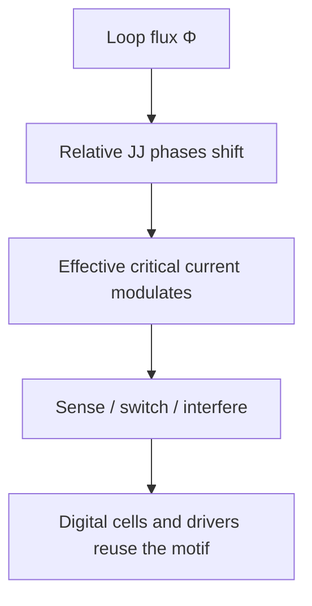

# Superconducting Loop and SQUID Intuition

**Prereqs:** [Flux Quantization](flux-quantization.md)  
**Next:** [Overdamped vs Underdamped JJ](overdamped-vs-underdamped-jj.md)

**In one minute.** A loop can store a flux quantum as circulating current — the memory picture behind SFQ bits. SQUID = loop + junctions.

**Learning goals.** After this page you should be able to (1) picture a superconducting loop holding a persistent circulating current for about one $\Phi_0$, (2) estimate $I_{\mathrm{circ}} \approx \Phi_0/L$ for a storage loop, (3) describe a DC SQUID as two Josephson junctions on a loop, and (4) contrast SFQ loop storage with CMOS capacitor / SRAM voltage storage.

## Why this matters

In SFQ, a logic “1” often lives as a **persistent circulating current** in a superconducting loop — not as a held voltage on a capacitor the way DRAM intuition suggests, and not as a cross-coupled voltage pair the way CMOS SRAM intuition suggests. Reading and writing that circulating flux is what flip-flops, many memory cells, and a great deal of RSFQ bookkeeping actually do.

If you only remember pulses from the previous page, storage will feel mysterious: where does a bit go when nothing is pulsing? It goes into a **loop**. This page builds that picture and introduces the **DC SQUID** — two junctions on a loop — as the field’s standard two-junction interferometer, used both as a magnetometer and as a circuit motif inside digital cells and drivers.

## Analogy (persistent current)

A frictionless circular water channel can keep water circulating forever once you give it a push. A superconducting loop can keep a **persistent current** circulating with essentially no DC voltage drop along the superconducting path. The “push unit” that matters for binary SFQ storage is about one flux quantum:

\[
L\,I_{\mathrm{circ}} \sim \Phi_0.
\]

You do not continuously “hold the bit up” with a voltage supply on that loop the way a CMOS static node is held by powered inverters. The supercurrent persists because the loop is superconducting and the fluxoid state is locked. Energy is spent when you **change** the state (write / readout switching), and in the bias networks that prepare junctions to switch — not in fighting loop resistance that is not there at DC.

## Analogy (DC SQUID as two doors on a ring)

A **DC SQUID** (Superconducting Quantum Interference Device) is a superconducting loop interrupted by **two** Josephson junctions. Think of a ring road with two toll gates. Current can split between the two arms. The magnetic flux through the loop shifts the relative Josephson phases of the two junctions, so the pair of gates interferes: the effective critical current of the device is **modulated by flux**.

That interference is why SQUIDs are extraordinarily sensitive magnetometers. In digital SFQ, you often care less about measuring external Tesla-scale fields and more about the same motif as a **storage / decision / driver building block**: two junctions, one loop, flux-dependent behavior.

## Picture — storage loop and DC SQUID

```text
        inductive loop L (storage sketch)
     ┌──────────∩∩∩──────────┐
     │                       │
     X  JJ_write/escape      |     one or more junctions
     │                       │     interrupt the loop in real cells
     └───────────────────────┘

  Circulating current I_circ  →  flux ≈ L · I_circ
  Designed so one stored “1” is about one Φ0
```

```text
        inductive loop L
     ┌──────────∩∩∩──────────┐
     │                       │
     X  JJ1                  X  JJ2     (DC SQUID sketch)
     │                       │
     └───────────────────────┘

  Bias current can enter at a center tap (typical DC SQUID readout picture).
  Flux through the loop modulates the effective switching threshold.
```





## Interactive lab

Same lab as [Flux Quantization](flux-quantization.md) — loop storage + Φ₀ packet. Prefer full-screen? Open the [lab page](../labs/flux-quantization-squid-loop.html).

1. Set **L**, **Write Φ₀**, watch $I_{\mathrm{circ}}$ and the circulating-current arrow.
2. **Clocked readout** empties the loop; **Try half-Φ₀** shows why flux is discrete.

<iframe
  src="../../labs/flux-quantization-squid-loop.html"
  title="Flux quantization / SQUID loop lab"
  style="width:100%;height:740px;border:1px solid rgba(0,0,0,0.12);border-radius:0.35rem;background:#fff;"
  loading="lazy"
></iframe>

## Persistent current and inductance

For a first estimate, ignore junction phase drops and write the inductive flux as

\[
\Phi_{\mathrm{ind}} = L\,I_{\mathrm{circ}}.
\]

Setting $\Phi_{\mathrm{ind}} \approx \Phi_0$ for a stored quantum gives

\[
I_{\mathrm{circ}} \approx \frac{\Phi_0}{L}.
\]

Using $\Phi_0 \approx 2.07\,\text{mV}\cdot\text{ps}$ and $L$ in pH yields currents in the hundreds of microamps for typical SFQ storage inductances — the same order as many junction critical currents. That matching is intentional: junctions must be able to **insert** or **remove** that circulating current when they switch.

| Loop inductance $L$ | $I_{\mathrm{circ}}\approx\Phi_0/L$ |
|---------------------|----------------------------------|
| $5\,\text{pH}$ | $\sim 0.41\,\text{mA}$ |
| $10\,\text{pH}$ | $\sim 0.21\,\text{mA}$ |
| $20\,\text{pH}$ | $\sim 0.10\,\text{mA}$ |

Real cells choose $L$ together with junction $I_c$ values, damping, and bias points so that margins exist for write, hold, and readout. The table is order-of-magnitude intuition, not a PDK recipe.

## Fluxoid quantization with junctions (intuition)

On the flux quantization page, a continuous superconducting ring locked $\Phi = n\Phi_0$. When Josephson junctions interrupt the ring, the locked quantity is the **fluxoid**: inductive flux plus junction phase contributions still sum to $2\pi n$. Practically:

- junctions are the **doors** that let $n$ change by $\pm 1$ when a $2\pi$ slip occurs,
- inductors are the **inertia** that stores the circulating current between events,
- binary cells are sized so $n=0$ and $n=1$ are the intended hold states.

A JTL stage also uses junctions and inductors, but its job is to **propagate** a pulse onward, not to hold a bit for many clock cycles. The same parts appear; the **intent** differs.

## DC SQUID: interference in one paragraph

Bias a DC SQUID with a total current $I_b$ that splits into the two arms. The flux $\Phi$ through the loop appears as a phase difference between the junctions. The maximum supercurrent the device can carry without switching is a periodic function of $\Phi$ with period $\Phi_0$ — the classic SQUID modulation curve. Deep textbooks write that curve with Bessel-function or sinusoidal approximations depending on inductance parameter $\beta_L = 2L I_c/\Phi_0$. For this curriculum’s core walk, remember the operational sentence:

**Two junctions on a loop make the switching condition flux-dependent with period $\Phi_0$.**

Digital designers exploit that dependence inside latches, memory, and some driver topologies. Magnetometer designers exploit it to measure tiny flux changes. Same motif, different packaging.

## CMOS contrast: where the bit lives

| Question | CMOS mental model | SFQ loop mental model |
|----------|-------------------|------------------------|
| Where is a static “1”? | Voltage on a node; SRAM uses cross-coupled inverters; DRAM uses capacitor charge | Circulating supercurrent / trapped flux quantum in a loop |
| What fights leakage? | Refresh (DRAM), feedback (SRAM), ratioed levels | Superconducting loop has ~0 DC resistance; state is a fluxoid number |
| What is the natural token size? | $CV$ charge depends on design | $\sim\Phi_0$ per stored quantum |
| How do you read? | Sense amplifier compares voltages / currents | A clocked junction (or SQUID-like pair) lets the quantum escape as a pulse or switches based on flux |
| Does holding a “1” require continuous $IR$ drop in the storage element? | Capacitor leakage and SRAM static power are real issues | Persistent current itself does not need a loop $IR$ drop; bias networks elsewhere still draw current |

Do not over-read the table: SFQ chips still consume bias power. The contrast is about the **storage mechanism**, not a claim of zero system power.

## Worked example 1 — Size a storage current

Suppose a storage loop has $L = 10\,\text{pH}$ and you want $L I_{\mathrm{circ}} \approx \Phi_0 \approx 2.07\,\text{mV}\cdot\text{ps}$. Then

\[
I_{\mathrm{circ}} \approx \frac{2.07\,\text{mV}\cdot\text{ps}}{10\,\text{pH}} = 0.207\,\text{mA} \approx 207\,\mu\text{A}.
\]

If the escape junction in that cell has $I_c \approx 200\,\mu\text{A}$ and is biased near $I_c$, a clock pulse can push it over the edge when the circulating current is present, launching an output SFQ pulse and returning the loop toward empty. Exact bias fractions and margins are library-specific; the story is what matters here: **stored bit $\leftrightarrow$ circulating current $\leftrightarrow$ one flux quantum $\leftrightarrow$ junction-scale microamps**.

## Worked example 2 — Empty vs full decision

A clocked readout junction sees roughly:

- **Empty loop ($n=0$):** circulating contribution small; with proper bias, the clock alone should **not** make the cell emit a data pulse (logic 0 readout).
- **Full loop ($n=1$):** circulating current adds to the junction’s stress; the clocked event **does** produce an output pulse (logic 1 readout), and the loop returns toward empty.

That is the DFF story in miniature. You will see it again on the RSFQ DFF concept page. Numerically, if circulating current is $\sim 0.2\,\text{mA}$ and bias is set so the junction sits near its threshold only when that extra current is present, the empty/full distinction becomes a digital decision rather than an analog maybe.

## Worked example 3 — Why inductance cannot be arbitrary

Suppose someone proposes $L = 200\,\text{pH}$ for a “huge” storage loop to make layout easy. Then

\[
I_{\mathrm{circ}} \approx \frac{\Phi_0}{L} \approx \frac{2.07\,\text{mV}\cdot\text{ps}}{200\,\text{pH}} \approx 10\,\mu\text{A}.
\]

That circulating current may be awkwardly small compared with junction $I_c$ values and noise margins, and the large inductance slows dynamics. Conversely, tiny $L$ demands large $I_{\mathrm{circ}}$, stressing junctions and layout. SFQ libraries live in a **sweet band** of loop inductances matched to process $I_c$. Inductance is not a free decorative parameter.

## Bridge to SFQ circuits

- An **RSFQ DFF** stores a flux quantum in a loop until a clock pulse arrives; a clocked escape junction launches an output SFQ pulse.
- A **JTL** is a chain of junctions and inductors that moves pulses; it is not meant as long-term memory.
- **NDRO / memory** variants reuse loops and SQUID-like structures with different readout destructiveness.
- Some **I/O drivers** stack SQUID-like stages to build larger voltage swings for semiconductor interfaces — still loop-and-junction thinking, different damping (next page).

## Common misconceptions

1. **“A superconducting loop needs a continuous applied voltage to keep the bit alive.”**  
   Persistent current in a superconducting loop does not require a DC voltage drop around the loop. You spend energy changing states and biasing junctions, not fighting ohmic loop resistance at DC.

2. **“SQUID always means a laboratory magnetometer.”**  
   DC SQUIDs are famous as sensors, but the **two-junction loop** is also a digital and driver building block. Context tells you which job is intended.

3. **“Any loop with two junctions is automatically an RSFQ gate.”**  
   Topology alone is not a logic family. Damping, bias, clocking, and pulse vs latching behavior decide whether you are looking at RSFQ pulse logic, a latching driver, or a sensor.

4. **“Stored flux is a different object from an SFQ pulse.”**  
   They are the same token in different costumes. A pulse is a quantum in transit ($\int V\,dt=\Phi_0$). A stored circulating current is a quantum at rest in a loop ($L I\sim\Phi_0$). Readout converts one costume into the other.

5. **“CMOS SRAM and SFQ loops are both ‘just feedback.’”**  
   CMOS SRAM feedback continuously enforces voltage levels with powered inverters. SFQ loop storage is a **fluxoid state** in a superconducting ring. Both can hold a bit; the physics and failure modes differ.

6. **“Larger loop area always means more stored quanta.”**  
   The digital design target is usually **one** quantum for a binary cell. Geometric area affects inductance and coupling; it does not mean the cell freely stacks many logic levels like multi-level flash.

## Check yourself

<details markdown="1">
<summary markdown="span">1. How does SFQ often store a static “1”?</summary>

As a persistent circulating current in a superconducting loop corresponding to about one $\Phi_0$.
</details>

<details markdown="1">
<summary markdown="span">2. What is a DC SQUID in one sentence?</summary>

A superconducting loop interrupted by two Josephson junctions, with flux-dependent interference / switching behavior.
</details>

<details markdown="1">
<summary markdown="span">3. Why is inductance $L$ important in a storage loop?</summary>

It sets how much circulating current corresponds to one flux quantum ($L I\sim\Phi_0$) and affects margins, speed, and matching to junction $I_c$.
</details>

<details markdown="1">
<summary markdown="span">4. Estimate $I_{\mathrm{circ}}$ for $L=5\,\text{pH}$ if $L I_{\mathrm{circ}}=\Phi_0$.</summary>

$I_{\mathrm{circ}}\approx 2.07\,\text{mV}\cdot\text{ps}/5\,\text{pH}\approx 0.41\,\text{mA}$.
</details>

<details markdown="1">
<summary markdown="span">5. What is the difference in intent between a storage loop and a JTL stage?</summary>

Storage loops hold a quantum across time until readout; JTL stages propagate a pulse onward. Both use junctions and inductors.
</details>

<details markdown="1">
<summary markdown="span">6. Name one CMOS contrast for “where the bit lives.”</summary>

CMOS DRAM/SRAM intuition stores charge or reinforced voltage; SFQ stores a circulating flux quantum / persistent current in a loop.
</details>

<details markdown="1">
<summary markdown="span">7. If readout emits an SFQ pulse and empties the loop, was the stored token destroyed or moved?</summary>

Converted from circulating storage into a propagating pulse — the quantum leaves as $\int V\,dt=\Phi_0$. Destructive readout empties the cell; NDRO variants are designed to sense without ending in the empty state the same way.
</details>

## Next steps

- Contrast pulse junctions vs latching junctions: [Overdamped vs Underdamped JJ](overdamped-vs-underdamped-jj.md).
- Later, watch a stored quantum become a timed logic token: [Pulse to Logic State](../bridge/pulse-to-logic-state.md).
