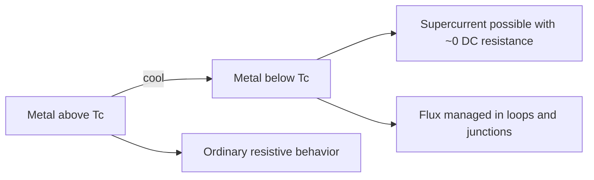
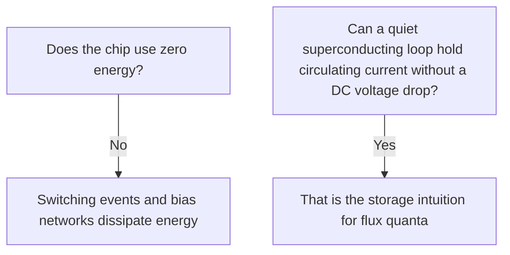

# Superconductivity Intuition

**Prereqs:** [How to Read SFQ Notation](reading-sfq-notation.md)  
**Next:** [Josephson Junction (RCSJ)](josephson-junction-rcsj.md)

**In one minute.** Below Tc: supercurrent with ~0 DC resistance; flux is guided into designed loops/weak links. Cold is necessary, not free energy. Next: Josephson RCSJ.

**Learning goals.** After this page you should be able to (1) explain cooling below a critical temperature $T_c$ as the step that opens zero-DC-resistance paths, (2) separate "zero resistance" from "zero energy use," (3) say why magnetic flux becomes a natural information idea once wires are superconducting, (4) contrast bulk Meissner expulsion with the way SFQ circuits deliberately guide flux through loops and weak links, and (5) walk into the Josephson-junction page without treating superconductivity as magic.

## Why this matters

Ordinary computer chips encode bits as **voltage levels** on semiconducting transistors. Single Flux Quantum (SFQ) chips encode bits using **tiny packets of magnetic flux** that travel through superconducting wiring and Josephson junctions. Before those packets make sense, you need a durable intuition for superconductivity itself --- not a graduate course in microscopic pairing theory, but a clear picture of what changes when a metal is cold enough.

If superconductivity feels vague, every later phrase --- supercurrent, flux quantum $\Phi_0$, circulating current in a loop --- floats without an anchor. This page builds that anchor in plain language, with analogies that stay honest about what they leave out.

You already met the symbols on [How to Read SFQ Notation](reading-sfq-notation.md). Here those symbols start to mean physical things: cold metal, lossless DC paths, and magnetic flux that can be trapped and moved in discrete units.

## Analogy: frictionless tracks and forced lanes for magnets

Think of two kinds of traffic for charge:

- **Normal metal:** electrons scatter like cars hitting potholes. A steady current needs a continuous push (a voltage drop) to fight resistance; energy becomes heat.
- **Superconductor below $T_c$:** a special paired-electron condensate can support a **supercurrent** with essentially **zero DC resistance** --- like cars on a frictionless track. Once a DC current is circulating in a closed superconducting loop, it can persist without a continuous voltage drop along the wire.

Cooling is the "open the track" step. Above $T_c$, the frictionless state collapses and the metal behaves as an ordinary resistor again.

Now add magnetism to the analogy. Superconductors do not treat magnetic fields casually. In the classic **Meissner effect**, a bulk superconductor **expels** magnetic field from its interior (idealized perfect diamagnetism). For circuit intuition, the useful rewrite is:

> Magnetic flux is not free to smear through superconducting metal the way it might through a normal conductor's volume. In SFQ chips, flux is guided into **loops**, **holes**, and **weak links** where the circuit designer put intentional paths.

That is why flux can become a **digital token**: the hardware naturally prefers discrete, controllable flux configurations rather than arbitrary smeared fields.

```text
  Warm metal          Cool below Tc
  (resistive)    →    (superconducting paths)

  cars + potholes →   frictionless track
  field smears    →   flux prefers designed loops / weak links
```

## Picture 1 --- Temperature as a switch for the superconducting state



Niobium (Nb) films are common in SFQ processes. Bulk niobium has $T_c$ near $9\,\text{K}$. Liquid helium at atmospheric pressure is about $4.2\,\text{K}$ --- cold enough for many Nb circuits to sit comfortably in the superconducting state. Room temperature (~$300\,\text{K}$) is far too warm: the same film would be an ordinary metal.

You do **not** need BCS pairing diagrams to start SFQ. You need this causal chain:

**cold → superconducting wiring → lossless DC loops become possible → magnetic flux becomes a controllable information medium → Josephson weak links turn flux motion into picosecond voltage pulses.**

## Picture 2 --- What "zero DC resistance" does and does not buy you

```text
Normal wire carrying DC current I:

   V = I R > 0     (continuous voltage drop, continuous heating)

Superconducting wire carrying DC supercurrent (idealized):

   V_along_wire ≈ 0 for steady DC
   circulating I in a closed loop can persist
```



Hold both truths at once. Superconductivity removes a particular loss mechanism (DC resistive drop along superconducting paths). It does **not** make computation free. SFQ gates still switch; bias distribution still costs design attention; cryogenic cooling itself costs infrastructure energy at the system level.

## What changes below $T_c$ (teaching inventory)

Use this checklist as a mental inventory --- not as a claim that every effect appears identically in every film stack:

| Idea | Below $T_c$ (idealized teaching picture) | Why SFQ cares |
|------|------------------------------------------|---------------|
| DC resistance of superconducting path | Essentially zero for supercurrent | Loops can hold circulating current; interconnect can be superconducting |
| Critical temperature $T_c$ | Material / film property; must stay below it | Cryostat and operating margin vs heat loads |
| Critical current of a wire / junction | Too much current destroys superconductivity locally | Sets usable bias and signal ranges |
| Magnetic response | Meissner expulsion in bulk; circuit geometries guide flux | Flux quantization and SQUID/loop storage |
| Weak links | Intentionally imperfect links (Josephson junctions) | Switching elements for pulses |

Exact film $T_c$, penetration depth, and critical-current densities are process details. This curriculum stays with **field-fundamental** behavior: cold enough, superconducting paths, flux in loops, junctions as weak links.

## Worked example 1 --- Choosing a mental operating point

**Prompt:** A teaching notebook says "Nb RSFQ chip in liquid helium." Translate that into the intuition of this page.

**Walkthrough:**

1. **Material:** niobium can superconduct below its $T_c$ (bulk ~$9\,\text{K}$ as a reference landmark).
2. **Bath:** liquid helium ~$4.2\,\text{K}$ is a common laboratory bath temperature --- below that landmark.
3. **Meaning for wiring:** superconducting Nb paths can carry supercurrent with essentially zero DC resistance.
4. **Meaning for information:** designers can store and move flux quanta in loops and through junctions instead of parking CMOS-like voltage levels on capacitors.
5. **Meaning for energy talk:** do not conclude "zero power." Conclude "DC lossless loops are available; dynamic and bias dissipation still exist."

If you can give those five sentences, you have the operating-point intuition.

## Worked example 2 --- Why flux, not "5 V," becomes the bit metaphor

**Prompt:** In CMOS you might say "bit = voltage on a node." What replaces that metaphor after superconductivity?

**Walkthrough:**

1. A superconducting loop can support a persistent circulating current once flux is trapped in quantized units (details on later pages: [Flux Quantization](flux-quantization.md), loops/SQUIDs).
2. A Josephson junction can pass a flux quantum as a short voltage pulse with area $\int V\,dt = \Phi_0$ (notation page + junction page).
3. Therefore the natural digital vocabulary becomes: **pulse present / absent in a clock window**, and **loop holds / does not hold a quantum** --- not "rail is at VDD or 0."
4. Superconductivity is what makes the lossless loop and the Josephson weak-link toolkit available at circuit scale.

So: superconductivity is not itself "the logic family." It is the **physical platform** that makes flux-token logic practical.

## Worked example 3 --- A false friend: "superconductor = perfect wire for everything"

**Prompt:** Someone says, "If resistance is zero, any current is fine and signals never attenuate."

**Correction steps:**

1. **Critical current limits:** exceed local critical currents and superconductivity fails in that region (hotspots, switching, damage risk in real hardware).
2. **AC / dynamic behavior:** zero DC resistance is not a claim that every transient is free or that every interconnect is dispersion-free.
3. **Junctions are intentional weak links:** SFQ logic *depends* on controlled non-idealities (Josephson junctions), not on every connection being a perfect bulk superconductor.
4. **Bias networks and loads** still shape pulse heights and timing in design practice.

The honest slogan is: **superconducting paths remove DC resistive drop; SFQ circuits still engineer thresholds, damping, and timing carefully.**

## Worked example 4 --- Only three ideas (reprise before RCSJ)

Before the washboard math, lock this triad (same spirit as the [symbol card](sfq-symbol-card.md)):

| Idea | Symbol | Job |
|------|--------|-----|
| Weak link with a current limit | $I_c$ | Push harder than $I_c$ → junction switches |
| One full turn of the junction's angle | $2\pi$ slip in $\phi$ | One digital switching event |
| Conserved pulse size | $\int V\,dt = \Phi_0$ | Area is the token; peak height is secondary |

**Prompt:** A friend remembers only "Josephson junctions are nonlinear inductors." What do you add?

**Answer:** For digital SFQ entry, add the triad above --- then visit [RCSJ](josephson-junction-rcsj.md) (and its [washboard lab](../labs/josephson-junction-rcsj.html)) to see *how* damping decides pulse vs latch.

## Comparison table --- superconductivity myths vs teaching truths

| Catchy myth | Better teaching truth |
|-------------|----------------------|
| "Superconductors have zero resistance always." | Below $T_c$, for supercurrent, DC resistance can be essentially zero --- within critical limits and for the superconducting path in question. |
| "Cooling is only to reduce thermal noise like in a fridge for CMOS." | Cooling is first of all what **enables** the superconducting state for the metal in use. |
| "Zero resistance means zero chip power." | Switching and bias still dissipate; cooling infrastructure has its own power story. |
| "Meissner effect means chips have no magnetic fields." | Bulk expulsion is the idealization; circuits **deliberately** guide flux through loops and junctions. |
| "Any cold metal is superconducting." | Only materials/films below their $T_c$ (and within current/field limits) enter that state. |

## Common misconceptions

1. **"I must learn BCS theory before SFQ."**  
   No. Pairing theory deepens materials physics; digital SFQ entry needs $T_c$, supercurrent, flux, and junctions.

2. **"Superconducting wire is like an ideal CMOS VDD rail."**  
   No. It is a lossless *path for supercurrent*, not a definition of logic high. Logic lives in pulses and stored flux.

3. **"If the chip warms a little, bits gradually fade like leaky DRAM."**  
   Crossing $T_c$ (or local heating that kills superconductivity) is a **state change**, not a gentle CMOS leakage curve. Thermal design matters, but the mental model is different.

4. **"Flux is continuous and analog, so SFQ cannot be digital."**  
   In superconducting loops, flux is **quantized** in units of $\Phi_0$. Digital SFQ exploits that discreteness. (Quantization page comes after junctions.)

5. **"Meissner effect forbids all magnetic activity in SFQ chips."**  
   Opposite pedagogical point: SFQ *uses* controlled magnetic flux in engineered geometries.

6. **"Liquid helium is the only possible bath."**  
   Helium is a common landmark for Nb. Other materials and refrigeration stacks exist in the wider field; this page's job is the **temperature-relative-to-$T_c$** idea, not a cryocooler catalog.

## CMOS contrast

| Theme | Typical CMOS intuition | Superconducting SFQ platform |
|-------|------------------------|------------------------------|
| Why cool? | Sometimes for reliability / performance; room-temp operation is normal | Often **required** so the metal is below $T_c$ |
| Bit carrier metaphor | Charge on capacitors / voltage on nodes | Flux quanta and SFQ pulses |
| Steady current in a loop | Needs continuous drive against resistance | Persistent supercurrent possible in a superconducting loop |
| "Quiet" interconnect | May still sit at a logic voltage | Often sits at ~0 between picosecond events |
| Loss mindset | CV²f and leakage are central stories | DC wire resistance can vanish; dynamic switching + bias networks dominate the conversation |

```text
CMOS first question:   "Is the node high or low?"
SFQ first question:    "Is the metal superconducting --- and where is the flux?"
```

## Bridge to SFQ circuits

Superconductivity gives you:

- wiring that can carry supercurrent without DC resistive drop;
- loops that can hold circulating current tied to flux quanta;
- a reason magnetic flux is a first-class citizen in the digital vocabulary.

What it does **not** yet give you is a **switch**. A uniform superconducting wire does not, by itself, emit a clean picosecond digital pulse on command. The missing ingredient is a **weak link** between superconductors --- the **Josephson junction** --- whose critical current $I_c$, phase $\phi$, and damping $\beta_C$ you already met as symbols.

That is the next page: how a junction switches, why RSFQ wants overdamped pulses, and how one $2\pi$ phase slip ties to $\int V\,dt = \Phi_0$.

## Check yourself

<details markdown="1">
<summary markdown="span">1. Why cool an SFQ chip that uses niobium wiring?</summary>

To keep the wiring below $T_c$ so supercurrents can flow with essentially zero DC resistance and so flux can be controlled in superconducting loops and junctions.
</details>

<details markdown="1">
<summary markdown="span">2. Does "zero DC resistance" mean the circuit uses no energy?</summary>

No. Switching events and bias networks still dissipate energy. Zero DC resistance means a steady supercurrent in a lossless loop does not need a continuous voltage drop the way a resistive wire does.
</details>

<details markdown="1">
<summary markdown="span">3. What replaces CMOS voltage levels as the central information idea in SFQ?</summary>

Discrete magnetic flux packets (flux quanta) and the presence or absence of the voltage pulses that carry them in clock windows.
</details>

<details markdown="1">
<summary markdown="span">4. How should you reinterpret the Meissner effect for circuit learning?</summary>

As a reason flux is guided into engineered loops and weak links rather than as a claim that SFQ chips contain no magnetic activity.
</details>

<details markdown="1">
<summary markdown="span">5. A friend says superconductivity makes SFQ "free computing." What precise correction do you give?</summary>

Superconductivity removes DC resistive loss on superconducting paths; computation and bias still cost energy, and cooling infrastructure has system-level costs.
</details>

<details markdown="1">
<summary markdown="span">6. Why is a perfect superconducting wire not enough to build SFQ logic gates?</summary>

Logic needs controlled switching elements --- Josephson junctions (weak links) --- that can emit or accept flux quanta as timed pulses; a uniform lossless wire does not provide that switch.
</details>

<details markdown="1">
<summary markdown="span">7. Room temperature is ~$300\,\text{K}$ and bulk Nb $T_c$ is ~$9\,\text{K}$. What does that gap mean for intuition?</summary>

The same Nb film that superconducts in a helium bath would be an ordinary resistive metal at room temperature; cooling is enabling, not optional decoration.
</details>

<details markdown="1">
<summary markdown="span">8. State the "only three ideas" triad heading into the Josephson page.</summary>

$I_c$ (switch threshold), $2\pi$ phase slip (one event), $\int V\,dt=\Phi_0$ (token size / pulse area).
</details>

## Glossary spot-links

[Glossary](../glossary.md): critical temperature $T_c$, supercurrent, flux quantum $\Phi_0$, Josephson junction, bias current.

## Next steps

- Meet the weak link that creates SFQ pulses: [Josephson Junction (RCSJ)](josephson-junction-rcsj.md).
- When you need the size of the flux packet made precise: [Flux Quantization](flux-quantization.md) (after the junction page).
