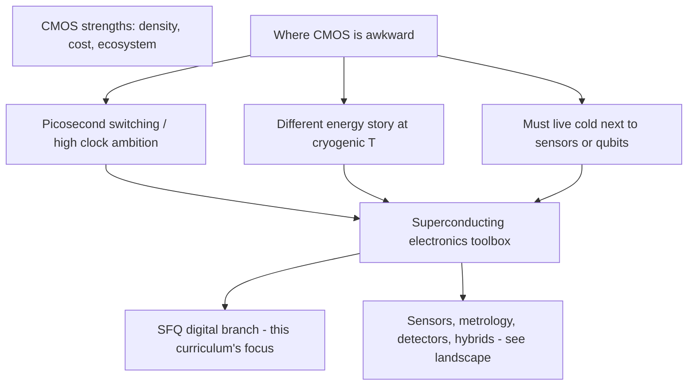

# Why Superconducting Electronics?

**Prereqs:** none  
**Next:** [History of superconducting electronics](history-of-superconducting-electronics.md) · [Coming from CMOS?](../concepts/cmos-vs-sfq.md) (preview)

**Learning goals.** After this page you should be able to (1) say what problem superconducting electronics is trying to solve relative to ordinary CMOS computing, (2) separate three motivations — speed, energy, and cryogenic co-location — without treating any one as a magic slogan, (3) name honest costs (cooling, fabrication, maturity) that keep the field specialized, and (4) know where this curriculum is heading before any Josephson-junction math begins.

## Why this matters

Most people meet computing as **CMOS**: silicon transistors, voltage levels, room-temperature chips. That platform won for good reasons — density, tooling, cost, and a huge software stack. So why does a whole research community still build circuits from **superconducting metals**, **Josephson junctions**, and **liquid-helium refrigerators**?

Because CMOS is not universally optimal. In some niches, physics pushes you toward devices that:

- switch in **picoseconds** with very different energy accounting,
- sit **next to** other cryogenic hardware (sensors, detectors, qubits) instead of fighting a warm–cold interface, and
- encode information as **magnetic flux packets** rather than held voltage rails.

This page is the orientation layer. You do **not** need $\Phi_0$, $I_c$, or RSFQ cell names yet. You need a clear “why bother?” so later fundamentals feel motivated rather than arbitrary.

If you already design CMOS digital chips, skim for contrast, then peek at the [CMOS vs SFQ cheat-sheet](../concepts/cmos-vs-sfq.md) anytime — that page goes deeper after you have pulse/flux intuition. If you are brand new, stay on this orientation path; symbols come next after history and landscape.

## Analogy: choosing a vehicle for the road you are on

Think of computing platforms as vehicles:

- **CMOS** is the highway fleet car: excellent for almost every trip, endless gas stations (foundries, EDA tools, talent), and a mature map.
- **Superconducting electronics** is more like a specialized truck or rail line: awkward for grocery runs, but unmatched when the cargo, the temperature, or the timing constraints match what it was built for.

Nobody claims the specialized truck replaces every car. The honest claim is narrower:

> For some workloads and some system contexts — especially ultra-high-speed digital logic, cryogenic interfaces, and precision flux-based circuits — superconducting devices can offer advantages that silicon transistors do not get for free.

The rest of this curriculum teaches the device and circuit vocabulary of one major branch of that specialty: **Single Flux Quantum (SFQ)** digital electronics. First, though, we stay at the system motivation level.

```text
  Everyday computing          Specialized cryogenic niches
  ------------------------    --------------------------------
  CMOS / room temp     →      SFQ logic, SQUID sensors,
  voltage-level bits          detectors, qubit I/O, metrology
```

## Picture 1 — Three motivations (not one slogan)



### Motivation A — Speed and timing texture

Josephson junctions can switch extremely quickly. Research SFQ logic has long been discussed in the language of **tens of gigahertz** pipeline stages and picosecond pulses. That does **not** mean “every SFQ chip is faster than every CMOS chip you can buy.” It means the **device switching mechanism** and the **pulse-pipeline style** of RSFQ-like logic open a different timing texture than static CMOS gates with held voltage levels.

Teaching takeaway: SFQ is interesting when your problem cares about **very fine-grained timed events**, not only about average transistor FO4 delay at room temperature.

### Motivation B — Energy (with the cooling asterisk)

A popular elevator pitch is “superconducting = zero resistance = free energy.” That pitch is **wrong** as stated. Zero DC resistance in a wire does not erase:

- the energy of switching events,
- bias-network dissipation (especially older resistive-bias RSFQ styles),
- or the enormous **refrigeration** cost of keeping metal at a few kelvin.

A more careful pitch is: at cryogenic temperatures, Josephson devices can perform logical switching with **very small energy per event**, and some modern families (ERSFQ, AQFP, and related ideas) specifically attack **static bias power**. Whether the *system* wins depends on workload, duty cycle, and how you account for the cryostat.

Teaching takeaway: energy claims need a **boundary** — device? chip? including cooler? This curriculum will keep reminding you of that boundary.

### Motivation C — Co-location with cold things

Some systems are already cold:

- superconducting quantum processors at millikelvin temperatures,
- superconducting nanowire single-photon detectors,
- precision voltage standards and magnetometers,
- sensors that only work in a cryostat.

Moving digital control, readout serialization, or interface logic **into the cold** can reduce cable heat load, latency, and noise compared with bouncing every decision to a warm rack. SFQ and cryo-CMOS are both tools in that story; they are not interchangeable, but they share the co-location motivation.

Teaching takeaway: sometimes you choose superconducting electronics because **the rest of the instrument forced you into the cold**, not because you hate CMOS.

## Picture 2 — Honest cost stack

```text
  Benefits people advertise          Costs you must budget
  -------------------------          ---------------------
  fast switching                     cryogenics + maintenance
  flux-quantum digital tokens        specialty Nb fabs / PDKs
  dense timed pipelines              smaller talent + EDA ecosystem
  natural fit next to cryo sensors   I/O to room temperature is hard
```

### Worked example 1 — “Is SFQ ‘more energy efficient’?”

**Prompt:** A slide says “SFQ gates use orders of magnitude less energy than CMOS.”

**Careful answer checklist:**

1. Energy of **what** — one junction switch, one logic operation, one chip, or one rack including the cryocooler?
2. At **what temperature** and **what activity factor**?
3. Compared with **which** CMOS node and **which** CMOS style (high-performance server vs low-power MCU)?
4. Does the design use **resistive bias** (static power) or a low-static family?

**Teaching result:** treat absolute slogans as unfinished claims. This curriculum will give you the vocabulary (pulse area $\Phi_0$, bias networks, overdamped switching) to ask better questions — after orientation.

### Worked example 2 — “Why not just cool CMOS?”

**Prompt:** If cold operation helps, why invent Josephson logic instead of cooling silicon?

**Short answer:** people *do* research cryo-CMOS. Cooling CMOS can help leakage and noise in some regimes, and cryo-CMOS is a real sibling field. Josephson SFQ is a different device physics: superconducting weak links, flux quantization, and pulse tokens. You pick it when that physics matches the job (ultra-fast pulse logic, flux sensors, certain quantum interfaces), not because “cold” alone requires Josephson junctions.

## Comparison table — CMOS default vs superconducting specialty

| Question | Typical CMOS answer | Superconducting-electronics answer |
|----------|---------------------|------------------------------------|
| Operating temperature | Room temperature (usually) | Cryogenic (often ~4 K for Nb SFQ; colder for some quantum stacks) |
| Bit representation | Voltage / charge on nodes | Often flux packets / phase configurations (SFQ digital) |
| Fabrication ecosystem | Huge, global | Smaller specialty processes |
| Best-known strength | Density + software stack | Extreme switching speed + cryo co-location |
| Biggest practical tax | Power/thermal at scale; Dennard-era limits | Cooling, I/O, tooling maturity |
| This curriculum’s focus | Assumed background contrast | SFQ digital path after orientation |

## Common misconceptions

1. **“Superconducting computers will replace laptops.”**  
   No. The cooling and specialty ecosystem make consumer replacement a non-goal for this field’s near-term reality.

2. **“Zero resistance means zero power.”**  
   False. Switching, bias, and refrigeration remain.

3. **“SFQ is the only superconducting electronics.”**  
   False. Sensors, metrology, detectors, and qubit hardware are huge siblings — see the [landscape](superconducting-electronics-landscape.md) page next after history.

4. **“If it is cold and superconducting, it must be quantum computing.”**  
   False. Classical SFQ logic is classical digital engineering that happens to use superconducting devices.

5. **“Motivation is only energy.”**  
   Speed and co-location matter at least as often in real proposals.

6. **“You must master BCS theory before caring.”**  
   No. This path starts with systems motivation and device *intuition*, not microscopic many-body physics.

## CMOS contrast (preview)

| CMOS habit | What will feel different later in SFQ |
|------------|----------------------------------------|
| Hold a logic high as a voltage | Often send a short pulse whose **area** is one flux quantum |
| Combinational clouds between flip-flops | Heavy **gate-level pipelining** (almost every gate is timed) |
| Rail-to-rail clarity | Timing window + pulse presence/absence |
| Room-temp board bring-up | Cryostat, bias currents, careful I/O |

Full cheat-sheet: [CMOS vs SFQ](../concepts/cmos-vs-sfq.md). Use it as a preview now; return after fundamentals if the pulse story still feels alien.

## Bridge to SFQ circuits

This page argued **why a specialty platform exists**. The next pages answer:

1. **How did the field get here?** → [History](history-of-superconducting-electronics.md)  
2. **What else sits in the same cryogenic toolbox?** → [Landscape](superconducting-electronics-landscape.md)  
3. **Where does SFQ sit among Josephson logic styles?** → [Logic families](sfq-among-logic-families.md)  
4. **What does “cryogenic” cost in practice?** → [Cryogenics for electronics](cryogenics-for-electronics.md)  

Only then do we teach symbols and Josephson device intuition — so $\Phi_0$ arrives as a tool, not a surprise.

## Check yourself

<details>
<summary>1. Name three distinct motivations for superconducting electronics.</summary>

Speed / fine-grained timed switching; energy story at cryogenic temperatures (with cooling caveats); co-location with already-cold sensors, detectors, or quantum hardware.
</details>

<details>
<summary>2. Why is “zero resistance ⇒ free computing” misleading?</summary>

Zero DC resistance in a superconducting wire does not remove switching energy, bias dissipation, or the power cost of refrigeration.
</details>

<details>
<summary>3. Does this curriculum claim SFQ will replace CMOS laptops?</summary>

No. It teaches a specialized platform for niches where the physics and system context fit.
</details>

<details>
<summary>4. What is co-location motivation in one sentence?</summary>

Put digital/interface circuitry in the cold so you are not shipping every signal to a warm rack when the instrument is already cryogenic.
</details>

<details>
<summary>5. If someone cools CMOS, have they “done SFQ”?</summary>

No. Cryo-CMOS is related but different device physics; SFQ uses Josephson junctions and (typically) flux-quantum tokens.
</details>

<details>
<summary>6. Where should a CMOS designer peek for contrast without leaving orientation forever?</summary>

The [CMOS vs SFQ](../concepts/cmos-vs-sfq.md) cheat-sheet — as a preview now, more deeply after pulse/flux fundamentals.
</details>

<details>
<summary>7. What should you learn next after this page?</summary>

[History of superconducting electronics](history-of-superconducting-electronics.md), then landscape and logic-family map, before notation and device physics.
</details>

## Glossary spot-links

Glossary: CMOS (contrast), cryogenic, SFQ (as a name), Josephson junction (name only for now), flux quantum (later).

## Next steps

- Continue orientation: [History of superconducting electronics](history-of-superconducting-electronics.md).  
- Coming from digital CMOS and impatient for contrast: [CMOS vs SFQ](../concepts/cmos-vs-sfq.md).
