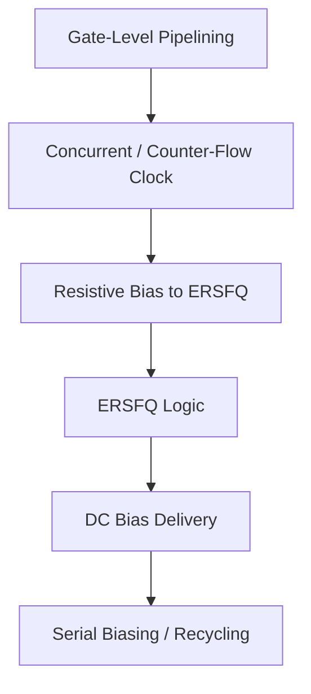

# Roadmap: Clocking, Biasing & Power

**Prereqs:** [SFQ Logic Primitives](../sfq-logic-primitives/ROADMAP.md) · [RSFQ DFF and Retiming](../../concepts/rsfq-dff-and-retiming.md)  
**Next:** [EDA Timing & Verification](../eda-timing-verification/ROADMAP.md) · [Curriculum Home](../../index.md)

## Pathway Overview

How clocks meet data, why bias current explodes at scale, and how ERSFQ plus serial biasing / current recycling attack power and supply limits.

## Reading order

1. [Gate-Level Pipelining](../../bridge/gate-level-pipelining.md)
2. [Concurrent-Flow and Counter-Flow Clocking](../../concepts/concurrent-and-counter-flow-clocking.md)
3. [Resistive Bias to ERSFQ](../../bridge/resistive-bias-to-ersfq.md)
4. [ERSFQ Logic](../../concepts/ersfq-logic.md)
5. [DC Bias Current Delivery](../../bridge/dc-bias-current-delivery.md)
6. [Serial Biasing and Current Recycling](../../concepts/serial-biasing-current-recycling.md)

## Later (public TBD / private papers)

Resonant clocking, AC flux-bias transformers, measured power tables, CAD for island assignment --- private explainers after this public path.
