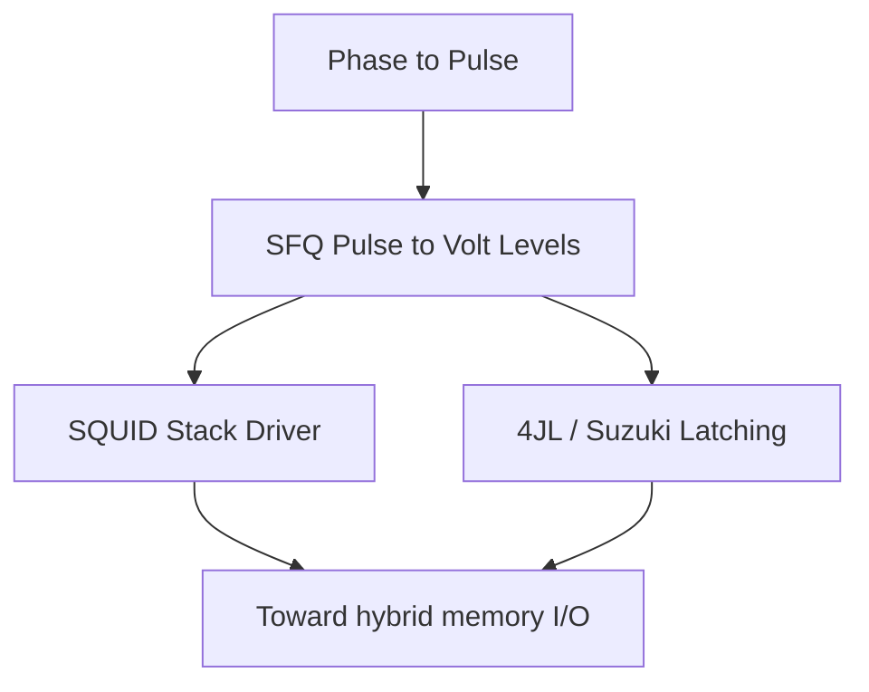

# Roadmap: Cryogenic Interfaces & I/O

**Prereqs:** [Overdamped vs Underdamped JJ](../../fundamentals/overdamped-vs-underdamped-jj.md) · [SFQ Logic Primitives](../sfq-logic-primitives/ROADMAP.md)  
**Next:** [Cryogenic Memory](../cryogenic-memory/ROADMAP.md) · [Curriculum Home](../../index.md)

## Pathway Overview

Why SFQ pulses cannot drive CMOS directly, then the two classic amplifier families: SQUID stacks and 4JL / Suzuki latching drivers.

## Reading order

1. [Phase to Pulse](../../bridge/phase-to-pulse.md)
2. [Overdamped vs Underdamped JJ](../../fundamentals/overdamped-vs-underdamped-jj.md)
3. [From SFQ Pulses to Voltage Levels](../../bridge/sfq-pulse-to-volt-level.md)
4. [SQUID Stack Driver](../../concepts/squid-stack-driver.md)
5. [Four-JL Latching Driver](../../concepts/four-jl-latching-driver.md)

## Later (public TBD / private papers)

PAM-3 / multi-level links, thermal/BER co-optimization, SFQ↔AQFP self-resetting interfaces --- private explainers.
