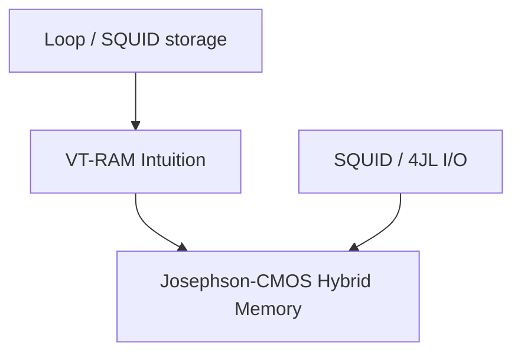

# Roadmap: Cryogenic Memory

**Prereqs:** [Cryogenic Interfaces & I/O](../cryogenic-interfaces-io/ROADMAP.md) · [Superconducting Loop / SQUID](../../fundamentals/superconducting-loop-squid.md)  
**Next:** [Curriculum Home](../../index.md)

## Pathway Overview

SFQ-native flux/vortex memory, then Josephson–CMOS hybrids that buy semiconductor density behind SFQ control and I/O.

## Reading order

1. [Superconducting Loop / SQUID](../../fundamentals/superconducting-loop-squid.md)
2. [Pulse to Logic State](../../bridge/pulse-to-logic-state.md)
3. [Vortex Transitional RAM](../../concepts/vortex-transitional-ram.md)
4. [From SFQ Pulses to Voltage Levels](../../bridge/sfq-pulse-to-volt-level.md)
5. [Four-JL Latching Driver](../../concepts/four-jl-latching-driver.md) · [SQUID Stack Driver](../../concepts/squid-stack-driver.md)
6. [Josephson–CMOS Hybrid Memory](../../concepts/josephson-cmos-hybrid-memory.md)

## Later (public TBD / private papers)

Magnetic JJ memory, 0-π SQUID cells, decoder/driver arrays — private explainers / future public cards.
