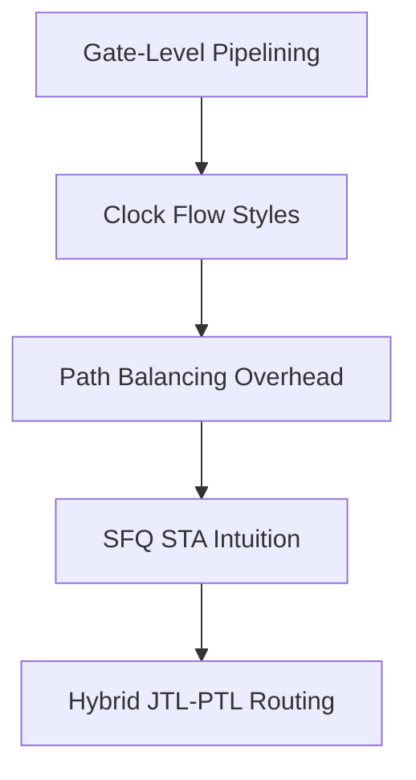

# Roadmap: EDA Timing & Verification

**Prereqs:** [Gate-Level Pipelining](../../bridge/gate-level-pipelining.md) · [Clocking, Biasing & Power](../clocking-biasing-power/ROADMAP.md)  
**Next:** [Cryogenic Interfaces & I/O](../cryogenic-interfaces-io/ROADMAP.md) · [Curriculum Home](../../index.md)

## Pathway Overview

Why SFQ is gate-level pipelined, what path-balancing costs, how STA thinks about pulse windows, and when JTL vs PTL interconnects change the timing picture.

## Reading order

1. [Gate-Level Pipelining](../../bridge/gate-level-pipelining.md)
2. [Concurrent-Flow and Counter-Flow Clocking](../../concepts/concurrent-and-counter-flow-clocking.md)
3. [Path Balancing Overhead](../../concepts/path-balancing-overhead.md)
4. [SFQ Static Timing Analysis](../../concepts/sfq-static-timing-analysis.md)
5. [JTL Interconnects](../../concepts/jtl-interconnects.md)
6. [Hybrid JTL–PTL Routing](../../concepts/hybrid-jtl-ptl-routing.md)

## Later (public TBD / private papers)

qSTA tool flows, CPPR, placement & routing engines, ColdFlux SEDA — private explainers.
