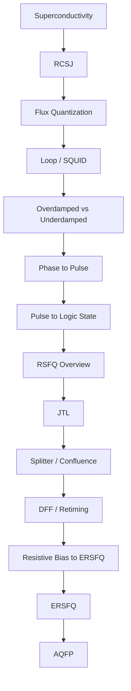

# Roadmap: SFQ Logic Primitives

**Prereqs:** [Curriculum Home](../../index.md)  
**Next:** [Clocking, Biasing & Power](../clocking-biasing-power/ROADMAP.md) · [Curriculum Home](../../index.md)

## Pathway Overview

Device physics → RSFQ cells → ERSFQ / AQFP family cards. Sibling tracks cover clocking/bias, EDA timing, I/O, and memory in more depth.

## Reading order

1. [Superconductivity Intuition](../../fundamentals/superconductivity-intuition.md)
2. [Josephson Junction (RCSJ)](../../fundamentals/josephson-junction-rcsj.md)
3. [Flux Quantization](../../fundamentals/flux-quantization.md)
4. [Superconducting Loop / SQUID](../../fundamentals/superconducting-loop-squid.md)
5. [Overdamped vs Underdamped JJ](../../fundamentals/overdamped-vs-underdamped-jj.md)
6. [Phase to Pulse](../../bridge/phase-to-pulse.md)
7. [Pulse to Logic State](../../bridge/pulse-to-logic-state.md)
8. [RSFQ Logic Overview](../../concepts/rsfq-logic.md)
9. [JTL Interconnects](../../concepts/jtl-interconnects.md)
10. [Splitter and Confluence](../../concepts/splitter-and-confluence.md)
11. [RSFQ DFF and Retiming](../../concepts/rsfq-dff-and-retiming.md)
12. [Resistive Bias to ERSFQ](../../bridge/resistive-bias-to-ersfq.md)
13. [ERSFQ Logic](../../concepts/ersfq-logic.md)
14. [AQFP Logic](../../concepts/aqfp-logic.md)

## Continue on sibling tracks

- [Clocking, Biasing & Power](../clocking-biasing-power/ROADMAP.md)
- [EDA Timing & Verification](../eda-timing-verification/ROADMAP.md)
- [Cryogenic Interfaces & I/O](../cryogenic-interfaces-io/ROADMAP.md)
- [Cryogenic Memory](../cryogenic-memory/ROADMAP.md)
