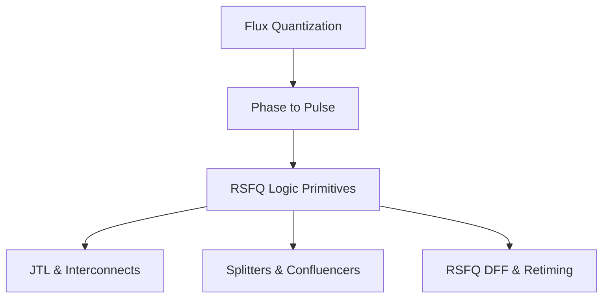

# Roadmap: SFQ Logic Primitives

**Prereqs:** [RSFQ Logic Primitives](../../concepts/rsfq-logic.md)  
**Next:** [Public Index](../../index.md)

## Pathway Overview

This track covers the fundamental physics of flux storage through standard cell logic gates (RSFQ, ERSFQ, AQFP, and all-JJ logic families).

## Reading Order

1. [Flux Quantization](../../fundamentals/flux-quantization.md)
2. [Phase to Pulse](../../bridge/phase-to-pulse.md)
3. [RSFQ Logic Primitives](../../concepts/rsfq-logic.md)
